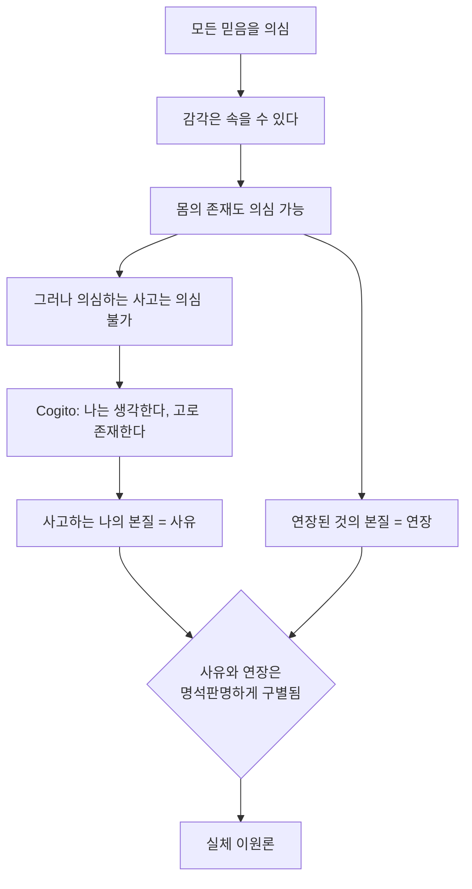

# 🧠 왜 마음-몸 문제인가

> **Psyche L0** · Chapter 1: 문제의 지형 · 문서 1/5
> *(마음과 몸의 관계가 왜 단순한 과학적 미해결이 아니라 문제의 형태 자체가 특이한 난제인지를 정의한다.)*

## 🎯 핵심 질문

마음-몸 문제는 한 문장으로 압축된다. **물질로 이루어진 것이 어떻게 무언가를 느끼는가?** 더 정확히 말하면, 물리적 과정과 의식적 경험 사이의 관계는 정확히 무엇인가.

이 질문이 까다로운 이유는 두 항이 서로 다른 종류의 기술(description) 아래 놓여 있다는 데 있다. 한쪽에는 뉴런, 시냅스, 전위차, 신경전달물질 — 즉 공간을 차지하고 측정 가능하며 3인칭으로 접근되는 것들이 있다. 다른 쪽에는 붉음의 붉음다움, 통증의 쓰라림, 멜로디의 흐름 — 즉 오직 그것을 겪는 주체에게만 주어지는 1인칭의 질(質)이 있다. 문제는 이 둘을 잇는 다리가 보이지 않는다는 것이 아니라, **어떤 종류의 다리여야 하는지조차 불명확하다**는 데 있다.

우리가 던지는 핵심 질문은 따라서 두 겹이다.

1. (관계의 질문) $\{\text{물리적 상태 } P\}$ 와 $\{\text{경험적 상태 } Q\}$ 의 관계는 동일성인가, 인과인가, 수반인가, 아니면 환원 불가능한 평행인가?
2. (설명의 질문) 설령 $P \leftrightarrow Q$ 의 상관이 완벽히 밝혀진다 해도, **왜** $P$ 에 $Q$ 가 따라붙는지가 설명되는가?

본 연구소(Psyche Lab Layer 0)가 출발점으로 삼는 것은 두 번째 질문이다. 첫 번째 질문은 형이상학적 입장 다툼이지만, 두 번째 질문은 그 다툼의 무대 자체를 규정하는 메타 질문이기 때문이다. 우리의 모토 — *"Explain it, don't explain it away"* — 는 바로 이 두 번째 질문을 회피(설명해 치우기)와 구별하려는 선언이다.

## 🌍 어디서 마주치나

마음-몸 문제는 철학 세미나실에만 갇혀 있지 않다. 그것은 구체적인 실천의 현장에서 거듭 모습을 드러낸다.

- **마취과 의학.** 전신마취는 무엇을 정지시키는가? 운동 반응? 기억 형성? 아니면 경험 그 자체? 술중 각성(intraoperative awareness)은 행동 지표가 의식 지표와 어긋날 수 있음을 임상적으로 보여 준다. 모니터(BIS 지수 등)는 뇌파의 물리적 패턴을 읽지만, 그것이 "지금 환자가 느끼지 않는다"를 보장하는지는 여전히 추론이다.
- **AI와 기계 의식.** 대규모 언어모델이 유창하게 "나는 슬프다"라고 출력할 때, 우리는 거기에 경험이 있는지 묻는다. 이 물음이 의미를 가지려면, 기능적 보고와 현상적 경험이 원리상 분리될 수 있어야 한다 — 이것이 곧 마음-몸 문제다.
- **신경윤리와 식물인간 상태.** 무반응 각성 증후군 환자가 fMRI 상에서 명령(테니스를 상상하라)에 반응하는 운동 영역 활성을 보일 때(Owen 등의 연구), 우리는 행동 없는 곳에 경험이 있다고 추론한다. 이 추론의 정당성 자체가 마음-몸 문제의 미해결성에 의존한다.
- **일상.** 사랑하는 이의 통증을 우리는 결코 직접 느끼지 못한다. 타인의 마음은 언제나 추론의 대상이다. 마음-몸 문제는 타심(他心) 문제와 한 뿌리에서 갈라진다.

이 모든 현장의 공통점: **물리적/행동적 지표와 경험적 사실 사이에 원리적 간극이 있다**는 가정 없이는 질문 자체가 성립하지 않는다.

## 🔍 직관의 함정

여기서 두 개의 강력한 직관이 충돌하며, 각각이 함정을 품는다.

**함정 1 — 환원적 낙관.** "결국 뇌가 마음이다. 신경과학이 충분히 발전하면 다 풀린다." 이 직관은 과학사의 성공(생기론의 몰락, 분자생물학의 승리)에서 힘을 얻는다. 함정은 이것이다. 생명의 경우, "살아 있음"은 처음부터 기능적 개념이었다 — 대사, 복제, 항상성. 그래서 메커니즘이 밝혀지자 개념이 흡수됐다. 그러나 의식의 경우, 설명해야 할 것(느낌)이 기능으로 환원될 수 있는지가 **바로 쟁점**이다. 생명과의 유비는 결론을 전제로 깔고 있다(→ `04-levels-of-explanation`에서 층위 혼동으로 재진단).

**함정 2 — 신비주의적 비관.** "마음은 물질을 영원히 초월한다. 과학의 영역 밖이다." 이 직관은 1인칭 경험의 환원 불가능성에서 힘을 얻는다. 함정은 이것이다. 설명되지 않았다는 것에서 설명 불가능하다는 것이 따라 나오지 않는다. 무지로부터의 논증(argument from ignorance)은 그 자체로는 형이상학적 결론을 정당화하지 못한다.

본 연구소의 태도는 두 함정 사이를 지난다. **간극은 실재하지만 신성하지 않다.** 우리는 간극의 위치를 정밀하게 짚되, 그것을 신비의 봉인으로도 곧 사라질 임시 무지로도 성급히 규정하지 않는다.

## ⚙️ 논증 구조

마음-몸 문제가 데카르트에게서 근대적 형태를 얻은 과정을 논증으로 재구성한다.

데카르트의 방법적 회의는 의심할 수 없는 것을 찾아 나아간다.

데카르트의 핵심 논증(『성찰』6)을 형식화하면:

전제 1. 나는 사유하는 것으로서의 나의 존재를 의심 없이 안다.
전제 2. 나는 연장된 물체의 존재를 의심할 수 있다(악령 가설).
전제 3. (라이프니츠 법칙의 변형) 만약 $A$ 와 $B$ 가 동일하다면, $A$ 에 참인 모든 것이 $B$ 에 참이어야 한다.
소결. 나의 정신에는 "의심 불가능하게 존재한다"가 참이고, 나의 몸에는 거짓이다.
결론. 따라서 정신 $\neq$ 몸. $\square$

이 논증의 약점은 잘 알려져 있다 — 전제들이 인식적 양상(의심 가능성)을 다루는데 결론은 형이상학적 동일성(실재의 구별)을 주장한다. "인식적으로 분리 가능하다"에서 "형이상학적으로 별개다"로의 이행이 정당한가? 이 비판(Arnauld의 반론에서 시작된)은 이후 모든 가상논증(conceivability argument)의 표적이 된다(→ `02`, L4 어려운 문제, 그리고 ch2 좀비 논증).

데카르트의 진짜 유산은 결론(이원론)이 아니라 **문제의 형태**다. 그는 정신적인 것과 물리적인 것을 서로 다른 본질로 깔끔하게 분리함으로써, 이후 모든 입장이 답해야 할 질문 — "이 둘을 어떻게 다시 잇는가" — 를 만들어 냈다. 송과선을 통한 상호작용이라는 그의 답이 실패하면서, **상호작용 문제**가 유산으로 남았다.

## 🧪 증거와 사고실험

**사고실험 1 — 데카르트의 악령.** 전능한 기만자가 외부 세계 전체를 환상으로 꾸민다고 가정해도, "내가 지금 무언가를 경험하고 있다"는 사실은 흔들리지 않는다. 이는 1인칭 경험의 인식적 직접성(epistemic immediacy)을 보여 준다. 경험은 추론의 결론이 아니라 출발점이다.

**경험적 증거 — 신경 상관물(NCC).** 현대 신경과학은 의식의 신경 상관물을 정밀하게 추적해 왔다. 양안 경합(binocular rivalry) 실험에서, 망막 입력은 고정되어 있는데도 지각 내용이 교대로 바뀌며, 이에 대응하는 피질 활성의 변화가 관측된다. 이는 **상관**의 강력한 증거다. 그러나 상관은 관계의 질문(§핵심 질문 1)에 답하지 (1) 동일성인지, (2) 인과인지, (3) 단지 동반인지를 가려 주지 않는다.

**왜 신경과학으로도 안 풀리는가.** 핵심은 신경과학이 답하는 질문의 형태에 있다. NCC 연구는 *어떤* 물리적 상태에 *어떤* 경험이 동반되는지를 점점 더 정밀하게 매핑한다. 이것은 거대한 성취다. 그러나 그것은 $P \leftrightarrow Q$ 의 **외연**을 채울 뿐, $P$ 가 *왜* $Q$ 를 동반하는지, 왜 다른 경험이 아닌 바로 그 경험인지(또는 왜 경험이 동반되긴 하는지)에 대한 설명을 제공하지 않는다. 완벽한 상관표는 설명적 간극을 메우는 것이 아니라 그 간극을 가장 선명하게 만든다(→ `02`, `03`).

## 🌉 설명적 간극

설명적 간극(explanatory gap)이라는 용어는 Joseph Levine(1983)에게서 왔지만, 그 구조는 여기서 처음 윤곽을 드러낸다.

간극의 정확한 위치는 다음과 같다. 우리는 물리적 사실 $P$ 의 완전한 집합으로부터 그것이 어떤 기능을 수행하는지, 어떤 행동을 산출하는지를 연역할 수 있다(원리상). 그러나 같은 $P$ 의 집합으로부터 "그리고 그것은 *이렇게 느껴진다*"는 사실은 연역되지 않는다. 즉:

$$\{P_1, P_2, \dots, P_n\} \vdash \{\text{기능}, \text{행동}\}$$
$$\{P_1, P_2, \dots, P_n\} \not\vdash \{\text{현상적 질 } Q\}$$

이 비연역성이 단지 우리의 인식적 한계인지(언젠가 메워질 무지), 아니면 존재론적 사실의 반영인지(영원히 메워지지 않을 종류의 차이)가 이후 모든 챕터의 분기점이다. 본 문서는 간극의 **존재**만을 확립하고, 그 **본성**에 대한 판단은 보류한다.

## 🧬 횡단 원리

여러 입장을 가로지르는 첫 원리를 추출한다.

**원리 1 (기술의 이종성).** 물리적 기술과 현상적 기술은 서로 다른 인식적 양식(epistemic mode)에 속한다. 전자는 3인칭·공적·구조적이고, 후자는 1인칭·사적·질적이다. 이 이종성은 형이상학적 결론이 아니라 출발 데이터다 — 일원론자조차 이 두 기술의 차이는 인정해야 하며, 다만 그것을 한 실재의 두 접근으로 본다.

**원리 2 (상관 ≠ 설명).** 두 변수 간의 법칙적 상관을 확립하는 것과 그 상관을 설명하는 것은 별개의 인식적 성취다. 마음-몸 문제는 상관의 부족이 아니라 설명의 부족 문제다. 이 원리는 `02`(쉬운/어려운 문제 구분), `03`(범주 함정), `04`(층위 혼동) 전체를 관통한다.

## 🪞 1인칭

지금 이 문장을 읽는 당신에게는 무언가가 일어나고 있다. 검은 글자의 시각적 질감, 의미가 떠오르는 미세한 사건, 어쩌면 동의나 저항의 어렴풋한 느낌. 이 "무언가가 일어남"이 바로 설명되어야 할 것(explanandum)이다.

여기서 결정적인 비대칭이 드러난다. 당신은 자신의 경험에 대해 추론하지 않는다 — 그저 그것을 **산다**. 반면 당신이 옆 사람의 경험에 접근하는 유일한 길은 행동과 보고를 통한 추론이다. 나의 경우 경험은 데이터지만, 타인의 경우 경험은 가설이다. 마음-몸 문제의 정서적 무게는 이 비대칭에서 나온다. 우리 각자는 우주 안에서 단 하나의 지점 — 자기 자신 — 에 대해서만 "여기 누군가 있다"를 직접 안다.

## 📐 예측·반증

문제를 정의하는 작업도 검증 가능한 약속을 남겨야 한다.

- **예측(메타 수준).** 향후 신경과학이 NCC를 임의의 정밀도로 밝혀내더라도, "왜 이 신경 상태에 경험이 동반되는가"라는 형태의 질문은 추가 설명 없이는 자연스럽게 남을 것이다. 만약 어느 NCC 발견이 이 질문을 *질문으로서* 소멸시킨다면(즉 더 이상 묻는 것이 무의미해진다면), 본 문서의 핵심 주장(간극의 강건성)은 반증된다.
- **반증 조건.** 순수하게 물리적/기능적 어휘만으로 구성된 이론이, 추가 가정 없이, 임의의 물리적 시스템에 대해 그것이 무엇을 경험하는지(또는 경험하지 않는지)를 연역적으로 도출해 낸다면 — 그리고 그 도출이 직관적 잔여 의문을 남기지 않는다면 — 설명적 간극은 가짜였던 것이 된다. 이것이 강한 환원주의가 충족해야 할 부담이다.

## 🤔 다음 질문

간극이 실재한다면, 그것은 모든 정신 현상에 걸쳐 균일한가, 아니면 어떤 측면(기능)은 간극 없이 설명되고 다른 측면(경험)만 간극에 걸리는가? 만약 후자라면, 우리는 문제를 둘로 쪼갤 수 있다 — 이것이 다음 문서의 칼이다(→ `02-easy-vs-hard-problem`).

---

🧩 **Principle** — 마음-몸 문제는 물리적 기술과 현상적 기술이라는 두 이종적 양식 사이의 *설명적* 관계를 묻는다. 데카르트는 이 둘을 별개 본질로 분리함으로써 문제의 근대적 형태를 주조했고, 신경과학은 둘 사이의 상관을 정밀화함으로써 문제를 해소하기보다 선명하게 만들었다.
🌉 **Boundary** — 설명이 멈추는 지점은 정확히 $\{P\} \not\vdash \{Q\}$ 다. 완전한 물리적 기술로부터 기능과 행동은 연역되지만 "이렇게 느껴짐"은 연역되지 않는다. 상관표의 완성은 간극을 메우지 않고 노출한다.
🪞 **Experience** — 그것은 추론 없이 직접 주어지는 "여기 누군가 있음"으로 느껴진다. 양안 경합 실험은 고정된 3인칭 입력에 대응하는 1인칭 내용의 교대를 동시 측정함으로써, 사적인 경험 변화를 공적인 신경 변화와 잇는 가장 가까운 실험적 다리를 놓는다.

---

## 📝 연습문제

<b>기초 — 상관과 설명의 구별</b>

다음 진술을 평가하라. "fMRI로 통증을 느낄 때 활성화되는 뇌 영역을 정확히 찾아냈으므로, 우리는 통증이 무엇인지 설명했다." 이 진술의 결함을 §횡단 원리의 두 원리를 사용해 진단하라.

**해설:** 이 진술은 **원리 2(상관 ≠ 설명)** 를 위반한다. 활성 영역의 식별은 $P \leftrightarrow Q$ 의 외연을 채우는 상관 확립이다. 그러나 "왜 그 영역의 활성이 *쓰라림으로* 느껴지는가"는 도출되지 않았다. 또한 **원리 1(기술의 이종성)** 에 비추면, "활성 영역"은 3인칭·구조적 기술이고 "통증의 쓰라림"은 1인칭·질적 기술이라, 전자의 완성이 후자의 설명을 자동으로 보장하지 않는다. 진술은 상관을 설명으로 오인하고 있다.

<b>심화 — 데카르트 논증의 양상 이행</b>

데카르트의 논증은 "정신은 의심 불가능, 몸은 의심 가능"에서 "정신 ≠ 몸"으로 나아간다. Arnauld의 고전적 반론을 재구성하고, 라이프니츠 법칙의 적용이 왜 미끄러지는지 설명하라. 이 미끄러짐이 §02에서 다룰 가상논증과 어떻게 연결되는가?

**해설:** Arnauld의 반론: "의심 가능함/불가능함"은 대상의 *내재적 속성*이 아니라 인식 주체의 *지향적 태도*에 관한 속성(intensional)이다. 라이프니츠 법칙은 외연적(extensional) 속성에만 안전하게 적용된다. 삼각형이 "세 변을 가짐"은 내가 그것을 의심하든 말든 참이지만, "내가 의심함"이라는 속성은 대상이 아니라 나에게 귀속된다. 따라서 "정신에 대해 의심 불가능"과 "몸에 대해 의심 가능"은 정신과 몸의 내재적 차이를 증명하지 못한다 — 그것은 나의 인식 상태의 차이일 수 있다. 이 인식적/형이상학적 이행의 위험은 §02 및 ch2의 좀비 가상논증에서도 동일하게 재현된다: "X를 상상할 수 있다"(인식적)에서 "X가 형이상학적으로 가능하다"로의 이행이 핵심 쟁점이 된다.

<b>논문 비평 — Levine, "Materialism and Qualia: The Explanatory Gap" (1983)</b>

Levine은 "통증은 C-섬유 발화다"라는 동일성 진술이, 설령 참이라 해도, "물은 H₂O다"와 달리 설명적 잔여를 남긴다고 주장한다. 그의 핵심 논점을 재구성하고, "설명적 간극은 인식적 문제일 뿐 존재론적 결론을 함축하지 않는다"는 Levine 자신의 신중한 단서가 왜 중요한지 논하라.

**해설:** Levine의 핵심: "물 = H₂O"는 물의 모든 거시적 역할(흐름, 끓음, 용해)을 분자 구조로부터 도출하게 해 주어 *왜* 그 동일성이 성립하는지를 이해시킨다. 반면 "통증 = C-섬유 발화"는 C-섬유 발화로부터 *왜 그것이 아프게 느껴지는지*를 도출시키지 못한다 — 동일성을 받아들여도 설명적 잔여가 남는다. 결정적 단서: Levine은 이 간극을 *인식적*(epistemic)인 것으로 규정하며, 그로부터 곧장 이원론(존재론적 결론)을 끌어내지 않는다. 이 신중함이 중요한 이유는, 무지로부터의 논증(§직관의 함정 2)을 피하기 때문이다 — "우리가 설명하지 못한다"가 "설명할 수 없는 종류의 것이다"를 함축하지 않는다. 비평 과제: Levine의 인식적 규정이 정말 중립적인지, 아니면 §02의 Chalmers가 주장하듯 어떤 인식적 간극은 존재론적 사실의 증상일 수 있는지를 평가하라.

---

[📚 README](../README.md) · [다음: 쉬운 문제 vs 어려운 문제 ▶](./02-easy-vs-hard-problem.md)

