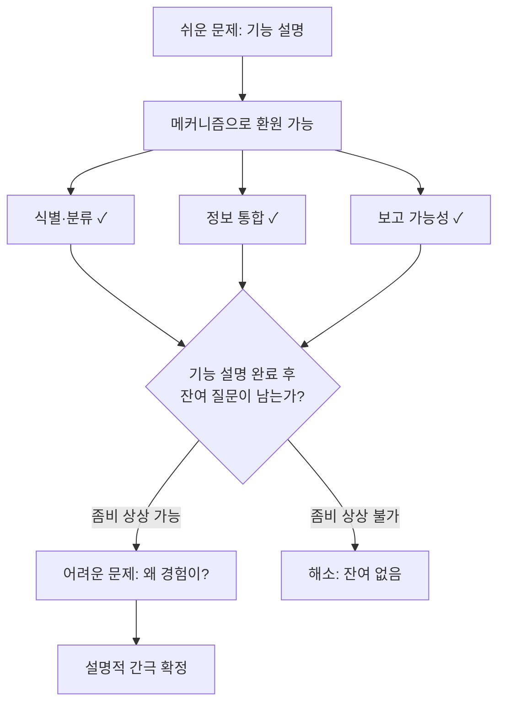

# ⚔️ 쉬운 문제 vs 어려운 문제

> **Psyche L0** · Chapter 1: 문제의 지형 · 문서 2/5
> *(Chalmers의 칼은 마음의 기능적 측면(쉬운 문제)과 경험적 측면(어려운 문제)을 가르며, 후자에서 설명적 간극이 처음으로 명시적으로 모습을 드러낸다.)*

## 🎯 핵심 질문

`01`은 마음-몸 문제 전체가 하나의 간극에 걸려 있음을 보였다. 이제 결정적 진전을 시도한다. **그 간극은 문제의 어느 부분에 걸리는가?**

David Chalmers(1995, "Facing Up to the Problem of Consciousness")의 기여는 새로운 답을 준 것이 아니라 **문제를 둘로 쪼갠 것**이다. 그는 의식에 관한 물음들을 두 부류로 나눈다.

- **쉬운 문제들(easy problems).** 인지 시스템의 *기능*을 설명하는 문제. 자극의 식별과 분류, 정보의 통합, 내적 상태의 보고 가능성, 주의의 집중, 행동의 자발적 통제, 깨어 있음과 잠의 차이. 이것들이 "쉬운" 이유는 사소해서가 아니라(실제로는 수십 년의 난제다), **풀이의 형태가 명확하기 때문**이다 — 어떤 메커니즘이 그 기능을 수행하는지를 밝히면 된다.
- **어려운 문제(the hard problem).** 이 모든 기능 수행에 *왜 경험이 동반되는가*. 정보 처리가 "어둠 속에서" 일어나지 않고 무언가로 느껴지는 이유. 시각 정보의 식별·통합이 왜 *붉음을 봄*이라는 질적 경험을 수반하는가.

핵심 질문은 따라서: 쉬운 문제들을 전부 풀어도 어려운 문제가 손대지지 않은 채 남는가? Chalmers의 주장은 그렇다는 것이다. 본 문서는 이 칼날의 정확한 형태와, 그것이 무엇을 베고 무엇을 베지 못하는지를 검토한다.

## 🌍 어디서 마주치나

이 구분은 추상적 분류가 아니라 연구 프로그램의 갈림길을 만든다.

- **인지과학의 일상.** 작업기억 용량, 주의의 신경 메커니즘, 의사결정의 강화학습 모델 — 이 모든 성공적 연구는 쉬운 문제의 영역에서 이뤄진다. 그것들은 기능을 메커니즘으로 환원한다. 어려운 문제는 이 성공의 그늘에서 손대지 않은 채 남는다.
- **전역 작업공간 이론(GWT)·통합정보이론(IIT) 논쟁.** Baars-Dehaene의 GWT는 정보가 어떻게 전역적으로 방송되어 보고·통제 가능해지는지를 설명한다 — 명백히 쉬운 문제(접근 의식, access consciousness)를 겨냥한다. Tononi의 IIT는 더 야심차게 현상적 의식 자체($\Phi$)를 겨냥한다고 주장하지만, 비판자들은 그것이 결국 상관의 정량화이지 어려운 문제의 해소가 아니라고 본다(→ ch3 물리주의, ch5 범심론).
- **AI 의식 논쟁.** "이 시스템은 자기 상태를 보고하고 통합한다"(쉬운 문제 충족)에서 "이 시스템은 경험한다"(어려운 문제)로의 추론이 정당한가? 두 문제의 구분 없이는 이 논쟁이 혼선에 빠진다.

## 🔍 직관의 함정

**함정 1 — 쉬운 문제를 풀면 어려운 문제가 따라온다는 낙관.** "기능을 다 설명하면 경험도 설명된 것이다. 경험이란 결국 그 기능들의 총합 아닌가?" 이 직관은 강력하지만 선결문제 요구(question-begging)일 수 있다. 그것은 *경험 = 기능*이라는, 정확히 증명되어야 할 명제를 전제한다. Chalmers의 좀비 사고실험(아래 §증거)은 이 전제를 직접 겨냥한다.

**함정 2 — 어려운 문제를 풀 수 없는 사이비 문제로 치부하는 해소주의.** Daniel Dennett은 어려운 문제가 *환상*이라고 주장한다 — 쉬운 문제들을 다 풀고 나면 따로 설명할 "경험"이라는 잔여는 없다는 것이다. 이 입장(illusionism, → Keith Frankish)의 강점은 무지로부터의 논증을 피한다는 데 있다. 함정은, 그것이 설명되어야 할 데이터(1인칭 경험) 자체를 *설명해 치워(explain away)* 버린다는 의심이다. 본 연구소의 모토 — *"Explain it, don't explain it away"* — 는 이 지점에서 illusionism과 거리를 둔다. 단, 우리는 illusionism을 적이 아니라 어려운 문제의 강건성을 시험하는 가장 날카로운 도전으로 대우한다.

두 함정은 거울상이다. 하나는 어려운 문제를 쉬운 문제 안으로 흡수하고, 다른 하나는 그것을 존재하지 않는 것으로 추방한다. 양쪽 다 구분 자체를 무너뜨린다.

## ⚙️ 논증 구조

Chalmers의 핵심 논증 — 어려운 문제가 쉬운 문제로 환원되지 않음 — 을 형식화한다.

**논증(기능 설명의 불충분성):**

전제 1. 쉬운 문제의 해답은 모두 "기능 $F$ 가 메커니즘 $M$ 에 의해 수행된다"는 형태를 갖는다.
전제 2. 임의의 기능 $F$ 에 대해, "$M$ 이 $F$ 를 수행하지만 *아무것도 느껴지지 않는*" 시나리오가 모순 없이 상상 가능하다(좀비 가능성).
소결. 따라서 "$M$ 이 $F$ 를 수행함"으로부터 "경험 $Q$ 가 존재함"이 논리적으로 따라 나오지 않는다.
결론. 쉬운 문제들의 완전한 해답은 어려운 문제를 해결하지 않는다. $\square$

이 논증의 무게는 전제 2(상상 가능성)에 실린다. 상상 가능성에서 형이상학적 가능성으로의 이행 — 바로 `01`에서 데카르트 논증을 흔들었던 그 이행 — 이 여기서도 핵심 쟁점이다. 본 문서는 어려운 문제의 *제기*를 확립하되, 좀비의 형이상학적 가능성에 대한 본격 심판은 ch2(이원론)와 ch3(물리주의)로 넘긴다.

## 🧪 증거와 사고실험

**사고실험 1 — Nagel의 박쥐 (1974, "What Is It Like to Be a Bat?").** 우리는 박쥐의 반향정위(echolocation) 신경 메커니즘을 완전히 알 수 있다 — 쉬운 문제는 풀린다. 그러나 *박쥐로 있다는 것이 어떠한지*는 그 지식으로부터 도출되지 않는다. 객관적·3인칭적 사실의 총합이 주관적·1인칭적 사실을 망라하지 못한다. Nagel은 이로써 "주관적 성격(subjective character of experience)"이 객관적 환원에 저항함을 보인다. 이것이 어려운 문제의 가장 우아한 선구적 정식화다.

**사고실험 2 — Jackson의 메리 (1982, 지식 논증).** 흑백 방에서 자란 신경과학자 메리는 색 시각에 관한 *모든 물리적 사실*을 안다. 방을 나와 처음 빨강을 볼 때, 그녀는 **새로운 것을 배우는가?** "그렇다"가 직관이라면, 물리적 사실의 총합 바깥에 사실(빨강의 경험적 질)이 있다는 결론이 따른다. 이는 어려운 문제를 인식론적 형태로 재진술한 것이다. (반론들 — 능력 가설, 옛 사실의 새로운 양식 — 은 ch3에서 검토.)

**사고실험 3 — 좀비.** 물리적으로 나와 분자 단위까지 동일하지만 *내적 경험이 전혀 없는* 존재. 그가 모순 없이 상상 가능하다면, 경험은 물리적 사실에 의해 *논리적으로 고정되지 않는다*. 이것이 위 논증의 전제 2다.

**경험적 정박 — 마취와 무의식 처리.** 어려운 문제는 순수 사변이 아니라 데이터에 닿는다. 차폐된 시각 자극(masked priming)은 보고되지 않은 채로도 행동에 영향을 준다 — 기능(처리)이 경험(보고된 의식) 없이 일어난다. 이는 두 문제가 경험적으로도 분리될 수 있는 차원을 가리킨다. 다만 "행동 영향 없음 = 경험 없음"의 추론은 `01`의 비대칭 때문에 결정적이지 않다.

## 🌉 설명적 간극

`01`에서 윤곽만 잡혔던 간극이 여기서 정밀한 좌표를 얻는다.

쉬운 문제의 영역에서는 간극이 **없다**:
$$\{\text{메커니즘 } M\} \vdash \{\text{기능 } F\}$$
이것은 기능 분석(functional analysis)으로 닫힌다. 무언가가 "X를 함"은 그 X를 구성하는 하위 작동들로 분석되고, 그 작동들이 물리적으로 실현되면 설명이 완결된다.

어려운 문제의 영역에서 간극이 **벌어진다**:
$$\{M\} \vdash \{F\}, \quad \text{그러나} \quad \{M, F\} \not\vdash \{Q\}$$
기능 $F$ 가 완전히 분석되고 실현되어도, "그리고 그것은 *이렇게 느껴진다*"는 잔여가 추가 설명 없이 남는다. 간극의 정확한 위치는 **기능과 현상 사이의 잔여**다.

이것이 `01`의 일반적 간극을 날카롭게 만든 결과다. 간극은 마음의 *어디에나* 있는 것이 아니라, 기능적으로 분석 가능한 부분이 다 분석된 *바로 그 다음*에 남는 잔여에 있다. 이 정밀화가 Chalmers의 칼이 한 일이다(L4 어려운 문제의 핵심 정의).

## 🧬 횡단 원리

**원리 3 (기능적 닫힘과 잔여).** 어떤 정신 현상이 기능적 역할로 *남김없이* 정의되면, 그것은 쉬운 문제에 속하고 메커니즘으로 닫힌다. 잔여(기능 분석 후에도 남는 "느껴짐")가 있을 때만 어려운 문제가 발생한다. 따라서 각 정신 개념에 대해 던질 진단 질문: *이것은 기능으로 완전히 정의되는가, 아니면 기능적 잔여를 갖는가?*

**원리 4 (구조적/질적 비대칭).** 물리적·기능적 설명은 본성상 *구조적·관계적*이다(무엇이 무엇과 어떻게 상호작용하는가). 현상적 질은 *내재적*으로 보인다(다른 것과의 관계로 환원되지 않는 그 자체의 느낌). 구조로 내재를 도출하려는 시도가 막히는 곳이 어려운 문제다. 이 원리는 범심론(ch5)이 내재적 질을 물리의 *내재적 본성*으로 재배치하려는 동기가 된다.

## 🪞 1인칭

지금 당신이 이 글의 의미를 식별하고(쉬운 문제: 패턴 인식), 앞 문단과 통합하고(쉬운 문제: 정보 통합), 필요하면 요약을 보고할 수 있다(쉬운 문제: 보고 가능성). 이 모든 기능이 작동하는 동안 — 그것들이 *무언가로 느껴진다*. 글자의 시각적 현전, 이해의 미세한 "딸깍", 어쩌면 지루함이나 흥미의 색조.

핵심 1인칭 통찰: 이 "느껴짐"을 제거해 보라. 모든 기능은 그대로 두고, 오직 경험만 꺼 보라. 당신은 그것을 *상상할 수 있는가*? 만약 "기능은 같은데 안이 깜깜한 나"를 일관되게 상상할 수 있다면, 당신은 방금 좀비 직관을 1인칭으로 확인한 것이다. 만약 그 상상이 어딘가에서 무너진다면(예: "보고하는데 안 느낀다는 게 말이 되나?"), 당신은 illusionism의 직관에 더 가깝다. 어려운 문제의 무게는 이 1인칭 시험에서 각자가 어디에 서느냐로 갈린다.

## 📐 예측·반증

- **예측.** 향후 가장 성공적인 의식 이론들조차 그 설명의 형태가 "어떤 메커니즘이 어떤 기능을 수행한다"인 한, 비판자들로부터 "그것은 접근 의식(쉬운 문제)을 설명할 뿐 현상 의식(어려운 문제)에는 닿지 않는다"는 반론을 반복적으로 받을 것이다. GWT가 정확히 이 패턴을 보인다.
- **반증 조건(어려운 문제 측).** 만약 순수 기능적 분석으로부터 특정 현상적 질의 *존재와 정체*(왜 다른 질이 아니라 이 질인지)가 직관적 잔여 없이 도출되는 사례가 단 하나라도 제시되면, "기능 ⊉ 경험"이라는 어려운 문제의 토대가 무너진다.
- **반증 조건(해소주의 측).** illusionism이 옳다면, "경험이 있다는 우리의 강한 확신"이 *어떻게* 순수 기능적 시스템에서 발생하는지(이른바 "환상 메타 문제", illusion meta-problem)를 잔여 없이 설명해야 한다. 그 설명이 끝내 "그런데 왜 그 확신이 *이렇게 느껴지나*"를 다시 낳는다면, 어려운 문제는 메타 수준에서 부활한다.

## 🤔 다음 질문

어려운 문제가 강건하다고 하자. 그렇다면 "뇌가 마음을 만든다", "뉴런이 의식을 산출한다" 같은 일상적 설명 문장들은 어려운 문제를 푸는가, 아니면 그것을 *언어적으로 은폐*하는가? 이 문장들이 왜 설명이 아닐 수 있는지 — 즉 범주의 혼동이 어떻게 거짓 해결의 외양을 만드는지를 다음 문서가 해부한다(→ `03-category-trap`).

---

🧩 **Principle** — Chalmers의 칼은 의식의 *기능적* 측면(식별·통합·보고: 메커니즘으로 닫히는 쉬운 문제)을 *현상적* 측면(왜 경험이 동반되는가: 어려운 문제)에서 분리한다. 쉬운 문제는 기능 분석으로 설명되고, 어려운 문제는 그 분석이 끝난 자리에 잔여로 남는다.
🌉 **Boundary** — 설명이 멈추는 정확한 지점은 *기능과 현상 사이의 잔여*다: $\{M, F\} \not\vdash \{Q\}$. 모든 기능이 분석·실현되어도 "그리고 그것은 이렇게 느껴진다"가 추가 설명 없이 남는다. 이것이 L4 어려운 문제의 핵심 정의다.
🪞 **Experience** — 그것은 "기능은 작동하는데 안이 깜깜한 나"를 상상해 보는 1인칭 시험으로 느껴진다. 차폐 점화(masked priming)와 양안 경합 실험은 보고/경험과 처리/기능을 부분적으로 떼어 측정함으로써, 두 문제의 분리를 3인칭에서 실험적으로 정박시킨다.

---

## 📝 연습문제

<b>기초 — 쉬운/어려운 분류</b>

다음 물음들을 쉬운 문제와 어려운 문제로 분류하라. (a) 뇌는 어떻게 빨강과 초록을 구별하는가? (b) 왜 빨강을 봄은 *이렇게* 느껴지고 초록을 봄은 *저렇게* 느껴지는가? (c) 수면과 각성의 신경 메커니즘은 무엇인가? (d) 왜 깨어 있음에는 경험이 동반되는가?

**해설:** (a), (c)는 **쉬운 문제** — 둘 다 "어떤 메커니즘이 어떤 기능(구별, 상태 전환)을 수행하는가" 형태로, 기능 분석으로 닫힌다(원리 3). (b), (d)는 **어려운 문제** — (b)는 특정 현상적 질의 정체("왜 다른 느낌이 아니라 이 느낌인지")를, (d)는 경험의 존재 자체("왜 동반되는가")를 묻는다. 둘 다 기능 설명 뒤에 남는 잔여에 걸린다. 진단 요령: 물음에 "왜 그것이 *느껴지는가/이렇게* 느껴지는가"가 들어가면 어려운 문제다.

<b>심화 — 메리는 정말 새로운 것을 배우는가</b>

Jackson의 메리 사고실험에 대한 "능력 가설"(Lewis, Nemirow) 반론을 재구성하라: 메리가 얻는 것은 새로운 *명제적 지식*이 아니라 새로운 *능력*(상상하고 재인하고 기억하는)이라는 주장이다. 이 반론이 어려운 문제를 해소하는가, 아니면 위치만 옮기는가?

**해설:** 능력 가설: "안다(know)"에는 명제적 앎(knowing that)과 능력적 앎(knowing how)이 있다. 메리는 물리적 명제는 다 알았고, 방을 나와 얻는 것은 빨강을 상상/재인하는 *능력*이지 새로운 사실이 아니다 — 따라서 물리주의는 안전하다. 평가: 이 반론은 지식 논증의 *형이상학적 결론*(물리 바깥의 사실 존재)을 막는 데는 효과적이지만, 어려운 문제를 *해소*하지는 못한다. 왜냐하면 "왜 그 능력의 행사에 *질적 경험이 동반되는가*"라는 물음이 다시 발생하기 때문이다 — 능력 자체도 기능적으로 기술되면 그 기능 수행에 왜 경험이 따라붙는지(원리 4의 구조/질 비대칭)가 남는다. 즉 반론은 간극의 *인식론적 정식*(메리의 배움)은 다룰 수 있어도 *설명적 정식*(기능→현상)은 그대로 남긴다. 위치 이동이지 해소가 아니다.

<b>논문 비평 — Dennett, "Quining Qualia" (1988) / illusionism</b>

Dennett은 "감각질(qualia)"이라는 개념이 내포한다고 여겨지는 속성들(내재적, 사적, 직접 접근 가능, 형언 불가)이 일관되지 않으며, 따라서 설명되어야 할 별도의 데이터로서의 감각질은 없다고 주장한다. 이 해소주의 노선이 본 연구소의 모토 "Explain it, don't explain it away"와 충돌하는 지점을 짚고, 그럼에도 이 노선을 진지하게 다뤄야 하는 이유를 논하라.

**해설:** Dennett의 핵심: 우리가 감각질에 귀속하는 네 속성은 정합적으로 함께 성립할 수 없다(예: "직접 접근 가능"하면서 "형언 불가"는 긴장). 따라서 감각질은 사이비 데이터이고, 쉬운 문제들(판단·성향·보고 메커니즘)을 다 설명하면 설명할 잔여가 없다 — 어려운 문제는 환상이다. 모토와의 충돌: 우리 입장에서 1인칭 경험은 *설명되어야 할 데이터(explanandum)*인데, illusionism은 그것을 *설명되어 치워질 환상(explanandum→해소)*으로 재분류한다 — 이것이 "explain it away"의 전형이다. 그럼에도 진지하게 다뤄야 하는 이유: (1) illusionism은 `01`의 무지로부터의 논증 함정을 깨끗이 피하는 유일하게 일관된 강한 물리주의 노선이다; (2) 그것은 "환상 메타 문제"라는 검증 가능한 부담(§예측·반증)을 진다 — 왜 우리에게 경험이 있다는 *확신*이 그토록 강하게 발생하는지를 설명해야 한다; (3) 만약 그 메타 설명이 성공하면 어려운 문제는 정말 해소되고, 실패하면(확신의 설명이 다시 "왜 이렇게 느껴지나"를 낳으면) 어려운 문제의 강건성이 역으로 입증된다. 즉 illusionism은 적이 아니라 어려운 문제를 시험하는 리트머스다.

---

[◀ 이전: 왜 마음-몸 문제인가](./01-why-mind-body-problem.md) · [📚 README](../README.md) · [다음: 범주의 함정 ▶](./03-category-trap.md)

