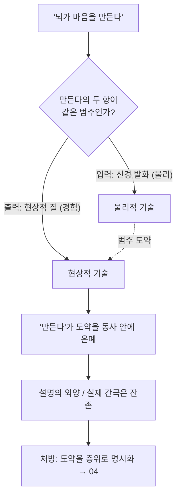

# 🪤 범주의 함정

> **Psyche L0** · Chapter 1: 문제의 지형 · 문서 3/5
> *("뇌가 마음을 만든다"는 설명처럼 들리지만, 물리적 기술과 현상적 기술을 한 평면에서 잇는 척하며 범주 오류로 간극을 은폐한다.)*

## 🎯 핵심 질문

`02`는 어려운 문제가 기능 설명 뒤에 잔여로 남음을 보였다. 그렇다면 일상과 대중과학이 즐겨 쓰는 해결 문장 — **"뇌가 마음을 만든다", "의식은 뉴런의 산물이다", "마음은 뇌가 하는 일이다"** — 는 이 잔여를 푸는가?

본 문서의 핵심 질문: 이 문장들은 *설명*인가, 아니면 *설명의 외양을 두른 범주 혼동*인가?

주장은 이렇다. 이 문장들은 대개 참일 것이다(상관·의존 관계로서). 그러나 그것들이 어려운 문제를 푼다는 인상을 주는 한, 그 인상은 **두 종류의 기술을 한 인과 평면에 욱여넣은 데서 오는 착각**이다. "만든다(produce/generate)"라는 동사가 이 욱여넣기의 핵심 장치다. 우리는 이 함정의 구조를 해부하고, 어떻게 하면 같은 사실을 범주 혼동 없이 진술할 수 있는지를 본다(→ 처방은 `04-levels-of-explanation`).

## 🌍 어디서 마주치나

- **대중 신경과학.** "사랑은 뇌의 도파민 분출이다", "자유의지는 환상, 결정은 의식 전에 뇌에서 일어난다"(Libet 실험의 통속 해석). 이런 헤드라인은 현상적 어휘(사랑, 의지)와 물리적 어휘(도파민, 준비전위)를 등호로 묶어 *설명했다*는 만족감을 준다.
- **임상 대화.** "당신의 우울은 세로토닌 불균형 때문입니다." 이 진술은 치료적으로 유용하고 부분적으로 참이지만, "우울이라는 *느낌*이 무엇이며 왜 그 신경 상태가 그 느낌인가"는 건드리지 않는다. 환자가 "그럼 내 슬픔은 설명된 건가요?"라고 물을 때 간극이 드러난다.
- **AI 담론.** "트랜스포머가 충분히 크면 의식이 *창발한다*." "창발(emergence)"은 "만든다"의 세련된 사촌으로, 같은 범주 도약을 매끄럽게 감춘다.
- **철학 강의실.** 학생이 "뇌가 마음을 만들면 되잖아요"라고 말할 때, 교수의 과제는 그 문장이 *무엇을* 만든다는 것인지 — 기능을? 상관을? 경험 자체를? — 를 분절하는 것이다.

## 🔍 직관의 함정

핵심 직관: **"A가 B를 만든다"는 익숙한 인과 도식이고, 인과는 설명의 표준 형식이다 — 그러니 "뇌가 마음을 만든다"도 설명이다.**

이 직관이 함정인 이유는 "만든다"가 정상적으로 작동하는 사례와 의식 사례의 결정적 차이에 있다.

- *정상 사례:* "태양이 빛을 만든다." 여기서 만든 것(빛)과 만든 과정(핵융합)은 **같은 물리적 범주** 안에 있다. 광자의 방출은 그 자체로 물리적 사건이고, 우리는 입력 물리량에서 출력 물리량으로의 도출 경로를 안다.
- *의식 사례:* "뇌가 경험을 만든다." 만든 과정(신경 발화)은 물리적 범주에, 만든 것(현상적 질)은 — 적어도 표면상 — 다른 범주에 있다. "만든다"라는 동사는 이 범주 도약을 *동사 안에 숨긴다*. 마치 도약이 일어나지 않은 것처럼.

즉 함정은 친숙한 인과 동사가 **이종 범주 간의 관계를 동종 범주 간의 관계인 양 위장**하는 데 있다(이것은 `01`의 원리 1 "기술의 이종성"의 직접 귀결이다). "만든다"는 설명하지 않는다 — 그것은 설명이 필요한 바로 그 지점에 *이름표를 붙여 봉인*한다.

## ⚙️ 논증 구조

범주 오류(category mistake)의 구조를 Gilbert Ryle(1949, 『마음의 개념』)을 빌려 정식화한다.

Ryle의 고전 예: 방문객이 캠퍼스의 건물·도서관·학과를 다 본 뒤 "그런데 *대학*은 어디 있나요?"라고 묻는다. 그는 "대학"을 건물과 *같은 논리적 범주*(개별 시설)에 놓는 오류를 범했다. 대학은 시설들 *옆에* 있는 또 하나의 시설이 아니라, 그 시설들이 *조직된 방식*이다.

**논증(은폐 진단):**

전제 1. 설명 $E$ 가 현상 $X$ 를 설명한다면, $E$ 는 $X$ 가 *왜 그러한지*를 도출 가능하게 만들어야 한다(`02`의 기능적 닫힘 기준의 일반화).
전제 2. "뇌가 마음을 만든다"에서 "마음"이 *현상적 질*을 가리킬 때, 이 문장으로부터 "왜 그 신경 상태가 *이* 질인지"는 도출되지 않는다(`02`의 어려운 문제).
소결. 따라서 그 독해에서 이 문장은 설명이 아니다.
전제 3. 그럼에도 이 문장은 인과 동사 "만든다" 때문에 설명처럼 들린다.
결론. "뇌가 마음을 만든다"는, 현상적 독해에서, *설명의 외양을 가진 범주 혼동*이다. $\square$

**중요한 단서.** "마음"이 *기능적 의미*(식별·통합·보고)로 읽히면 이 문장은 참된 설명이 될 수 있다 — 쉬운 문제의 영역이기 때문이다. 함정은 오직 현상적 독해와 기능적 독해 사이를 *말없이 미끄러질* 때 발동한다. 범주의 함정은 곧 **독해의 이중성을 이용한 미끄러짐**이다.

## 🧪 증거와 사고실험

**사고실험 1 — Ryle의 대학 (재배치).** "뉴런들을 다 봤는데 마음은 어디 있나요?"라는 물음이 만약 "마음 = 뉴런들의 조직 방식"이라면 범주 오류다. 이 독해에서는 마음이 뉴런 옆의 추가 사물이 아니다. **그러나 주의:** 이 Ryle식 해소는 마음의 *기능적/조직적* 측면에는 잘 듣지만, 현상적 질에는 다시 막힌다 — "조직 방식"이 *왜 느껴지는지*는 여전히 잔여다. 즉 범주 오류 진단은 함정의 절반(기능 측)을 치우지만 어려운 문제(경험 측)는 남긴다. 이 구별이 본 문서의 핵심 균형이다.

**사고실험 2 — Leibniz의 방앗간 (『모나드론』 §17).** 사고 능력을 가진 기계를 방앗간만큼 키워 그 안으로 걸어 들어간다고 상상하자. 우리는 서로 미는 부품들만 볼 뿐, *지각*을 설명할 무엇도 보지 못한다. Leibniz의 통찰: 부품들의 기계적 배열(물리적 기술)을 아무리 들여다봐도 지각(현상적 기술)은 그 *안에서 발견되지* 않는다. 이는 "뇌를 충분히 자세히 보면 마음이 보인다"는 직관에 대한 300년 묵은 반증이다.

**경험적 정박 — 설명의 비대칭 검사.** 좋은 환원적 설명은 *예측적 양방향성*을 갖는다: H₂O의 구조에서 물의 끓는점을 도출하고, 거꾸로 끓는점 이상으로부터 분자 거동을 제약한다. 신경-경험 관계에서 우리는 한 방향(신경 조작 → 보고된 경험 변화: TMS, 약물)은 강하게 갖지만, "이 경험이려면 신경이 *왜 정확히 이래야 하는지*"의 도출 방향은 비어 있다. 이 비대칭이 "만든다"가 설명이 아님을 경험적으로 드러낸다.

## 🌉 설명적 간극

여기서 간극은 *언어적 위장*의 형태로 나타난다. `02`가 간극을 *기능과 현상 사이*에 위치시켰다면, `03`은 그 간극이 **인과 동사("만든다", "산출한다", "창발한다") 안에 어떻게 숨겨지는지**를 보인다.

정밀화하면, "만든다"는 함수 $f$ 를 암시한다:
$$f: \{\text{신경 상태}\} \to \{\text{경험}\}$$
정상적 인과 설명에서 우리는 $f$ 의 *메커니즘*을 안다. 그러나 의식 사례에서 우리가 가진 것은 $f$ 의 *그래프*(어떤 입력에 어떤 출력이 짝지어지는가, 즉 NCC 상관표)뿐이고 *메커니즘*은 아니다. "만든다"는 메커니즘을 가진 함수의 어감을 빌려, 그래프만 있는 관계에 입힌다. 간극의 정확한 위치: **상관 함수의 그래프와 그 함수의 메커니즘 사이.** 동사가 그 자리를 덮는다.

## 🧬 횡단 원리

**원리 5 (동사 위장 검사).** 어떤 정신 설명이 "만든다/산출한다/창발한다/발생시킨다" 같은 인과 동사에 의존할 때, 항상 물어라: *이 동사의 두 항은 같은 기술 범주에 있는가?* 다르다면, 동사는 설명이 아니라 미해결의 봉인일 가능성이 높다. 이 검사는 모든 입장의 주장에 적용된다 — 물리주의의 "창발"에도, 이원론의 "상호작용"에도, 범심론의 "조합"에도(ch5의 조합 문제가 정확히 이 검사에 걸린다).

**원리 6 (독해 명시 의무).** "마음/의식"을 포함한 모든 설명 주장은 그 용어가 *기능적으로* 읽히는지 *현상적으로* 읽히는지를 명시해야 한다. 명시하지 않으면 두 독해 사이의 미끄러짐(§논증의 단서)이 발생하고, 쉬운 문제의 성취가 어려운 문제의 해결로 위장된다. 이 의무가 `04`의 층위 명시로 이어진다.

## 🪞 1인칭

당신이 누군가에게 "왜 슬픈가"를 설명받는다고 하자. "세로토닌이 부족해서"라는 답을 들을 때, 1인칭의 무언가가 만족하지 못한 채 남는다 — *이 무거움, 이 색조*가 어떻게 그 분자 수치 *인지*가 답해지지 않았기 때문이다. 이 "만족하지 못함"은 변덕이 아니라 범주의 함정을 1인칭에서 감지하는 인지적 신호다.

반대로, 만약 "슬픔"으로 당신이 *오직* 행동 성향(위축, 회피, 낮은 의욕)만을 뜻했다면, 세로토닌 설명에 충분히 만족했을 수도 있다. 1인칭 시험: 설명을 듣고 *남는 잔여가 있는가?* 잔여가 있으면 당신은 현상적 독해를 하고 있고, 동사 위장이 그 잔여를 덮으려 한 것이다. 잔여가 없으면 당신의 "마음" 개념은 그 맥락에서 기능적이었던 것이다.

## 📐 예측·반증

- **예측.** 의식에 관한 대중적·심지어 학술적 주장에서 "만든다/창발한다" 동사의 빈도는 어려운 문제 잔여의 강도와 정비례할 것이다 — 즉 가장 어려운 지점일수록 가장 매끄러운 인과 동사로 덮이는 경향이 나타날 것이다(설명 부담이 클수록 언어적 위장 압력이 크다).
- **반증 조건.** 만약 "뇌가 경험을 만든다"류 문장이, 현상적 독해 하에서, 입력 신경 기술로부터 출력 현상 질의 정체를 *직관적 잔여 없이* 도출하는 진짜 메커니즘으로 채워질 수 있다면, 본 문서의 "동사 위장" 진단은 틀린 것이 된다 — 그 경우 "만든다"는 정당한 인과 설명이며 범주 도약은 환상이었다.

## 🤔 다음 질문

범주의 함정이 "두 기술을 한 평면에 욱여넣음"이라면, 처방은 그것들을 *서로 다른 평면(층위)*에 올바로 배치하는 것일 터다. 그러나 "층위"란 정확히 무엇이며, 어떻게 구분되는가? 그리고 층위를 제대로 나누면 어려운 문제가 풀리는가, 아니면 *진단만 정밀해지고 간극은 남는가*? 다음 문서가 Marr의 3층위로 이 처방의 힘과 한계를 가늠한다(→ `04-levels-of-explanation`).

---

🧩 **Principle** — "뇌가 마음을 만든다"는 인과 동사 "만든다"를 빌려, 물리적 기술과 현상적 기술이라는 이종 범주를 한 인과 평면에 위장 결합한다. 마음을 *기능적으로* 읽으면 참된 설명일 수 있으나, *현상적으로* 읽으면 설명이 아니라 범주 혼동이다.
🌉 **Boundary** — 설명이 멈추는 지점은 *상관 함수의 그래프와 그 함수의 메커니즘 사이*다. NCC는 어떤 신경 상태에 어떤 경험이 짝지어지는지(그래프)를 주지만, "만든다"가 암시하는 메커니즘은 비어 있다. 동사가 바로 그 빈자리를 덮는다.
🪞 **Experience** — 그것은 신경/화학 설명을 듣고도 "이 느낌이 어떻게 그것*인지*"가 답해지지 않은 채 남는 1인칭 잔여로 느껴진다. TMS·약물 조작(신경→보고된 경험)은 한 방향의 다리를 실험으로 놓지만, 역방향 도출의 부재가 동사 위장을 노출한다.

---

## 📝 연습문제

<b>기초 — 위장 동사 찾기</b>

다음 문장들에서 §원리 5의 "동사 위장"이 일어나는지 판정하고, 일어난다면 두 항의 범주를 분리해 보라. (a) "심장이 혈액을 펌프질한다." (b) "신경망이 의식을 창발시킨다." (c) "해마가 기억을 저장한다." (d) "보상 회로가 쾌락의 *느낌*을 산출한다."

**해설:** (a) 위장 없음 — 두 항(심장 운동, 혈류) 모두 물리적 동종 범주, 메커니즘 알려짐. (c) 대체로 위장 없음 — "기억 저장"을 기능적(정보 부호화·인출)으로 읽으면 동종, 쉬운 문제. (b) **위장** — "의식"을 현상적으로 읽으면 입력(신경망: 물리)과 출력(의식: 경험)이 이종 범주이고 "창발"이 그 도약을 덮음. 기능적(접근 의식)으로 읽으면 위장 해소. (d) **위장** — "쾌락의 *느낌*"이라고 명시했으므로 현상적 독해가 강제되고, "산출한다"가 물리→현상 도약을 은폐. 교훈(원리 6): 같은 동사라도 목적어의 독해(기능/현상)에 따라 위장 여부가 갈린다.

<b>심화 — Ryle식 해소의 한계</b>

Ryle의 범주 오류 진단은 "마음은 뇌 옆의 또 다른 사물이 아니라 뇌가 조직된 방식"이라며 데카르트적 "기계 속 유령"을 해소한다. 이 해소가 어려운 문제까지 치우는가? 행동주의/기능주의가 Ryle을 계승하면서 어디서 다시 어려운 문제에 부딪히는지 논하라.

**해설:** Ryle의 해소는 마음의 *기능적·성향적* 측면(지능적 행동, 능력)에 대해서는 강력하다 — 그것들은 정말 "또 다른 내적 사물"이 아니라 행동의 조직 패턴이다. 그러나 이 해소는 *현상적 질*에는 닿지 못한다. "조직된 방식"이나 "성향"으로 슬픔의 *느껴짐*을 환원하려 하면, `02`의 어려운 문제가 재발한다: 왜 그 조직/성향에 경험이 *동반*되는가. 기능주의(ch4)는 Ryle을 계승해 마음을 인과적 역할로 정의함으로써 쉬운 문제를 우아하게 처리하지만, 정확히 현상적 질에서 — "기능적 역할은 같은데 질이 다르거나 없을 수 있다"(전도된 감각질, 부재 감각질 논변, ch4) — 어려운 문제와 다시 충돌한다. 결론: Ryle의 진단은 범주의 함정의 *기능 측 절반*을 치우는 데 필수적이지만, *현상 측 절반*은 남긴다. 범주 오류 ≠ 어려운 문제의 해소.

<b>논문 비평 — 창발(emergence) 개념의 양면성</b>

"의식은 복잡한 신경 활동에서 *창발한다*"는 주장은 약한 창발(weak/epistemic emergence: 하위 법칙에서 원리상 도출 가능하나 실용상 예측 어려움)과 강한 창발(strong/ontological emergence: 하위 사실로부터 원리상 도출 불가능한 새 속성)으로 나뉜다. 이 구분을 사용해, "창발"이 어려운 문제에 대해 설명인지 위장인지를 양 갈래로 평가하라.

**해설:** **약한 창발 독해:** 의식이 신경 활동에서 약하게 창발한다면, 그것은 원리상 하위 사실로부터 도출 가능하다는 뜻 — 이 경우 "창발"은 어려운 문제를 *해결*하는 것이 아니라 그 해결이 (실용적 복잡성만 빼면) 가능하다고 *약속*하는 것이다. 하지만 `02`의 좀비/메리 논증이 옳다면 바로 그 도출 가능성이 부정되므로, 약한 창발은 선결문제를 요구한다(어려운 문제가 없다고 전제). **강한 창발 독해:** 의식이 강하게 창발한다면, 그것은 하위 사실로부터 *원리상 도출 불가능한* 새 속성이다 — 이는 어려운 문제를 *해결*하는 게 아니라 그 존재를 *인정하고 이름 붙인* 것이다(설명적 간극을 "강한 창발"로 재명명). 더구나 강한 창발은 하향 인과나 새 근본 법칙을 요구해 사실상 (속성)이원론으로 수렴한다(ch2). **결론(§원리 5 적용):** 두 독해 모두에서 "창발"은 어려운 문제를 *풀지* 않는다 — 약한 독해는 문제를 전제로 회피하고, 강한 독해는 문제를 새 이름으로 봉인한다. "창발"은 "만든다"의 학술적 변종으로서 동사 위장 검사에 걸린다. 단, 강한 창발은 정직하게 간극을 인정한다는 점에서 위장보다 *명명*에 가깝다 — 이 정직성의 차이가 비평의 핵심이다.

---

[◀ 이전: 쉬운 문제 vs 어려운 문제](./02-easy-vs-hard-problem.md) · [📚 README](../README.md) · [다음: 설명 층위의 필요 ▶](./04-levels-of-explanation.md)

