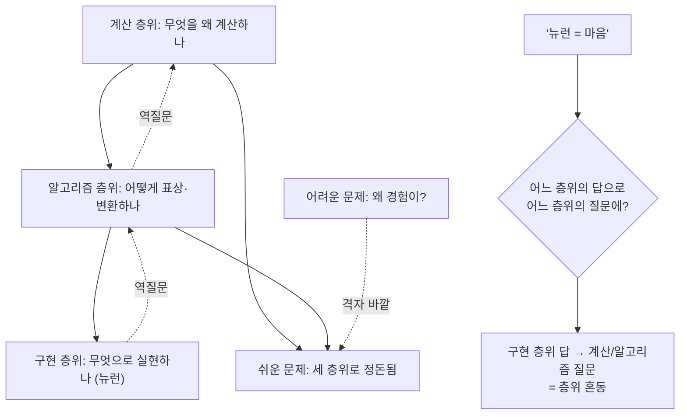

# 📐 설명 층위의 필요

> **Psyche L0** · Chapter 1: 문제의 지형 · 문서 4/5
> *(Marr의 3층위는 "뉴런 = 마음"이 왜 범주 오류인지를 진단하는 격자를 주지만, 그 격자조차 어려운 문제의 잔여를 메우지는 못한다.)*

## 🎯 핵심 질문

`03`은 범주의 함정이 두 기술을 한 평면에 욱여넣음이라고 진단했고, 처방으로 "올바른 층위에 배치하기"를 예고했다. 본 문서의 핵심 질문: **설명의 층위란 무엇이며, 그것을 제대로 나누면 무엇이 풀리고 무엇이 남는가?**

David Marr(1982, 『Vision』)의 3층위 분석이 우리의 도구다. Marr는 어떤 정보처리 시스템도 *세 가지 독립적인 층위*에서 설명되어야 한다고 주장했다.

1. **계산 층위(computational).** 시스템이 *무엇을* 왜 계산하는가. 문제의 목표와 그것이 풀리는 추상적 논리. (예: 시각은 2D 망막 상에서 3D 구조를 복원한다.)
2. **알고리즘/표상 층위(algorithmic).** 그 계산을 *어떻게* 수행하는가. 입력·출력의 표상 형식과 변환 절차. (예: 어떤 표상과 알고리즘으로 깊이를 추정하는가.)
3. **구현 층위(implementational).** 그 알고리즘이 *무엇으로* 물리적으로 실현되는가. (예: 어떤 뉴런·시냅스가 그것을 돌리는가.)

핵심 주장: "뉴런 = 마음"은 *구현 층위*의 사실로 *계산/알고리즘 층위*의 질문에 답하려는 — 즉 **층위를 혼동한** 범주 오류다. 그러나 정직하게도, 우리는 Marr의 격자가 어려운 문제를 *진단*할 뿐 *해소*하지 못함을 보일 것이다 — 어려운 문제는 세 층위 *어디에도* 깔끔히 들어맞지 않기 때문이다.

## 🌍 어디서 마주치나

- **신경과학 vs 인지심리학의 분업.** 한 연구실은 V1 뉴런의 발화 특성(구현)을 재고, 다른 연구실은 시지각의 베이지안 추론 모델(계산/알고리즘)을 짠다. 둘 다 "시각을 설명한다"고 말하지만 *다른 층위*를 설명한다. 갈등은 흔히 층위 혼동에서 온다.
- **AI 해석.** "이 신경망의 가중치를 다 봤지만 *무엇을* 하는지 모르겠다." 가중치(구현)를 안다고 계산 층위(이 회로가 푸는 문제)가 저절로 보이지 않는다 — 기계 해석가능성(mechanistic interpretability)이 정확히 구현에서 계산으로 거슬러 오르려는 시도다.
- **환원 논쟁.** "심리학은 결국 신경과학으로 환원된다"는 주장은 계산/알고리즘 층위가 구현 층위로 흡수된다는 주장이다. Marr는 이를 거부한다 — 같은 계산이 무수히 다른 구현으로 실현될 수 있기에(다중 실현, ch4 기능주의), 구현 사실이 계산 설명을 대체하지 못한다.

## 🔍 직관의 함정

**함정 1 — 구현이 가장 근본적이라는 환원적 직관.** "결국 다 뉴런이다. 뉴런만 충분히 알면 위층은 부수적이다." 함정: 층위는 *깊이*의 위계가 아니라 *질문*의 종류다. "왜 이 계산을 하는가"(계산 층위)는 "어떤 뉴런이 도는가"(구현)로 답될 수 없다 — 후자는 전자가 묻는 질문 자체를 던지지 않는다. 구현 환원주의는 다른 종류의 질문을 같은 질문으로 착각한다.

**함정 2 — 층위를 나누면 어려운 문제가 풀린다는 처방적 직관.** "범주 오류가 층위 혼동이라면, 층위를 똑바로 나누면 의식도 설명되겠지." 함정: 어려운 문제는 *층위 간 혼동*이 아니라 *층위 격자 바깥의 잔여*다. 식별·통합·보고는 계산/알고리즘 층위에 깔끔히 배치되지만(쉬운 문제), "왜 그 계산에 경험이 동반되는가"는 세 층위 중 어느 것에도 항목으로 존재하지 않는다. Marr의 격자는 **기능을 정돈**하지 *경험을 위치시키지* 못한다.

이 두 함정의 교훈: 층위 분석은 범주의 함정을 *진단*하는 데 강력하지만, 어려운 문제를 *해소*하지는 못한다. 진단과 해소는 다르다.

## ⚙️ 논증 구조

"뉴런 = 마음"이 왜 범주 오류인지를 Marr 격자로 형식화한다.

**논증 A (층위 혼동 진단):**

전제 1. "마음"이 가리키는 인지 기능들(식별·통합·보고)은 일차적으로 계산/알고리즘 층위에서 정의된다(그 기능이 *무엇을 어떻게* 하는가).
전제 2. "뉴런"은 구현 층위의 항이다.
전제 3. 한 층위의 답은 다른 층위의 질문에 대한 답을 자동으로 제공하지 않는다(층위 자율성; 다중 실현이 이를 보장).
결론. "뉴런 = 마음"은 구현 층위 답으로 계산/알고리즘 층위 질문에 답하려는 층위 혼동, 즉 범주 오류다. $\square$

**논증 B (격자의 한계 — 어려운 문제의 비배치):**

전제 4. Marr 격자의 세 층위는 모두 *기능적/정보처리적* 질문이다(무엇을·어떻게·무엇으로).
전제 5. 어려운 문제는 "이 정보처리에 *왜 경험이 동반되는가*"로, 정보처리적 질문이 아니다(`02`의 기능적 잔여).
결론. 어려운 문제는 Marr의 세 층위 어디에도 항목으로 들어가지 않는다 — 격자는 그것을 진단할 좌표는 주지만 담을 칸은 없다. $\square$

논증 B가 본 문서의 정직성이다. 층위는 `03`의 처방을 *부분적으로만* 이행한다: 기능 측의 범주 혼동은 깔끔히 치우되, 현상 측의 잔여는 격자 바깥에 남긴다.

## 🧪 증거와 사고실험

**사고실험 1 — 다중 실현(multiple realizability).** 같은 계산(예: 덧셈)이 실리콘 회로, 뉴런, 주판, 물 파이프로 실현될 수 있다. 구현이 이토록 다양해도 계산 층위의 설명은 동일하다. 이는 계산/알고리즘 층위가 구현 층위로 *환원되지 않음*을 보인다(Putnam, Fodor → ch4). 따라서 "뉴런 = 마음"은 거짓이거나, 적어도 한 특수 구현을 마음 일반과 동일시하는 오류다.

**사고실험 2 — 거꾸로 올라가기(reverse-engineering).** 외계 유물의 회로(구현)를 완전히 매핑했다고 하자. 우리는 그것이 *무엇을 계산하는지* 자동으로 알지 못한다 — 계산 층위는 구현에서 *읽어 올려져야* 하며, 그 자체로 추가적 설명 작업이다. 이는 구현이 다른 층위를 함축하지 않음을 보인다.

**경험적 정박 — 기계 해석가능성.** AI 모델에서 "유도 헤드(induction heads)" 같은 회로의 발견은, 구현(가중치)에서 알고리즘(이 회로가 수행하는 절차)으로 거슬러 오르는 실제 사례다. 흥미롭게도, 모든 회로 매핑을 마쳐도 "이 모델은 *무엇을 경험하는가*"는 한 발짝도 가까워지지 않는다 — 해석가능성은 계산/알고리즘 층위를 밝히지만 어려운 문제 층위에는 닿지 않는다. 이것은 논증 B의 경험적 실연이다.

## 🌉 설명적 간극

층위 관점에서 간극은 **격자 내 환원 가능성과 격자 외 잔여의 경계**로 재정식화된다.

격자 *안에서는* 층위 간 다리가 (원리상) 놓인다:
$$\text{구현} \xrightarrow{\text{실현}} \text{알고리즘} \xrightarrow{\text{기능}} \text{계산}$$
이 다리들은 모두 *어떻게/무엇으로*의 다리로, 쉬운 문제의 영역이다. 그러나 격자 *밖으로*:
$$\{\text{계산}, \text{알고리즘}, \text{구현}\} \not\vdash \{\text{경험 } Q\}$$
세 층위의 완전한 명세로부터 현상적 질은 도출되지 않는다. 간극의 정확한 위치: **Marr의 가장 높은 층위(계산)와 현상 사이.** 계산 층위는 "왜 이 기능인가"까지 답하지만 "왜 이 기능에 *느낌*이 따라붙는가"는 답하지 않는다. 어려운 문제는 격자의 *천장 위*에 있다(L4 어려운 문제, → `02`).

## 🧬 횡단 원리

**원리 7 (층위 명시 의무 — `03` 원리 6의 구체화).** 모든 정신 설명 주장은 *어느 Marr 층위*를 겨냥하는지 명시해야 한다. "뇌가 X를 한다"가 구현 층위 주장인지 계산 층위 주장인지 밝히지 않으면 층위 혼동(범주 오류)이 발생한다. 이 명시는 `03`의 동사 위장 검사와 짝을 이룬다 — 위장은 *동사*에, 혼동은 *층위*에 숨는다.

**원리 8 (격자 천장 원리).** 기능적으로 분석 가능한 모든 것은 Marr 격자의 어느 층위에 배치된다(쉬운 문제). 어떤 정신 항목이 *세 층위 어디에도 자연스러운 칸을 찾지 못하면*, 그것이 어려운 문제의 잔여다. 이 원리는 진단 도구다: 어떤 의식 이론이 "의식을 설명했다"고 주장할 때, 그것이 천장 아래(기능)에 머무는지 천장 위(경험)에 닿는지를 가른다. IIT, GWT 등 주요 이론을 이 자로 잴 수 있다(→ ch3, ch5).

## 🪞 1인칭

당신이 지금 이 문장을 이해하는 사건을 세 층위로 분해해 보라. *계산:* 기호열에서 의미 구조를 복원함. *알고리즘:* 어휘 접근, 통사 파싱, 의미 통합의 절차. *구현:* 좌반구 언어 영역의 발화 패턴. 세 기술 모두 참이고 유용하다.

그런데 이 세 기술을 다 합쳐도 *지금 이 이해가 어떤 느낌으로 진행되는지* — 의미가 떠오르는 그 미묘한 현전 — 는 어느 칸에도 적히지 않는다. 1인칭 시험: 당신의 경험을 셋 중 *어느 층위가 담는가?* 정직하게 보면, 경험은 한 층위의 *내용*이 아니라 세 층위가 돌아가는 동안 *그것이 무언가로 있음*이다. 이 "무언가로 있음"이 격자 천장 위의 잔여이며, Marr가 우리에게 정밀한 진단을 주되 마지막 칸을 비워 둔 자리다.

## 📐 예측·반증

- **예측.** 의식 이론들을 Marr 격자에 투사하면, "어려운 문제를 푼다"고 주장하는 이론들 대다수가 실제로는 계산/알고리즘 층위(접근·보고·통합 메커니즘)에 머물고 있음이 드러날 것이다. GWT는 계산/알고리즘 층위 이론으로, 천장 아래에 정확히 위치할 것이다.
- **반증 조건.** 만약 Marr의 세 층위(또는 그 자연스러운 확장) *안에서* 현상적 질의 존재와 정체가 도출된다면, 논증 B(격자 천장 원리)는 틀린 것이 된다 — 어려운 문제는 층위 격자 안에 칸을 갖는 셈이고, 그렇다면 그것은 결국 쉬운 문제의 한 종류였다. 거꾸로, 임의의 완전한 3층위 명세가 항상 "그런데 왜 느껴지나"의 잔여를 남긴다면 격자 천장 원리는 강건하다.

## 🤔 다음 질문

우리는 이제 진단 도구를 갖췄다 — 기술의 이종성(`01`), 쉬운/어려운 칼(`02`), 동사 위장 검사(`03`), 층위 격자(`04`). 이 도구들로 무장하면, 마음-몸 문제에 대한 주요 형이상학적 답변들 — 이원론·물리주의·기능주의·범심론 — 을 *각각 어디까지 설명하고 어디서 벽에 부딪히는지* 일관된 자로 잴 수 있다. 다음 문서가 그 지형도를 펼쳐, 이후 모든 챕터의 좌표계를 세운다(→ `05-map-overview`).

---

🧩 **Principle** — Marr의 3층위(계산/알고리즘/구현)는 정보처리 시스템을 서로 자율적인 세 질문으로 분해한다. "뉴런 = 마음"은 구현 층위의 답으로 계산/알고리즘 층위의 질문에 답하려는 *층위 혼동*이며, 다중 실현이 그 환원을 막는다.
🌉 **Boundary** — 설명이 멈추는 지점은 *격자의 천장(계산 층위)과 현상 사이*다: $\{\text{계산, 알고리즘, 구현}\} \not\vdash \{Q\}$. 세 층위는 모두 기능적 질문이라 식별·통합·보고를 정돈하지만, "왜 경험이 동반되는가"를 담을 칸이 없다. 어려운 문제는 격자 천장 위에 있다(→ L4, `02`).
🪞 **Experience** — 그것은 이해·지각의 사건을 세 층위로 빠짐없이 분해해도 "그것이 무언가로 있음"이 어느 칸에도 적히지 않는 1인칭 잔여로 느껴진다. 기계 해석가능성(구현→알고리즘 역공학)은 격자 안 다리를 실험으로 놓지만, 천장 위 경험에는 한 발짝도 다가가지 못함으로써 잔여의 위치를 3인칭에서 드러낸다.

---

## 📝 연습문제

<b>기초 — 층위 분류</b>

다음 진술을 Marr의 세 층위 중 하나로 분류하라. (a) "시각계는 그림자 정보로 표면 곡률을 추정한다." (b) "V4 영역은 색 항상성 처리에 관여한다." (c) "시각의 목표는 망막 상에서 외부 세계의 안정된 3D 모델을 복원하는 것이다." (d) "깊이 추정은 양안 시차를 입력으로 받아 disparity map을 출력한다."

**해설:** (c) **계산 층위** — 시스템이 *무엇을 왜* 푸는가(목표). (a), (d) **알고리즘/표상 층위** — *어떻게* 표상하고 변환하는가(그림자→곡률 추정, 시차→disparity map: 입출력 표상과 절차). (b) **구현 층위** — *무엇으로* 실현되는가(V4라는 신경 기질). 요령: "무엇을 왜"=계산, "어떻게(어떤 표상·절차)"=알고리즘, "무엇으로(어떤 물질)"=구현. (a)와 (d)가 둘 다 알고리즘인 이유는 둘 다 표상과 변환을 말하지 목표나 기질을 말하지 않기 때문.

<b>심화 — 다중 실현과 환원</b>

Putnam의 다중 실현 논변은 "통증은 C-섬유 발화다"류의 유형 동일성(type identity)을 어떻게 반박하는가? 그리고 이 논변이 §03의 범주 함정 및 §04의 층위 자율성과 어떻게 맞물리는지 설명하라. 다중 실현이 어려운 문제까지 해결하는가?

**해설:** 다중 실현 논변: 통증(계산/기능 층위의 상태)은 인간의 C-섬유, 문어의 다른 신경계, 가상의 실리콘 존재에서 *서로 다른 물리적 상태*로 실현될 수 있다. 만약 통증 = C-섬유 발화(특정 구현)라면, C-섬유 없는 문어는 통증을 못 느껴야 하는데 이는 거짓이다. 따라서 정신 *유형*은 특정 물리 *유형*과 동일시될 수 없다 — 기능 층위는 구현 층위로 환원되지 않는다(층위 자율성, §원리 8 배경). §03 연결: "뉴런 = 마음"이 범주 오류인 이유가 여기서 강화된다 — 특정 구현(뉴런)으로 계산/기능 일반(마음)을 동일시하는 것이기 때문. **그러나 어려운 문제는?** 다중 실현은 마음을 *구현에서 해방시켜 기능 층위에 정박*시키지만(이것이 기능주의, ch4의 토대), 바로 그 때문에 어려운 문제를 *재발*시킨다: 기능이 다양한 기질에서 실현된다면, "그 기능 실현에 왜 경험이 동반되며 모든 실현에서 *같은* 경험인가"(전도/부재 감각질, ch4)가 즉시 제기된다. 다중 실현은 환원을 막아 범주 함정을 진단하지만, 어려운 문제를 해결하기는커녕 날카롭게 만든다.

<b>논문 비평 — Marr 격자는 의식에 적용 가능한가</b>

Marr의 3층위는 *정보처리* 시스템을 위해 설계되었다. 어떤 이들은 의식을 "통합 정보"나 "전역 방송" 같은 정보처리 속성으로 보아 Marr 격자 안에 의식을 배치하려 한다(예: IIT, GWT). 이 시도가 성공하려면 무엇을 보여야 하며, §원리 8(격자 천장 원리)에 비추어 그 성공 가능성을 평가하라.

**해설:** 시도의 구조: 의식을 어떤 정보처리적 속성 $\Phi$(IIT) 또는 전역 가용성(GWT)으로 *정의*하면, 그것은 계산/알고리즘 층위의 항목이 되어 격자 안에 들어온다. **성공 조건:** 이 시도가 *어려운 문제를 풀려면*, 단지 "의식 = $\Phi$"라는 상관/정의를 넘어, $\Phi$(또는 전역 방송)*로부터 현상적 질의 존재와 정체가 직관적 잔여 없이 도출됨*을 보여야 한다(§02 기능적 닫힘 기준). **§원리 8 평가:** 격자 천장 원리에 따르면, $\Phi$와 전역 방송은 모두 *정보처리적 기술*(무엇을·어떻게)이므로 천장 아래(쉬운 문제)에 위치한다. 따라서 그것들을 의식과 *동일시*하는 것은 정의에 의한 봉합이지 도출이 아니다 — IIT는 공리에서 $\Phi$로 가지만 "왜 높은 $\Phi$에 경험이 *동반*되는가"는 추가 형이상학적 공준(현상→물리 동일성 가정)으로 메운다. GWT는 더 명시적으로 접근 의식(천장 아래)만을 겨냥한다고 인정한다. **비평 결론:** 두 이론 모두 격자 안에 의식의 *상관·구조*를 정밀하게 배치하는 데 성공하지만, 어려운 문제(천장 위)는 정의적 동일시로 *건너뛸* 뿐 도출하지 못한다. 이것이 IIT가 사실상 (구조적) 범심론으로 기우는 이유(ch5)다 — 천장 위에 닿으려면 격자를 넘어 형이상학으로 나가야 하기 때문. 과제: $\Phi$의 동일시가 §03의 "동사 위장"의 정의판(定義版)인지, 아니면 정직한 형이상학적 공준인지를 판정하라.

---

[◀ 이전: 범주의 함정](./03-category-trap.md) · [📚 README](../README.md) · [다음: 지형도 개요 ▶](./05-map-overview.md)

