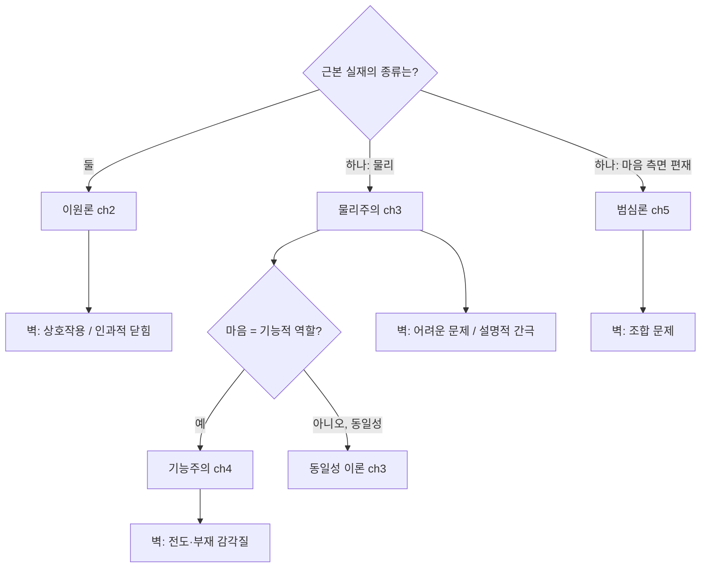

# 🗺️ 지형도 개요

> **Psyche L0** · Chapter 1: 문제의 지형 · 문서 5/5
> *(이원론·물리주의·기능주의·범심론은 각각 마음-몸 문제의 다른 부분을 잘 설명하고 다른 벽에 부딪힌다 — 이 문서가 이후 챕터의 좌표계를 세운다.)*

## 🎯 핵심 질문

`01`–`04`에서 우리는 문제를 정의하고(`01`), 쉬운/어려운 문제로 쪼개고(`02`), 거짓 해결(범주 함정, `03`)을 진단하고, 진단 격자(층위, `04`)를 세웠다. 이제 마지막 질문: **이 도구들로 잴 때, 네 입장은 각각 무엇을 설명하고 어디서 벽에 부딪히는가?**

본 문서는 새로운 논증을 펴기보다, 네 입장을 *공통의 자*로 배치하는 지형도를 그린다. 각 입장은 마음-몸 문제의 *서로 다른 압력점*에 최적화되어 있다 — 그래서 각자 무언가를 우아하게 설명하고, 정확히 다른 곳에서 대가를 치른다. 이 지도는 "누가 옳은가"의 시상식이 아니라, "각 입장이 어떤 교환(trade-off)을 받아들이는가"의 좌표계다. 이것이 ch2–ch5의 출발 도면이 된다.

## 🌍 어디서 마주치나

네 입장은 추상이 아니라 실제 연구·논쟁 진영으로 살아 있다.

- **이원론(ch2).** 신경과학에 회의적이지 않지만 의식의 환원 불가능성을 고수하는 진영 — Chalmers의 자연주의적 속성 이원론, 좀비/메리 논증의 형이상학적 독해.
- **물리주의(ch3).** 주류 신경과학·인지과학의 암묵적 기본값 — 동일성 이론, 기능주의의 물리주의적 판본, Dennett의 illusionism.
- **기능주의(ch4).** AI·계산주의의 철학적 토대 — 마음을 인과적 역할로 보는 입장. 물리주의와 겹치지만 다중 실현으로 독자성을 갖는다.
- **범심론(ch5).** 최근 부활한 진영 — Galen Strawson, Philip Goff, 그리고 IIT의 형이상학적 함의를 진지하게 받는 흐름.

이 진영들의 학회·논문·대중 논쟁에 들어설 때, 본 지도는 누가 어떤 압력점을 방어하고 있는지를 즉시 읽게 해 준다.

## 🔍 직관의 함정

**함정 1 — 한 입장이 모든 것을 설명해야 한다는 기대.** 각 입장을 "전부 맞거나 전부 틀림"으로 평가하는 직관. 함정: 마음-몸 문제는 단일 문제가 아니라 *문제 다발*(관계의 질문 + 설명의 질문 + 상호작용 + 인과적 닫힘 + 조합)이다. 어떤 입장도 모든 압력점에서 동시에 이기지 못한다 — 각자 어디서 이기고 어디서 지는지를 보는 것이 지도의 목적이다.

**함정 2 — 가장 직관적인 입장이 가장 옳다는 직관.** 이원론은 1인칭 직관에, 물리주의는 과학적 세계상에, 범심론은 환원 불가능성에 각각 호소한다. 함정: 직관의 강도는 진리의 척도가 아니라 *그 입장이 무엇을 우선했는지*의 표지다. 좋은 평가는 각 입장이 *어떤 직관을 살리려고 어떤 직관을 희생하는지*를 추적한다.

**함정 3 — 중립을 무입장으로 오인.** 본 연구소는 어느 진영도 미리 채택하지 않지만, 그것이 "다 똑같이 그럴듯하다"는 상대주의는 아니다. 우리의 자(쉬운/어려운 구분, 동사 위장 검사, 층위 격자)는 각 입장의 *교환을 정직하게 드러내는* 도구이며, 어떤 입장이 어떤 부담을 *숨기는지*까지 판정한다.

## ⚙️ 논증 구조

네 입장을 두 축으로 배치한다. **축 1: 근본 실재가 몇 종류인가(일원/이원).** **축 2: 마음을 무엇으로 보는가(기능적/내재적·질적).**

각 입장의 핵심 주장과 벽을 논증 형식으로 압축한다.

**이원론 (설명: 환원 불가능성을 정직하게 인정 / 벽: 상호작용·인과적 닫힘).**
주장: 현상적 질은 물리적 사실로 환원·도출되지 않으므로(`02`), 별도의 실체 또는 속성이다.
$$\{P\} \not\vdash \{Q\} \;\Rightarrow\; Q \text{는 비물리적}$$
벽: 비물리적 마음이 물리적 뇌·행동에 영향을 준다면, 물리계의 인과적 닫힘(모든 물리적 사건은 충분한 물리적 원인을 가짐)을 위반한다(→ ch2 상호작용 문제). 영향을 안 준다면 부수현상론(epiphenomenalism)으로 귀결돼 "왜 우리는 경험을 *보고*하는가"가 미궁이 된다. $\square$

**물리주의 (설명: 과학적 세계상과의 정합·인과적 닫힘 보존 / 벽: 어려운 문제).**
주장: 오직 물리적인 것만 존재하며, 마음은 물리적 상태와 동일하거나 그것에 수반된다.
벽: `02`의 좀비/메리/박쥐 논증이 보이는 설명적 잔여 — $\{P\}\not\vdash\{Q\}$ — 를 어떻게 다루는가. illusionism(잔여를 환상으로)이 가장 일관되나 1인칭 데이터를 *설명해 치울* 위험(`02` §함정). $\square$

**기능주의 (설명: 다중 실현·쉬운 문제의 우아한 처리 / 벽: 전도·부재 감각질).**
주장: 마음 상태는 인과적 역할로 정의된다 — 무엇으로 실현되든 같은 역할이면 같은 마음(`04` 다중 실현).
벽: 기능적 역할이 동일한데도 질이 뒤바뀌거나(전도 감각질) 없을(부재 감각질) 가능성이 상상 가능하다면, 기능이 질을 고정하지 못한다(→ ch4). 이는 `02`의 어려운 문제가 기능주의에 특화된 형태로 재발한 것. $\square$

**범심론 (설명: 어려운 문제의 우회·내재적 질의 위치 확보 / 벽: 조합 문제).**
주장: 현상적 질은 물질의 *내재적 본성*으로 편재한다(`02` 원리 4의 구조/질 비대칭을 질을 근본에 둠으로써 해소).
벽: 미시적 경험(전자의 원형 경험)이 어떻게 결합해 통합된 거시적 경험(나의 의식)을 이루는가 — 이것이 *조합 문제*이며, `03`의 동사 위장 검사("결합한다")에 정확히 걸린다(→ ch5). $\square$

## 🧪 증거와 사고실험

각 입장을 지탱하거나 압박하는 대표 사고실험을 지도 위에 배치한다.

| 사고실험 | 누구를 지지 | 누구를 압박 | 출처 |
|---|---|---|---|
| 좀비 (`02`) | 이원론·범심론 | 물리주의·기능주의 | Chalmers |
| 메리/지식 논증 (`02`) | 이원론 | 물리주의 | Jackson |
| 박쥐 (`02`) | 환원 불가능성 일반 | 객관적 환원주의 | Nagel |
| 전도/부재 감각질 | 비기능주의 | 기능주의 | Block, Shoemaker |
| 중국어 방 | 비기능주의(이해≠형식조작) | 강한 AI 기능주의 | Searle |
| 인과적 닫힘 | 물리주의 | 이원론 | (물리학적 원리) |
| 조합 문제 | 비범심론 | 범심론 | James, Goff |

핵심 관찰: **같은 사고실험이 한 입장을 지지하면서 다른 입장을 압박한다.** 좀비는 이원론·범심론에는 탄약이지만 물리주의·기능주의에는 폭탄이다. 이는 §함정 1의 교훈을 실증한다 — 압력점마다 승자가 다르다. 사고실험들은 진리를 결정하지 않고, *어떤 입장이 어떤 직관을 우선했는지*의 지도를 그린다.

경험적 정박: NCC 연구, IIT의 $\Phi$ 측정, GWT의 전역 점화 실험은 모두 *상관·구조* 데이터를 제공한다 — `01`의 원리 2(상관 ≠ 설명)에 따라, 이 데이터는 입장들 사이를 *결정적으로* 가르지 못하고 각 입장이 자기 식으로 해석한다. 데이터의 풍부함과 형이상학적 미결정성의 공존이 이 분야의 특징이다.

## 🌉 설명적 간극

지도 전체를 관통하는 통일된 관점: **각 입장은 설명적 간극(`01`–`04`에서 $\{P\}\not\vdash\{Q\}$로 정식화)에 대한 서로 다른 대응 전략이다.**

- **이원론:** 간극을 *존재론적 사실*로 받아들인다 — 도출 안 되는 이유는 *실제로 다른 것*이기 때문. (대가: 상호작용)
- **물리주의:** 간극을 *인식적 한계 또는 환상*으로 본다 — 도출 안 되는 것처럼 보이나 실은 메워지거나 사이비 간극. (대가: 1인칭 데이터의 부담)
- **기능주의:** 간극을 *기능 분석의 미완*으로 본다 — 충분히 분석하면 닫힌다. (대가: 감각질 논변)
- **범심론:** 간극을 *질을 근본에 둠으로써* 우회한다 — 도출할 필요 없이 처음부터 거기 있음. (대가: 조합)

즉 간극은 사라지지 않고 *각 입장의 가장 약한 이음매로 이전*된다. 이원론에서는 인과의 이음매로, 물리주의에서는 1인칭의 이음매로, 기능주의에서는 질의 이음매로, 범심론에서는 결합의 이음매로. 이 "간극의 보존 법칙"이 ch1이 도달한 가장 중요한 메타 통찰이다(L4 어려운 문제는 형태를 바꾸며 모든 입장에 출몰한다).

## 🧬 횡단 원리

**원리 9 (간극 이전 법칙).** 마음-몸 문제의 설명적 간극은 제거되지 않고 입장에 따라 위치를 바꾼다. 어떤 입장을 평가하는 가장 정직한 방법은 "그것이 간극을 푸는가"가 아니라 "그것이 간극을 *어디로 옮기며 그 대가가 무엇인가*"를 묻는 것이다. (`01`–`04`의 모든 진단 도구가 이 한 원리로 수렴한다.)

**원리 10 (좌표계 의무).** 이후 각 입장(ch2–ch5)을 다룰 때, 본 챕터의 자 — 쉬운/어려운 구분(`02`), 동사 위장 검사(`03` 원리 5), 층위 격자(`04` 원리 7–8) — 를 일관되게 적용한다. 같은 자로 재야만 입장 간 비교가 공정하다. 이것이 본 문서가 ch1을 닫으며 ch2–ch5에 부과하는 약속이다.

## 🪞 1인칭

지금 이 지도를 읽는 당신은, 이미 어느 압력점에 가장 민감한지를 1인칭으로 안다. 좀비를 상상할 때 "당연히 가능하다"가 떠오르면 당신의 직관은 이원론·범심론 쪽으로, "그게 말이 되나"가 떠오르면 물리주의·기능주의 쪽으로 기운다. 어려운 문제의 잔여가 견딜 수 없이 무겁게 느껴지면 범심론의 우회가 매력적일 것이고, 인과적 닫힘을 신성시하면 이원론의 대가가 치명적으로 보일 것이다.

1인칭 시험(이 챕터의 종합): 네 입장의 *대가* — 상호작용, 1인칭 부담, 감각질, 조합 — 중 *당신에게 가장 견딜 만한 것*은 무엇인가? 그 답이 당신이 무의식적으로 우선하는 직관을 드러낸다. 본 연구소의 권유는 어느 답을 강요하는 것이 아니라, 당신의 선택이 *어떤 교환인지를 의식하게* 하는 것이다. 지도는 영토가 아니지만, 자신이 어느 길을 택했는지는 알 수 있다.

## 📐 예측·반증

- **예측.** ch2–ch5에서 각 입장을 본 챕터의 자로 잴 때, 어떤 입장도 네 압력점(상호작용·1인칭·감각질·조합) *모두*에서 무대가로 통과하지 못할 것이다 — 간극 이전 법칙(원리 9)의 예측이다. 만약 어떤 입장이 모든 압력점을 무대가로 통과한다면, 이 법칙은 반증된다.
- **반증 조건.** 본 지도의 핵심 주장(간극의 보존·이전)은, 어떤 입장이 설명적 간극을 *어디에도 잔여를 남기지 않고* 완전히 소멸시킴이 입증되면 반증된다. 그 입장은 마음-몸 문제를 *해결*한 것이고, 본 연구소의 "지형" 전제(문제가 강건히 남는다)는 무너진다. 우리는 이 반증을 환영한다 — 그것이야말로 모토의 궁극적 성취("explain it")일 터이기 때문이다.

## 🤔 다음 질문

지도가 펼쳐졌으니, 이제 영토로 들어간다. 첫 행선지는 가장 오래되고 가장 직관적이며 가장 곤혹스러운 입장이다 — 마음과 몸을 두 실체로 본 데카르트의 후예들. 그들은 어려운 문제를 가장 정직하게 인정하지만, 인과의 벽 앞에서 가장 위태롭다. 실체 이원론은 정확히 무엇을 주장하며, 송과선 이후 그것은 어떻게 살아남았는가(→ ch2 `01-substance-dualism`)?

---

🧩 **Principle** — 이원론·물리주의·기능주의·범심론은 마음-몸 문제의 서로 다른 압력점에 최적화된 *간극 대응 전략*들이다. 이원론은 간극을 존재론으로 인정하고, 물리주의는 인식적 한계/환상으로 보고, 기능주의는 분석의 미완으로 다루며, 범심론은 질을 근본에 둬 우회한다.
🌉 **Boundary** — 설명적 간극은 어느 입장에서도 소멸하지 않고 *가장 약한 이음매로 이전*된다: 이원론은 상호작용/인과적 닫힘, 물리주의는 1인칭 데이터, 기능주의는 전도·부재 감각질, 범심론은 조합 문제. 이것이 간극 이전 법칙(원리 9)이며 L4 어려운 문제의 편재성이다.
🪞 **Experience** — 그것은 네 입장의 대가 중 "당신에게 가장 견딜 만한 것"을 1인칭으로 가늠할 때 드러나는, 자신의 우선 직관에 대한 자각으로 느껴진다. 좀비 상상 가능성에 대한 즉각적 반응, NCC·IIT·GWT 실험의 동일 데이터를 각자 다르게 읽는 양상이 그 직관을 3인칭 토론장과 잇는다.

---

## 📝 연습문제

<b>기초 — 입장과 벽 짝짓기</b>

다음 "벽"을 그것이 가장 압박하는 입장과 짝지어라. (a) 상호작용 문제 / (b) 조합 문제 / (c) 전도·부재 감각질 / (d) 1인칭 데이터를 설명해 치울 위험. [입장: 이원론, 물리주의(illusionism), 기능주의, 범심론]

**해설:** (a)↔**이원론** — 비물리적 마음이 물리계에 작용하면 인과적 닫힘 위반. (b)↔**범심론** — 미시 경험들이 어떻게 통합 거시 경험을 이루는가. (c)↔**기능주의** — 같은 기능적 역할에 질이 뒤바뀌거나 부재할 가능성. (d)↔**물리주의(특히 illusionism)** — 경험을 환상으로 돌리면 설명되어야 할 1인칭 데이터를 *설명해 치우는* 위험. 핵심(원리 9): 각 벽은 그 입장이 간극을 옮겨 놓은 *바로 그 이음매*다.

<b>심화 — 간극 이전 법칙의 적용</b>

부수현상론(epiphenomenalism: 마음은 물리에 의해 산출되나 물리에 영향을 주지 않는다)을 골라, 그것이 설명적 간극과 인과 문제를 *어떻게 재배치*하는지 분석하라. 이 입장이 이원론의 상호작용 벽을 피하는 대가로 어떤 새 벽을 떠안는가?

**해설:** 부수현상론의 전략: 마음을 비물리적(또는 환원 불가능한) 것으로 인정해 어려운 문제를 정직하게 받되($\{P\}\not\vdash\{Q\}$ 인정), 마음→물리 인과를 *부정*함으로써 인과적 닫힘을 보존한다. 즉 §05 지도에서 이원론의 *상호작용 벽*을 우회한다. **재배치된 벽(원리 9):** (1) *자기 지식의 역설* — 경험이 어떤 물리적 효과도 못 낸다면, 우리가 경험에 대해 *말하고 쓰는*(이 문장을 포함!) 물리적 행위는 경험에 의해 야기되지 않은 셈이다. 그렇다면 우리의 의식 보고는 의식과 인과적으로 무관하게 우연히 일치하는 것이 되어, "왜 우리 보고가 경험과 들어맞는가"가 미궁에 빠진다. (2) *진화적 잉여* — 인과력 없는 경험은 자연선택의 표적이 될 수 없어, 의식의 진화가 설명 불가능해진다. 결론: 부수현상론은 상호작용 벽(이음매 A)을 자기 지식·진화 벽(이음매 A′)으로 *옮길* 뿐 간극을 소멸시키지 못한다 — 간극 이전 법칙의 교과서적 사례.

<b>논문 비평 — 중립적 일원론은 제3의 길인가</b>

본 지도는 네 입장을 두 축으로 배치했지만, 중립적 일원론(neutral monism: Russell, 그리고 일부 범심론 변종)은 물리적인 것과 정신적인 것 *둘 다*를 더 근본적인 *중립적* 실재의 두 측면으로 본다. 이 입장이 §05의 네 압력점에 대해 갖는 잠재력과 한계를 평가하고, 그것이 범심론과 어떻게 구별되는지 논하라.

**해설:** 중립적 일원론의 핵심: 궁극 실재는 물리적이지도 정신적이지도 않은 *중립적* 무엇이며, 물리적 기술과 현상적 기술은 그 동일 실재에 대한 두 접근 양식이다(`01` 원리 1의 이종성을 *한 실재의 두 측면*으로 해소). **압력점 잠재력:** (1) 인과적 닫힘 — 정신을 별도 실체로 두지 않으니 이원론의 상호작용 벽을 피한다. (2) 어려운 문제 — 현상적 측면을 환상으로 돌리지 않으므로(물리주의와 달리) 1인칭 데이터를 보존하며 "explain it away"를 피한다. (3) 구조/질 비대칭(`02` 원리 4) — Russell의 통찰: 물리학은 물질의 *구조·관계*만 기술하고 그 *내재적 본성*은 비워 두는데, 중립적 일원론은 그 빈자리에 현상적(또는 원형 현상적) 본성을 채운다. **범심론과의 구별:** 범심론은 *정신성*을 근본에 두는 반면, 엄밀한 중립적 일원론은 근본 실재를 정신적이라고도 물리적이라고도 부르지 않는다(중립). 그러나 실천에서 둘은 자주 수렴한다 — "중립적" 본성을 *원형 현상적*으로 구체화하면 사실상 범심론(특히 러셀적 일원론)이 된다. **한계(원리 9):** 중립적 일원론도 *조합 문제*를 떠안는다 — 중립적 미시 측면들이 어떻게 통합 거시 경험을 이루는가. 또한 "중립적 실재"가 *무엇인지* 적극적으로 특징짓기 어려워, 비판자들은 그것이 문제를 푸는 게 아니라 *이름 붙인* 것(§03 동사 위장의 명사판)이라 본다. 비평 과제: 중립적 일원론이 진정한 제3의 길인지, 아니면 범심론과 물리주의 사이의 *수사적 중간역*인지를 — 그것이 조합 문제를 범심론보다 더 잘 다루는가로 — 판정하라. 이 입장은 ch5에서 본격적으로 재론된다.

---

[◀ 이전: 설명 층위의 필요](./04-levels-of-explanation.md) · [📚 README](../README.md) · [다음: 실체 이원론 ▶](../ch2-dualism/01-substance-dualism.md)

