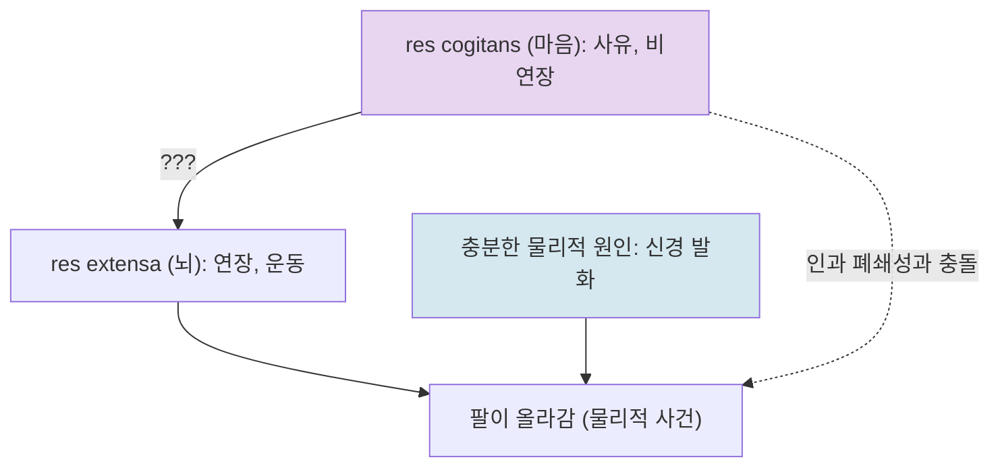

# 🪞 실체 이원론: 두 세계의 만남

> **Psyche L0** · Chapter 2: 이원론과 그 유산 · 문서 1/4
> *(마음과 몸이 서로 다른 종류의 실체라면, 둘은 도대체 어떻게 만나는가 — 이것이 이원론의 영광이자 저주다.)*

## 🎯 핵심 질문

데카르트는 세계를 두 가지 근본 실체로 나눈다. 하나는 **사유하는 것**($res\ cogitans$), 다른 하나는 **연장된 것**($res\ extensa$)이다. 전자는 공간을 차지하지 않으며 분할되지 않고 오직 생각한다. 후자는 공간을 차지하고 무한히 분할되며 생각하지 않는다. 이 구분이 깔끔하다면 — 너무 깔끔해서 문제다.

핵심 질문은 단순하다. **비물질적인 마음이 어떻게 물질적인 뇌에 인과적으로 영향을 줄 수 있는가?** 내가 팔을 들겠다고 *결심*하면(사유의 사건) 실제로 팔이 올라간다(연장의 사건). 결심과 근육 수축 사이에는 인과 사슬이 있어야 한다. 그런데 두 실체가 *아무런 공통 속성도 공유하지 않는다면*, 한쪽이 다른 쪽을 밀거나 당기거나 변화시킬 접촉면이 존재하지 않는다. 인과는 보통 무언가의 전달 — 운동량, 에너지, 힘 — 을 요구하는데, 비연장적인 것은 전달할 위치도 방향도 없다.

이 문제는 단순한 기술적 난점이 아니다. 그것은 이원론의 *정의 자체*에서 곧장 흘러나온다. 마음과 몸을 충분히 다르게 만들수록(그래서 마음이 죽음 이후에도 살아남을 수 있을 만큼 독립적으로 만들수록), 둘이 어떻게 상호작용하는지는 더 설명하기 어려워진다. 이원론은 자신의 강점에 의해 약화된다.

## 🌍 어디서 마주치나

이 구분은 추상적으로 들리지만, 일상의 어휘 곳곳에 스며 있다. "몸은 여기 있는데 마음은 딴 데 가 있다"는 표현, "정신력으로 병을 이긴다"는 믿음, 의학에서의 "심인성(psychosomatic)" 질환 개념 — 이 모두는 마음과 몸을 *서로 작용을 주고받는 별개의 영역*으로 전제한다.

종교적 맥락에서는 더 노골적이다. 영혼이 육체를 떠난다는 관념, 사후 세계에서 의식이 지속된다는 믿음은 마음이 물질적 신체에 *부착되어 있을 뿐 의존하지 않는다*는 실체 이원론적 직관을 깔고 있다. 데카르트 자신도 영혼 불멸을 철학적으로 정당화하려는 동기에서 이 구분을 벼렸다.

심지어 현대 신경과학의 보고서에서도 흔적이 보인다. "뇌가 결정을 내린다"와 "내가 결정을 내린다" 사이의 어색한 공존, fMRI 영상 위에 의식을 *위치시키려는* 시도 — 이런 표현들은 마음을 어딘가에 놓아야 한다는 압박을 드러낸다. 그리고 그 압박은 데카르트가 송과선(pineal gland)에 영혼의 자리를 둔 시도의 먼 후손이다.

## 🔍 직관의 함정

함정은 두 방향에서 온다.

**첫째, 분리 가능성의 직관.** 나는 내 몸 없이 존재하는 나를 *상상할 수 있다*. 꿈속에서, 또는 데카르트의 방법적 회의 속에서, 나는 신체를 의심하면서도 사유하는 나를 의심할 수 없다("나는 생각한다, 고로 존재한다"). 여기서 "상상할 수 있다 → 분리될 수 있다 → 실제로 별개의 실체다"라는 미끄러짐이 일어난다. 이 미끄러짐은 *상상 가능성(conceivability)이 형이상학적 가능성을 보증하는가*라는 거대한 물음을 건드린다(→ 문서 4, 챌머스의 좀비 논증과 직결).

**둘째, 인과의 직관.** 우리는 마음이 몸을 움직인다는 것을 *경험적으로 안다*고 느낀다. 의지가 행동을 낳는 것을 매 순간 체험하기 때문이다. 그래서 "마음과 몸은 상호작용한다 — 그건 명백하다"고 말하고 싶어진다. 하지만 *그것이 일어난다는 확신*과 *그것이 어떻게 가능한지에 대한 설명*은 전혀 다른 문제다. 상호작용의 명백함은 상호작용의 가능성을 설명해 주지 않는다. 오히려 그 명백함이 설명의 부재를 가린다.

## ⚙️ 논증 구조

데카르트의 실체 구분 논증과 그에 대한 상호작용 반론을 형식화하면 다음과 같다.

**데카르트의 실재적 구별(real distinction) 논증:**

1. 나는 마음을 (사유하지만 연장되지 않은 것으로) 명석판명하게(clearly and distinctly) 이해할 수 있다.
2. 나는 몸을 (연장되지만 사유하지 않는 것으로) 명석판명하게 이해할 수 있다.
3. 명석판명하게 서로 독립적으로 이해될 수 있는 것은, 적어도 신에 의해 분리되어 존재할 수 있다.
4. 따라서 마음과 몸은 실재적으로 구별되는 두 실체다. $\square$

**상호작용 반론(엘리자베스 공주 → 인과 폐쇄성):**

이 결론을 받아들이면 다음 긴장이 발생한다.

1. 마음(비연장적·비물질적)은 몸(연장적·물질적)에 인과적으로 영향을 준다. (상호작용 전제)
2. 인과적 영향은 영향을 주는 것과 받는 것 사이에 공통의 인과 양식 — 접촉, 운동, 힘의 전달 — 을 요구한다. (인과 원리)
3. 비연장적인 것은 위치도, 운동량도, 접촉면도 갖지 않으므로 (2)의 인과 양식에 참여할 수 없다.
4. 따라서 마음이 어떻게 몸에 영향을 주는지 설명할 수 없다 — 혹은 (1)과 (2) 중 하나를 포기해야 한다. $\square$

여기에 현대적 강화가 더해진다. **물리적 인과 폐쇄성(causal closure of the physical)** 원리:

> 모든 물리적 사건은, 그것이 원인을 갖는다면, 충분한 물리적 원인을 갖는다.

이 원리가 참이라면, 팔이 올라가는 물리적 사건은 이미 충분한 *물리적* 원인(신경 발화)을 갖는다. 그렇다면 비물질적 의지가 추가로 끼어들 인과적 여지가 없다. 만약 의지가 정말 기여한다면 — 그것은 물리계 안에 *추가적 힘*을 주입하는 것이고, 이는 에너지 보존 법칙과 충돌한다. 마음이 인과적으로 무력하든지(부수현상론), 물리학이 불완전하든지, 둘 중 하나다.

## 🧪 증거와 사고실험

**엘리자베스 공주의 편지(1643).** 보헤미아의 엘리자베스 공주는 데카르트와의 서신에서 정확히 이 급소를 찔렀다. 그녀는 묻는다 — *비물질적인 영혼이 어떻게 신체적 정기(animal spirits)를 움직여 자발적 행위를 일으키는가?* 무언가를 밀어 움직이려면 미는 것이 표면과 접촉해야 하고 연장을 가져야 하는데, 영혼은 둘 다 결여한다. 데카르트는 만족스러운 답을 끝내 내놓지 못했다. 그는 송과선을 매개로 제시했지만, 이는 문제를 *옮겼을 뿐* 해소하지 못한다 — 비물질적 마음이 송과선이라는 물질을 움직이는 바로 그 지점에서 동일한 수수께끼가 반복된다.

**송과선 사고실험의 무한 후퇴.** 마음이 뇌에 작용하는 "접점"을 어디에 두든, 그 접점에서 비물질이 물질을 변화시키는 메커니즘은 여전히 비어 있다. 접점을 더 작게(뉴런 하나, 시냅스 하나, 단일 이온 채널) 좁혀도 수수께끼는 *크기에 비례해 줄어들지 않는다*. 이것이 송과선 가설의 진짜 실패다. 위치 특정은 설명이 아니다.

**부수현상론이라는 출구.** 한 가지 응답은 마음이 *존재하지만 인과적으로 무력하다*고 보는 것이다(epiphenomenalism). 마음은 뇌가 만들어 내는 연기(煙氣)와 같아서, 일어나는 일을 *동반*할 뿐 *야기*하지 않는다. 이는 인과 폐쇄성을 구한다. 하지만 대가가 끔찍하다 — 내가 손가락을 데였다는 *고통이* 손을 떼는 행동의 원인이 아니라는 결론, 내가 의식적으로 쓰는 이 문장이 사실 내 의식과 무관하게 손가락이 타이핑한 것이라는 결론. 직관에 대한 폭력이 너무 크다.

## 🌉 설명적 간극

실체 이원론은 *간극을 메우지 못하고 간극을 실체화한다*. 즉 마음과 몸 사이의 설명적 거리를, 두 실체 사이의 형이상학적 심연으로 격상시킨다. 문제를 해결하는 대신 문제에 존엄을 부여하는 셈이다.

여기서 핵심을 분명히 하자. 간극에는 두 종류가 있다.

- **인식적 간극(epistemic gap):** 우리가 *어떻게* 마음-몸 관계를 이해해야 할지 모른다.
- **존재론적 간극(ontological gap):** 마음과 몸이 *실제로* 다른 종류의 것이다.

데카르트는 인식적 간극(명석판명하게 따로 이해됨)에서 존재론적 간극(따로 존재함)으로 건너간다. 그러나 *우리가 어떤 것을 따로 이해할 수 있다는 사실*이 *그것들이 따로 존재한다는 사실*을 함축하는가? 물(水)과 $H_2O$는 별개로 이해될 수 있었지만 동일한 것으로 밝혀졌다. 이해의 분리가 존재의 분리를 보장하지 않는다 — 이것이 후대 물리주의의 핵심 반격이며(→ 챕터 3), 동시에 챌머스가 *왜 의식의 경우에는 이 반격이 통하지 않는지*를 논증하려는 지점이다(→ 문서 4).

## 🧬 횡단 원리

이 문서를 관통하는 추상 원리는 다음과 같다.

> **분리 가능성의 대가:** 두 영역을 더 깨끗이 분리할수록, 둘의 연결을 설명하기는 더 어려워진다.

이 원리는 마음-몸 문제를 넘어 반복된다. 추상적 수학적 대상과 물리적 세계의 관계(수가 어떻게 인과에 참여하는가), 가치와 사실의 관계(당위가 어떻게 존재에서 나오는가), 의미와 기호의 관계 — 모든 "두 영역" 문제는 동일한 형식을 갖는다. *깨끗한 구분*과 *작동하는 다리*는 서로를 잡아당긴다. 이원론은 이 긴장의 원형(原型)이다.

따라서 마음-몸 문제를 공부하는 일은 단지 한 주제를 배우는 게 아니라, *환원 불가능해 보이는 두 영역을 어떻게 다룰 것인가*라는 철학의 반복 패턴을 배우는 일이다.

## 🪞 1인칭

내가 지금 커피잔을 들겠다고 마음먹는다. 잔이 올라온다. 1인칭 시점에서 이 사건은 *완벽하게 매끄럽다* — 의지와 행동 사이에 어떤 틈도 느껴지지 않는다. 바로 이 매끄러움이 함정이다.

3인칭 시점에서 보면 그 사이에는 운동 피질의 발화, 척수의 전도, 신경근 접합부의 아세틸콜린 방출, 액틴-미오신 활주가 빽빽이 들어차 있다. *나는 그중 어느 것도 의식적으로 경험하지 않는다.* 나는 오직 "들고 싶다"와 "들렸다"의 양 끝만 안다. 1인칭 경험의 매끄러움은 중간 메커니즘의 비가시성에서 온다.

데카르트의 오류는 어쩌면 이 비가시성을 *형이상학으로 읽은 것*인지도 모른다. 메커니즘이 보이지 않으니, 마음이 직접 몸에 닿는다고 느낀 것이다. 1인칭의 명증함은 강력하지만(→ 문서 3에서 이 힘을 정면으로 다룬다), 그것이 곧 형이상학적 진리는 아니다.

## 📐 예측·반증

실체 이원론은 흔히 "반증 불가능한 형이상학"이라고 폄하되지만, 실제로는 검증 가능한 함의를 갖는다.

**이원론이 참이라면 예측되는 것:**
- 물리적 인과 폐쇄성이 *거짓*이어야 한다. 즉 뇌 안 어딘가에 충분한 물리적 원인 없이 일어나는 물리적 사건 — 비물질적 의지가 주입한 "추가 힘" — 이 있어야 한다.
- 이는 측정 가능한 에너지 비보존, 혹은 신경 발화의 물리적 미결정 지점으로 나타나야 한다.

**현재까지의 관찰:**
- 신경 활동은 알려진 물리·화학 법칙으로 설명되는 한도 내에서 작동하며, 비물리적 입력을 요구하는 잔여(residual)가 검출된 바 없다.
- 뇌 손상이 인격·기억·의지를 *체계적으로* 변형시킨다는 사실(피니어스 게이지 사례 등)은 마음이 신체 독립적이라는 가설에 강한 압박을 준다.

따라서 실체 이원론은 *원리적으로는 반증 가능하지만, 현재 증거의 방향은 그것에 불리하다*. 다만 부수현상론적 후퇴는 이 반증을 피해 간다 — 마음이 인과적으로 작용하지 않는다면 에너지 비보존도 예측되지 않기 때문이다. 그 대가로 부수현상론은 *경험적으로 텅 빈* 이론이 되며, 이는 다른 차원의 부담이다.

## 🤔 다음 질문

만약 마음을 *별도의 실체*로 보는 대가가 이렇게 크다면 — 실체는 하나(물리적 기질)로 두되, *속성*만 두 종류라고 하면 어떨까? 물질이 특정하게 조직되었을 때 *물리적 속성*과 더불어 *현상적 속성*이 함께 나타난다고 보면, 인과 폐쇄성과의 정면충돌은 누그러질지 모른다. 이것이 다음 문서의 출발점이다.

---

🧩 **Principle** — 분리 가능성의 대가: 두 영역을 더 깨끗이 가를수록, 둘을 잇는 다리는 더 설명하기 어려워진다.
🌉 **Boundary** — 인식적 간극(따로 *이해됨*)과 존재론적 간극(따로 *존재함*)은 다르다. 데카르트는 전자에서 후자로 건넌다.
🪞 **Experience** — 의지와 행동 사이의 1인칭 매끄러움은 중간 메커니즘의 비가시성에서 온다. 매끄러움은 형이상학이 아니다.

## 📝 연습문제

<b>기초</b> — 인과 폐쇄성 원리를 한 문장으로 진술하고, 그것이 왜 실체 이원론과 충돌하는지 설명하라.

**해설:** 인과 폐쇄성: "모든 물리적 사건은, 원인을 갖는다면, 충분한 *물리적* 원인을 갖는다." 충돌의 핵심은 *충분함*에 있다. 팔이 올라가는 물리적 사건이 이미 충분한 물리적 원인(신경 발화)을 갖는다면, 비물질적 의지가 더해질 인과적 빈틈이 없다. 만약 의지가 진짜 기여한다면 물리계에 추가 힘이 주입되어 에너지 보존과 충돌하고, 충돌하지 않으려면 의지는 무력해져야 한다(부수현상론). 어느 쪽이든 "마음이 몸을 움직인다"는 상호작용 전제는 위협받는다.

<b>심화</b> — 데카르트의 송과선 가설이 상호작용 문제를 해결하지 못하는 이유를, "위치 특정은 설명이 아니다"라는 명제를 사용해 논증하라.

**해설:** 상호작용 문제의 본질은 *위치*가 아니라 *메커니즘*이다. 비물질이 물질을 변화시키는 작용이 어떻게 가능한지가 물음인데, 송과선 가설은 그 작용이 *어디서* 일어나는지만 답한다. 접점을 송과선으로 특정하면, "비물질적 마음이 송과선이라는 물질을 어떻게 움직이는가"라는 정확히 동일한 수수께끼가 그 지점에서 재발한다. 접점을 더 작게(시냅스, 이온 채널) 좁혀도 수수께끼는 크기에 비례해 줄지 않는다 — 어떤 크기에서도 "비물질→물질" 전이 메커니즘은 비어 있기 때문이다. 따라서 위치 특정은 문제를 옮길 뿐 해소하지 못한다. $\square$

<b>논문 비평</b> — "엘리자베스 공주의 반론은 단지 17세기 역학(접촉 인과)을 전제했을 뿐이며, 비국소성을 허용하는 현대 물리학에서는 더 이상 유효하지 않다"는 주장을 비판적으로 평가하라.

**해설:** 이 주장은 부분적으로 옳지만 결정적으로 빗나간다. 옳은 부분: 엘리자베스의 원래 정식화는 분명 접촉-역학적 인과 개념에 기대고 있고, 현대 물리학(양자 비국소성, 장 이론)은 접촉을 인과의 필요조건으로 요구하지 않는다. 빗나가는 부분: 반론의 *핵심*은 접촉이 아니라 *공통 인과 양식의 부재*다. 양자 비국소성조차 물리량(상태, 확률 진폭) 사이의 관계이지, *비물리량과 물리량* 사이의 다리가 아니다. 더 근본적으로, 현대적 강화 형태인 인과 폐쇄성 논증은 접촉을 전혀 전제하지 않으면서도 동일한 결론에 도달한다 — 물리적 사건이 충분한 물리적 원인을 갖는 한, 인과 양식이 무엇이든 비물질적 원인의 자리는 없다. 따라서 물리학의 발전은 엘리자베스 반론을 *재정식화*하게 만들 뿐 무력화하지 못한다. 좋은 비평이라면 "접촉 전제는 시대 제약이나, 인과적 공통 기반의 요구는 그렇지 않다"고 구분해야 한다.

[◀ 이전: 지형도 개요](../ch1-the-terrain/05-map-overview.md) · [📚 README](../README.md) · [다음: 속성 이원론 ▶](./02-property-dualism.md)

