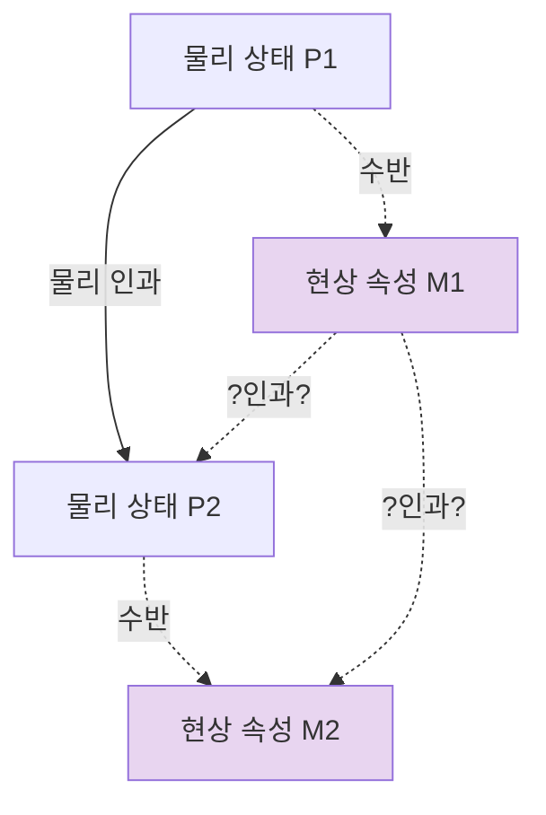

# 🌗 속성 이원론: 하나의 기질, 두 종류의 속성

> **Psyche L0** · Chapter 2: 이원론과 그 유산 · 문서 2/4
> *(실체는 하나로 줄이되 속성은 둘로 남긴다 — 그러나 수반은 동반을 보장할 뿐 설명을 보장하지 않는다.)*

## 🎯 핵심 질문

실체 이원론의 부담(상호작용 문제, 인과 폐쇄성과의 충돌)을 피하는 한 가지 자연스러운 후퇴가 있다. **실체는 하나만 인정하자 — 물리적 기질뿐이다.** 영혼이라는 별도의 실재는 없다. 그러나 그 물리적 기질이 특정하게 조직될 때(예컨대 살아 있는 뇌처럼), 거기에는 두 종류의 *속성*이 깃든다. 하나는 물리적 속성(질량, 발화율, 전기화학적 상태)이고, 다른 하나는 **현상적 속성** — 무언가를 경험할 때의 *그것임의 느낌*($what\ it\ is\ like$), 빨강의 빨감, 통증의 아픔이다.

이것이 **속성 이원론(property dualism)**이다. 핵심 질문은 이렇게 바뀐다. **현상적 속성은 물리적 속성에 *수반*하는가, 그리고 수반한다면 그것으로 *설명*되는가?**

이 질문이 미묘한 이유는, "그렇다"와 "그렇다"가 같은 답이 아니기 때문이다. 현상적 속성이 물리적 속성에 의존하고 그것 없이는 변하지 않는다는 것(수반)을 인정하면서도, *왜 바로 그 물리적 조직이 바로 그 느낌을 낳는지*는 여전히 미스터리로 남을 수 있다. 속성 이원론은 의존을 받아들이면서 설명을 거부하는 — 혹은 보류하는 — 입장이다.

## 🌍 어디서 마주치나

이 입장은 현대 의식 과학의 *암묵적 기본값*에 가깝다. 신경과학자 대부분은 영혼을 믿지 않으면서도(실체는 하나), "이 신경 상관자가 *왜* 의식을 동반하는지"는 별개의 미해결 문제로 남겨 둔다. 이 분리된 태도가 바로 속성 이원론적 직관의 작동이다.

**의식의 신경 상관자(NCC, neural correlates of consciousness)** 연구 프로그램 전체가 이 구조를 전제한다. 우리는 특정 경험(빨강을 봄)과 특정 신경 상태(V4 영역의 활동 패턴) 사이의 *상관*을 찾는다. 그런데 "상관"이라는 단어 자체가 이미 두 항(현상적 항, 물리적 항)을 구분하고 있다. 만약 둘이 *동일*하다면 상관을 찾을 필요가 없을 것이다 — 물은 $H_2O$의 NCC가 아니라 그냥 $H_2O$다.

일상에서는 "기분이 좌우된다는 건 알겠는데, *왜* 세로토닌 농도가 *이런 느낌*으로 나타나는지는 모르겠다"는 당혹감에서 마주친다. 약리학은 물리적 개입(약물)으로 현상적 결과(기분)를 *조절*할 수 있음을 보여 주지만, *왜 그 조절이 느낌의 형태를 띠는지*는 답하지 않는다.

## 🔍 직관의 함정

함정은 "수반하면 설명된다"는 미끄러짐에 있다.

수반(supervenience)은 강력한 의존 관계처럼 들린다. *현상이 물리에 수반한다*면, 물리적 사실이 모두 고정되면 현상적 사실도 고정된다 — 물리적으로 동일한 두 세계는 현상적으로도 동일하다. 이것은 분명 마음이 몸에 *묶여 있다*는 강한 주장이다.

그래서 "수반을 확립하면 환원을 완성한 것"이라고 느끼기 쉽다. 하지만 수반은 *공변(covariation)*의 진술이지 *메커니즘*의 진술이 아니다. "A가 변하면 B도 변한다"는 "A가 B를 *왜* 그렇게 만드는지"를 말하지 않는다. 기압계 바늘은 날씨에 수반하지만(같은 날씨 → 같은 바늘), 바늘이 날씨를 설명하지는 않는다.

또 다른 함정은 *방향성*이다. 수반은 정의상 비대칭이지만(현상이 물리에 수반, 그 역은 아님), 이 비대칭이 어디서 오는지 — 왜 물리가 기초이고 현상이 부수인지 — 는 수반 관계 자체로부터 도출되지 않는다. 그것은 추가로 가정되어야 한다.

## ⚙️ 논증 구조

먼저 수반을 형식화하자.

> **수반(global supervenience):** 속성군 $B$(현상적)가 속성군 $A$(물리적)에 수반한다 $\iff$ $A$에서 구별 불가능한 두 대상(혹은 세계)은 $B$에서도 구별 불가능하다.

기호로:
$$
A\text{-supervenes} \;:\; \neg\exists x,y\;\big( (x \equiv_A y) \wedge (x \not\equiv_B y) \big)
$$

즉 *물리적 쌍둥이는 반드시 현상적 쌍둥이다.* 현상이 변하려면 물리가 먼저 변해야 한다.

**속성 이원론의 핵심 논증:**

1. 현상적 속성은 물리적 속성에 수반한다. (의존 주장 — 실체 이원론의 분리를 거부)
2. 그러나 현상적 속성은 물리적 속성과 *동일하지 않다*. (비환원 주장)
3. 만약 (1)과 (2)가 모두 참이라면, 현상적 속성은 물리적 속성에 의존하는 *별개의* 속성이다.
4. 따라서 세계에는 하나의 실체와 두 종류의 속성이 있다. $\square$

여기서 전체 무게는 전제 (2)에 실린다. *왜 현상적 속성을 물리적 속성과 동일시할 수 없는가?* 속성 이원론자는 보통 두 자원에 호소한다 — 설명적 간극 논증(아래 🌉)과 상상 가능성 논증(→ 문서 4). 그리고 (2)를 *거부*하는 것이 바로 환원적 물리주의의 길이다(→ 챕터 3).

**김재권(Jaegwon Kim)의 압박.** 김재권은 수반에 머무는 입장이 불안정하다고 논증했다. 그의 **수반/배제 논증(supervenience/exclusion argument)**은 다음과 같이 압박한다.

만약 $M_1$이 $P_1$에 수반하고, $P_2$가 이미 $P_1$에 의해 충분히 야기된다면, $M_1$이 $M_2$나 $P_2$를 야기할 *인과적 일거리*가 남지 않는다(인과적 배제). 그렇다면 현상적 속성은 부수현상으로 전락하거나 — 아니면 물리적 속성과 *동일시*되어 $P_1$의 인과력을 *물려받아야* 한다. 김재권의 결론은 날카롭다: **수반만으로는 현상적 속성의 인과적 실재성을 구할 수 없다.** 속성 이원론은 부수현상론으로 미끄러지거나 환원적 물리주의로 붕괴하는 두 출구 사이에 끼인다.

## 🧪 증거와 사고실험

**역전 스펙트럼(inverted spectrum).** 나와 당신이 물리적·기능적으로 동일하게 빨강에 반응하지만, 당신의 *내적 빨강*은 나의 *내적 초록*과 같다고 상상해 보자. 행동·언어·신경 상태는 완벽히 일치하므로 어떤 3인칭 검사로도 구별할 수 없다. 만약 이런 역전이 *논리적으로 일관*된다면, 현상적 속성은 물리적·기능적 속성을 넘어선다 — 즉 수반은 성립하더라도(역전이 *같은 물리*에서 일어난다면 수반은 깨진다) 환원은 실패한다. 역전 스펙트럼의 정확한 위치는 논쟁적이지만, 그것이 *생각될 수 있다는 것 자체*가 (2)에 힘을 싣는다.

**메리의 방(지식 논증, Jackson).** 색채 과학을 완벽히 통달했지만 평생 흑백 방에 갇혀 산 신경과학자 메리. 그녀는 빨강에 관한 *모든 물리적 사실*을 안다. 방을 나와 처음 빨강을 볼 때, 그녀는 *새로운 무언가*를 배우는가? "그렇다"고 느껴진다면, 물리적 사실의 총체에 *빠진 사실*(빨강의 느낌)이 있다는 뜻이다. 이는 현상적 속성의 비환원성, 곧 전제 (2)를 직접 겨냥한다. (이 논증은 → hard problem L4에서 전면 분석된다.)

**기압계 유비의 교훈.** 위 두 사고실험과 대비되는 것이 기압계다. 기압계 바늘은 기압에 완벽히 수반하지만, 우리는 "왜 이 바늘 위치가 이 기압을 동반하는가"를 미스터리로 여기지 않는다 — 바늘의 운동은 기압의 작용으로 *남김없이 설명*되기 때문이다. 현상적 속성이 기압계 바늘과 같다면 속성 이원론은 무너진다. 핵심 쟁점은 *현상적 속성이 기압계 바늘처럼 설명되는가, 아니면 설명적으로 남는가*이다.

## 🌉 설명적 간극

여기가 이 문서의 심장이다. **수반은 동반(co-occurrence)을 보장하지만 설명(explanation)을 보장하지 않는다.**

레빈(Joseph Levine)이 정식화한 **설명적 간극(explanatory gap)**을 적용하자. 물(水)의 경우, "물은 $H_2O$다"는 단지 두 사실이 함께 나타난다는 진술이 아니다. 우리는 *왜* 물이 끓고, 얼고, 적시는지를 분자 구조로부터 *연역*할 수 있다. 동반이 메커니즘으로 설명된다. 반면 "통증은 C-섬유 발화에 수반한다"에서는, C-섬유 발화로부터 *왜 그것이 아픈 느낌을 동반하는지*를 연역할 수 없다. 우리는 상관을 발견할 뿐 *연결을 이해*하지 못한다.

형식적으로:

- **환원적 동일성:** $\text{물} = H_2O$, 그리고 거시 속성이 미시 구조에서 연역됨 → 설명적 간극 없음.
- **단순 수반:** 현상이 물리에 수반($x \equiv_A y \Rightarrow x \equiv_B y$), 그러나 *왜 이 물리가 이 현상인지* 연역되지 않음 → 설명적 간극 잔존.

속성 이원론은 정확히 *수반은 인정하되 환원적 연역은 거부하는* 위치를 차지한다. 그것은 간극을 *형이상학적으로* 메우지 않고(실체 이원론처럼 두 실체를 두지도 않고), *설명적으로* 메우지도 않은 채, 간극을 *속성 차원에 봉인*한다. 정직한 입장이지만, 미완의 입장이기도 하다.

## 🧬 횡단 원리

> **공변은 설명이 아니다(Covariation is not explanation):** A와 B가 함께 변한다는 사실은, A가 B를 *왜* 그렇게 만드는지를 말해 주지 않는다.

이 원리는 과학 전반의 방법론적 격언("상관은 인과가 아니다")의 형이상학판이다. 그러나 마음-몸 문제에서는 한 걸음 더 나아간다 — 여기서는 인과조차 충분치 않다. 설령 물리적 상태가 현상적 상태를 *인과한다*고 인정해도, *왜 그 인과의 결과가 느낌의 형태를 띠는지*는 여전히 빈칸이다. 횡단 원리의 강한 버전은 이렇다: **의존(수반)도, 인과도, 그 자체로는 *질적 성격*을 설명하지 못한다.** 설명에는 *연역적 투명성* — 기초 사실로부터 표적 사실이 따라 나옴이 보이는 것 — 이 필요하며, 바로 이 투명성이 현상적 영역에서 결여된다.

## 🪞 1인칭

3인칭에서 나는 신경 상태들의 공변을 본다. 1인칭에서 나는 *이 통증*을 겪는다. 속성 이원론의 호소력은 이 1인칭 잔여에서 온다 — "당신이 내 C-섬유에 관해 무엇을 다 알아내든, 그것은 *내가 지금 겪는 이것*을 다 말해 주지 않는다"는 확신.

이 확신은 단지 정보의 부족이 아니다. 메리는 *정보를 다 가졌어도* 무언가를 더 배운다고 느껴진다. 즉 1인칭은 *추가 정보*가 아니라 *다른 접근 양식* — 사실을 아는 것과 사실을 *겪는* 것의 차이 — 을 가리키는 듯하다. 속성 이원론은 이 양식의 차이를 *속성의 차이*로 번역한다. 물리주의는 이를 *동일한 사실에 대한 두 표상 방식*으로 번역한다(→ 문서 4의 2차원 의미론, 그리고 챕터 3). 어느 번역이 옳은지가 전체 논쟁의 분수령이다.

## 📐 예측·반증

속성 이원론은 메타-이론에 가까워 직접 반증이 까다롭지만, 함의는 있다.

**예측되는 것:**
- 현상적 속성이 물리에 *수반*하므로, 물리적 개입은 반드시 현상적 변화를 동반해야 한다(역은 아님). 즉 물리 변화 없는 현상 변화는 *없어야* 한다.
- 동시에 *왜 이 물리가 이 현상인지*에 대한 완결적 연역은 영원히 얻어지지 않으리라 예측한다(설명적 간극의 영속성).

**반증 시나리오:**
- 만약 어떤 신경 이론이 현상적 성격을 미시 구조에서 *연역적으로 투명하게* 도출하는 데 성공한다면(물→$H_2O$처럼), 전제 (2)는 무너지고 환원적 물리주의가 승리한다. 속성 이원론은 이 가능성에 의해 반증된다.
- 반대로 물리 변화 *없이* 현상이 변하는 사례가 확립되면, 수반(전제 1) 자체가 깨져 실체 이원론 쪽으로 압박된다.

**김재권 압박의 메타-반증.** 이론 내적으로도 위협이 있다. 만약 수반/배제 논증이 건전하다면, 속성 이원론은 *안정적 중간 지대를 점유할 수 없다* — 부수현상론(현상의 인과적 무력)이나 환원(현상의 물리적 동일시) 중 하나로 강제 이동된다. 이는 경험적 반증이 아니라 *개념적 불안정성*에 의한 약화다. 속성 이원론의 생존은 이 압박을 견디는 응답(예: 비환원적 물리주의, 다수 실현 논변)에 달려 있다.

## 🤔 다음 질문

수반/배제 논증과 설명적 간극에도 *불구하고*, 왜 그토록 많은 사람이 "내 빨강은 결코 신경 상태로 환원되지 않는다"고 흔들림 없이 느끼는가? 이 확신은 단순한 추론 오류일까, 아니면 무시할 수 없는 증거일까? 다음 문서는 이 1인칭 직관의 *힘 자체*를 정면으로 다룬다 — 그것을 쉽게 기각할 수 없는 이유를 찾는다.

---

🧩 **Principle** — 공변은 설명이 아니다: A와 B가 함께 변한다는 사실은 A가 *왜* B를 낳는지를 말해 주지 않는다.
🌉 **Boundary** — 수반(동반의 보장)과 환원(연역적 설명의 보장)은 다르다. 속성 이원론은 전자를 받고 후자를 거부한다.
🪞 **Experience** — 1인칭은 추가 정보가 아니라 다른 접근 양식이다 — 사실을 *아는* 것과 사실을 *겪는* 것의 차이.

## 📝 연습문제

<b>기초</b> — 수반을 정의하고, "통증은 C-섬유 발화에 수반한다"가 "통증은 C-섬유 발화다"보다 약한 주장인 이유를 설명하라.

**해설:** 수반: 물리에서 구별 불가능한 것은 현상에서도 구별 불가능하다($x \equiv_A y \Rightarrow x \equiv_B y$). "수반한다"는 *공변/의존*만 주장한다 — 물리가 같으면 현상도 같다. "동일하다"는 그보다 강하게 *두 항이 하나의 것*이라고 주장하며, 따라서 현상 속성이 물리 속성의 인과력과 설명력을 그대로 *물려받는다*. 수반은 동일성을 함축하지 않는다: 기압계 바늘은 기압에 수반하지만 기압과 동일하지 않다. 그래서 수반은 의존을 인정하면서도 비동일성(전제 2)을 열어 둘 수 있는, 더 약하고 더 유연한 주장이다.

<b>심화</b> — 기압계 유비를 사용하여, "수반은 설명을 보장하지 않는다"는 명제를 논증하라. 그리고 통증의 경우가 기압계와 어떻게 다른지 밝혀라.

**해설:** 기압계 바늘 위치는 기압에 완벽히 수반한다(같은 기압→같은 바늘). 그러나 이 수반은 그 자체로 아무것도 설명하지 않는다 — 설명은 *기압이 용수철에 가하는 힘이 바늘을 움직인다*는 메커니즘에서 온다. 즉 수반은 설명의 *결과*이지 설명 자체가 아니다. 일반화하면: 공변의 확립은 메커니즘의 제시와 별개다. 통증의 경우 차이는 결정적이다 — 기압계에서는 수반 위에 *연역적으로 투명한 메커니즘*을 얹을 수 있어 간극이 메워지지만, 통증에서는 C-섬유 발화로부터 *왜 그것이 아픈 느낌인지*를 연역할 길이 보이지 않는다. 따라서 기압계는 "수반+설명"이고 통증은 "수반-설명"이며, 이 차이가 설명적 간극의 거처다. $\square$

<b>논문 비평</b> — 김재권의 수반/배제 논증이 "속성 이원론은 부수현상론이나 환원으로 붕괴한다"고 결론짓는다. 비환원적 물리주의자가 이 딜레마를 빠져나갈 한 가지 응답을 구성하고, 그 응답의 약점을 지적하라.

**해설:** 가능한 응답: *다수 실현(multiple realizability)에 의한 비환원성*. 현상적 속성 $M$이 여러 물리적 기질($P_1, P_2, \dots$)로 실현될 수 있다면, $M$은 어떤 단일 물리 속성과도 동일시될 수 없으므로(동일성은 일대일을 요구) 환원되지 않는다. 그러면서도 각 사례에서 $M$은 그 사례의 물리적 실현자의 인과력을 *통해* 작동하므로 부수현상이 아니다 — $M$의 인과력은 실현자의 인과력으로 "구현"된다. 이로써 두 뿔(부수현상/환원) 모두를 피하는 듯 보인다. 약점: 김재권은 바로 이 "구현을 통한 인과"가 결국 *실현자가 진짜 인과 일꾼*임을 인정하는 것이며, 그렇다면 $M$ 고유의 인과적 기여는 다시 배제된다고 반박한다(인과적 유전 문제). 또한 만약 $M$의 인과력이 실현자의 인과력과 *동일*하다면 그것은 사실상 부분적 환원이고, *다르다*면 인과적 배제가 재발한다. 따라서 다수 실현은 동일성을 막지만 배제 논증의 핵심 — *물리적 충분 원인이 이미 있을 때 현상적 속성이 할 인과 일거리가 있는가* — 은 정면으로 해소하지 못한다. 좋은 비평은 "다수 실현은 *환원* 뿔은 무디게 하나 *배제* 뿔은 무디게 하지 못한다"고 구분해야 한다.

[◀ 이전: 실체 이원론](./01-substance-dualism.md) · [📚 README](../README.md) · [다음: 이원론의 직관적 힘 ▶](./03-intuitive-force.md)

