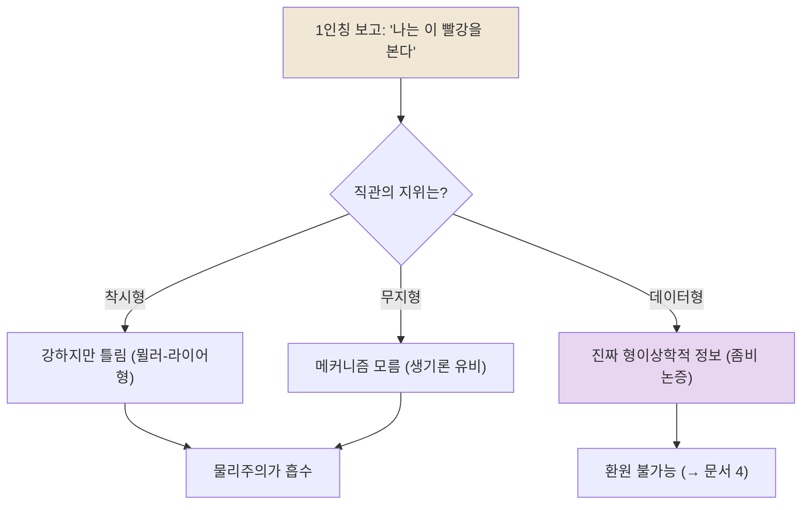

# 👁️ 이원론의 직관적 힘: 왜 쉽게 버려지지 않는가

> **Psyche L0** · Chapter 2: 이원론과 그 유산 · 문서 3/4
> *(논증으로는 거듭 반박되어도 직관으로는 죽지 않는다 — 1인칭의 명증함을 단순 오류로 치부할 수 없는 이유를 추적한다.)*

## 🎯 핵심 질문

이원론은 철학사에서 가장 자주 "논파된" 입장이다. 상호작용 문제, 인과 폐쇄성, 수반/배제 — 우리는 앞 두 문서에서 그 부담을 보았다. 그런데도 이원론적 직관은 좀처럼 사라지지 않는다. 신경과학을 깊이 공부한 사람조차 "그래도 *내가 지금 보는 이 빨강*은 뇌 상태가 아닌 것 같다"는 느낌을 떨치지 못한다.

핵심 질문은 메타적이다. **이 끈질긴 1인칭 직관은 단순한 인지적 착각인가, 아니면 무시할 수 없는 데이터인가?** "나는 뇌 상태가 아니라 이 빨강을 본다"는 보고는 *틀린 추론*일까, 아니면 *옳은 보고이되 잘못 해석된* 것일까, 아니면 *진짜 형이상학적 정보를 담은* 것일까?

이 물음이 중요한 이유는, 직관의 지위를 어떻게 평가하느냐가 마음-몸 논쟁 전체의 방법론을 결정하기 때문이다. 직관을 증거로 인정하면 물리주의의 부담이 커지고, 직관을 착각으로 격하하면 물리주의가 숨 쉴 공간을 얻는다. 따라서 우리는 직관을 *기각하지도, 맹신하지도 않고* 그 힘의 출처를 해부해야 한다.

## 🌍 어디서 마주치나

이 직관은 철학 강의실 밖에서 더 강하다.

- **임종과 사별의 언어:** "그 사람은 떠났지만 그의 *영혼은* 우리와 함께 있다." 거의 모든 문화가 의식이 신체를 *초과*한다는 표현을 갖는다.
- **마취의 경험:** 전신마취에서 깨어난 사람은 "시간이 사라졌다"고 보고한다. 의식의 *켜짐과 꺼짐*이 너무나 전부-아니면-전무여서, 그것이 한낱 화학 농도의 함수라는 사실이 직관적으로 받아들이기 어렵다.
- **AI에 대한 우리의 망설임:** 우리는 정교한 언어 모델이 "정말 느끼는가"를 묻는다. 행동이 아무리 인간 같아도 "*안에 누군가 있는가*"라는 물음이 남는다. 이 잔여 물음 자체가 이원론적 직관의 표현이다 — 기능과 현상이 분리될 수 있다는 느낌.
- **거울 앞의 자기 인식:** "이 얼굴 뒤에 *내가* 있다"는 감각. 신체는 대상으로 보이지만, 보는 *주체*는 대상화되지 않는다.

## 🔍 직관의 함정

여기서 함정은 *반대 방향*으로도 작동한다. 즉 이 장에서는 직관을 너무 빨리 *기각하는* 것이 함정이다.

물리주의자는 흔히 이렇게 말한다. "이원론적 직관은 무지의 산물이다 — 옛 사람들이 번개를 신의 분노로 본 것처럼, 우리도 메커니즘을 모르니 마음을 신비화한다." 이 진단(생기론 유비)은 강력하지만, *너무 매끄럽게* 적용될 위험이 있다. 모든 강한 직관을 "곧 사라질 무지"로 예단하면, 그 직관이 진짜로 *추적하고 있는 무언가*를 놓칠 수 있다.

반대 함정도 있다. 직관이 강하다는 *사실*에서 직관이 *참*이라는 결론으로 건너뛰는 것이다. 강도(强度)는 신빙성이 아니다. 뮐러-라이어 착시는 직접 재어 보아도 여전히 다르게 *보인다* — 직관은 강하면서도 틀릴 수 있다.

따라서 정직한 작업은 양쪽 함정 사이를 걷는 것이다: **직관의 힘을 진지하게 받아들이되, 그 힘을 진리로 자동 번역하지 않는다.** 우리가 추적할 질문은 "직관이 강한가"가 아니라 "이 직관은 *어떤 종류의* 강함인가 — 착시형인가, 데이터형인가"이다.

## ⚙️ 논증 구조

1인칭 직관을 가장 잘 정식화한 것이 **상상 가능성 논증(conceivability argument)**의 일반 형식이다.

1. 나는 내 뇌의 모든 물리적 사실을 고정한 채로, *현상적 의식이 부재하는* 사례(좀비)를 상상할 수 있다.
2. 상상 가능한 것은(적절한 조건에서) 형이상학적으로 가능하다. ($Conceivability \Rightarrow Possibility$)
3. 따라서 물리적 사실이 현상적 사실을 *필연화하지 않는* 세계가 가능하다.
4. 그러나 만약 현상이 물리로 환원된다면, 물리가 고정되면 현상도 필연적으로 고정되어야 한다.
5. 따라서 현상은 물리로 환원되지 않는다. $\square$

이 논증의 무게는 전제 2 — 상상 가능성에서 가능성으로의 추론 — 에 실린다. 물리주의자의 표준 반격은 "*인식적* 상상 가능성은 *형이상학적* 가능성을 보증하지 않는다"는 것이다(물과 $H_2O$: "물이 $H_2O$가 아닌 세계"를 상상할 수 있는 *듯하지만* 그것은 형이상학적으로 불가능하다 — 우리가 물의 본질을 *잘못 표상*했을 뿐이다).

여기서 이 문서의 고유 기여가 드러난다. **현상적 개념은 물·$H_2O$의 경우와 다른 특별한 지위를 갖는가?** 챌머스의 답은 "그렇다"이며, 그 근거가 2차원 의미론이다(→ 문서 4). 이 문서는 그 형식 장치 *이전에*, *왜* 사람들이 현상적 직관에 그토록 큰 비중을 두는지를 — 직관의 *현상학*을 — 먼저 밝힌다.

## 🧪 증거와 사고실험

**현전(presence)의 직접성.** 현상적 직관의 핵심 특징은 그것이 *추론*이 아니라 *제시*라는 점이다. 내가 통증을 아는 방식은, 증거를 모아 "나는 통증 상태에 있다"고 *결론짓는* 것이 아니다. 통증은 *그냥 거기 있다* — 매개 없이, 오류 가능성 없이. 데카르트의 코기토가 가진 힘도 여기서 온다: 나는 내 사유의 존재를 *추론*하는 게 아니라 *겪는다*. 이 직접성이 직관에 특유의 면역력을 준다.

**오류 불가능성의 비대칭.** 나는 "벽이 빨갛다"에 대해서는 틀릴 수 있다(조명, 착시). 그러나 "나에게 빨강으로 *보인다*"에 대해서는 틀리기 어렵다. 외부 대상에 대한 판단과 내적 현상에 대한 판단 사이의 이 *오류 가능성 비대칭*은, 현상적 사실이 물리적 사실과 *다른 인식적 종류*임을 시사하는 듯하다. (물리주의자는 이를 "특별한 *접근 방식*이지 특별한 *사실*이 아니다"라고 재해석한다.)

**뮐러-라이어 대조 실험(사고실험).** 직관이 착시형인지 데이터형인지 가르는 시금석. 뮐러-라이어 착시는 *교정 후에도 지속*된다 — 자로 재어 같음을 알아도 여전히 달라 보인다. 그렇다면 이원론적 직관도 "물리주의를 받아들인 후에도 지속되니 착시"라고 말할 수 있을까? 결정적 차이: 뮐러-라이어에서 우리는 *직관과 무관한 독립 측정*(자)을 갖고 있어 직관이 틀렸음을 *외부에서* 확정할 수 있다. 현상적 직관에는 그런 독립 측정대가 — 직관 바깥에서 현상의 유무를 재는 도구 — 가 *원리적으로* 없다. 1인칭 외부에서 현상에 접근할 길이 없기 때문이다. 이 비대칭이 이원론적 직관을 단순 착시로 환원하기 어렵게 만든다.

## 🌉 설명적 간극

이 문서에서 설명적 간극은 *직관의 차원*에 다시 나타난다. 물리주의가 옳다 해도 — 즉 현상이 정말 물리적 상태라 해도 — *왜 그것이 1인칭에게는 환원 불가능하게 느껴지는지*는 별도로 설명되어야 한다. 이를 **메타-간극(meta-gap)**이라 부르자.

물리주의의 가장 정직한 형태는 두 가지 부담을 인정한다. (a) 현상이 물리임을 보이는 부담. (b) *왜 그것이 물리가 아닌 것처럼 보이는지*를 설명하는 부담(이른바 "현상적 개념 전략", phenomenal concept strategy). (b)를 무시하면 물리주의는 *직관에 빚을 진 채* 승리를 선언하는 셈이다. 따라서 이원론적 직관은, 설령 거짓이라 해도, 물리주의가 *반드시 설명해야 할 설명항*으로 남는다.

요점: 이원론을 거부하더라도 이원론적 직관은 사라지지 않으며, 그 직관 자체가 *설명되어야 할 현상*이다. 모토를 빌리면 — 직관을 *설명해야지(explain), 설명으로 없애 버려서는(explain away)* 안 된다.

## 🧬 횡단 원리

> **직관은 데이터다, 그러나 해석 없는 데이터는 없다:** 강한 직관은 무언가를 추적한다. 다만 그것이 *무엇을* 추적하는지는 추가 해석을 요한다.

이 원리는 철학 방법론 전반을 관통한다. 윤리학의 직관(고문은 그르다), 수학의 직관(무한히 많은 소수가 있다), 논리의 직관(모순은 거짓이다) — 직관은 이론 구축의 출발 데이터다. 그러나 데이터를 *날것으로* 신뢰하는 것과 데이터를 *해석되어야 할 것*으로 다루는 것은 다르다. 마음-몸 문제에서 이 원리의 적용은 특히 까다로운데, 여기서 데이터(현상적 직관) 자체가 *1인칭에서만 접근 가능*하여 상호 교차 검증이 제약되기 때문이다. 이원론적 직관의 특수성은 바로 *검증대의 부재*에 있다.

## 🪞 1인칭

지금 이 순간 멈추어 보라. 화면의 흰 바탕, 글자의 검정. 이 *봄* 자체 — 색의 현전, 봄의 있음. 당신은 이것을 의심할 수 없다. 그것은 추론된 것이 아니라 *주어진* 것이다.

이원론적 직관의 전부가 이 한 점에 있다: **현상은 나에게 *제시*되지 *기술*되지 않는다.** 어떤 신경과학적 기술도 "V4 영역의 발화 패턴"이라는 *3인칭 기술*의 형식을 띤다. 그러나 내가 겪는 빨강은 *기술의 대상*이 아니라 *겪음의 양식*이다. 이 양식과 기술 사이의 격차가, 아무리 정교한 환원을 들이대도 "그건 빨강에 *관한* 것이지 빨강 *자체*가 아니다"라는 잔여감을 남긴다.

물리주의자는 이 잔여감을 *제거*하려 하지 않고 *재배치*하려 한다 — "동일한 사실을 1인칭 양식과 3인칭 양식으로 표상하는 것뿐"이라고. 이 재배치가 성공하는지가 다음 문서, 그리고 챕터 3 전체의 시험대다. 분명한 것은: 직관을 *느끼지 못하는 척*하는 물리주의는 정직하지 않다는 것이다.

## 📐 예측·반증

직관 자체는 명제가 아니지만, "직관은 단순 착각"이라는 가설과 "직관은 데이터"라는 가설은 서로 다른 것을 예측한다.

**"직관은 곧 사라질 무지"(생기론 유비) 가설의 예측:**
- 신경과학이 성숙할수록 이원론적 직관이 *약화*되어야 한다 — 생기론적 직관이 분자생물학 앞에서 소멸했듯이.

**관찰:**
- 그러나 신경과학의 폭발적 진보에도 불구하고 현상적 직관은 *약화되지 않았다*. 오히려 전문가들 사이에서도 "어려운 문제는 여전히 어렵다"는 합의가 유지된다. 이는 생기론 유비에 대한 불리한 증거다 — 적어도 직관이 *단지* 메커니즘 무지에서 온다는 가설을 약화한다.

**"직관은 형이상학적 데이터" 가설의 시험:**
- 만약 어떤 환원이 현상적 성격을 *연역적으로 투명하게* 보여 주는 데 성공하고 그 결과 직관이 *자연스럽게 해소*된다면(물→$H_2O$에서 생기론적 잔여감이 해소되었듯), 직관은 데이터가 아니라 무지의 잔영이었음이 사후에 확증된다.
- 반대로 완성된 물리 이론 앞에서도 직관이 *완강히 남는다면*, 직관이 단순 무지 이상을 추적한다는 가설이 강화된다.

요컨대 이 직관의 지위는 *미래의 환원 성공 여부에 의해 사후적으로 판정된다*. 현재로서는 어느 쪽도 결론짓지 못하며, 바로 그 미결정 상태가 이원론을 살려 둔다.

## 🤔 다음 질문

만약 1인칭 직관이 이토록 견고하고, 단순 착시로도 단순 무지로도 환원되지 않는다면 — 현대 철학자가 *과학을 부정하지 않으면서도* 이 직관을 이론에 정직하게 반영할 길은 없을까? 데이비드 챌머스는 바로 이 길을 모색한다: 물리학을 손대지 않은 채 의식을 *근본적인 것*으로 추가하는 "자연주의적 이원론". 다음 문서는 이 현대적 부활의 논리 — 좀비 논증과 2차원 의미론 — 를 해부한다.

---

🧩 **Principle** — 직관은 데이터다, 그러나 해석 없는 데이터는 없다: 강한 직관은 무언가를 추적하나, *무엇을* 추적하는지는 추가 해석을 요한다.
🌉 **Boundary** — 착시형 직관(독립 측정대로 교정 가능)과 데이터형 직관(독립 측정대 부재)은 다르다. 현상적 직관에는 1인칭 바깥의 검증대가 없다.
🪞 **Experience** — 현상은 나에게 *제시*되지 *기술*되지 않는다. 기술과 겪음의 격차가 환원 후에도 잔여감을 남긴다.

## 📝 연습문제

<b>기초</b> — "직관이 강하다"는 사실에서 "직관이 참이다"로 곧장 추론하는 것이 왜 오류인지, 뮐러-라이어 착시를 예로 설명하라.

**해설:** 강도(强度)는 신빙성과 다른 차원이다. 뮐러-라이어 착시에서 두 선분은 자로 재면 같은 길이지만, 측정 결과를 알고 난 뒤에도 여전히 강하게 다르게 *보인다*. 즉 직관이 매우 강하면서도 명백히 거짓일 수 있다. 따라서 "강함 → 참"은 타당하지 않은 추론이다. 직관의 강도는 그것이 *진지하게 다뤄질 데이터*임을 시사할 뿐, 그 내용이 옳음을 보증하지 않는다. 직관은 설명의 출발점이지 결론이 아니다.

<b>심화</b> — 이원론적 직관을 뮐러-라이어 착시로 환원하려는 시도가 부딪히는 *비대칭*을 설명하라. 무엇이 두 경우를 다르게 만드는가?

**해설:** 핵심 비대칭은 *독립 측정대의 유무*다. 뮐러-라이어에서 우리는 직관과 무관한 외부 도구(자)로 선분의 실제 길이를 잴 수 있고, 그 측정이 직관을 *외부에서* 반증한다 — 직관이 틀렸음을 직관 바깥에서 확정할 수 있다. 그러나 현상적 직관에는 그런 외부 측정대가 원리적으로 없다. 현상(빨강의 느낌)의 유무를 1인칭 경험 *바깥에서* 재는 도구가 존재하지 않기 때문이다. 3인칭 신경 측정은 *상관자*를 잴 뿐 현상 자체에 직접 접근하지 못한다. 따라서 "직관이 지속된다"는 사실이 뮐러-라이어에서는 "착시"의 증거가 되지만, 현상적 직관에서는 같은 결론을 내릴 외부 근거가 없다. 이 비대칭이 이원론적 직관의 단순 착시 환원을 막는다. $\square$

<b>논문 비평</b> — "현상적 직관은 생기론(vitalism)과 동형이며, 생기론이 분자생물학 앞에서 소멸했듯 신경과학의 성숙과 함께 소멸할 것이다"라는 예측을 비판적으로 평가하라.

**해설:** 이 유비는 강력한 귀납적 호소력을 갖지만 결정적 비대칭을 간과한다. 생기론의 직관("생명에는 비물질적 생기가 필요하다")은 *기능적* 직관이었다 — 생명의 모든 *기능*(대사, 번식, 발생)이 어떻게 물질로 가능한지에 대한 당혹감. 분자생물학은 그 기능들을 메커니즘으로 *연역적으로 투명하게* 설명함으로써 직관을 자연 소멸시켰다. 그러나 현상적 직관은 기능적 직관이 *아니다*. 의식의 기능적 측면(정보 통합, 보고, 주의)은 신경과학이 잘 다루며, 그것들이 설명되어도 *왜 그 기능 수행에 느낌이 동반되는가*라는 잔여가 남는다(챌머스의 쉬운 문제/어려운 문제 구분). 즉 생기론은 *기능 설명*으로 해소될 직관이었고 실제 해소되었지만, 현상적 직관은 기능 설명으로 닿지 않는 지점을 가리킨다. 따라서 유비는 *구조적으로* 어긋난다. 다만 비평은 공정해야 한다: 이 반론이 보여 주는 것은 "유비가 자동 성립하지 않는다"이지 "현상적 직관이 결코 해소되지 않는다"가 아니다. 어려운 문제와 쉬운 문제의 경계가 사실은 우리 개념의 미성숙에서 온 것이라면(미래의 개념 혁신이 그 경계를 녹인다면), 유비가 사후적으로 옳았던 것으로 판명될 여지는 남는다. 좋은 비평은 "현재의 개념틀에서 유비는 어긋나지만, 그 어긋남이 형이상학적 필연인지 개념적 우연인지는 미결"이라고 결론지어야 한다.

[◀ 이전: 속성 이원론](./02-property-dualism.md) · [📚 README](../README.md) · [다음: 이원론의 현대적 부활 ▶](./04-modern-revival.md)

