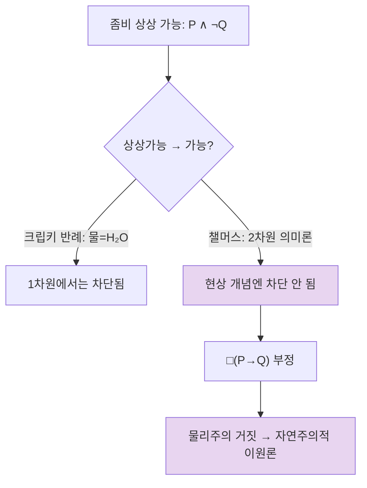

# 🌅 이원론의 현대적 부활: 챌머스와 자연주의적 이원론

> **Psyche L0** · Chapter 2: 이원론과 그 유산 · 문서 4/4
> *(물리학을 손대지 않은 채 의식을 근본 요소로 추가한다 — 좀비와 2차원 의미론이 떠받치는 21세기 이원론.)*

## 🎯 핵심 질문

데카르트적 실체 이원론은 상호작용 문제로, 단순한 속성 이원론은 김재권의 압박으로 흔들린다. 그렇다면 이원론은 박물관 유물인가? 1996년 데이비드 챌머스의 *The Conscious Mind*는 그렇지 않다고 답했다. 그는 **자연주의적 이원론(naturalistic dualism)**을 제안한다 — 영혼도, 초자연도, 물리법칙 위반도 없이, 다만 *현상적 의식을 우주의 근본 요소(fundamental)로 추가*하는 입장.

핵심 질문은 둘이다. 첫째, **물리학을 전혀 부정하지 않으면서 이원론자가 될 수 있는가?** 둘째, **현대 철학은 왜 이원론을 완전히 포기하지 못하는가?** 답의 열쇠는 두 도구에 있다 — *좀비 논증*(현상이 물리에 형이상학적으로 추가됨을 보이려는 시도)과 *2차원 의미론*(물·$H_2O$ 반례를 피하면서 상상 가능성에서 가능성으로 건너가려는 의미론적 장치).

이 문서는 챌머스 입장의 *논리적 골격*을 해부하고, 그것이 왜 단순한 데카르트 회귀가 아닌지, 그리고 그 비용이 무엇인지를 추적한다.

## 🌍 어디서 마주치나

자연주의적 이원론은 현대 의식 연구의 *지형을 정의하는 좌표*가 되었다.

- **"어려운 문제(hard problem)" 어휘의 편재:** 챌머스가 1994년 도입한 "쉬운 문제 vs 어려운 문제" 구분은 이제 신경과학 논문, AI 윤리 토론, 대중 과학에까지 스며들었다. 어려운 문제를 *진지하게* 받아들이는 순간, 사람은 (의식하든 못하든) 챌머스적 좌표 위에 선다.
- **AI 의식 논쟁:** "기능을 완벽히 복제해도 *느낌*이 따라오는가?"라는 물음은 좀비 논증의 직접 적용이다. 기능적 동치인 존재가 현상 없이 가능하다면, 의식은 기능에 추가되는 무언가다.
- **범심론(panpsychism)의 부흥:** 의식을 근본 요소로 두면, "근본 요소가 어디까지 퍼져 있는가"라는 물음이 자연히 따라온다. 챌머스 자신이 범심론을 진지한 선택지로 다루며, 이는 최근 형이상학에서 활발한 연구 영역이 되었다.

## 🔍 직관의 함정

함정은 두 가지 오해다.

**오해 1: "근본적으로 추가"가 곧 "유령"이다.** 자연주의적 이원론을 데카르트로 오해하기 쉽다. 그러나 챌머스는 별도 *실체*를 두지 않는다. 그는 물리적 세계의 인과 구조를 *그대로* 두고, 거기에 *현상적 속성*을 근본 속성으로 더할 뿐이다. 질량·전하가 물리학의 근본 양이듯, 현상성도 근본 양이라는 것이다. 유령은 없다 — 추가된 것은 *속성의 목록*이지 *실체의 목록*이 아니다.

**오해 2: "물리학을 부정한다."** 정반대다. 챌머스는 물리적 인과 폐쇄성을 *받아들인다*. 바로 그래서 현상적 속성은 (부수현상론적이거나, 혹은 정보의 근본적 양면으로서) 물리 인과에 *간섭하지 않는다*. 데카르트와 달리 그는 에너지 보존을 위협하지 않는다. 이 점이 입장을 "자연주의적"으로 만든다 — 자연법칙에 *심리물리 법칙*을 추가하되, 기존 물리법칙을 어기지 않는다.

함정을 피하면 입장의 진짜 비용이 보인다: 부수현상론의 위협(추가된 현상이 인과적으로 무력해질 위험)과 *심리물리 법칙*의 미설명성(왜 *이* 물리가 *이* 느낌과 묶이는지는 근본 법칙으로 *상정*될 뿐 *설명*되지 않음).

## ⚙️ 논증 구조

**좀비 논증(zombie argument)을 형식화하자.** 좀비 $Z$는 나와 물리적으로 완벽히 동일하되 현상적 의식이 전혀 없는 존재다($P \wedge \neg Q$, 여기서 $P$=완전한 물리적 서술, $Q$=현상적 사실).

1. 좀비는 상상 가능하다(conceivable): $P \wedge \neg Q$에 선험적 모순이 없다.
2. 상상 가능하면 형이상학적으로 가능하다(적절히 이상화된 상상 가능성에 한해): $Conceivable(P \wedge \neg Q) \Rightarrow Possible(P \wedge \neg Q)$.
3. $P \wedge \neg Q$가 가능하면, $Q$는 $P$로부터 형이상학적으로 *필연화되지 않는다*: $\neg\,\square(P \to Q)$.
4. 그러나 물리주의가 참이면 $\square(P \to Q)$여야 한다(물리가 모든 것을 필연화).
5. 따라서 물리주의는 거짓이다. $\square$

전체 논쟁은 전제 2에 모인다. 물리주의자의 결정적 반례는 후험적 필연성이다: "$\text{물} = H_2O$"는 후험적이지만 *필연적*이며, "물이 $H_2O$가 아닌 세계"는 상상 가능한 *듯하나* 불가능하다. 따라서 상상 가능성이 가능성을 보증하지 못한다 — 좀비도 같은 운명 아닌가?

**2차원 의미론(two-dimensional semantics)이 등판한다.** 이것이 챌머스 논증의 정밀 부품이다. 한 표현의 의미를 두 차원으로 나눈다.

- **1차 내포(primary intension):** 세계가 어떻게 *판명되든*, 우리의 개념이 *그 세계에서* 골라내는 것. "물"의 1차 내포는 "우리 주변의 투명하고 마실 수 있는 액체."
- **2차 내포(secondary intension):** 실제 세계의 본질을 고정한 채 다른 가능 세계를 평가할 때 골라내는 것. "물"의 2차 내포는 $H_2O$(실제 세계에서 물의 본질이 $H_2O$로 밝혀졌으므로).

물의 경우 두 내포가 *어긋난다*. "물=$H_2O$"의 필연성은 2차 내포 차원에서 성립하고, "물이 $H_2O$가 아님"의 상상 가능성은 1차 내포 차원에서 성립한다. 두 차원이 분리되기에 *상상 가능하지만 불가능*이 모순 없이 공존한다.

챌머스의 핵심 주장: **현상적 개념은 두 내포가 일치한다(붕괴한다).** "의식"이 가리키는 것은 그 *느껴지는 성질 그 자체*이지, "느낌을 일으키는 숨은 본질"이 아니다. 빨강의 느낌에는 물의 "$H_2O$"에 해당하는 *숨겨진 본질*이 없다 — 현상은 *나타나는 그대로가 본질*이다. 두 내포가 일치하면, 1차원에서의 상상 가능성이 곧장 2차원(형이상학)에서의 가능성으로 이어진다. 후험적 필연성의 탈출구가 *현상적 개념에 대해서만* 막힌다.

$$
\text{물 경우: } \text{1차 내포} \neq \text{2차 내포} \;\Rightarrow\; \text{상상가능} \not\Rightarrow \text{가능}
$$
$$
\text{의식 경우: } \text{1차 내포} = \text{2차 내포} \;\Rightarrow\; \text{상상가능} \Rightarrow \text{가능} \;\square
$$

이것이 문서 1에서 예고한 "데카르트의 인식적→존재론적 도약"의 *정교한 현대판*이다. 데카르트는 명석판명함에 호소했고, 챌머스는 2차원 의미론으로 그 도약을 *어디서 허용되고 어디서 막히는지* 정밀하게 다시 그린다.

## 🧪 증거와 사고실험

**좀비 세계.** 핵심 사고실험은 이미 본 대로다. 물리적으로 우리와 한 치도 다르지 않으나 *안이 캄캄한* 세계. 좀비-나는 "아프다"고 말하고 손을 떼지만 *아무것도 느끼지 않는다*. 이 세계의 일관성 여부가 논쟁의 전부다.

**메리의 방, 재방문(지식 논증).** 문서 2에서 본 메리는 챌머스 틀에서 새 역할을 얻는다. 메리가 방을 나와 *새 사실*을 배운다면, 완전한 물리적 서술 $P$에 $Q$가 포함되지 않은 것이다 — 좀비 논증과 같은 결론을 *인식론* 쪽에서 떠받친다. (전면 분석은 → hard problem L4.)

**역전 지구(사고실험).** 1차/2차 내포 분리를 직관적으로 보여 주는 장치. "수(水)"가 $XYZ$인 쌍둥이 지구를 상상하면, "물"의 1차 내포는 그 액체를 골라내지만 2차 내포(=$H_2O$)는 골라내지 못한다. 이로써 두 내포가 *실제로* 어긋날 수 있음이 예시된다 — 챌머스는 이 분리가 현상 개념에서는 일어나지 않는다고 논증함으로써 비대칭을 확립한다.

**반론으로서의 "현상적 개념 전략".** 물리주의자(로어, 파피노 등)는 응수한다: 좀비가 상상 가능해 *보이는* 이유는 우리가 현상을 *현상적 개념*으로, 뇌 상태를 *물리적 개념*으로 따로 파악하기 때문이며, 이 *개념의 이원성*이 *속성의 이원성*으로 오인된다는 것이다. 즉 인식적 간극은 우리 *개념 장치*의 특징이지 세계의 특징이 아니다. 챌머스의 반-반론: 그렇다면 *왜 우리가 그런 특별한 현상적 개념을 갖는지* 자체가 물리적으로 설명되어야 하는데, 그 설명 역시 어려운 문제를 회피하지 못한다. 이 공방이 현대 논쟁의 최전선이다.

## 🌉 설명적 간극

챌머스의 기여는 설명적 간극을 *형이상학적 결론으로 격상*한 데 있다. 레빈(문서 2)에게 간극은 *인식적* 현상 — 우리가 연결을 이해하지 못함 — 이었다. 챌머스는 2차원 의미론을 지렛대 삼아 인식적 간극에서 *존재론적* 간극으로 건넌다: 현상 개념의 두 내포가 일치하므로, *이해의 간극이 곧 존재의 간극*이다.

여기서 비용이 분명해진다. 자연주의적 이원론은 간극을 *메우지 않고 법칙화*한다. 왜 $P$가 $Q$를 동반하는가? — 답은 "*심리물리 근본 법칙*에 의해." 이 법칙은 더 기초적인 무언가로 *설명되지 않는다*. 마치 중력 상수가 *왜 그 값인지* 더 설명되지 않듯, 의식-물리 연결은 *근본적 잔여(brute fact)*로 남는다. 이는 정직한 입장이지만 — 설명을 *완성*하는 대신 설명을 *멈출 지점*을 선언하는 입장이다.

모토의 관점에서 챌머스의 선택은 의미심장하다. 그는 의식을 *설명으로 없애기(explain away)*를 거부하고, 그것을 근본으로 두어 *설명 안에 보존*하려 한다. 비판자는 이를 "설명의 포기"라 부르고, 옹호자는 "허위 설명에 대한 거부"라 부른다.

## 🧬 횡단 원리

> **근본화는 설명의 종착이자 비용이다(To fundamentalize is to stop explaining — at a price):** 무언가를 우주의 근본 요소로 두면 더 깊은 "왜"를 묻지 않게 되지만, 그 대가로 그것의 동반 관계는 *근본 법칙*으로 상정될 뿐 도출되지 않는다.

물리학은 늘 이렇게 작동한다 — 질량, 전하, 스핀은 근본 양으로 *상정*되지 설명되지 않는다. 챌머스의 도박은 *현상성을 그 목록에 추가하는 것*이 정당한가이다. 추가가 정당하려면 현상성이 기존 근본 양들로 *환원 불가능*함을 보여야 하고, 그것이 바로 좀비 논증의 일이다. 횡단 원리의 교훈: *어디까지를 근본으로 둘 것인가*는 경험적이라기보다 *설명 경제(explanatory economy)*의 판단이다. 더 적은 근본 요소로 더 많이 설명하는 이론이 낫다 — 물리주의는 현상성을 근본에서 빼서 절약하려 하고, 이원론은 빼면 *설명되어야 할 것이 사라진다*고 맞선다.

## 🪞 1인칭

챌머스의 출발점은 끝내 1인칭이다. 그가 "어려운 문제"라 부른 것의 핵심은 *경험의 있음 그 자체*다 — 정보 처리가 일어날 때 *왜 그것이 누군가에게 느껴지는가*. 3인칭 과학이 아무리 완전해져도, 그것은 *기능과 구조*를 기술한다. 그러나 1인칭에는 기능도 구조도 아닌 *주어짐*이 있다.

자연주의적 이원론의 도덕적 매력이 여기 있다: 그것은 1인칭을 *진지하게* 대접하면서도 과학을 부정하지 않는다. 그것은 "당신이 느끼는 그것은 실재한다, 그것을 환상으로 깎아내리지 않겠다, 다만 그것이 어디서 오는지는 근본 법칙에 맡기겠다"고 말한다. 이 입장이 옳든 그르든, 그것이 1인칭에 대한 *정직성*을 방법론적 미덕으로 끌어올렸다는 점은 이원론 부활의 진짜 유산이다.

회의주의자는 응수할 것이다 — 정직함이 진리는 아니라고. 1인칭을 진지하게 대접하는 *또 다른* 방법, 곧 그것을 물리적 세계 *안에서* 설명하는 길이 아직 닫히지 않았다고. 그 길의 탐색이 다음 챕터의 과제다.

## 📐 예측·반증

자연주의적 이원론은 검증 가능한 함의를 갖는다.

**예측되는 것:**
- *심리물리 법칙*이 존재한다면, 그것은 발견 가능한 규칙성 — 특정 물리적/정보적 구조가 특정 현상과 *법칙적으로* 묶이는 패턴 — 으로 나타나야 한다. (통합정보이론 IIT 같은 프로그램이 이 빈칸을 메우려는 시도다.)
- 물리 인과 폐쇄성은 *유지*되어야 한다(데카르트와 달리 에너지 비보존을 예측하지 않음).
- 따라서 현상은 (적어도 표준 형태에서) 물리 인과에 *독립적 기여*를 하지 않으며, 이는 부수현상론적 부담을 안긴다.

**반증/약화 시나리오:**
- *현상적 개념 전략*이 성공하여, "왜 우리가 환원 불가능해 보이는 현상적 개념을 갖는가"가 *순수하게 물리적으로* 설명된다면, 좀비의 상상 가능성은 *개념 장치의 산물*로 재해석되고 전제 1·2의 형이상학적 무게가 빠진다.
- 어떤 환원 이론이 $Q$를 $P$로부터 *연역적으로 투명하게* 도출하면 $\square(P\to Q)$가 회복되어 좀비 논증이 무너진다.
- 반대로, 심리물리 법칙이 *예측력 있는 규칙성*으로 경험적으로 확립되면(예: 특정 통합 구조의 유무가 보고와 무관하게 현상 유무를 예측), 이원론적 틀의 *경험적 견인력*이 강화된다.

요컨대 자연주의적 이원론은 형이상학이지만 *경험적으로 텅 비지 않았다* — 그 운명은 (a) 현상적 개념의 물리적 설명 가능성과 (b) 심리물리 법칙의 경험적 발견 가능성이라는 두 전선에서 결정된다.

## 🤔 다음 질문

챌머스가 옳다면 물리주의는 *불완전*하다. 그러나 물리주의자는 패배를 인정하지 않는다 — 그들은 좀비의 상상 가능성을 부정하거나, 현상적 개념 전략으로 간극을 *개념 장치*로 돌려보내거나, 애초에 "물리적"의 의미를 재정의한다. 그렇다면 *물리주의란 정확히 무엇을 주장하는가?* 무엇이 "물리적"으로 셈해지며, 그 경계는 어디인가? 다음 챕터는 이원론의 거울상 — 물리주의 — 의 내부로 들어가, 그 입장이 실제로 *무엇을 약속하고 무엇을 빚지는지*를 해부한다.

---

🧩 **Principle** — 근본화는 설명의 종착이자 비용이다: 무언가를 근본 요소로 두면 더 깊은 "왜"는 멈추지만, 그 동반 관계는 근본 법칙으로 *상정*될 뿐 *도출*되지 않는다.
🌉 **Boundary** — 1차 내포(개념이 골라내는 것)와 2차 내포(본질이 골라내는 것)는 다르다. 물에서는 어긋나고, 챌머스에 따르면 의식에서는 일치한다 — 이 비대칭이 좀비 논증의 엔진이다.
🪞 **Experience** — 자연주의적 이원론은 1인칭을 환상으로 깎아내리길 거부한다. 정직함은 진리가 아니나, 1인칭에 대한 정직함을 방법론적 미덕으로 세운 것이 이 부활의 유산이다.

## 📝 연습문제

<b>기초</b> — 챌머스의 자연주의적 이원론이 데카르트의 실체 이원론과 다른 두 가지 핵심 차이를 설명하라.

**해설:** (1) *실체 vs 속성*: 데카르트는 비물질적 *실체*(res cogitans)를 추가하지만, 챌머스는 별도 실체 없이 현상적 *속성*을 우주의 근본 속성으로 추가한다. 유령은 없고, 추가된 것은 속성 목록뿐이다. (2) *인과 폐쇄성에 대한 태도*: 데카르트의 마음은 몸에 인과적으로 *작용*하여 인과 폐쇄성·에너지 보존과 충돌하지만, 챌머스는 물리 인과 폐쇄성을 *받아들이고* 현상을 물리 인과에 간섭하지 않는 것으로 둔다(그 대가로 부수현상론적 부담을 안음). 그래서 챌머스의 입장은 "자연주의적"이라 불린다 — 기존 물리법칙을 어기지 않고 심리물리 법칙만 추가한다.

<b>심화</b> — "물=H₂O" 반례가 좀비 논증을 어떻게 위협하는지 진술하고, 2차원 의미론이 현상적 개념의 경우에 한해 이 위협을 어떻게 차단하는지 설명하라.

**해설:** 위협: "물이 $H_2O$가 아닌 세계"는 상상 가능해 *보이지만* 형이상학적으로 *불가능*하다(크립키의 후험적 필연성). 이는 일반적으로 *상상 가능성 ⇏ 가능성*임을 보이며, 따라서 좀비의 상상 가능성도 좀비의 가능성을 보증하지 못할 수 있다 — 즉 전제 2가 무너질 위험. 2차원 의미론의 차단: 물의 경우 1차 내포("주변의 마실 수 있는 액체")와 2차 내포($H_2O$)가 *어긋나므로*, 상상 가능성(1차원)과 불가능성(2차원)이 모순 없이 공존한다 — 이것이 반례의 메커니즘이다. 그러나 현상적 개념은 두 내포가 *일치*한다: 빨강의 느낌에는 물의 "$H_2O$"에 해당하는 숨은 본질이 없고, *나타나는 그대로가 본질*이다. 두 내포가 일치하면 1차원의 상상 가능성이 곧장 2차원(형이상학적)의 가능성으로 이어지므로, 후험적 필연성의 탈출구가 *현상에 대해서만* 막힌다. 따라서 좀비 논증은 물=$H_2O$형 반례를 면역한다. $\square$

<b>논문 비평</b> — "현상적 개념 전략(phenomenal concept strategy)이 성공하면 좀비 논증은 무력화된다"는 물리주의자의 주장을 재구성하고, 챌머스가 제기할 수 있는 가장 강력한 반-반론을 평가하라.

**해설:** 재구성: 좀비가 상상 가능해 보이는 *유일한* 이유는, 우리가 같은 사태를 두 종류의 개념 — 현상적 개념(직접 파악)과 물리적 개념(이론적 파악) — 으로 따로 붙잡기 때문이다. 이 *개념의 인지적 독립성*이 "물리만으로는 현상이 보장 안 됨"이라는 *외양*을 낳지만, 외양의 출처는 우리 개념 장치이지 세계의 두 속성이 아니다. 핵심 수: 만약 "왜 우리가 이런 인지적으로 독립적인 현상적 개념을 갖는가"가 *순수 물리적으로* 설명된다면, 인식적 간극은 물리주의 *안에서* 설명되고 좀비 논증의 형이상학적 추론(전제 2)은 근거를 잃는다. 챌머스의 반-반론: 이 전략은 자기 발등을 찍는다. 현상적 개념의 *특별함*을 진정으로 물리적으로 설명하려면, 그 설명은 결국 "이 개념이 *현상* — 느껴지는 무언가 — 을 직접 파악한다"는 사실에 호소해야 한다. 그런데 *왜 그 파악에 느낌이 동반되는가*가 바로 어려운 문제다. 즉 현상적 개념 전략은 어려운 문제를 *해결*하지 않고 *전제*한다 — 설명항(현상적 개념의 특별함)이 피설명항(현상의 환원 불가능성)을 이미 끌어안고 있다(순환 혹은 선결문제 요구). 평가: 이 반-반론은 강력하나 결정적이지는 않다. 물리주의자는 "현상적 개념이 *느낌을 직접 파악한다*는 기술 자체를 기능적·표상적 용어로 재서술"함으로써 순환을 끊으려 시도할 수 있다(예: 인용적/지표적 현상 개념 이론). 그 재서술이 *질적 잔여를 남기지 않는지*가 다시 쟁점이 되며, 논쟁은 한 단계 위로 올라갈 뿐 종결되지 않는다. 공정한 결론: 현상적 개념 전략과 챌머스의 반-반론은 *교착*에 있으며, 그 교착의 위치 자체가 어려운 문제의 견고함을 보여 준다 — 이 견고함의 본격 분석이 hard problem L4의 과제다.

[◀ 이전: 이원론의 직관적 힘](./03-intuitive-force.md) · [📚 README](../README.md) · [다음: 물리주의란 정확히 무엇인가 ▶](../ch3-physicalism/01-what-is-physicalism.md)

