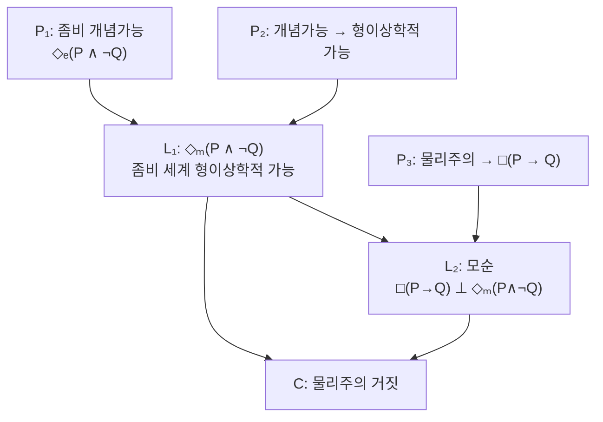

# 🧟 좀비 논변

> **Psyche L0** · Chapter 3: 물리주의의 주장과 압박 · 문서 2/5
> 물리적으로 우리와 완전히 동일하나 경험이 전혀 없는 좀비를 일관되게 생각할 수 있다면, 물리 사실은 의식 사실을 고정하지 못한다.

## 🎯 핵심 질문

철학적 좀비(philosophical zombie)는 영화 속 식인 괴물이 아니다. 그것은 **물리적·기능적·행동적으로 나와 분자 하나까지 똑같지만, 내적 경험이 전혀 없는** 가상의 존재다. 좀비는 통증 자극에 "아야"라고 말하고 손을 뗀다. 좀비의 뇌에서는 나와 동일한 신경 발화가 일어난다. 그러나 좀비에게는 통증의 **느껴짐**이 없다. 안에서 보면 깜깜하다.

핵심 질문은 단순하다. **이런 좀비는 가능한가?** 더 정확히는, 좀비는 *형이상학적으로* 가능한가? 좀비가 자연법칙상 실현 불가능하다는 데는 대체로 합의가 있다(우리 세계의 법칙에서는 그 물리적 조직이 경험을 동반할 것이다). 논쟁의 초점은 더 깊다. **어떤 가능 세계에든** 좀비가 존재할 수 있는가?

이 물음이 결정적인 이유는 명확하다. 물리주의(1장에서 본 고정 원리)는 물리적으로 우리와 동일한 모든 세계가 모든 면에서 우리와 동일하다고 주장한다. 그런데 좀비 세계는 물리적으로 우리와 동일하면서 경험이 부재하므로 우리와 **다르다**. 따라서 좀비 세계가 형이상학적으로 가능하다면, 물리주의는 거짓이다. 좀비 논변은 이 단순하고도 잔혹한 추론을 정밀하게 벼린 것이다. 차머스(David Chalmers)가 『The Conscious Mind』(1996)에서 제시한 형태가 표준이다.

## 🌍 어디서 마주치나

좀비 직관은 전문 철학 바깥에서도 끊임없이 출몰한다.

- **AI 의식 논쟁**: "이 챗봇은 정말로 느끼는가, 아니면 느끼는 척만 하는가?"라는 물음은 정확히 좀비 물음의 변형이다. 행동상 구별 불가능하나 내부가 비어 있을 가능성을 묻는다.
- **마취 중 각성 공포**: 외과 수술 중 신체는 마비되었으나 의식이 돌아온 환자의 사례는, 행동(좀비처럼 무반응)과 경험(생생한 고통)의 분리가 실제로 일어날 수 있음을 섬뜩하게 보여준다. 좀비의 *역상*에 가깝다.
- **타인의 마음 회의**: "다른 사람도 정말로 안에서 무언가를 느낄까?"라는 어린 시절의 의문은 좀비 가능성에 대한 직관적 인식이다.
- **동물·곤충 의식**: 곤충이 통증을 "느끼는지" 아니면 단지 회피 반응을 보이는지의 논쟁도 좀비 틀에서 작동한다.

이 만남들이 보여주는 것은, 좀비 직관이 인위적 사변이 아니라 **경험과 기능의 개념적 분리**라는 깊은 직관에 뿌리내리고 있다는 점이다. 우리는 누군가의 모든 외적·물리적 사실을 알아도 그의 내적 불빛이 켜져 있는지는 별도의 물음으로 느낀다.

## 🔍 직관의 함정

좀비 논변은 직관에 호소하므로, 직관의 함정에 특히 취약하다.

**함정 1: 상상 가능과 개념 가능의 혼동.** 우리는 둥근 사각형을 "상상"하는 듯한 느낌을 가질 수 있지만, 그것은 진정으로 **개념 가능**(conceivable)하지 않다. 모순을 품기 때문이다. 좀비 반대자는 좀비도 마찬가지라고 주장한다. 우리가 좀비를 생각한다고 *느끼지만*, 충분히 깊이 분석하면 거기엔 숨은 모순(경험적 기능을 전부 갖췄는데 경험이 없다는 모순)이 있다는 것이다.

**함정 2: 부정적 개념가능을 긍정적 개념가능으로 착각.** 차머스는 두 가지를 구별한다. **부정적 개념가능**은 "명백한 모순을 발견할 수 없음"이고, **긍정적 개념가능**은 "그 상황을 일관된 시나리오로 적극적으로 그려낼 수 있음"이다. 약한 부정적 개념가능만으로는 가능성을 입증하기 어렵다. 좀비 논변의 힘은 긍정적 개념가능 주장에 달려 있다.

**함정 3: "행동도 같다"의 의미 과소평가.** 좀비가 "나는 의식이 있다"라고 진지하게 *말한다*는 사실은 매우 당혹스럽다. 좀비의 그 발화를 일으킨 원인은 무엇인가? 만약 의식이 발화의 원인이 아니라면, 우리 세계에서도 의식은 우리의 의식 보고의 원인이 아닌 것 아닌가? 이 **현상 판단의 역설**(paradox of phenomenal judgment)은 좀비 옹호자가 떠안는 무거운 짐이다.

## ⚙️ 논증 구조

좀비 논변을 형식화하자. $P$를 우리 세계의 완전한 물리적 진리의 연언, $Q$를 어떤 현상적 진리(예: "누군가 통증을 느낀다")라 하자.

- $P_1$: 좀비는 **개념 가능**하다. 즉 $P \wedge \neg Q$ ("모든 물리 사실이 성립하나 현상 사실은 성립하지 않음")가 개념 가능하다.

$$\Diamond_{\text{epist}} (P \wedge \neg Q)$$

- $P_2$: 개념 가능한 것은 형이상학적으로 가능하다. (이 사례에 적용된 **개념가능성→가능성** 원리)

$$\Diamond_{\text{epist}} (P \wedge \neg Q) \rightarrow \Diamond_{\text{meta}} (P \wedge \neg Q)$$

- $L_1$ (따라서): $\Diamond_{\text{meta}} (P \wedge \neg Q)$ — 좀비 세계는 형이상학적으로 가능하다.

- $P_3$: 물리주의가 참이면, $P$는 $Q$를 형이상학적으로 함의한다. $\square(P \rightarrow Q)$. (1장의 고정 원리)

- $L_2$: $\square(P \rightarrow Q)$는 $\Diamond_{\text{meta}}(P \wedge \neg Q)$와 양립 불가능하다.

- $C$ (결론): 그러므로 물리주의는 거짓이다. $\square$

논증은 타당하다. 따라서 물리주의자는 반드시 어느 전제를 부정해야 한다. 선택지는 둘뿐이다. **반론 A**: $P_1$을 부정한다(좀비는 개념 불가능하다). **반론 B**: $P_2$를 부정한다(개념 가능해도 형이상학적으로 불가능하다). 각각의 비용을 다음에서 본다.

## 🧪 증거와 사고실험

좀비 논변에는 **증거**가 아니라 **직관 펌프**가 동력이다. 핵심 사고실험을 변주로 보강하자.

**역전 좀비(zoombie)와 부분 좀비.** 차머스는 변주들을 제시해 직관을 정련한다. *부분 좀비*는 경험의 일부만 결여한 존재(예: 색맹이 아니라 색 경험만 없이 색 구별 행동은 정상인 자)다. 이런 점진적 변주가 개념 가능하다면, 경험과 기능의 분리는 전면적 좀비에만 국한되지 않는다.

**상상 가능성의 인식적 무게.** 데카르트가 "나는 몸 없는 나를 생각할 수 있다"에서 출발했듯, 좀비 논변도 1인칭 상상에서 출발한다. 그러나 차머스는 데카르트보다 신중하다. 그는 상상의 *느낌*만으로 결론을 내리지 않고, 2차원 의미론(다음 절)이라는 인식적-양상적 다리를 깐다.

**경험적 보조 증거: 설명적 간극의 견고함.** 좀비가 일관되게 생각된다는 직관이 단지 무지의 산물이라면, 신경과학이 진보할수록 그 직관은 약해져야 한다. 그러나 신경 상관물(NCC) 연구가 정교해질수록 "그럼에도 *왜* 이것이 느껴지는가"라는 물음은 줄어들지 않는다. 이 직관의 **완강함**이 좀비 옹호자가 인용하는 정황 증거다. 반대로 물리주의자는 이를 "직관의 완강함은 개념의 인지적 고립 탓이지 형이상학적 사실 탓이 아니다"라고 재해석한다(5장 현상 개념 전략).

## 🌉 설명적 간극

좀비 논변의 심장은 **2차원 의미론**(two-dimensional semantics)을 통해 개념가능과 가능을 잇는 다리에 있다. 이것이 차머스가 $P_2$를 방어하는 정교한 장치다.

크립키(Kripke)는 "물=H₂O" 같은 후험적 필연성을 보였다. "물=H₂O"는 필연적으로 참이지만, 그 필연성은 후험적으로만 알려진다. 우리는 물이 H₂O가 아닌 상황을 *상상하는 듯* 하지만, 그것은 실은 "물처럼 보이는 다른 물질(XYZ)"을 상상하는 것이다. 물리주의자는 이 모형을 마음에 적용한다. "통증=C-섬유 발화"도 후험적 필연이라면, 우리가 좀비를 상상하는 것은 실은 "통증처럼 보이는 무엇이 빠진" 상황을 상상하는 것일 뿐, 진짜 좀비를 상상하는 게 아니다.

차머스의 응수가 2차원 의미론이다. 각 개념은 두 내포를 가진다. **1차 내포**(primary/epistemic intension): 세계가 *실제로* 어떠한가에 따라 지시체를 고르는 함수. **2차 내포**(secondary/metaphysical intension): 실제 세계를 기준으로 고정한 뒤 다른 세계에 적용하는 함수.

크립키 사례에서 "물"과 "통증"이 다르다는 것이 차머스의 핵심 통찰이다. "물"은 1차 내포(물처럼 행동하는 것)와 2차 내포(H₂O)가 갈라져, 상상의 어긋남이 생긴다. 그러나 **현상 개념의 경우 두 내포가 일치한다.** 통증의 1차 내포는 "이렇게 느껴지는 것"이며, 그 느껴짐이 곧 통증의 본질이다. 거기엔 "통증처럼 느껴지지만 통증이 아닌 것"을 위한 틈이 없다. 따라서 현상적 사례에서는 개념가능이 가능으로 곧장 이어진다.

$$\text{현상 개념: } \text{1차 내포} = \text{2차 내포} \;\Rightarrow\; \Diamond_{\text{epist}} \rightarrow \Diamond_{\text{meta}}$$

이것이 설명적 간극을 형이상학적 간극으로 전환하는 결정적 단계다. 물리주의자가 좀비를 막으려면, 바로 이 "두 내포의 일치"를 부정해야 한다.

## 🧬 횡단 원리

- **개념가능성→가능성 다리**: 좀비 논변의 부담은 거의 전부 이 다리에 있다. 일반적으로 이 원리는 거짓이다(후험적 필연성 때문에). 차머스의 전략은 그것을 **현상 개념이라는 특수 사례**로 한정해 구출하는 것이다. 따라서 논쟁은 "현상 개념이 정말 특수한가"로 수렴한다.
- **물리주의 진술의 함의적 강도**: 물리주의는 단순 상관($P$가 있을 때 $Q$가 있다)이 아니라 **형이상학적 함의**($\square(P\rightarrow Q)$)를 주장한다. 이 강한 약속이 좀비라는 단 하나의 가능 세계에 의해서도 무너진다는 점이 물리주의의 양상적 취약성이다.
- **방언 무차별성 재확인**: 좀비는 동일론이든 수반론이든 무차별하게 겨냥한다. 좀비 세계는 수반조차 깨므로, 1장에서 본 "약한 방언으로의 후퇴"는 여기서 통하지 않는다.
- **직관의 인식적 지위**: 좀비 논변은 직관을 *증거*로 격상하는 메타철학적 약속에 의존한다. 이 약속을 거부하는 자(직관 회의론자)에게 논변은 출발조차 못 한다.

## 🪞 1인칭

좀비 논변은 본질적으로 1인칭 사고실험이다. 제3자로서 "저 사람의 복제가 경험이 없을 수 있다"를 상상하기는 추상적이다. 그러나 차머스는 더 날카로운 1인칭 판을 권한다. **나의** 좀비 쌍둥이를 상상하라. 그는 지금 이 문장을 읽고, "흥미롭군"이라고 생각하며, 내가 가진 모든 신경 발화를 똑같이 가진다. 그러나 그 안에는 아무 불빛도 없다.

여기서 1인칭의 역설이 정점에 이른다. 만약 좀비가 가능하다면, **나는 내가 좀비가 아님을 어떻게 아는가?** 나의 "나는 의식이 있다"는 확신조차, 좀비도 똑같이 (경험 없이) 발화할 것이기 때문이다. 차머스의 답은 미묘하다. 좀비는 그 *문장*을 발화하지만, 나는 내 경험에 **직접 접면**(acquaintance)한다. 나의 의식 인식은 추론이 아니라 직접 앎이며, 이 직접성이 나를 좀비와 구별한다. 그러나 반대자는 반박한다. 그 "직접 앎"의 느낌마저도 좀비가 (느낌 없이) 보고할 수 있지 않은가? 이 막다른 골목이 좀비 논변의 1인칭적 심연이며, 동시에 그 가장 큰 약점이기도 하다.

## 📐 예측·반증

좀비 논변은 형이상학적이지만, 그 전제들에 대한 압박은 검증 가능한 결과와 얽힌다.

- **물리주의자의 예측**: 신경과학이 진보하면 "왜 이 물리 상태가 이 경험을 동반하는가"라는 물음에 점점 만족스러운 환원적 설명이 누적될 것이고, 그에 따라 좀비 직관은 약화될 것이다. **반증 조건(물리주의 측)**: 충분한 진보 후에도 좀비 직관이 조금도 약해지지 않으면, "이것은 단순 무지"라는 진단은 의심받는다.
- **반물리주의자의 예측**: 어떤 신경과학적 진보도 설명적 간극을 닫지 못할 것이다. **반증 조건(반물리주의 측)**: 현상적 사실이 물리적 사실로부터 *투명하게 연역*되는 사례가 단 하나라도 확립되면(통증의 모든 질적 면이 미시 구조에서 도출되면), 좀비의 개념가능성 주장은 무너진다.
- **메타철학적 검증 불가능성**: 좀비 세계 자체는 정의상 우리 세계와 물리적으로 식별 불가능하므로 직접 관측될 수 없다. 따라서 핵심 다툼은 경험이 아니라 **개념 분석과 양상 논리**에서 결판난다. 이 점이 좀비 논변을 강력하면서 동시에 결론 불가능하게 만든다.

## 🤔 다음 질문

좀비 논변은 "가능 세계"라는 양상적 무대에서 작동한다. 그것은 강력하지만, 형이상학적 가능성이라는 미끄러운 개념에 의존한다는 약점이 있다. 그렇다면 더 *구체적인*, 거의 경험적으로 느껴지는 사고실험으로 같은 결론을 끌어낼 수 있을까?

다음 문서의 메리는 바로 그 시도다. 메리는 가능 세계를 떠도는 좀비 대신, 한 흑백 방에 갇힌 **현실적인** 과학자다. 그녀는 색에 관한 모든 물리적 사실을 알지만, 빨강을 본 적이 없다. 그녀가 방을 나설 때 무언가 새것을 배운다면 — 그것은 물리적 사실이 *모든* 사실이 아니라는 직접적 증거가 될 것이다.

---

🧩 **Principle** — 좀비 논변의 전 무게는 "개념가능→형이상학적 가능"이라는 다리에 실리며, 차머스는 그 다리를 2차원 의미론으로 현상 개념에 한정해 구출한다. 논쟁은 곧 "현상 개념이 두 내포가 일치하는 특수 개념인가"로 수렴한다.
🌉 **Boundary** — 좀비 세계는 수반조차 깨므로 물리주의의 모든 방언을 무차별하게 겨냥하며, 정의상 물리적으로 우리 세계와 식별 불가능해 경험적으로는 결판나지 않는다.
🪞 **Experience** — "나는 내가 좀비가 아님을 어떻게 아는가"라는 1인칭 물음에 대한 답(경험에의 직접 접면)이 좀비 논변의 핵심 자원이자 가장 취약한 급소다.

## 📝 연습문제

<strong>기초</strong>: 철학적 좀비의 정의에서 "물리적·기능적·행동적으로 동일"이라는 세 조건이 모두 필요한 이유를 설명하라.

좀비는 우리와 (1) 물리적으로(분자 수준의 뇌 상태까지), (2) 기능적으로(입력-출력-내부 상태 전이의 인과 구조), (3) 행동적으로(외적 반응) 모두 동일해야 한다.

**해설:** 세 조건이 모두 필요한 이유는 좀비 논변이 겨냥하는 표적이 다르기 때문이다. 물리적 동일성은 **유형 동일론과 수반 물리주의**를 겨냥한다(물리 사실이 같은데 경험이 다르므로). 기능적 동일성은 **기능주의**(4장)를 겨냥한다(기능 조직이 같은데 경험이 다르므로). 행동적 동일성은 **행동주의**를 겨냥한다. 어느 한 조건만 빠져도 해당 입장은 "그 차이가 경험 차이를 설명한다"고 응수할 수 있다. 세 조건을 모두 묶을 때 비로소 좀비는 물리주의 전 진영을 동시에 압박한다.

<strong>심화</strong>: 크립키의 "물=H₂O" 후험적 필연성 모형을 통증에 적용하려는 물리주의자의 시도를, 차머스가 2차원 의미론으로 어떻게 차단하는지 서술하라.

물리주의자: "통증=C-섬유 발화"는 "물=H₂O"처럼 후험적 필연이다. 우리가 좀비(C-섬유 발화는 있으나 통증이 없음)를 상상한다고 *느끼는* 것은, 물이 H₂O가 아닌 상황을 상상한다고 느끼는 착각과 같다. 실제로는 "통증처럼 보이는 다른 것"을 상상할 뿐이다.

**해설:** 차머스의 차단: "물"의 경우 1차 내포("물처럼 행동/보이는 것")와 2차 내포(H₂O)가 분리되므로, 상상의 어긋남은 1차 내포에 해당하는 다른 세계를 그린 것이다 — 즉 진짜 "물 없는 H₂O 세계"가 아니라 "XYZ 세계"를 상상한 것이다. 그러나 **통증의 1차 내포는 "이렇게 느껴지는 것" 자체**이고, 그것이 곧 통증의 본질(2차 내포)이다. 두 내포가 일치하므로 "통증처럼 느껴지지만 통증이 아닌" 틈이 없다. 따라서 통증의 부재를 상상할 때 우리는 "통증처럼 보이는 다른 것"의 부재가 아니라 통증 자체의 부재를 상상하는 것이며, 개념가능이 곧 형이상학적 가능으로 이어진다. 크립키 모형은 두 내포가 갈라지는 자연종어에는 통하지만, 두 내포가 일치하는 현상 개념에는 통하지 않는다는 것이 핵심이다.

<strong>논문 비평</strong>: "좀비가 '나는 의식이 있다'고 보고한다면, 우리 세계에서도 의식은 의식 보고의 원인이 아니다"라는 현상 판단의 역설이 좀비 논변에 가하는 압박을 평가하라.

역설의 구조: 좀비는 경험 없이도 "나는 의식이 있다"를 발화한다. 그 발화의 원인은 순수 물리적 과정이다. 그런데 좀비의 물리 과정은 나의 것과 동일하다. 따라서 *나의* 의식 보고를 일으킨 원인도 (의식이 아니라) 그 물리 과정이다. 결국 의식은 그것에 관한 우리의 판단·보고에 인과적으로 무관하다 — 이는 부수현상론(epiphenomenalism)을 강요하며, 더 나아가 "우리는 우리 자신의 의식을 알 수 없다"는 자기 인식의 붕괴를 함의하는 듯하다.

**해설:** 이 역설은 좀비 옹호자에게 진정한 비용이다. 평가의 균형을 위해 양측을 보자. 압박의 강도: 만약 의식이 의식 보고의 원인이 아니라면, 차머스가 1인칭 절에서 의지했던 "경험에의 직접 접면"마저 인식적으로 정당화되기 어렵다. 우리는 우리 경험을 *근거로* 보고하는 것이 아니게 되기 때문이다. 차머스의 대응: 그는 (a) 부수현상론을 마지못해 수용하거나(의식은 인과적으로 무력하지만 실재한다), (b) "직접 접면은 인과적 정당화가 아니라 구성적 정당화"라고 주장하거나, (c) 자연주의적 이원론에서 의식이 미묘한 인과 역할을 한다고 본다. 비판적 결론: 역설은 좀비 논변을 *논박*하지는 못하지만, 좀비를 받아들이는 대가가 **부수현상론과 자기 인식의 긴장**이라는 무거운 형이상학적 청구서임을 드러낸다. 따라서 좀비 논변의 비용-편익 평가는, 물리주의의 설명적 간극이라는 비용과 반물리주의의 부수현상론이라는 비용을 저울질하는 문제로 귀착된다.

[◀ 이전: 물리주의란 정확히 무엇인가](./01-what-is-physicalism.md) · [📚 README](../README.md) · [다음: 메리의 방 ▶](./03-marys-room.md)

