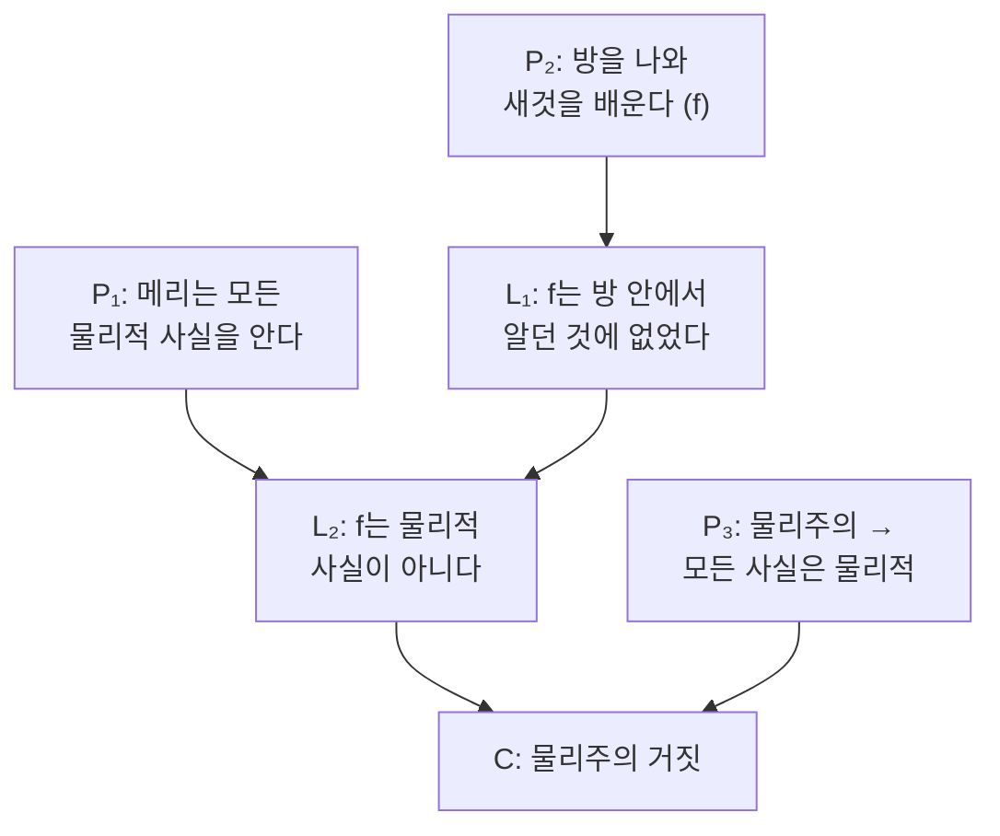

# 🎨 메리의 방

> **Psyche L0** · Chapter 3: 물리주의의 주장과 압박 · 문서 3/5
> 색에 관한 모든 물리적 사실을 아는 메리가 흑백 방을 나와 빨강을 처음 보고 새것을 배운다면, 그 새것은 비물리적 사실이다.

## 🎯 핵심 질문

프랭크 잭슨(Frank Jackson)이 「Epiphenomenal Qualia」(1982)에서 제시한 메리의 방은 좀비보다 구체적이고, 그래서 더 끈질긴 직관 펌프다. 이야기는 이렇다.

메리는 천재 신경과학자이지만, 태어날 때부터 완전한 흑백 방에서 살아왔다. 그녀는 흑백 모니터를 통해서만 세계를 배운다. 메리는 색채 시각에 관한 **모든 물리적 사실**을 안다 — 빛의 파장, 망막 원추세포의 분광 감도, 시각 피질의 처리 경로, 색 명명 행동을 일으키는 모든 신경 메커니즘, 그리고 (잭슨의 의도상) 완성된 물리학·신경과학·기능적 사실 전부를. 그녀는 사람들이 "빨강"을 볼 때 뇌에서 무슨 일이 일어나는지 빠짐없이 안다.

핵심 질문: **메리가 방을 나와 처음으로 빨간 토마토를 볼 때, 그녀는 무언가 새것을 배우는가?** 직관은 압도적으로 "그렇다"고 답한다. 그녀는 "아, *이것이* 빨강을 보는 느낌이구나"라고 깨닫는다. 그런데 그녀는 이미 모든 *물리적* 사실을 알고 있었다. 따라서 그녀가 새로 배운 것은 **물리적 사실이 아니다.** 그러므로 어떤 사실은 비물리적이다. 그러므로 물리주의는 거짓이다. 이것이 **지식 논변**(knowledge argument)이다.

## 🌍 어디서 마주치나

메리의 직관은 추상적 철학을 넘어 곳곳에서 울린다.

- **선천적 시각장애인의 색 이해**: 색맹이나 선천적 맹인은 색에 관한 물리적·언어적 정보를 학습할 수 있으나, "본다는 것이 어떤 것인지"는 결여한다고 흔히 여겨진다. 시력 회복 수술 후 환자의 첫 색 경험에 관한 보고는 메리의 현실판이다.
- **와인 테이스팅·음악 교육**: 와인의 화학 조성을 다 알아도 그 맛을 경험하기 전엔 "안다"고 하기 어렵다는 직관. 악보 이론을 완벽히 알아도 그 화음을 들어본 적 없다면.
- **감각 대체 장치**: 혀에 부착한 전극으로 시각 정보를 받는 장치 사용자가 "보는 것 같다"고 보고할 때, 정보의 전달과 경험의 발생 사이의 간극이 드러난다.
- **AI의 색 지식**: 색에 관한 모든 데이터로 훈련된 AI가 "빨강을 안다"고 할 수 있는가? 메리 물음의 기계판이다.

이 만남들의 공통점은 **명제적 지식**("빨강의 파장은 700nm다")과 **경험적·체험적 앎**("빨강은 이렇게 보인다") 사이의 직관적 균열이다. 메리의 방은 그 균열을 극한까지 밀어 물리주의에 압박을 가한다.

## 🔍 직관의 함정

지식 논변은 직관이 선명한 만큼 함정도 선명하다.

**함정 1: "모든 물리적 사실"을 과소평가하기.** 메리가 *정말로* 모든 물리적 사실을 안다면 — 자신이 빨강을 볼 때 뇌가 어떤 상태가 될지까지 포함해 — 그녀는 이미 그 경험을 *예측*할 수 있어야 하는 것 아닌가? 데닛(Dennett)은 "메리가 정말 모든 것을 안다면 토마토를 보고도 놀라지 않을 것"이라 도발한다. 직관이 강한 이유는 우리가 부지불식간에 메리의 지식을 *불완전하게* 상상하기 때문일 수 있다.

**함정 2: 새 지식과 새 사실의 혼동.** 메리가 새것을 *배운다*는 직관은 강하다. 그러나 "새 지식을 얻음"이 곧 "새 사실의 존재"를 함의하지는 않는다. 같은 사실을 **새로운 방식으로** 알게 되었을 수도 있다(옛 사실/새 표상 반론). 메리가 배운 것이 새 *명제*인지, 새 *능력*인지, 옛 사실의 새 *제시 양태*인지가 논쟁의 갈림길이다.

**함정 3: 부수현상론과의 어색한 동거.** 흥미롭게도 잭슨 자신은 당시 부수현상론자였다. 그는 감각질이 비물리적이지만 인과적으로 무력하다고 보았다. 그러나 그렇다면 메리의 새 경험이 어떻게 그녀의 "아, *이것이!*"라는 *발화*를 일으키는가? 감각질이 인과적으로 무력하다면 메리의 놀람조차 순수 물리적 원인을 가질 것이고, 그렇다면 비물리적 감각질은 그녀의 지식 변화와 무관하다. 이 긴장은 훗날 잭슨이 입장을 철회하는 한 동기가 된다.

## ⚙️ 논증 구조

지식 논변을 형식화하자. $K_{\text{phys}}$를 "메리가 색에 관한 모든 물리적 사실을 안다", $f$를 "빨강을 봄이 어떠한지(what it's like)"라는 사실이라 하자.

- $P_1$: 방을 나오기 전, 메리는 색에 관한 모든 물리적 사실을 안다. $K_{\text{phys}}(\text{Mary})$.
- $P_2$: 방을 나온 뒤, 메리는 새로운 것을 배운다 — 즉 빨강을 봄이 어떠한지($f$)를 안다. $\neg K(\text{Mary}, f)_{\text{before}} \wedge K(\text{Mary}, f)_{\text{after}}$.
- $L_1$: 그러므로 $f$는 메리가 방 안에서 알던 사실들에 포함되지 않았다.
- $L_2$: 메리는 방 안에서 *모든 물리적* 사실을 알았다($P_1$). 그러므로 $f$는 물리적 사실이 아니다.

$$f \notin \{\text{물리적 사실}\}$$

- $P_3$: 물리주의가 참이면, 모든 사실은 물리적 사실이다(고정 원리, 1장).
- $C$: 그러므로 물리주의는 거짓이다. $\square$

논증의 약한 고리는 $P_2$다. 정확히 *무엇이* 새로운가? 물리주의자의 반론은 모두 이 지점을 공략한다 — 메리가 얻은 것이 새 *사실*이 아니라 새 *무엇*이라고 재기술함으로써. 다음 두 절에서 그 재기술들을 본다.

## 🧪 증거와 사고실험

메리 논변에 대한 표준 반론들을 사고실험 형태로 검토하자. 이들은 물리주의자의 최선의 응수다.

**(1) 능력 가설(ability hypothesis) — 루이스(Lewis)와 네메로우(Nemirow).** 메리가 얻은 것은 새 *명제적 지식*이 아니라 새 *능력*(know-how)이다 — 빨강을 상상하고, 재인식하고, 표상하는 능력. 자전거 타는 법을 배우는 것이 새 사실을 아는 것이 아니듯, 빨강을 경험하는 것은 새 노하우의 획득이다. 사실의 영역은 늘어나지 않았으므로 물리주의는 안전하다.

*비판자의 응수*: 메리는 능력만 얻은 게 아니라 분명 무언가를 **알게**(that ...을 안다) 된 듯하다. "아, 그들이 *이런* 경험을 하고 있었구나"는 명제적 깨달음처럼 보인다. 또 능력 없이도 새 사실을 알 수 있는 경우들(예: 마비된 미식가가 새 맛을 경험)이 능력 가설을 압박한다.

**(2) 옛 사실/새 표상(old fact, new mode) — 처치랜드, 처머, 로어 계열.** 메리는 *새 사실*을 배운 게 아니라, *이미 알던 물리적 사실*을 새로운 방식으로 — 즉 **현상 개념**을 통해 — 다시 안다. 비유: 헤스페로스(저녁별)와 포스포로스(새벽별)는 동일한 금성이지만, 메리는 "저녁별 양태"로만 알다가 "새벽별 양태"로 처음 알게 된 셈이다. 사실은 하나(물리적)이되 그것을 붙잡는 개념이 둘이다. 새 개념의 획득은 새 사실의 발견이 아니다.

*비판자의 응수*: 이 전략은 5장에서 본격 검토할 **현상 개념 전략**의 핵심이다. 그 부담은 "왜 동일한 사실에 대해 인식적으로 그토록 고립된 두 개념이 존재하는가"를 *물리적으로* 설명하는 데 있다.

**(3) 데닛의 도발.** 메리가 *정말로* 모든 물리적 사실을 안다면, 그녀는 토마토를 보기 전에 자신의 반응을 완벽히 예측할 수 있고, 따라서 놀라지 않는다. 우리 직관이 "그래도 놀랄 것"이라 말하는 이유는 우리가 메리의 전지성을 진지하게 상상하지 못하기 때문이다.

*비판자의 응수*: 이것은 직관을 거부하는 강수다. 많은 이는 "물리적 사실의 완전한 앎으로부터 경험의 질을 연역할 수 있다"는 주장 자체가 선결 문제 요구라고 본다.

## 🌉 설명적 간극

메리의 방은 설명적 간극을 좀비와는 다른 각도에서 조명한다. 좀비가 "물리가 같아도 경험이 다를 수 있다"는 **양상적** 간극을 보였다면, 메리는 "물리를 다 알아도 경험을 알 수 없다"는 **인식적·연역적** 간극을 보인다.

핵심은 **연역 가능성**(deducibility)이다. 물=H₂O의 경우, H₂O의 미시 사실로부터 물의 모든 거시적 행동(끓음, 얼음의 부력, 용해력)을 *연역*할 수 있다. 간극이 없다. 그러나 메리의 사례는 색 경험의 질이 물리적 사실로부터 연역되지 *않음*을 시사한다. 메리는 전제(모든 물리 사실)를 다 가졌으나 결론(빨강의 느낌)을 도출하지 못했다.

이 **연역적 간극**이 형이상학적 결론을 뒷받침하느냐가 쟁점이다. 반물리주의자: 연역 불가능은 곧 그 사실이 물리 사실 *너머*에 있음의 표지다. 물리주의자: 연역 불가능은 단지 *개념*의 문제다 — 현상 개념과 물리 개념은 인식적으로 독립적이어서, 한 쪽에서 다른 쪽을 *선험적으로* 도출할 수 없을 뿐, 양자가 동일한 사실을 가리킬 수 있다. 후자가 a posteriori 물리주의의 핵심 동작이며, 메리 논변을 "인식적 현상을 형이상학적 결론으로 부당하게 도약"시킨다고 진단한다.

따라서 메리의 방은 설명적 간극의 **인식적 버전**을 가장 선명하게 제시하며, 그 간극이 형이상학적 함의를 갖는지가 5장으로 이어지는 미해결 다리다.

## 🧬 횡단 원리

- **사실 대 표상의 구별**: 지식 논변의 모든 운명은 "새 지식 = 새 사실"인가 "새 지식 = 옛 사실의 새 표상/능력"인가에 달렸다. 이 구별은 이 책 전체에서 인식론과 형이상학을 분리하는 핵심 도구다.
- **연역 가능성 기준**: 환원의 성공은 흔히 "미시에서 거시로의 연역 가능성"으로 측정된다. 의식의 특이성은 이 연역이 (적어도 현재로서는) 막혀 있다는 데 있다. 이것이 인식적 사실인지 형이상학적 사실인지가 핵심 쟁점.
- **전지성의 상상 가능성**: 메리(와 좀비) 직관의 신뢰도는 "완전한 물리적 지식"을 우리가 진지하게 상상할 수 있는가에 달렸다. 데닛 노선은 이 상상 능력 자체를 의심한다.
- **현상 개념의 부담**: "옛 사실/새 표상" 전략은 현상 개념의 인식적 고립을 *물리적으로* 설명할 빚을 진다. 이 빚이 청산 가능한지가 물리주의 방어의 사활.

## 🪞 1인칭

메리의 방은 1인칭 관점이 어떻게 *지식의 한 형태*일 수 있는지를 묻는다. 방 안의 메리는 빨강에 대한 완벽한 3인칭 지식을 가졌으나, 1인칭 *접면*은 결여했다. 방을 나서는 순간, 그녀가 얻는 것은 정보의 양이 아니라 **관점**이다.

이 1인칭 전환을 직접 음미해보자. 당신이 한 번도 맛본 적 없는 과일의 화학식, 분자 구조, 미뢰 반응 곡선을 전부 외운다 해도, 그것을 입에 넣는 순간의 "아"는 새롭다. 그 새로움은 *무지의 해소*처럼 느껴진다 — 마치 줄곧 가려져 있던 사실의 문이 열리는 듯. 잭슨은 이 1인칭 현상학을 형이상학의 증거로 격상한다.

그러나 1인칭의 함정도 여기 있다. 그 "새로움의 느낌"은 *반드시* 새 사실의 표지인가, 아니면 같은 사실에 처음으로 1인칭 개념을 적용한 데 따른 *현상학적 인상*일 뿐인가? 헤스페로스를 새벽에 처음 본 자도 "오, 새 별!"이라 느끼지만, 그것은 옛 별(금성)이다. 1인칭의 생생함은 데이터이되, 그 데이터를 형이상학으로 번역하는 단계가 곧 논쟁의 자리다.

## 📐 예측·반증

- **반물리주의 예측**: 어떤 양의 3인칭 정보도 결코 1인칭 경험의 질을 *대체*하지 못한다. **반증 조건**: 순수 3인칭 정보의 학습만으로 한 번도 겪지 않은 경험의 질을 정확히 *예지*하고 재인식하는 사례가 확립되면(예: 새 색을 본 적 없이 신경 정보만으로 그 색을 정확히 상상·식별), 지식 논변은 무너진다.
- **능력 가설의 예측**: 메리가 얻는 것이 순전히 능력이라면, 그녀의 변화는 새 명제의 보고가 아니라 새 수행(상상·재인식)으로 *남김없이* 기술될 수 있어야 한다. **반증 조건**: 능력으로 환원되지 않는 명제적 깨달음("이제 나는 그들이 *겪던 것*을 안다")이 본질적으로 남으면 능력 가설은 불완전하다.
- **신경과학적 단서**: 시력 회복 환자(예: 선천적 백내장 제거 후)의 첫 색 경험 보고, 그리고 그 경험이 사전 학습으로 얼마나 예측 가능했는지는 메리 시나리오에 대한 부분적 경험 증거다. 다만 어떤 환자도 메리처럼 *완전한* 물리 지식을 갖지는 못하므로, 결정적 검증은 원리상 불가능에 가깝다.

## 🤔 다음 질문

좀비는 경험의 *유무*를, 메리는 경험적 지식의 *환원 불가능성*을 겨냥했다. 두 논변 모두 "경험의 질"을 물리에서 떼어내려 한다. 그렇다면 그 질 자체의 본성을 더 직접 찌를 수는 없을까? 경험의 질이 물리적·기능적 사실에 의해 고정되지 않는다면, 같은 물리적 입력에 대해 사람마다 *질이 다를* 수도 있어야 한다 — 그리고 그 차이를 아무도 탐지하지 못해야 한다.

다음 문서의 역전된 감각질이 바로 이 가능성을 탐색한다. 나의 빨강이 당신의 파랑과 같은 내적 경험일 수 있는가? 그리고 어떤 행동·기능 검사로도 그것을 확인할 수 없다면, 감각질에는 기능을 *초과하는* 무엇이 있는 것이다.

---

🧩 **Principle** — 지식 논변의 운명은 메리가 얻은 새 지식이 새 *사실*인지, 옛 사실의 새 *표상/능력*인지에 전적으로 달려 있다. 이는 인식론적 현상을 형이상학적 결론으로 옮길 수 있는가의 문제다.
🌉 **Boundary** — 메리는 설명적 간극의 *인식적·연역적* 버전을 제시한다. 물리 사실로부터 경험의 질이 선험적으로 연역되지 않는다는 사실이 형이상학적 함의를 갖는지가 경계선이다.
🪞 **Experience** — 1인칭 경험의 "새로움의 느낌"은 부정할 수 없는 데이터지만, 그것을 새 사실의 증거로 번역하는 단계가 곧 논쟁의 핵심 자리다 — 헤스페로스를 새 별로 착각하듯.

## 📝 연습문제

<strong>기초</strong>: 지식 논변에서 "메리가 모든 물리적 사실을 안다"는 전제가 왜 필수적인지, 그리고 그것을 약화하면 논변이 어떻게 붕괴하는지 설명하라.

이 전제는 메리가 방을 나와 배우는 것이 *물리적이지 않음*을 보장하기 위해 필요하다. 만약 메리가 물리적 사실의 일부만 알았다면, 그녀가 새로 배운 것이 단지 그녀가 미처 몰랐던 *물리적* 사실일 가능성이 열린다.

**해설:** 전제를 약화하면 논변은 결론 $L_2$("$f$는 물리적 사실이 아니다")에 도달하지 못한다. 새 지식이 비물리적임을 보이려면, 모든 물리적 가능성이 *소진*되어 있어야 하기 때문이다. 그래서 잭슨은 메리에게 *완성된* 물리과학의 전지성을 부여한다. 역설적으로 이 강한 전제가 데닛류 반론의 표적이 된다 — "정말 모든 것을 안다면 놀라지도 않을 것"이라는. 즉 논변의 힘(완전한 물리 지식)과 취약성(그 지식의 상상 가능성)이 같은 전제에 동시에 걸려 있다.

<strong>심화</strong>: 능력 가설과 "옛 사실/새 표상" 전략을 비교하라. 둘 다 물리주의를 구하지만, 메리의 깨달음의 본성을 서로 다르게 진단한다. 각 전략의 주된 부담은 무엇인가?

능력 가설: 메리가 얻은 것은 명제적 지식(know-that)이 아니라 실천적 능력(know-how) — 상상·재인식·표상 능력이다. 사실의 목록은 늘지 않는다.

옛 사실/새 표상: 메리가 얻은 것은 *옛 물리적 사실에 대한 새 개념(현상 개념)*이다. 사실은 하나, 그것을 잡는 양태가 둘이다.

**해설:** 두 전략의 핵심 차이: 능력 가설은 메리의 변화를 *지식이 아닌 것*(스킬)으로 재분류해 사실 영역을 보호한다. 옛 사실/새 표상은 메리의 변화를 *여전히 지식이되 새 사실 없는 지식*으로 본다. 능력 가설의 부담: 메리의 깨달음이 분명 명제적("그들이 *이것을* 겪고 있었다")으로 보인다는 직관, 그리고 능력 없이 새 경험을 아는 반례. 옛 사실/새 표상의 부담: 동일 사실에 대한 두 개념이 *왜* 그토록 인식적으로 고립되어 한쪽에서 다른쪽을 연역할 수 없는지를, 비순환적이고 *물리적*으로 설명해야 한다(현상 개념 전략의 핵심 빚, 5장). 평가하면, 옛 사실/새 표상이 메리의 명제적 직관을 더 잘 수용하지만 더 무거운 설명 빚을 지고, 능력 가설은 설명 빚이 가볍지만 직관과 더 어긋난다.

<strong>논문 비평</strong>: 잭슨이 후일 지식 논변을 철회하고 물리주의로 전향한 것을 논변에 대한 내재적 증거로 볼 수 있는가? 그의 부수현상론과의 긴장을 중심으로 평가하라.

배경: 1982년 잭슨은 비물리적 감각질을 옹호했으나, 그것이 인과적으로 무력하다는 부수현상론을 함께 취했다. 후일 그는 지식 논변이 표상주의로 응답될 수 있다고 보아 물리주의로 전향했다.

긴장의 구조: 부수현상론이 참이면, 메리의 비물리적 새 경험은 그녀의 "아, *이것이!*"라는 *발화*를 인과적으로 일으킬 수 없다(발화는 물리적 사건이고 물리 영역은 인과적으로 폐쇄적이므로). 그렇다면 메리가 새 사실을 배웠다는 *보고* 자체가 그 새 사실과 무관하게 산출된 셈이고, 우리는 그녀의 보고를 새 비물리적 사실의 증거로 신뢰할 근거를 잃는다.

**해설:** 비판적 평가: 저자(잭슨)의 전향을 논변의 거짓에 대한 "내재적 증거"로 보는 것은 부분적으로만 타당하다. (1) 권위에의 호소 경계: 창안자의 마음이 바뀌었다는 사실 자체는 논변의 타당성에 대한 논리적 증거가 아니다 — 많은 철학자가 잭슨의 전향에도 불구하고 지식 논변을 유효하다고 본다. (2) 그러나 *내적 일관성*의 증거로는 의미가 있다. 잭슨이 전향한 이유는 외부 반박이 아니라, 비물리적 감각질 + 부수현상론 + 그 감각질에 대한 우리 지식의 신뢰성이 *함께* 성립하기 어렵다는 *내적* 긴장이었다. 즉 그의 전향은 "지식 논변의 결론을 받아들이면 그 결론을 *아는* 우리의 능력이 자기 침식된다"는 자기 반박적 구조를 드러낸 셈이다. (3) 결론: 전향은 논변을 *논박*하지 않으나, 반물리주의가 부수현상론과 결합할 때 치르는 인식론적 비용을 부각한다. 따라서 지식 논변의 평가는 다시 한번 — 좀비의 경우처럼 — 양 진영의 비용 비교로 귀착되며, 잭슨의 전향은 반물리주의 측 청구서의 한 항목을 또렷이 보여준 사건으로 읽는 것이 공정하다.

[◀ 이전: 좀비 논변](./02-zombie-argument.md) · [📚 README](../README.md) · [다음: 역전된 감각질 ▶](./04-inverted-qualia.md)

