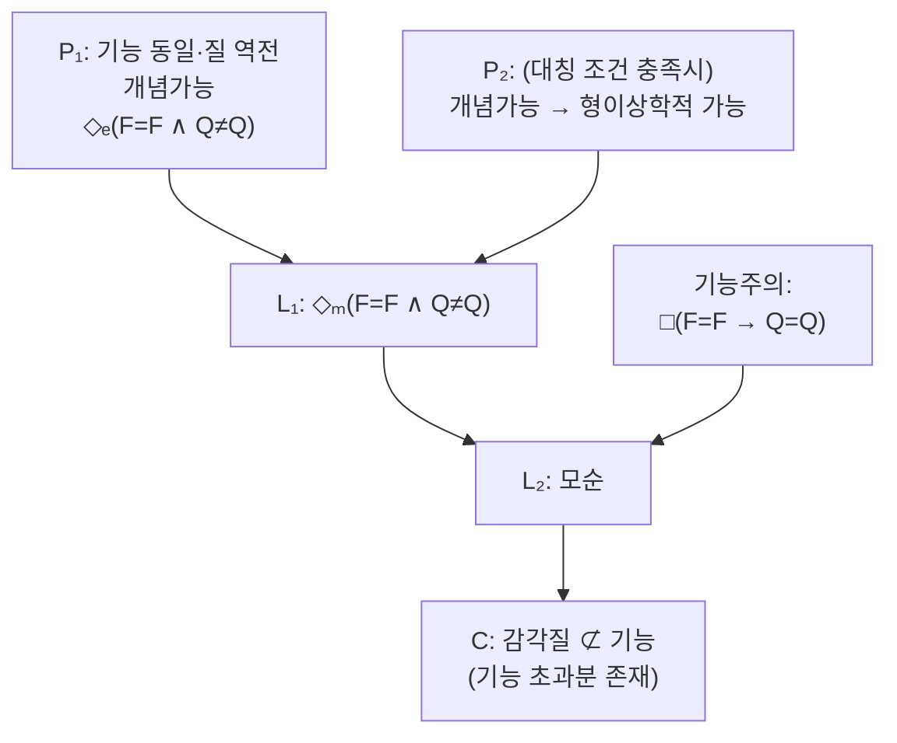

# 🌈 역전된 감각질

> **Psyche L0** · Chapter 3: 물리주의의 주장과 압박 · 문서 4/5
> 나의 빨강이 당신의 파랑과 같은 내적 경험일 수 있고 어떤 행동·기능 검사로도 그것을 확인할 수 없다면, 감각질에는 기능을 초과하는 잔여가 있다.

## 🎯 핵심 질문

역전된 감각질(inverted qualia)은 좀비·메리와 더불어 반물리주의 삼각편대의 마지막 꼭짓점이다. 좀비가 경험의 *유무*를, 메리가 경험적 지식의 *환원 불가능성*을 겨냥했다면, 역전 감각질은 경험의 *질적 정체성*을 겨냥한다.

사고실험은 이렇다. 당신과 나는 색 어휘를 똑같이 쓴다. 우리는 모두 잘 익은 토마토를 "빨갛다"고, 맑은 하늘을 "파랗다"고 부른다. 우리의 색 변별·명명·선호 행동은 완벽히 일치한다. 그런데 내가 토마토를 볼 때 *내적으로* 일어나는 경험의 질이, 당신이 하늘을 볼 때 일어나는 질과 *같다*면? 즉 나의 색 스펙트럼이 당신의 것에 대해 통째로 뒤집혀 있다면? 우리는 같은 단어를 쓰고 같은 변별을 하므로, 어떤 외적 검사로도 이 차이를 *탐지할 수 없다.*

핵심 질문: **이런 행동적·기능적으로 탐지 불가능한 질적 역전이 가능한가?** 만약 가능하다면, 경험의 질(감각질)은 그것의 기능적·행동적 역할에 의해 완전히 결정되지 않는다. 감각질에는 **기능을 초과하는 잔여**(functional residue)가 있다. 그리고 이것은 마음을 기능적·물리적 조직으로 환원하려는 물리주의(특히 4장의 기능주의)에 직접적 압박이다.

## 🌍 어디서 마주치나

역전 감각질의 직관은 어린아이도 떠올리는 보편적 의문이다.

- **"네가 보는 빨강이 내가 보는 빨강과 같을까?"**: 거의 모든 사람이 한 번쯤 떠올리는, 철학사에서 가장 민주적인 사고실험. 로크(Locke)가 이미 17세기에 "역전된 스펙트럼"으로 논했다.
- **색맹과 색각 이상**: 이색형 색각자(dichromat)나 사색형 색각자(tetrachromat)의 존재는 사람마다 색 경험의 *구조*가 실제로 다를 수 있음을 보여준다. 다만 이들은 *행동상으로도* 다르므로 순수한 역전 사례는 아니다 — 진짜 역전은 행동이 동일해야 한다.
- **공감각(synesthesia)**: 숫자에 색을 보는 사람의 존재는 동일 자극에 대한 질적 경험의 개인차가 실재함을 시사한다.
- **번역과 문화적 색 범주**: 언어마다 색 경계가 다르다는 사실(예: 청록을 하나의 색으로 묶는 언어)은 색 경험의 *조직화*가 보편적이지 않을 가능성을 연다.

이 만남들의 핵심은 **행동·언어의 공유가 내적 질의 동일성을 보장하지 못한다**는 직관이다. 우리는 색 어휘를 공유하지만, 그 어휘 뒤의 사적(私的) 질이 일치한다는 보증은 어디에도 없다.

## 🔍 직관의 함정

역전 감각질은 매혹적이지만, 그 성립 조건은 까다롭다.

**함정 1: 비대칭성 문제(asymmetry problem).** 색 공간은 균질하지 않다. 빨강은 "따뜻하고", 파랑은 "차갑다." 노랑은 가장 밝게 보이고, 채도·명도의 구조도 비대칭적이다. 그래서 빨강↔파랑을 단순 교환하면 *다른* 비대칭이 생겨 행동에 차이가 날 수 있다(예: "어떤 색이 더 따뜻한가?"라는 물음에 다르게 답함). 진정한 행동 무탐지 역전이 *기하학적으로 가능*하려면 색 공간이 충분히 대칭적이어야 한다. 이 때문에 일부 철학자는 "현실적 역전"은 불가능하고 "논리적 역전"만 가능하다고 본다.

**함정 2: 역전된 지구(Inverted Earth) 변주의 혼동.** 블록(Ned Block)의 역전된 지구 사고실험은 *세계의 색*과 *언어*가 함께 뒤집힌 행성에 색-역전 렌즈를 낀 채 사는 사람을 다룬다. 이것은 감각질이 *내부* 기능이 아니라 *외부* 환경 관계에 의해 고정된다는 외재주의(표상주의)를 시험하는 다른 도구다. 단순 역전 스펙트럼과 혼동하면 논점이 흐려진다.

**함정 3: "탐지 불가능"의 범위 과장.** 행동으로 탐지 불가능하다는 것이 *원리상 모든 물리적 방법으로* 탐지 불가능을 의미하지는 않는다. 만약 감각질이 특정 신경 상태와 상관한다면, 뇌 스캔으로 역전을 탐지할 수도 있다. 따라서 논변의 표적은 정확히 **기능주의**(감각질=기능적 역할)이지 모든 물리주의가 아니다. 신경 상태 차이를 인정하는 유형 동일론은 역전을 *물리적으로* 구별할 수 있다.

## ⚙️ 논증 구조

역전 감각질 논변을 기능주의에 대한 압박으로 형식화하자. 기능주의는 마음 상태가 그 *기능적 역할*(인과적 입력-출력-내부전이 프로필)에 의해 정의된다고 주장한다. $F(s)$를 상태 $s$의 기능적 역할, $Q(s)$를 그 질적 특성이라 하자. 기능주의의 핵심 약속은:

$$\square\,\forall s_1 \forall s_2 \,\big[ F(s_1) = F(s_2) \rightarrow Q(s_1) = Q(s_2) \big]$$

즉 기능적으로 동일한 두 상태는 질적으로도 동일하다. 역전 논변은 이를 공격한다.

- $P_1$: 두 사람(또는 한 사람의 두 시점) 사이에 기능적으로 동일하나 질적으로 역전된 상태가 **개념 가능**하다. $\Diamond_{\text{epist}}\big[ F(s_1)=F(s_2) \wedge Q(s_1)\neq Q(s_2) \big]$.
- $P_2$: (대칭성 조건이 충족되면) 이 개념가능성은 형이상학적 가능성으로 이어진다.
- $L_1$: 그러므로 $\Diamond_{\text{meta}}\big[ F=F \wedge Q\neq Q \big]$.
- $L_2$: $L_1$은 기능주의의 핵심 약속 $\square[F=F \rightarrow Q=Q]$와 모순이다.
- $C$: 그러므로 질적 특성은 기능적 역할로 환원되지 않는다 — 감각질은 기능 초과분을 가진다. $\square$

좀비 논변과의 구조적 평행에 주목하라. 둘 다 개념가능→가능 다리를 쓴다. 그러나 역전 논변의 표적은 더 좁고(기능주의) 더 날카롭다 — 경험의 *존재*가 아니라 *동일성*을 기능에서 떼어내기 때문이다. 따라서 역전을 인정하는 물리주의자라도, 그것이 *신경* 차이와 상관한다고 주장하면 유형 동일론 쪽으로 물러나 논변을 부분적으로 흡수할 수 있다.

## 🧪 증거와 사고실험

**(1) 로크의 원형.** 로크는 "한 사람의 마음 속 제비꽃이 일으키는 관념이 다른 사람의 마음 속 금잔화가 일으키는 관념과 같을 수 있다"고 적었다. 그는 그러나 이것이 *탐지 불가능*하므로 실천적으로 무의미하다고 보았다 — 이미 회의적 결론을 예고한 셈이다.

**(2) 점진적 역전과 기억(샤이머/블록).** 한 사람의 색 경험이 어느 날 수술로 *역전*되었다고 하자. 처음엔 그가 알아챈다("토마토가 파랗게 보여!"). 그러나 만약 그의 색 *기억*과 *언어*까지 함께 역전된다면, 그는 적응 후 아무 차이도 보고하지 못한다. 이 시나리오는 역전이 행동상 봉인될 수 있음을 보여주는 가장 설득력 있는 판본이다.

**(3) 비대칭 반론과 그 우회.** 색 공간이 비대칭이라 단순 역전이 행동 차이를 낸다는 반론에 맞서, 옹호자는 (a) 충분히 대칭적인 부분 공간(예: 특정 색상환의 회전)을 택하거나, (b) 감각질의 *모든* 관계 구조까지 함께 역전시키는 "전면 역전"을 상정한다. 그러나 (b)를 끝까지 밀면 — 모든 기능적·관계적 구조가 보존된다면 — "정말 무엇이 역전되었는가"가 모호해진다. 이것이 표상주의자가 파고드는 틈이다(다음 절).

**(4) 부재 감각질(absent qualia)과의 짝.** 역전의 극단 변주는 "기능적으로 동일하나 감각질이 *부재*"하는 경우다. 이것은 사실상 부분 좀비이며, 블록의 "중국 인민(China-brain)" 사고실험 — 중국 전 인구가 신호를 주고받아 한 뇌의 기능 조직을 실현하면 거기에 의식이 있을까 — 으로 보강된다. 직관은 "그런 거대 체계에 통증의 *질*이 있다고 보기 어렵다"고 말하며, 이는 기능 조직만으로 감각질을 보장하지 못한다는 압박이다.

## 🌉 설명적 간극

역전 감각질은 설명적 간극을 **관계 대 내재(relational vs. intrinsic)**의 축에서 드러낸다. 기능주의는 마음 상태를 순전히 *관계적*으로 정의한다 — 무엇이 무엇을 일으키고 무엇으로 이어지는가. 그러나 감각질은 내재적 질처럼 느껴진다 — 빨강의 *빨감*은 그것이 어떤 인과적 그물에 놓이는가와 무관하게 그 자체로 *이러한* 무엇이다.

여기서 간극이 벌어진다. 어떤 관계적·구조적 명세도 내재적 질을 *고정*하지 못하는 듯하다. 두 상태가 모든 인과 관계에서 일치해도 그 내재적 "느낌"은 다를 수 있다는 것이 역전 직관의 핵심이다. 이는 1장에서 본 "물리/기능 사실이 모든 사실을 고정한다"는 주장에 대한 정밀 타격이다 — 고정되지 않는 잔여(내재적 질)가 남는다고 주장하기 때문이다.

물리주의자(표상주의자)의 응수는 강력하다. **감각질은 내재적으로 보이지만 실은 표상적·관계적이다.** 빨강 경험의 "빨감"은 그 경험이 *세계의 어떤 속성(표면 반사율 등)을 표상하는가*에 의해 고정된다. 따라서 진정한 역전은 *표상 내용의 역전*을 요구하고, 그것은 더 이상 탐지 불가능하지 않다(다른 것을 표상하므로 다르게 행동하거나 다른 환경 관계에 놓인다). 표상주의가 옳다면, "내재적 질"이라는 외양은 환상이며 설명적 간극은 봉합된다. 그러나 비판자는 "표상 내용을 다 명세해도 *왜 그것이 이렇게 느껴지는가*는 여전히 열려 있다"고 반박한다 — 간극이 표상 단계로 이동했을 뿐이라는 것이다. 이 공방이 5장의 핵심이다.

## 🧬 횡단 원리

- **기능 초과 원리**: 역전(과 부재) 감각질 직관의 핵심은 "질이 기능을 초과한다"는 것이다. 이것이 참이면 기능주의는 감각질을 포착하지 못한다. 이것이 4장 기능주의에 대한 가장 직접적 압박이다.
- **내재 대 관계의 긴장**: 감각질이 내재적이라면 관계적 정의(기능)로 환원 불가능하고, 관계적이라면(표상주의) 환원 가능하다. 이 분기점이 의식 환원 가능성 전체를 가른다.
- **표적의 정밀성**: 역전 논변은 기능주의를 직격하지만, *신경 차이를 인정하는* 유형 동일론에는 약하다(역전이 신경 차이와 상관하면 물리적으로 탐지 가능). 따라서 논변은 물리주의 *내부의 방언 선택*을 압박하는 도구이기도 하다.
- **대칭성 의존성**: 역전의 *형이상학적* 가능성은 색 공간의 충분한 대칭성에 의존한다. 비대칭이 깊으면 행동 무탐지 역전은 좁아진다 — 이는 논변의 일반화에 대한 자연적 제약이다.

## 🪞 1인칭

역전 감각질만큼 1인칭과 3인칭의 비대칭을 날카롭게 노출하는 사고실험은 없다. 나는 *나의* 빨강 경험에 직접 접면한다. 그러나 나는 *당신의* 빨강 경험에 결코 접면할 수 없다. 우리 사이엔 영원히 건널 수 없는 사적 장벽이 있다. 우리는 같은 단어("빨강")로 가리키지만, 그 단어 뒤의 질이 일치한다는 것을 *원리상* 확인할 길이 없다.

이 1인칭 봉인을 직접 음미해보라. 당신은 당신의 색 경험이 *언제나 그래왔던* 그대로임을 확신하는가? 만약 어젯밤 잠든 사이 당신의 모든 색 감각질이 — 기억과 언어까지 함께 — 역전되었다면, 당신은 오늘 아침 그것을 *알아챌* 수 있을까? 점진적 역전 시나리오의 섬뜩함은 바로 "아니오"라는 답에 있다. 1인칭 접면조차 *시간을 가로지른 질의 동일성*을 보증하지 못할 수 있다.

그러나 회의론자(비트겐슈타인 계열)는 여기서 반문한다. 어떤 1인칭적·3인칭적 차이도 만들지 못하는 "역전"이란 정말 *차이*인가, 아니면 언어가 헛도는 무의미한 가정인가? "바퀴는 돌지만 아무것도 맞물리지 않는다." 이 비트겐슈타인적 의심은 역전 감각질이 깊은 형이상학적 발견인지 언어의 환상인지를 묻는 1인칭의 마지막 갈림길이다.

## 📐 예측·반증

- **기능주의의 예측**: 기능적으로 동일한 모든 체계는 동일한 감각질을 가진다. **반증 조건**: 모든 기능적 변수가 통제된 상태에서 질적 차이가 입증되면(예: 신경 차이 없이 기능 동일한데 보고 가능한 질 차이) 기능주의는 직접 반증된다. 다만 "보고 가능한"이 이미 기능 차이를 함의하므로, 이 반증은 원리상 까다롭다.
- **표상주의의 예측**: 모든 감각질 차이에는 표상 내용의 차이가 대응한다. **반증 조건**: 동일한 외부 속성을 표상하면서 질이 다른 두 경험이 확립되면 표상주의는 무너진다(예: 역전된 지구 시나리오의 특정 판본).
- **신경과학적 단서**: 만약 색 감각질이 특정 신경 부호화 패턴과 신뢰성 있게 상관한다면, 두 사람의 "빨강"이 같은 부호인지 비교함으로써 역전을 *부분적으로* 탐지할 길이 열린다. 이는 유형 동일론에 유리하고 순수 기능주의에 불리한 경험적 방향이다.
- **약점**: 행동·기능상 완전히 봉인된 역전은 정의상 행동 검사로 반증 불가능하다. 결판은 (1) 색 공간 대칭성에 관한 심리물리학적 사실과 (2) 감각질의 내재/관계 본성에 관한 개념 분석에서 나야 한다.

## 🤔 다음 질문

세 사고실험 — 좀비, 메리, 역전 감각질 — 은 각기 다른 각도에서 같은 결론을 향했다. 물리적·기능적 사실이 경험의 *모든* 것을 고정하지는 못한다는 것. 설명적 간극은 인식적 호기심이 아니라 형이상학적 균열처럼 보인다.

그러나 우리는 지금까지 반물리주의의 칼날만 벼렸다. 공정하려면, 물리주의자가 이 세 칼날을 어떻게 막아내는지 — 그것도 최선의 형태로 — 들어야 한다. 표상주의는 감각질을 표상 내용으로 재해석하고, a posteriori 물리주의는 개념가능→가능 다리를 끊으며, 현상 개념 전략(로어)은 간극을 *개념의* 특이성으로 *물리주의 안에서* 설명한다. 다음 문서는 묻는다. **그 간극은 인식적일 뿐 형이상학적이 아닐 수 있는가? 그리고 왜 이 논쟁은 여전히 열려 있는가?**

---

🧩 **Principle** — 역전 감각질 직관의 핵심은 "질이 기능을 초과한다"는 기능 초과 원리이며, 이것이 참이면 기능적·관계적 정의는 감각질의 내재적 질을 고정하지 못한다.
🌉 **Boundary** — 쟁점은 감각질이 내재적인가(환원 불가) 관계적·표상적인가(환원 가능)이며, 표상주의는 간극을 봉합하려 하나 비판자는 간극이 표상 단계로 이동했을 뿐이라 본다.
🪞 **Experience** — 1인칭 접면조차 시간과 타인을 가로지른 질의 동일성을 보증하지 못한다는 점이 역전의 섬뜩함이지만, 비트겐슈타인적 의심은 그 "차이 없는 차이"가 발견인지 언어의 헛돎인지를 되묻는다.

## 📝 연습문제

<strong>기초</strong>: 역전 감각질 사고실험이 성립하려면 두 사람의 색 관련 행동과 언어가 왜 *완전히 동일*해야 하는지 설명하라.

만약 두 사람의 색 행동이나 언어가 조금이라도 다르다면, 그 차이가 *질의 차이*가 아니라 단순한 *기능·행동의 차이*로 설명될 수 있다.

**해설:** 논변의 목적은 "기능이 같아도 질이 다를 수 있다"를 보이는 것이다. 따라서 기능(행동·언어·변별·선호)을 *상수로 고정*해야만, 남는 변이(질의 역전)가 기능으로 환원되지 않음을 분리해낼 수 있다. 행동에 차이를 허용하면 기능주의자는 곧장 "그 행동 차이가 곧 상태 차이"라고 응수해 논변을 무력화한다. 그래서 진정한 역전 사례는 기억과 언어까지 함께 역전된 "봉인된 역전"이어야 한다. 동시에 이 완전 봉인 요구가 비트겐슈타인적 반론("차이 없는 차이는 무의미")을 불러들이는 약점이기도 하다.

<strong>심화</strong>: 비대칭성 문제가 역전 논변을 어떻게 약화하며, 옹호자가 이를 우회하려는 시도(전면 역전, 대칭 부분공간)가 어떤 새로운 대가를 치르는지 분석하라.

비대칭성 문제: 현상적 색 공간은 비대칭적이다(빨강은 따뜻하고 노랑은 밝다 등). 따라서 빨강↔파랑 단순 교환은 "어느 색이 더 따뜻한가/밝은가" 같은 물음에서 *행동 차이*를 낳아, 봉인이 깨진다.

우회 1(대칭 부분공간): 충분히 대칭적인 색상환의 회전만 사용한다. 우회 2(전면 역전): 모든 질적 *관계 구조*까지 함께 역전시켜 비대칭마저 보존한다.

**해설:** 대가 분석: 우회 1은 역전의 범위를 *좁은 대칭 영역*으로 한정해, 논변의 일반성을 잃는다(모든 감각질이 아니라 일부만). 우회 2가 더 흥미로운데, 모든 관계 구조를 보존하면서 "내재적 질만" 뒤집는다고 주장한다. 그러나 여기서 치명적 대가가 발생한다 — 모든 기능적·관계적 구조가 보존되었다면, "무엇이 역전되었는가"를 가리킬 *어떤 구조적 지표도 없다.* 표상주의자는 이 틈을 파고든다: 남은 "내재적 질"이 어떤 관계에도 걸리지 않는다면, 그것이 *차이*라고 부를 근거가 무엇인가? 따라서 우회 2는 비대칭 문제를 피하는 대가로 비트겐슈타인적·표상주의적 "차이 없는 차이" 반론에 정면으로 노출된다. 결론: 비대칭 문제는 역전을 *논박*하진 않으나, 그것이 "현실적·일반적 가능성"에서 "좁은 논리적 가능성"으로 후퇴하게 만들며, 그 후퇴는 차이의 *의미*에 대한 새 부담을 부과한다.

<strong>논문 비평</strong>: "역전 감각질은 기능주의를 반박하지만 물리주의 자체를 반박하지는 못한다"는 주장을 표상주의 응답과 유형 동일론의 가능성을 함께 고려하여 비판적으로 평가하라.

주장의 구조: 역전 논변은 "기능 동일·질 상이"를 겨냥하므로 *기능주의*(질=기능적 역할)를 직격한다. 그러나 (a) 신경 상태 차이를 인정하는 유형 동일론은 역전을 *신경 차이*로 설명하여 물리적으로 탐지·정착시킬 수 있고, (b) 표상주의는 질을 표상 내용으로 재해석해 역전을 내용 역전으로 환원, 역시 물리주의 안에 머문다.

**해설:** 비판적 평가: 이 주장은 대체로 타당하나 두 단서가 필요하다. (1) 유형 동일론 경로의 한계: 역전이 신경 차이와 상관한다고 인정하면 *행동 무탐지*는 유지되나 *물리 무탐지*는 깨진다 — 즉 역전은 더 이상 물리주의에 대한 반례가 아니다. 그러나 이 경로는 다중 실현을 포기하므로(1장), 기능주의의 장점을 잃는 대가를 치른다. 즉 물리주의는 살지만 *어떤* 물리주의인지에 제약이 걸린다. (2) 표상주의 경로의 미결: 표상주의는 역전을 흡수하지만, "표상 내용이 같은데 질이 다른" 변주(특정 역전 지구 판본, 또는 표상을 다 명세해도 남는 '왜 이렇게 느껴지는가')에 다시 노출된다 — 간극이 봉합된 게 아니라 표상 층위로 이동했다는 비판. (3) 종합 평가: 따라서 "역전은 기능주의를 반박하나 물리주의를 반박하지 못한다"는 *정확하되 불완전*하다. 정확한 이유는 물리주의가 유형 동일론·표상주의로 후퇴해 살아남기 때문이고, 불완전한 이유는 그 후퇴들이 각각 (다중 실현 포기, 또는 간극의 이동이라는) 비용을 동반하기 때문이다. 즉 역전 감각질은 물리주의를 죽이지 못하지만, 물리주의가 취할 수 있는 형태를 *유의미하게 제약*하고 비용을 명시화한다. 이것이 이 사고실험의 진짜 역할 — 반박이 아니라 *대가 계산서*의 발행 — 이다.

[◀ 이전: 메리의 방](./03-marys-room.md) · [📚 README](../README.md) · [다음: 물리주의의 반론 ▶](./05-physicalist-replies.md)

