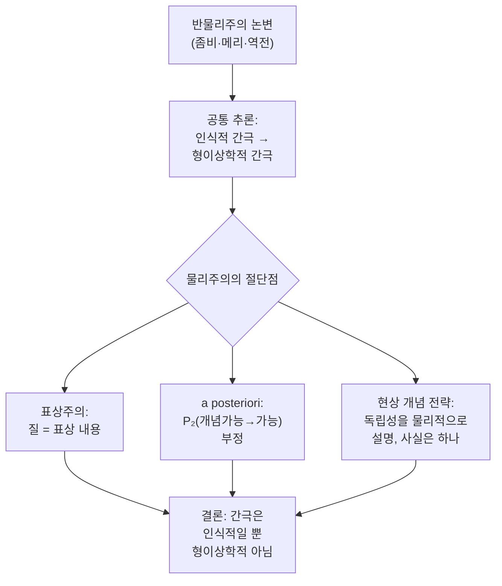

# 🛡️ 물리주의의 반론

> **Psyche L0** · Chapter 3: 물리주의의 주장과 압박 · 문서 5/5
> 표상주의·a posteriori 물리주의·현상 개념 전략은 설명적 간극이 인식적일 뿐 형이상학적이 아니라고 논증하며, 그 성패가 논쟁이 열려 있는 이유다.

## 🎯 핵심 질문

앞선 세 문서는 좀비·메리·역전 감각질이라는 칼날로 물리주의를 압박했다. 공정한 탐구라면 이제 물리주의자가 어떻게 반격하는지 — 그것도 가장 강한 형태로 — 들어야 한다. 모토를 기억하자. "설명해내라, 설명으로 없애지 말라(Explain it, don't explain it away)." 좋은 물리주의는 의식을 *제거*하지 않고 *수용*하면서 간극을 해소하려 한다.

물리주의자의 반론은 하나의 전략적 핵심으로 수렴한다. **설명적 간극은 실재하지만, 그것은 우리 *개념*과 *인식* 안의 간극이지 *세계* 안의 간극이 아니다.** 다시 말해, 물리 사실과 현상 사실 사이에 *인식적·선험적 연역 가능성*의 결여가 있음은 인정하되, 그로부터 *형이상학적 비동일성*을 도출하는 단계가 부당하다고 본다.

핵심 질문은 둘이다. 첫째, **반물리주의 논변들은 공통으로 어디서 미끄러지는가?** 모두 "인식적 사실(상상 가능함, 연역 불가능함, 탐지 불가능함)"에서 "형이상학적 사실(별개의 사실임)"로 건너뛴다. 물리주의자는 이 다리(개념가능→가능)를 끊으려 한다. 둘째, **그 끊기가 성공하면 간극은 완전히 사라지는가, 아니면 자리만 옮기는가?** 이 두 번째 물음에 대한 미결성이 곧 의식 논쟁이 한 세대 넘게 열려 있는 이유다.

## 🌍 어디서 마주치나

물리주의적 직관 역시 일상과 과학에 깊이 뿌리내려 있다.

- **신경과학의 누적적 성공**: 기억, 주의, 감정의 신경 기제가 차례로 해명되는 역사는 "의식도 결국 풀릴 또 하나의 어려운 과학 문제"라는 낙관을 지지한다.
- **과학사의 "활력론" 교훈**: 한때 생명은 "비물리적 생명력(élan vital)"을 요구한다고 여겨졌으나 분자생물학이 그 간극을 닫았다. 물리주의자는 의식의 간극도 같은 운명일 수 있다고 본다 — 현재의 신비는 미래의 무지일 뿐.
- **착시와 내성의 오류**: 변화맹·맹시(blindsight) 등은 내성이 의식에 관해 *신뢰할 수 없는* 보고자임을 보인다. 그렇다면 "간극이 있다"는 내성적 확신도 의심 대상이다.
- **AI의 행동적 정교화**: 시스템이 점점 더 풍부한 "내적 상태"를 보고하는 시대에, 의식과 정보 처리의 경계는 실천적으로 흐려진다.

이 만남들의 공통 메시지: 역사적으로 "설명될 수 없어 보이던" 현상들은 거듭 물리적으로 설명되었으며, 의식만 예외라고 단정할 선험적 근거는 없다. 물리주의는 이 **귀납적 낙관**에 기댄다.

## 🔍 직관의 함정

물리주의 반론을 읽을 때의 함정도 짚어야 공정하다.

**함정 1: 제거주의와 환원적 설명의 혼동.** "의식은 환상"이라는 강한 제거주의(부분적으로 데닛으로 읽히는)와 "의식은 실재하며 물리적이다"라는 환원적·비제거적 물리주의는 다르다. 본 문서가 다루는 표상주의·a posteriori·현상 개념 전략은 후자에 속한다 — 의식을 *없애지* 않고 *물리 안에 자리매김*한다. 이 구별을 놓치면 물리주의를 허수아비로 만든다.

**함정 2: "인식적 간극은 사소하다"는 오해.** 물리주의자가 "간극은 인식적일 뿐"이라 할 때, 그것이 간극을 *하찮게* 여긴다는 뜻은 아니다. 오히려 강한 전략(현상 개념 전략)은 그 인식적 간극이 *왜 필연적으로 닫히지 않는지*를 적극 설명하려 한다. 인식적 간극을 *설명*하는 것과 *무시*하는 것은 다르다.

**함정 3: a posteriori 필연성의 방향 혼동.** 크립키의 후험적 필연성은 양날의 칼이다. 물리주의자는 그것으로 "통증=뇌상태가 필연적이나 후험적"이라 주장하려 하지만, 크립키 *본인*은 같은 도구로 심신 동일론을 *반박*했다(다음 절). 누가 그 칼을 더 잘 쥐는지가 쟁점이다.

## ⚙️ 논증 구조

세 반론을 차례로 구조화한다.

**(1) 표상주의(representationalism) — 타이, 드레츠키, 해먼.** 감각질은 내재적 질이 아니라 경험의 *표상 내용*이다. 빨강 경험의 현상적 성격은 그것이 *세계의 어떤 속성(표면 반사율)을 표상함*에 의해 남김없이 고정된다. 형식적으로, 경험 $e$의 현상적 성격 $Q(e)$에 대해:

$$Q(e) = \text{Content}(e)$$

표상 내용은 물리적·기능적·환경적 관계로 자연화 가능하므로, 감각질도 그렇다. 역전 감각질은 표상 내용의 역전을 요구하고, 그것은 더 이상 탐지 불가능하지 않다(절 4 참조).

**(2) A posteriori 물리주의 — 후험적 동일성 노선.** 좀비·메리 논변의 급소는 $P_2$(개념가능→형이상학적 가능)다. a posteriori 물리주의는 이 다리를 끊는다. "통증=C-섬유 발화"는 "물=H₂O"처럼 **후험적 필연**이다.

$$\Box(\text{Pain} = P) \quad \text{이되} \quad \text{이는 } a\ posteriori$$

좀비가 개념 가능한 것은, 우리가 두 개념(현상 개념과 물리 개념)을 선험적으로 잇지 못하기 때문이지, 두 사실이 별개여서가 아니다. 개념적 독립이 형이상학적 독립을 함의하지 않는다.

**(3) 현상 개념 전략(phenomenal concept strategy, PCS) — 로어(Brian Loar).** 이것이 가장 정교한 반론이다. 핵심 주장:

- $C_1$: 우리는 경험에 대해 두 종류의 개념을 가진다 — *물리 개념*(C-섬유 발화)과 *현상 개념*("이런 느낌").
- $C_2$: 이 두 개념은 **동일한 물리적 속성**을 지시하되, 인지적으로 서로 독립적이다(한쪽에서 다른쪽을 선험적으로 도출 불가).
- $C_3$: 이 인지적 독립성 자체가 **물리적·인지과학적으로 설명 가능**하다 — 현상 개념은 대상을 *직접 인용/현시*하는 특수한 인지 메커니즘(재인 개념, 인용적 개념)이다.
- $C_4$: 따라서 설명적 간극·좀비 직관·메리의 깨달음은 모두 **두 개념의 독립성**의 산물이며, 두 *사실*의 별개성을 함의하지 않는다.

$$\underbrace{\text{개념적 독립}}_{\text{인식적, 설명됨}} \;\not\rightarrow\; \underbrace{\text{속성의 별개성}}_{\text{형이상학적}}$$

세 노선 모두 마지막 노드 $G$에 합류한다 — 간극은 인식적이지 형이상학적이 아니다. $\square$

## 🧪 증거와 사고실험

**(1) 활력론 유비.** 19세기에 "유기물의 합성은 비물리적 생명력 없이 불가능"이라 믿어졌으나 뵐러의 요소 합성 이후 그 간극은 사라졌다. 당시에도 "생명력 좀비(화학적으로 같으나 살아있지 않은 것)"가 개념 가능해 *보였다*. 그러나 그 개념가능성은 무지의 산물이었다. 물리주의자는 의식의 간극도 같다고 본다.

*반론자의 응수(차머스)*: 활력론과 의식은 **비대칭적**이다. 생명의 모든 *기능*(대사, 생식)을 설명하면 생명 설명은 끝난다 — 남는 "활력의 느낌" 같은 잔여가 없다. 그러나 의식은 모든 기능을 설명해도 "왜 그것이 *느껴지는가*"가 남는다. 이것이 차머스의 **쉬운 문제/어려운 문제** 구별의 핵심이다. 활력론 유비는 *어려운 문제*를 *쉬운 문제*로 잘못 동화한다.

**(2) 현상 개념의 인지과학적 정착.** PCS 옹호자는 현상 개념이 뇌의 *재인 메커니즘*(경험을 직접 가리키는 인덱스적 표상)으로 구현된다고 본다. 이것이 옳다면, 현상 개념과 물리 개념의 독립성은 *우리 인지 구조의 우연한 특징*이며, 형이상학적 깊이가 없다. 메리가 방을 나와 얻는 것은 새 *현상 개념*(새 재인 능력)이지 새 *사실*이 아니다 — 능력 가설과 옛 사실/새 표상의 통합.

*반론자의 응수(차머스의 '마스터 논변')*: PCS는 딜레마에 빠진다. 현상 개념의 특수성(인지적 고립)이 *순수 물리적으로* 설명 가능하다면, 그 설명은 좀비에게도 성립한다(좀비도 같은 물리적 인지 구조를 가지므로). 그렇다면 좀비도 "현상 개념"을 가져야 하는데, 좀비는 경험이 없으므로 진짜 현상 개념을 가질 수 없다. 따라서 현상 개념의 특수성은 *순수 물리적으로는* 설명되지 않는다 — PCS는 자기 발 밑을 판다는 것이다. PCS 옹호자는 "좀비의 개념은 우리의 현상 개념과 기능적 쌍둥이지만 진짜 현상 개념은 아니다"라고 응수하나, 그러면 차이가 다시 비물리적 무엇에 기댄다는 의심이 남는다.

**(3) 크립키의 반동일론 논변.** 크립키는 후험적 필연성 도구로 *물리주의를 반박*했다. "물=H₂O"의 외양적 우연성("물이 H₂O가 아닐 수도"라는 느낌)은 "물처럼 보이는 다른 것(XYZ)"으로 *해명*된다 — 즉 진짜 물이 아닌 것을 상상한 것. 그러나 "통증=C-섬유"의 외양적 우연성은 같은 식으로 해명되지 않는다. "통증처럼 *느껴지지만* 통증이 아닌 것"은 없기 때문이다(통증은 그 느낌이 곧 본질). 따라서 통증=C-섬유의 우연성 외양은 *진짜* 우연성이고, 동일성은 거짓이다. a posteriori 물리주의는 바로 이 크립키 논변을 무력화해야 하며, 그 부담이 PCS다.

## 🌉 설명적 간극

이제 핵심 물음을 정면으로 본다. **물리주의의 반론이 성공하면 간극은 사라지는가, 옮겨가는가?**

물리주의의 가장 강한 주장은 *간극의 인식적 설명*이다. 우리가 간극을 *느끼는* 이유 자체를 물리적으로 설명할 수 있다면(현상 개념의 인지적 고립 때문에), 간극의 존재는 더 이상 물리주의에 대한 반례가 아니라 물리주의가 *예측하는* 현상이 된다. 이것이 "설명해내라"의 모범 사례다 — 간극을 부정하지 않고, 간극의 *발생*을 설명한다.

그러나 반물리주의자의 가장 날카로운 응수는 **간극이 자리만 옮긴다**는 것이다. 표상주의를 받아들여도 "왜 *이* 표상 내용이 *이렇게* 느껴지는가"가 남는다. PCS를 받아들여도 "왜 현상 개념을 *행사하는 것 자체*에 느낌이 있는가"가 남는다. 차머스의 마스터 논변(위)이 보여주듯, 간극을 물리적으로 메우려는 모든 시도는 자신이 메우려는 바로 그 현상(경험)을 설명항에 슬쩍 전제하는 듯 보인다.

여기서 논쟁은 교착에 이른다. 물리주의자: "당신은 인식적 사실에서 형이상학적 결론으로 부당하게 도약한다." 반물리주의자: "당신은 설명해야 할 것(경험의 느껴짐)을 매번 설명 안에 미리 집어넣는다." 양측 모두 상대가 선결 문제를 요구한다고 본다. 이 대칭적 교착 — 어느 쪽도 상대를 *공유 전제만으로* 논박하지 못함 — 이 의식 논쟁이 결론에 이르지 못한 채 열려 있는 구조적 이유다.

## 🧬 횡단 원리

- **인식/형이상학 분리 원리**: 물리주의 반론의 공통 엔진은 "인식적 간극 ≠ 형이상학적 간극"이다. 반물리주의의 공통 엔진은 그 둘을 잇는 다리(개념가능→가능, 연역불가→별개사실)다. 이 책 전체의 핵심 분기점.
- **간극 이동 가설**: 어떤 환원도 간극을 *완전히* 닫지 못하고 한 층 위로 옮긴다는 의심. 이것이 참이면 어려운 문제는 원리상 풀리지 않고, 거짓이면 시간문제다. 이 가설의 진위가 미결.
- **자기 적용의 덫(마스터 논변)**: 간극의 *인식적 설명*이 너무 잘 작동하면(좀비에게도 성립하면) 그 설명은 경험을 설명하지 못한 것이 되고, 작동하지 않으면 물리주의가 실패한다. PCS의 구조적 딜레마.
- **귀납적 낙관 대 비대칭 논제**: 물리주의는 과학사의 환원 성공을 귀납 근거로 삼고, 반물리주의는 의식이 *기능 잔여 없는 느낌*이라는 점에서 과거 사례와 비대칭이라 본다. 이 메타귀납의 적용 가능성이 다툼.

## 🪞 1인칭

물리주의 반론은 1인칭의 위상을 재배치한다. 반물리주의는 1인칭 접면을 *형이상학적 증거*로 격상했다. 물리주의(특히 PCS)는 1인칭 접면을 *부정하지 않으면서* 그것을 *특수한 인지 양식*으로 재해석한다. 내가 내 통증에 직접 접면할 때, 나는 분명 무언가를 직접 안다 — 그러나 그 직접성은 내가 *비물리적 사실*에 닿았다는 표지가 아니라, 내가 *물리적 속성을 현상 개념으로 인용적으로 파지*하는 특수 메커니즘을 행사하고 있다는 표지다.

이 재배치를 1인칭으로 음미해보라. 지금 이 빨강을 보며 "이것!"이라 지목할 때, 그 지목의 *직접성*은 부인할 수 없다. 물리주의자는 말한다 — 그 직접성은 실재하되, 직접성이 *지목하는 것*은 결국 당신의 시각 피질의 물리적 상태다. 마치 거울 속 얼굴을 "이 얼굴!"이라 직접 지목해도 그것이 당신의 물리적 얼굴인 것처럼. 직접적 파지 양식과 파지되는 사실의 본성은 별개다.

반물리주의자의 1인칭 반론은 끈질기다 — "그 '이것!'의 *생생함 자체*가 어떤 물리적 명세에도 담기지 않는다." 그리고 물리주의자는 다시 "그 '담기지 않음'은 개념의 고립이지 사실의 초과가 아니다." 1인칭은 이렇게 양측의 최종 전장이 되며, 같은 경험이 한쪽엔 형이상학적 증거로, 다른 쪽엔 인지적 환상으로 읽힌다.

## 📐 예측·반증

- **물리주의(PCS)의 예측**: 설명적 간극을 *느끼게 만드는* 인지 메커니즘(현상 개념의 신경 기반)이 식별되고, 그 메커니즘이 간극의 발생을 *예측*할 것이다. **반증 조건**: 그런 메커니즘이 좀비에게도 동일하게 성립함이 보여지면(마스터 논변), PCS는 경험을 설명하지 못한 것이 되어 실패한다.
- **표상주의의 예측**: 모든 현상적 차이에 표상 내용 차이가 대응한다. **반증 조건**: 동일 내용·상이 질의 사례(특정 역전 지구 판본)가 확립되면 무너진다.
- **반물리주의의 예측**: 어떤 물리적·인지적 설명도 "왜 이렇게 느껴지는가"의 잔여를 남길 것이다(간극 이동). **반증 조건**: 현상적 진리가 물리적 진리로부터 *투명하게 연역*되는 단 하나의 사례가 확립되면 무너진다.
- **메타 약점**: 핵심 다툼(인식적 간극이 형이상학적 함의를 갖는가)은 경험적으로가 아니라 *개념가능→가능 다리의 타당성*이라는 양상 인식론에서 결판나야 한다. 그래서 신경과학의 어떤 진보도 이 다툼을 *직접* 종결하지 못한다 — 진보는 양측에 의해 각자의 서사로 흡수된다. 이 흡수 가능성이 곧 논쟁이 열려 있는 구조적 이유다.

## 🤔 다음 질문

3장은 물리주의의 고정 원리를 세우고(문서 1), 세 칼날로 압박하고(문서 2–4), 물리주의의 최선의 방어를 들었다(문서 5). 결론은 깔끔한 승패가 아니라 *정교한 교착*이다. 양측은 서로를 선결 문제 요구로 진단하며, 어느 쪽도 공유 전제만으로 상대를 논박하지 못한다.

이 교착을 우회하는 한 가지 길이 있다. 동일성도 좀비도 직접 다투지 않고, 마음을 *기능적 조직*으로 재정의해 다중 실현을 수용하면서 정신의 인과적 실재를 구하는 길 — **기능주의**다. 기능주의는 이 장에서 거듭 등장했다(역전 감각질의 표적, 표상주의의 토대). 그것은 물리주의의 가장 영향력 있는 현대적 형태이자, 동시에 "그렇다면 감각질은 어디로 가는가"라는 본 장의 압박을 고스란히 물려받는다.

다음 장은 묻는다. 마음이 *무엇으로 만들어졌는가*가 아니라 *무엇을 하는가*로 정의된다면 — 그 약속은 무엇을 사고, 무엇을 빚지는가?

---

🧩 **Principle** — 물리주의 반론의 공통 엔진은 "인식적 간극 ≠ 형이상학적 간극"이며, 표상주의·a posteriori·현상 개념 전략은 모두 개념가능→가능 다리를 끊어 간극을 *세계*가 아닌 *개념* 안에 위치시킨다.
🌉 **Boundary** — 결정적 경계는 "간극이 사라지는가, 자리만 옮기는가"다. 마스터 논변은 간극의 인식적 설명이 너무 잘 되면 좀비에게도 성립해 경험을 설명 못 하고, 안 되면 물리주의가 실패하는 딜레마를 제기한다.
🪞 **Experience** — 같은 1인칭 직접성이 반물리주의에겐 형이상학적 증거로, 물리주의에겐 물리 속성을 인용적으로 파지하는 특수 인지 양식으로 읽힌다. 1인칭은 양측의 최종 전장이다.

## 📝 연습문제

<strong>기초</strong>: "설명적 간극은 인식적일 뿐 형이상학적이 아니다"라는 물리주의의 핵심 주장을, 메리의 방에 적용해 설명하라.

물리주의자는 메리가 방을 나와 *새 사실*을 배우는 것이 아니라, 이미 알던 *물리적 사실*을 *새 개념*(현상 개념)으로 처음 파지한다고 본다. 사실의 영역은 늘지 않고, 그것을 잡는 인지 양식만 추가된다.

**해설:** "인식적 간극"은 메리가 방 안에서 (물리 개념으로) 가졌던 지식으로부터 (현상 개념의) 빨강 경험을 *선험적으로 연역할 수 없었다*는 사실이다. 이는 진짜 간극이다 — 물리주의자도 인정한다. 그러나 "형이상학적 간극"은 빨강의 느낌이 *물리 사실과 별개의 사실*이라는 주장이며, 물리주의자는 이를 부정한다. 두 개념(물리·현상)이 인식적으로 독립적이라는 사실로부터 두 *속성*이 별개라는 결론은 따라 나오지 않는다 — 헤스페로스와 포스포로스가 인식적으로 독립적이어도 동일한 금성이듯. 메리의 깨달음은 새 사실의 발견이 아니라 옛 사실의 새 *제시 양태* 획득이다.

<strong>심화</strong>: 활력론 유비가 의식에 적용될 때 차머스의 "쉬운 문제/어려운 문제" 구별이 그 유비를 어떻게 차단하는지 분석하고, 물리주의자가 그 차단에 다시 응수할 수 있는 길을 제시하라.

활력론 유비: 생명도 한때 비물리적 "생명력"을 요구한다 여겨졌으나, 그 모든 *기능*(대사·생식·유전)을 물리화학으로 설명하자 간극이 사라졌다. 의식도 그러하리라.

차머스의 차단: 생명의 경우 설명할 것은 *기능들*뿐이고, 기능을 다 설명하면 잔여가 없다(쉬운 문제). 그러나 의식의 경우, 모든 기능(변별·보고·통합)을 설명해도 "왜 그것이 *느껴지는가*"가 남는다(어려운 문제). 유비는 이 비대칭을 무시한다.

**해설:** 물리주의자의 재응수 경로: (1) *어려운 문제의 선결 문제성 의심* — "느껴짐"이 기능과 별개의 설명 대상이라는 전제 자체가 이미 반물리주의를 가정한다. 만약 "느껴짐"이 특정 고차 표상·통합 기능과 동일하다면(표상주의·고차이론), 어려운 문제는 쉬운 문제들의 *총합*으로 해소된다. (2) *직관의 진화적 해소* — "기능을 다 설명해도 무언가 남는다"는 직관 자체가, 현상 개념의 인지적 고립이 낳는 *예측 가능한 착각*이라고 PCS로 설명한다. (3) *역사적 겸손* — 활력론자도 "기능을 다 설명해도 *살아있음*은 남는다"고 느꼈으나 틀렸다. "잔여가 있다는 느낌"은 환원 *이전*에는 늘 있었다. 평가: 이 재응수들은 어려운 문제를 *논박*하진 못하나, 그것이 *자명한 비대칭*이 아니라 *논쟁 중인 전제*임을 보인다. 차머스의 차단이 성립하려면 "느껴짐은 어떤 기능과도 동일하지 않다"가 독립적으로 확립되어야 하는데, 바로 그것이 다투는 바다. 따라서 유비도 차단도 결정적이지 않고, 다툼은 "느껴짐이 기능 잔여인가"라는 더 깊은 물음으로 후퇴한다.

<strong>논문 비평</strong>: 차머스의 "마스터 논변"이 현상 개념 전략(PCS) 전체를 무너뜨린다는 주장을 비판적으로 평가하라. PCS 옹호자의 최선의 탈출구는 무엇이며, 그 대가는 무엇인가?

마스터 논변의 구조: PCS는 "현상 개념의 인지적 고립을 물리적으로 설명한다"고 주장한다. 그러나 (디딜레마) — (뿔 1) 그 설명이 *순수 물리적*이라면, 물리적으로 동일한 좀비에게도 성립한다. 그러면 좀비도 "현상 개념"을 가지는데, 좀비는 경험이 없으므로 *진짜* 현상 개념을 가질 수 없다(현상 개념은 그 경험에 접면함을 본질로 한다고들 본다). 따라서 그 물리적 설명은 *진짜* 현상 개념의 특수성을 설명하지 못한다. (뿔 2) 그 설명이 순수 물리적이지 *않다면*, PCS는 비물리적 무언가에 의존해 물리주의를 배신한다.

**해설:** 비판적 평가: 마스터 논변은 강력하나 결정적이지는 않다. PCS 옹호자의 최선의 탈출구 두 가지를 보자. (탈출구 A — 기능적 현상 개념) "현상 개념"을 경험에의 접면을 *본질로 요구하지 않는* 순수 인지적·인용적 메커니즘으로 재정의한다. 그러면 좀비도 그 메커니즘(따라서 "현상 개념")을 가지며, 모순이 사라진다. *대가*: 이 경우 현상 개념이 더 이상 경험의 *생생함*을 포착한다고 보기 어려워져, 메리의 깨달음과 좀비 직관의 *현상적 무게*를 설명하는 본래 임무를 약화한다 — 즉 PCS가 설명하려던 바로 그것을 놓칠 위험. (탈출구 B — 접면의 구성적 역할) 현상 개념이 경험을 *구성적으로 포함*한다고 보되, 그 구성 관계 자체는 물리적이라고 주장한다(경험=물리 상태이므로 접면도 물리적 관계). 그러면 좀비는 (경험이 없으니) 그 구성 관계를 결여하므로 진짜 현상 개념을 못 가진다 — 모순 회피. *대가*: 이는 좀비와 우리의 차이를 다시 *경험의 유무*에 의존시키는데, 그 경험의 유무가 물리적으로 무엇인지를 비순환적으로 말해야 하는 부담이 남고, 자칫 선결 문제로 미끄러진다. 종합 결론: 마스터 논변은 PCS를 *무너뜨리지는* 못하나, PCS가 "현상 개념의 특수성을 경험 없이 순수 물리적으로 설명한다"는 *깔끔한* 형태로는 성립하기 어려움을 보인다. PCS는 살아남되, 접면·경험에 대한 추가 형이상학적 약속을 떠안으며, 그 약속들이 물리주의의 *경제성*을 갉아먹는다. 이것이 — 좀비·메리의 경우와 마찬가지로 — 논쟁이 승패가 아니라 *비용 계산서의 교환*으로 귀결되는, 그리고 열려 있는 이유다.

[◀ 이전: 역전된 감각질](./04-inverted-qualia.md) · [📚 README](../README.md) · [다음: 기능주의의 핵심 주장 ▶](../ch4-functionalism/01-functionalism-core.md)

