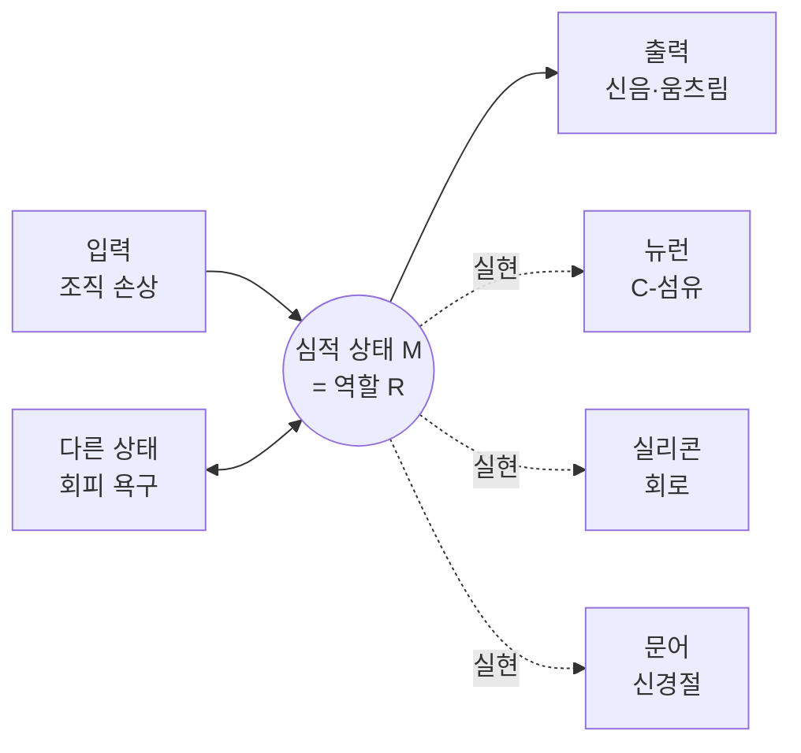

# 🧩 기능주의의 핵심 주장 — 마음은 소프트웨어인가

> **Psyche L0** · Chapter 4: 기능주의 · 문서 1/5
> 마음 상태는 어떤 물질로 만들어졌느냐가 아니라, 입력·다른 상태·출력 사이에서 어떤 *역할*을 하느냐로 정의된다.

기능주의(functionalism)는 20세기 후반 심리철학을 지배한 입장이며, 동시에 인지과학과 인공지능 연구의 암묵적 작업가설이다. 그 핵심 슬로건은 단순하다. "마음은 두뇌가 *하는 일*이다(The mind is what the brain does)." 통의 재질이 아니라 통의 기능, 하드웨어가 아니라 소프트웨어. 이 장 전체가 이 한 줄의 약속과 그 한계를 추적한다.

---

## 🎯 핵심 질문

심신 동일론(physicalism, 3장)은 "고통 = C-섬유 발화"처럼 마음 상태를 특정한 물리적 상태와 동일시했다. 그러나 곧바로 반론이 제기됐다. 문어도 고통을 느끼고, 화성인도, 어쩌면 미래의 실리콘 로봇도 고통을 느낄 수 있을 텐데, 그들에게는 C-섬유가 없다. 그렇다면 고통은 C-섬유와 *동일할 수 없다*. 동일론이 너무 **편협(chauvinistic)**하다는 것이다.

여기서 기능주의의 핵심 질문이 솟아난다.

> **마음 상태를 정의하는 것은 그것의 물리적 *구성*인가, 아니면 그것이 체계 안에서 수행하는 *역할*인가?**

기능주의의 답은 단호하다. 역할이다. 고통이란 "조직 손상이라는 입력에 의해 유발되고, 회피·신음·불안 같은 출력을 산출하며, 다른 심적 상태(예: 고통을 멈추고 싶다는 욕구)와 인과적으로 연결되는 그 무엇"이다. 이 역할만 채워진다면, 그것을 채우는 것이 탄소든 실리콘이든 상관없다.

부수적 질문이 따라온다. 그렇다면 마음을 이해한다는 것은 그 *기능적 조직(functional organization)*을 기술하는 것으로 충분한가? 만약 그렇다면, 마음은 원리상 컴퓨터 프로그램처럼 명세될 수 있다 — 이것이 "마음은 소프트웨어인가"라는 이 장의 제목이 묻는 바다.

## 🌍 어디서 마주치나

기능주의는 추상적 이론이 아니라 우리가 매일 쓰는 사고방식이다.

- **공학·일상 어휘**: "이 부품의 *기능*은 무엇인가?"라고 물을 때 우리는 이미 기능주의자다. 심장은 "피를 펌프질하는 것"으로 정의되지, "이 특정한 근육 덩어리"로 정의되지 않는다. 인공 심장도 같은 역할을 하면 심장이다.
- **소프트웨어**: 같은 워드프로세서가 인텔 칩에서도, ARM 칩에서도, 가상머신에서도 돈다. 프로그램의 정체성은 실행되는 물리적 기판과 무관하다. 기능주의는 이 직관을 마음에 적용한다.
- **인지과학의 실무**: 기억을 "부호화–저장–인출"이라는 정보처리 단계로 모형화할 때, 연구자는 뉴런의 화학을 미루어 두고 *기능적 흐름도*를 그린다. 이는 곧 기능주의적 기술이다.
- **법·윤리의 직관**: 우리가 "고통을 느낄 수 있는 존재"에게 도덕적 지위를 부여할 때, 그 기준은 특정 신경 구조가 아니라 고통의 *기능적 역할*을 수행하는가다. 동물 복지 논쟁이 그 예다.

이처럼 기능주의는 학계 바깥에서도 끊임없이 마주치는 "역할이 곧 정체성"이라는 사고의 철학적 정련판이다.

## 🔍 직관의 함정

기능주의를 둘러싼 가장 흔한 오해 세 가지를 미리 걷어내자.

**함정 1: "기능주의는 물질이 중요하지 않다고 말한다."** 정확히는 아니다. 기능주의는 *어떤* 물질이든 좋다고 말할 뿐, 물질이 *없어도* 된다고 말하지 않는다. 역할은 반드시 무언가에 의해 *실현(realize)*되어야 한다. 추상적 역할이 허공에서 작동하지는 못한다. 기능주의는 이원론이 아니라 물리주의의 한 *세련된 변종*이다.

**함정 2: "행동주의와 같다."** 행동주의(behaviorism)는 마음 상태를 입력→출력의 성향으로만 정의했다. 그래서 "내적 상태들 사이의 인과 관계"를 다룰 수 없었다(예: 욕구와 믿음이 결합해 행동을 낳는 구조). 기능주의는 결정적으로 *내적 상태들 사이의 인과적 그물망*을 인정한다. 출력만이 아니라 "다른 상태와의 연결"이 정의의 일부다. 이것이 행동주의에 대한 진보다.

**함정 3: "기능적으로 같으면 무조건 의식도 같다."** 이것은 기능주의의 *결론*이지 자명한 전제가 아니다. 바로 이 지점에서 감각질 반론(4문서)이 칼을 들이댄다. 직관적으로 우리는 "역할은 같아도 *느낌*은 다를 수 있지 않나?"라고 의심한다. 이 의심이 정당한지가 이 장 후반부의 핵심 쟁점이다.

## ⚙️ 논증 구조

기능주의의 핵심 논증은 **다중 실현 가능성(multiple realizability)**에서 동일론을 무너뜨리고 자신을 세운다. 퍼트넘(Hilary Putnam)의 1967년 논변을 형식화하면 다음과 같다.

1. **(전제)** 만약 심적 상태 $M$이 물리적 상태 $P$와 동일하다면($M = P$), $M$을 가진 모든 존재는 $P$를 가져야 한다. (동일성의 라이프니츠 법칙)
2. **(전제)** 그러나 인간, 문어, 가상의 화성인, 미래의 로봇은 서로 다른 물리적 구조 $P_1, P_2, P_3, \ldots$를 가지면서도 *같은* 심적 상태 $M$(예: 고통)을 가질 수 있다.
3. **(소결론)** 그러므로 $M$은 어떤 단일한 $P_i$와도 동일하지 않다. $M = P$는 거짓이다. $\square$ (반동일론)
4. **(전제)** 그런데 이 다양한 $P_1, P_2, \ldots$가 공유하는 것이 있다. 바로 *같은 인과적 역할 $R$*이다.
5. **(결론)** 그러므로 $M$을 정의하는 것은 물리적 구성이 아니라 인과적 역할 $R$이다. $M$은 *역할 $R$을 수행하는 그 무엇*이다. $\square$ (기능주의)

이를 다듬은 두 갈래가 있다.

- **루이스(David Lewis)의 분석적 기능주의**: 심적 용어들을 우리의 상식 심리학(folk psychology)이 부여하는 인과적 역할로 정의한다. "고통"이란 상식 이론이 고통에게 할당한 역할을 점유하는 상태다. 램지 문장(Ramsey sentence) 기법으로 모든 심적 용어를 한꺼번에 정의한다.
- **퍼트넘의 기계 기능주의(machine functionalism)**: 마음을 *튜링 기계의 기계표(machine table)*에 비유한다. 심적 상태 = 기계의 내부 상태. 각 상태는 "현재 입력 + 현재 상태 → 출력 + 다음 상태"라는 표로 명세된다.

핵심 구조는 **역할 점유자(role vs. occupant) 구분**이다. 역할은 추상적·다중 실현 가능하고, 점유자는 구체적·물리적이다. 마음은 역할 수준에서 정의된다.

## 🧪 증거와 사고실험

**다중 실현의 경험적 정황.** 진화는 같은 기능을 거듭 재발명한다. 눈은 척추동물, 두족류, 곤충에서 *독립적으로* 진화했고 그 광수용 구조는 제각각이다. 그럼에도 모두 "시각"이라는 같은 기능을 실현한다. 만약 시각조차 다중 실현된다면, 고통이나 믿음이 그렇지 못할 이유가 없다. 이는 사고실험이 아니라 생물학적 사실에 가깝다.

**퍼트넘의 문어 사례.** 문어의 신경계는 포유류와 진화적으로 멀고 화학·구조가 다르다. 그럼에도 우리는 문어가 통증을 회피하고 학습한다고 자연스럽게 말한다. 동일론자가 "그것은 *진짜* 고통이 아니다"라고 우긴다면, 그는 고통의 기준을 자의적으로 인간 신경에 못 박는 편협함에 빠진다.

**라이프니츠의 방앗간(예고편).** 라이프니츠는 사고를 하는 기계를 거대하게 확대해 방앗간처럼 그 안을 걸어 다닌다고 상상했다. 톱니와 지렛대만 보일 뿐 "지각"은 어디에도 없다고 그는 말했다. 기능주의자는 답한다 — 지각은 *부품*에 있는 것이 아니라 부품들의 *조직된 활동*에 있다고. 같은 직관이 뒤에서 설(Searle)의 중국어 방으로, 블록(Block)의 중국 두뇌로 변주된다(2·4문서).

**램지화 사고실험.** 루이스를 따라, 상식 심리학의 모든 진술을 한데 모아 심적 용어들을 변항으로 치환해 보라. "$x$가 있어서, 손상이 $x$를 유발하고, $x$가 회피 행동을 낳으며…"라는 거대한 존재 문장이 남는다. 이 변항을 채우는 것이 무엇이든 그것이 곧 고통이다. 이 형식적 절차가 "역할이 곧 정의"라는 주장을 명료히 한다.

## 🌉 설명적 간극

기능주의는 동일론의 *편협함*을 멋지게 치료하지만, 곧장 새로운 간극을 연다. 역할을 명세하는 데 쓰이는 어휘는 *인과적·관계적·구조적*이다. 입력, 출력, 상태 전이 — 모두 "무엇이 무엇을 한다"는 3인칭 언어다. 그런데 고통에는 그 모든 인과적 사실에 더해 *아픈 느낌*, 즉 현상적 질(phenomenal quality)이 있는 듯하다.

여기서 결정적 물음이 생긴다.

> 역할은 같은데 *느낌*이 다르거나 아예 없을 수 있는가?

만약 "그렇다"면, 느낌은 역할로 환원되지 않고 기능적 기술 *바깥으로* 새어 나간다. 이것이 기능주의의 설명적 간극이며, 이 장 4·5문서의 표적이다. 기능주의는 *인과적 마음*(믿음·욕구·지각의 정보처리)에 대해서는 거의 무적이지만, *현상적 마음*(느낌의 질)에 대해서는 처음부터 빚을 안고 출발한다.

미리 경계선을 그어두자. 기능주의의 강점 영역은 **인지(cognition)**, 약점 영역은 **경험(experience)**이다. 이 경계의 정확한 위치를 찾는 것이 이 장의 임무다.

## 🧬 횡단 원리

기능주의가 작동하는 깊은 원리는 **추상화 계층(levels of abstraction)**이다. 같은 현상을 여러 층위에서 기술할 수 있고, 각 층위는 아래 층위에 *수반(supervene)*하되 그것으로 *환원되지 않는다*. 소프트웨어는 하드웨어에 수반하지만, 정렬 알고리즘을 "전압의 패턴"으로 환원해 설명하면 핵심을 놓친다.

이 원리는 도처에서 재발견된다.

- **계산이론**: 같은 알고리즘이 여러 기계에서 실현된다(처치–튜링).
- **생물학**: 같은 기능이 여러 해부 구조로 실현된다(수렴 진화).
- **경제학**: "화폐"는 조개껍데기, 금, 종이, 비트열로 실현된다.

따라서 기능주의의 횡단 원리는 이렇게 정식화된다.

> **실현 독립성 원리**: 어떤 체계의 본질적 동일성은 *무엇으로 만들어졌는가*가 아니라 *어떤 조직을 갖는가*에 있다.

이 원리는 다음 장 computation-representation으로 직결된다. 마음이 역할로 정의된다면, 그 역할은 결국 *정보를 처리하고 표상하는* 역할일 것이기 때문이다. 기능주의는 계산주의로 가는 문이다.

## 🪞 1인칭

3인칭에서 기능주의는 흠잡을 데 없어 보인다. 그러나 1인칭으로 시선을 돌리면 묘한 잔여가 남는다. 지금 내가 느끼는 이 두통 — 그 욱신거림은 "회피 욕구를 유발하고 신음을 낳는 상태"라는 명세를 *완전히* 채우는가? 명세를 다 읽어도 욱신거림 자체는 그 문장 어디에도 적혀 있지 않은 것 같다.

여기에 1인칭의 도전이 있다. 나는 내 고통을 *역할로* 아는 것이 아니라 *직접 겪어서* 안다. 기능적 정의는 고통을 바깥에서 묶는 그물이지, 안에서 사는 경험이 아니다. 기능주의자는 이렇게 응수할 수 있다 — "당신이 '직접 겪는다'고 느끼는 그것조차, 자기 상태를 모니터링하는 또 하나의 *기능적 역할*(내성)일 뿐"이라고. 이 응수가 충분한지가 4·5문서의 1인칭 전투의 핵심이다.

지금은 단지 긴장을 명확히 기록해 두자. 기능주의는 마음의 *인과적 골격*을 훌륭히 잡아내지만, 그 골격에 *살아 있는 느낌의 살*이 붙어 있는지는 1인칭에서만 검증 가능하고, 바로 그래서 논쟁적이다.

## 📐 예측·반증

좋은 철학 이론은 경험적 결과와 만난다. 기능주의가 거는 예측과 그 반증 조건은 이렇다.

**예측 1.** 인간의 인지 기능을 충분히 정밀하게 기능적으로 명세하면, 그것을 다른 기판(예: 디지털 컴퓨터)에서 재현할 수 있어야 한다. → 인공지능이 인간 수준의 언어·추론·계획을 보인다면 기능주의에 유리한 정황.

**예측 2.** 같은 인지 기능이 종(種)을 가로질러 서로 다른 신경 구조로 실현되어야 한다. → 비교신경과학에서 다중 실현이 관찰되면 지지.

**반증 조건 1 (좁은 실현).** 만약 특정 심적 상태가 *오직 하나의* 물리적 구조로만 실현 가능함이 밝혀진다면(예: 의식은 미세소관의 특정 양자 과정 없이는 불가능), 다중 실현 논변은 약화된다.

**반증 조건 2 (역전·부재 감각질).** 만약 기능적으로 동일하면서 감각질이 다르거나 부재한 사례가 정합적으로 성립함이 입증된다면, "역할 = 마음 전부"라는 강한 기능주의는 반증된다(4문서, 블록의 부재 감각질).

기능주의의 강점은 *시험 가능성*이다. 그것은 신학적 가정이 아니라, AI와 신경과학의 진척에 의해 강화되거나 약화될 수 있는 작업가설이다.

## 🤔 다음 질문

기능주의가 "마음은 역할"이라고 선언했다면, 곧바로 검증의 문제가 따른다. 우리는 어떻게 어떤 체계가 *실제로* 그 역할을 채우는지 — 즉 진짜 마음을 가지는지 — 알 수 있는가? 행동만 보면 충분한가?

튜링은 "행동이 충분하다"고 답했고(튜링 테스트), 설은 "행동은 *이해*를 보장하지 못한다"고 반격했다(중국어 방). 통사론(syntax)을 아무리 정교하게 조작해도 의미론(semantics)은 나오지 않는다는 것이다. 다음 문서는 이 전투로 들어간다. 기능주의의 검증 가능성과 그 한계가 여기서 시험대에 오른다.

---

🧩 **Principle** — 마음 상태는 물리적 구성이 아니라 입력·내적 상태·출력 사이의 인과적 *역할*로 정의되며, 따라서 다중 실현 가능하다.

🌉 **Boundary** — 역할 어휘는 인과적·관계적이다. 인과적 마음(인지)은 잘 잡아내지만, 현상적 마음(느낌의 질)이 역할로 환원되는지는 미결로 남는다.

🪞 **Experience** — 1인칭의 고통은 명세된 역할로 *직접 겪지* 않고 안에서 산다. 이 잔여가 후속 감각질 논쟁의 불씨다.

## 📝 연습문제

<b>기초</b> — 다중 실현 가능성이란 무엇이며, 왜 동일론에 위협이 되는가?

**문제.** "다중 실현 가능성"을 한 문장으로 정의하고, 그것이 "고통 = C-섬유 발화"라는 동일론 명제를 어떻게 반박하는지 단계적으로 설명하라.

**해설:** 다중 실현 가능성이란 *하나의 심적 상태가 서로 다른 여러 물리적 구조로 실현될 수 있다*는 주장이다. 반박은 라이프니츠의 동일성 법칙에 기댄다. 만약 고통 $=$ C-섬유 발화라면, 고통을 가진 모든 존재는 C-섬유를 가져야 한다. 그러나 문어·화성인·로봇은 C-섬유 없이도 고통을 가질 수 있다(전제). 그러므로 고통 $\neq$ C-섬유 발화다. 동일성은 양방향이어야 하는데, 다중 실현은 그 한 방향(모든 고통→C-섬유)을 깨뜨린다. 이로써 동일론은 너무 편협하다고 비판되고, 그 자리를 "여러 구조가 공유하는 역할"로 마음을 정의하는 기능주의가 차지한다.

<b>심화</b> — 기능주의는 행동주의와 무엇이 다른가?

**문제.** 기능주의가 행동주의의 어떤 결함을 교정하는지, "내적 상태들 사이의 인과 관계"라는 개념을 사용해 설명하라. 구체적 예를 들라.

**해설:** 행동주의는 심적 상태를 *입력→출력 성향*으로만 정의해, 내적 상태들 간의 인과 그물망을 다루지 못한다. 그 결과 같은 행동도 서로 다른 내적 구성에서 나올 수 있음을 설명 못 한다. 예컨대 "우산을 챙긴다"는 출력은 "비가 올 거라는 *믿음*"과 "젖기 싫다는 *욕구*"의 결합에서 나온다. 믿음만으로도, 욕구만으로도 그 행동이 나오지 않는다. 행동주의는 이 결합 구조를 출력 성향만으로 환원하려다 무한 후퇴에 빠진다(믿음을 행동으로 정의하려면 또 다른 욕구가 전제됨). 기능주의는 믿음·욕구·지각을 *서로를 정의항으로 삼는 인과적 그물*로 한꺼번에 정의(전체론적, 램지 문장)함으로써 이 문제를 푼다. 핵심 진보는 "출력만이 아니라 다른 심적 상태와의 인과 연결"을 정의의 일부로 들인 데 있다.

<b>논문 비평</b> — 퍼트넘 「심적 상태의 본성」(1967)의 논증을 비판적으로 평가하라

**문제.** 퍼트넘의 다중 실현 논변은 기계 기능주의를 확립하는 데 성공하는가? 논변의 강점과, 퍼트넘 자신이 후일 제기한 반성(기능주의 포기)을 고려해 평가하라.

**해설:** 퍼트넘의 논변은 *반동일론* 단계에서는 매우 강력하다. 다중 실현이 경험적으로 그럴듯하므로 유형 동일론(type identity)은 방어하기 어렵다. 그러나 *기능주의 확립* 단계는 더 약하다. (1) 다중 실현된 상태들이 공유하는 것이 반드시 "단일한 기능적 역할"이라는 보장이 없다 — 그것들은 단지 막연한 유사성의 가족일 수도 있다(키처·소버의 비판). (2) 기계표 기능주의는 각 체계가 *정확히 하나의* 기계표로 기술된다고 가정하나, 같은 체계가 여러 추상화 수준에서 여러 표로 기술될 수 있어 상태 개별화가 모호해진다. (3) 결정적으로, 퍼트넘 자신이 1980년대에 *외재주의*(의미는 머릿속에만 있지 않다, "쌍둥이 지구")와 다중 실현의 무한 확장을 근거로 기능주의를 포기했다 — 마음의 동일성이 환경·역사에 의존한다면 순수 내적 기능표로는 마음을 명세할 수 없다. 종합하면, 논변은 동일론에 대한 *파괴적* 무기로는 성공하나, 기능주의에 대한 *건설적* 토대로는 그 창시자에게서조차 흔들린다. 그럼에도 인지과학의 작업가설로서의 실용적 위력은 이 형이상학적 의심과 별개로 유지된다(3문서에서 다룸).

[◀ 이전: 물리주의의 반론](../ch3-physicalism/05-physicalist-replies.md) · [📚 README](../README.md) · [다음: 튜링 테스트를 넘어서 ▶](./02-beyond-turing-test.md)

