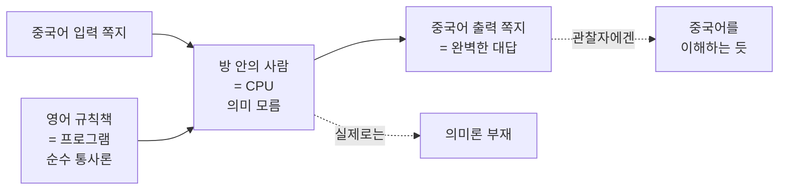

# 🗣️ 튜링 테스트를 넘어서 — 기호 조작은 이해인가

> **Psyche L0** · Chapter 4: 기능주의 · 문서 2/5
> 행동이 같으면 마음도 같은가? 튜링은 그렇다 했고, 설은 통사론은 의미론을 낳지 못한다고 반격했다.

기능주의가 "마음은 역할"이라고 선언하면, 검증의 질문이 즉시 따라온다. *어떤 체계가 그 역할을 정말로 채우는지를 우리는 어떻게 아는가?* 튜링은 행동으로 충분하다는 대담한 답을 내놓았고, 설은 행동(기호 조작)이 *이해*를 보장하지 못한다는 강력한 반례로 맞섰다. 이 문서는 행동주의적 검증의 한계를 추적하며 통사론과 의미론의 간극을 드러낸다.

---

## 🎯 핵심 질문

1950년 튜링(Alan Turing)은 "기계가 생각할 수 있는가?"라는 모호한 질문을 *조작 가능한* 질문으로 바꿨다. "기계가 인간 심문자를 속여 자신을 인간으로 믿게 만들 수 있는가?" 이것이 모방 게임, 곧 튜링 테스트다. 핵심 통찰은 기능주의적이다 — 사고의 *내부 재질*은 검증 불가능하니, 검증 가능한 *행동적 역할*로 질문을 옮기자.

그러나 여기서 이 문서의 핵심 질문이 갈라진다.

> **올바른 입출력 행동을 산출하는 것이, 그 행동의 배후에 *이해*가 있음을 보장하는가?**

기능주의의 강한 판본은 "그렇다"고 답해야 한다. 만약 어떤 체계가 모든 인지적 입출력 역할을 완벽히 채운다면, 정의상 그것은 이해하는 것이다. 설(John Searle)은 1980년 중국어 방 논변으로 "아니다"라고 답한다. 기호를 규칙에 따라 조작하는 것(통사론, syntax)은 그 기호가 *무엇을 의미하는지 아는 것*(의미론, semantics)과 전혀 다르다는 것이다.

## 🌍 어디서 마주치나

이 논쟁은 오늘날 가장 뜨겁게 현실화되어 있다.

- **대형 언어 모델**: 챗봇이 유창하게 대화한다. 그것은 *이해*하는가, 아니면 통계적으로 다음 토큰을 예측하는 거대한 기호 조작기인가? 이는 중국어 방 논쟁의 직계 후손이다. 비판자들은 "확률적 앵무새"라 부르고, 옹호자들은 "기능이 충분히 풍부하면 이해가 창발한다"고 말한다.
- **AI 평가 벤치마크**: 우리는 모델을 시험 점수, 대화 자연스러움 등 *행동*으로 평가한다. 이는 튜링의 유산이다. 그러나 벤치마크 통과가 진짜 능력의 보증인가, 아니면 시험에 대한 과적합인가?
- **의료·법의 자동화**: 진단 시스템이 옳은 출력을 낸다면, 우리는 그것이 의학을 "이해"하는지 따질 필요가 있는가, 아니면 신뢰성만 따지면 되는가? 실무에서 우리는 종종 기능주의자처럼 행동한다.
- **동물·영아의 마음**: 말 없는 존재의 마음을 우리는 *행동*으로 추론한다. 튜링 테스트의 정신은 타자의 마음 일반에 대한 우리의 일상적 추론과 같은 구조다.

## 🔍 직관의 함정

**함정 1: "튜링 테스트는 지능의 정의다."** 튜링 자신은 그렇게 주장하지 않았다. 그는 테스트를 지능의 *충분조건*이나 *정의*로 못 박지 않고, "생각할 수 있는가"라는 형이상학적 질문을 *실용적 대체물*로 바꾸자고 제안했다. 테스트를 정의로 오해하면 기능주의를 과장하게 된다.

**함정 2: "중국어 방은 AI가 불가능함을 증명한다."** 아니다. 설은 *강한 AI*(프로그램 실행 자체가 마음을 *구성한다*는 주장)를 공격할 뿐, 기계가 마음을 가질 가능성 전체를 부정하지 않는다. 그는 오히려 "두뇌는 기계이고 마음을 가진다"고 인정한다. 표적은 "통사론만으로 의미론이 나온다"는 명제다.

**함정 3: "방 안의 사람이 중국어를 모르니까 방도 모른다."** 이것이 그 유명한 **체계 응답(systems reply)**의 표적이다. 설의 비판자들은 "이해하는 것은 *방 전체 체계*이지 그 안의 사람(CPU)이 아니다"라고 반박한다. 사람만 보고 결론을 내리는 것은 부분의 무지를 전체에 잘못 귀속하는 합성의 오류일 수 있다. 이 논쟁의 핵심이 바로 여기에 있으니, 한쪽 직관만 붙들지 말 것.

## ⚙️ 논증 구조

**튜링의 논증(행동주의적 검증).**

1. 사고의 내부 상태는 1인칭에서만 접근 가능하고 3인칭에서 직접 검증 불가능하다.
2. 우리는 타인이 생각한다는 것조차 그 *행동*으로부터 추론한다(타자의 마음).
3. 그러므로 기계에 대해서도 같은 기준을 적용하는 것이 공정하다. 행동이 인간과 구별 불가능하면, 사고를 부정할 근거가 없다.
4. **결론**: 모방 게임을 통과하는 기계에게 사고를 귀속하는 것이 합리적이다. $\square$

**설의 반논증(중국어 방).**

1. 나(설)는 중국어를 전혀 모른 채 방 안에 있다. 중국어 기호가 적힌 입력 쪽지가 들어온다.
2. 나는 영어로 된 규칙책을 따라 기호의 *모양*만 보고 출력 쪽지를 골라 내보낸다.
3. 외부 관찰자에게 이 방은 중국어를 완벽히 이해하는 것처럼 보인다(튜링 테스트 통과).
4. 그러나 나는 그 어떤 중국어 단어의 *의미*도 모른다. 나는 순수히 통사적 조작만 했다.
5. 방은 디지털 컴퓨터와 형식적으로 동일하다(프로그램 = 규칙책, 데이터 = 기호, CPU = 나).
6. **결론**: 그러므로 형식적 기호 조작(통사론)만으로는 이해(의미론)가 발생하지 않는다. 강한 AI는 거짓이다. $\square$

설의 핵심 명제는 압축하면 이렇다.

> **통사론은 의미론에 대해 충분하지 않다(Syntax is not sufficient for semantics).**

이를 형식 논변으로 정리하면: (전제 1) 프로그램은 순수히 통사적으로 정의된다. (전제 2) 마음은 의미적 내용을 가진다. (전제 3) 통사론은 의미론을 구성하지도 보장하지도 못한다. ∴ 프로그램 실행만으로 마음은 구성되지 않는다. $\square$

## 🧪 증거와 사고실험

**체계 응답과 설의 재반박.** 비판자: "이해하는 것은 사람이 아니라 사람+규칙책+방 전체다." 설의 응수: "좋다, 그럼 내가 규칙책을 *통째로 외워서* 방 없이 머릿속에서 다 처리한다고 하자. 이제 체계 전체가 곧 나다. 그래도 나는 여전히 중국어를 한 마디도 이해하지 못한다." 이로써 그는 부분/전체 구분으로 빠져나가는 길을 차단하려 한다. (반론자들은 이 *내면화*가 정말로 동일한 체계를 만드는지 의심한다.)

**로봇 응답과 재반박.** 비판자: "방에 카메라·팔을 달아 세계와 인과적으로 연결하면 기호가 *접지(grounding)*되어 의미를 얻는다." 설의 응수: "그 감각 입력조차 결국 또 다른 기호 쪼가리로 방에 들어올 뿐이고, 나는 여전히 모양만 본다." 그러나 이 응답이 가장 취약하다고 보는 이들이 많다 — 의미가 *세계와의 인과 관계*에서 온다면(인과적 의미론), 접지된 로봇은 통속의 방과 다르다.

**두뇌 시뮬레이터 응답.** 비판자: "중국어 화자의 *뉴런 발화 패턴*을 정확히 시뮬레이션하면?" 설: "그럼 물 파이프와 밸브로 그 패턴을 구현한 거대 장치를 상상하라 — 파이프 더미가 중국어를 이해한다고 믿을 수 있는가?" 이 응답은 직관을 자극하지만, 기능주의자는 "조직만 같다면 파이프든 뉴런이든 이해한다"고 물러서지 않는다(1문서의 다중 실현).

**경험적 정황(LLM).** 오늘날 언어 모델은 번역·요약·추론에서 인상적 수행을 보인다. 한편 명백한 의미 이해 실패(기초 산수, 부정 처리, 환각)도 보인다. 양측 모두 이를 자기 진영의 증거로 읽는다. 중국어 방은 사고실험이지만, 그 검증은 실제 시스템에서 진행 중이다.

## 🌉 설명적 간극

튜링과 설의 충돌은 기능주의의 간극을 정밀하게 드러낸다. 기능주의는 마음을 *역할*로 정의한다. 그런데 역할은 통사적·인과적 언어로 명세된다. 설은 묻는다 — 그 언어로 명세된 모든 것을 채워도, *의미적 내용*과 *주관적 이해*라는 잔여가 남지 않는가?

여기서 간극이 두 갈래로 갈린다.

- **지향성(intentionality)의 간극**: 기호가 *무언가에 관한 것*이 되는 일(aboutness)이 순수 형식 조작에서 나오는가? 설은 아니라 한다. 이는 의미론의 간극이다.
- **현상성(phenomenality)의 간극**: 이해에 동반하는 *이해하는 느낌*, 곧 의식이 역할에서 나오는가? 설은 진짜 지향성은 의식적 두뇌의 인과력에 뿌리박는다고 본다. 이는 4문서의 감각질 간극으로 이어진다.

튜링 테스트의 깊은 한계가 여기 있다. 그것은 *행동의 동등성*만 검사할 뿐, 그 행동을 떠받치는 것이 진짜 이해인지 정교한 모방인지 구별할 *원리적 수단*을 갖지 못한다. 행동주의적 검증은 간극의 *존재 자체*에 눈을 감는다.

## 🧬 횡단 원리

이 충돌의 횡단 원리는 **형식과 내용의 구분(form vs. content)**이다. 어떤 체계의 형식적·구문적 구조를 완전히 명세하는 것과, 그 구조가 *무엇에 관한 것인지*를 명세하는 것은 다른 차원의 일이다.

- **수학·논리**: 형식 체계는 기호의 모양과 변형 규칙만으로 정의된다. 그 기호에 해석(모형)을 부여하는 일은 별도다. 같은 공리계가 여러 모형을 가진다.
- **언어학**: 통사론(문장이 어떻게 구성되는가)과 의미론(문장이 무엇을 뜻하는가)은 구분된 층위다.
- **컴퓨터**: 프로그램은 순수 통사적 객체다. 그것이 "은행 잔고"를 뜻하는지 "체스 말"을 뜻하는지는 외부 해석에 달렸다.

따라서 횡단 원리는 이렇게 정식화된다.

> **통사론–의미론 비대칭 원리**: 형식적 구조의 완전한 명세는 의미적 내용을 *결정하지 않는다*. 의미는 구조 위에 무언가를 더 요구한다(인과적 접지, 사용, 또는 의식).

이 원리가 참이라면 강한 기능주의는 곤경에 처하고, 거짓이라면(의미가 충분히 풍부한 기능적 역할에서 창발한다면) 설의 논변은 미끄러진다. 이것이 다음 층위 L3 computational-mind로 넘기는 핵심 쟁점이다.

## 🪞 1인칭

중국어 방의 설득력은 전적으로 1인칭에 있다. 설이 "*나는* 그 의미를 전혀 모른다"고 말할 때, 그 증언의 무게는 내성적 자명함에서 온다. 우리는 영어 문장을 읽을 때 *이해함*을 직접 안다. 그리고 모양만 보고 규칙대로 쪽지를 고르는 일에는 그 이해가 *없음*을 직접 안다. 이 1인칭 대비가 논변의 엔진이다.

그러나 바로 이것이 약점이기도 하다. 1인칭 직관은 *부분*(나=CPU)에 대한 것이지 *전체 체계*에 대한 것이 아닐 수 있다. 내가 어떤 과정의 한 부품일 때, 그 전체가 무엇을 이해하는지를 나의 부품적 시점에서 보고할 자격이 있는가? 위장의 세포는 소화를 "이해"하지 못하지만 위는 소화한다. 1인칭 보고의 권위가 여기까지 미치는지가 관건이다.

기능주의자의 1인칭 응수: "당신이 중국어를 *이해할 때* 느끼는 그 '이해함'조차, 두뇌의 어떤 하위 모듈이 다른 모듈의 처리 결과에 접근하는 *기능적 사건*일 뿐이다. 그 느낌을 의미론의 증거로 쓰는 것은 선결문제 요구다." 1인칭의 자명함과 기능주의의 환원 사이의 이 팽팽함이 다음 문서들로 이어진다.

## 📐 예측·반증

**튜링 진영의 예측.** 기능적 조직이 충분히 풍부해지면, 시스템은 의미 의존적 과제(맥락 추론, 함의 이해, 새로운 상황으로의 일반화)에서도 인간과 구별 불가능해진다. → LLM의 능력이 단순 패턴 매칭을 넘어 *체계적 일반화*로 확장되면 튜링 진영에 유리.

**설 진영의 예측.** 아무리 행동이 정교해도, 진짜 이해가 없는 시스템은 *접지의 부재*에서 오는 체계적 실패(맥락 밖 적용, 상식의 부재, 의미 없는 환각)를 드러낸다. → 그런 실패가 규모를 키워도 *원리적으로* 사라지지 않으면 설 진영에 유리.

**반증 조건.** 튜링 테스트 자체는 *원리적으로* 이해와 모방을 구별 못 하므로, 순수 행동 테스트로는 어느 쪽도 결정적으로 반증되지 않는다 — 이것이 테스트의 근본 한계다. 진전은 행동을 넘어 *내부 메커니즘*(표상이 인과적으로 세계에 접지되어 있는가, 일반화의 구조가 의미적인가)을 검사하는 기준을 요구한다. 즉 이 논쟁의 해결은 "더 나은 튜링 테스트"가 아니라 *의미론의 자연주의적 이론*을 요구한다.

## 🤔 다음 질문

설의 반론이 기능주의의 *형이상학적* 야심(통사론만으로 진짜 마음이 구성된다)에 흠집을 냈다 하더라도, 한 가지는 흔들리지 않는다 — 기능적·계산적 기술이 인지를 설명하는 데 *실용적으로 어마어마하게* 강력하다는 사실이다. 인지과학과 AI는 매일 기능적 흐름도로 마음을 모형화하며 성공을 거둔다.

그렇다면 다음 질문은 이것이다. 기능주의는 형이상학적 한계와 무관하게, *어디까지* 마음을 성공적으로 설명하는가? 그 성공의 정확한 영역은 어디인가? 다음 문서는 기능주의의 빛나는 성공 영역 — 인지 — 으로 들어간다.

---

🧩 **Principle** — 행동적 동등성(튜링 테스트)은 검증 가능하지만, 통사적 조작만으로 의미적 이해가 구성되는지는 보장하지 못한다(통사론 ≠ 의미론).

🌉 **Boundary** — 행동 테스트는 정교한 모방과 진짜 이해를 원리적으로 구별하지 못한다. 해결은 의미가 어떻게 세계에 접지되는지의 이론을 요구한다.

🪞 **Experience** — 중국어 방의 힘은 "나는 의미를 모른다"는 1인칭 자명함에서 온다. 그 권위가 부분에서 전체로 이전 가능한지가 쟁점이다.

## 📝 연습문제

<b>기초</b> — 튜링 테스트가 검사하는 것과 검사하지 못하는 것을 구별하라.

**문제.** 튜링 테스트가 무엇을 측정하는지, 그리고 그것이 "이해"를 측정한다고 말할 수 없는 이유를 설명하라.

**해설:** 튜링 테스트는 *행동적 구별 불가능성* — 즉 시스템의 입출력 패턴이 인간 심문자에게 인간의 것과 구별되지 않는가 — 를 측정한다. 그것은 3인칭에서 접근 가능한 *역할 수행*의 검사다. 그러나 이해는 의미적 내용과 주관적 파악을 포함하는데, 두 시스템이 같은 입출력을 내면서 하나는 이해하고 다른 하나는 통사적으로 모방만 할 수 있다(중국어 방의 가능성). 테스트는 출력만 보므로 이 두 경우를 원리적으로 구별하지 못한다. 따라서 테스트는 *행동적 능력*의 증거는 되지만 *이해의 보증*은 아니다. 튜링 본인도 그것을 정의가 아닌 실용적 대체물로 제안했다.

<b>심화</b> — 체계 응답과 설의 내면화 반박을 평가하라.

**문제.** "이해하는 것은 사람이 아니라 방 전체 체계다"라는 체계 응답을 설은 어떻게 반박하며, 그 반박은 성공하는가?

**해설:** 체계 응답은 합성의 오류를 지적한다 — CPU(사람)가 이해 못 한다고 체계 전체가 이해 못 한다고 결론지을 수 없다(위 세포가 소화 못 해도 위는 소화한다). 설의 반박은 *내면화*다. 사람이 규칙책·메모리·절차를 모두 머릿속에 외우면, 외부 방 없이 사람 자신이 전체 체계가 된다. 그래도 여전히 중국어를 이해하지 못하므로, 체계 전체에도 이해가 없다는 것이다. 평가: 반박은 깔끔해 보이나 두 약점이 있다. (1) 인간이 거대한 프로그램을 *의식적으로* 외워 실행하는 것이, 그 프로그램이 *전용 인지 아키텍처로* 구현되는 것과 같은 체계인지 의심스럽다 — 동일한 기능적 조직이 아닐 수 있다. (2) 만약 진짜로 동일한 조직이 머릿속에 구현된다면, 기능주의자는 "그렇다면 당신 안에 *당신이 의식적으로 접근 못 하는* 중국어 이해 서브체계가 생긴 것"이라 주장할 수 있고, 이는 분열뇌·무의식 처리 사례로 그럴듯해진다. 따라서 내면화 반박은 직관적으로 강력하지만 결정적이지는 않다.

<b>논문 비평</b> — 설 「마음·두뇌·프로그램」(1980)의 핵심 명제를 비판적으로 평가하라.

**문제.** 설의 "통사론은 의미론에 충분하지 않다"는 명제를 형식 논변으로 재구성하고, 그 약한 고리를 짚어라.

**해설:** 재구성: (P1) 컴퓨터 프로그램은 순수 통사적으로 정의된다. (P2) 마음은 본질적으로 의미적 내용(지향성)을 가진다. (P3) 통사론은 의미론에 충분하지 않다. ∴ 프로그램 실행만으로 마음은 구성되지 않는다. 논변은 타당(valid)하다 — 결론은 전제에서 따라 나온다. 따라서 비판은 전제 건전성에 집중해야 한다. 가장 약한 고리는 **P3**다. 설은 그것을 중국어 방 *직관*으로 뒷받침하지만, 인과적 의미론(드레츠키·밀리칸)은 의미가 표상과 세계 사이의 인과적·기능적 관계에서 자연주의적으로 발생한다고 주장한다 — 이 관계 자체가 더 넓은 기능적 조직의 일부라면, 충분히 풍부하고 *접지된* 통사적 체계에서 의미론이 창발할 수 있고 P3는 무너진다. 로봇 응답이 정확히 이 길을 연다. 둘째 약점은 **P2와 직관의 순환**이다. 설은 "진짜 지향성은 두뇌의 인과력에서만 온다"고 하지만, *왜* 두뇌의 인과력만 특권적인지(생물학적 본질주의)는 독립적 논증 없이 가정된다 — 이는 1문서의 다중 실현 정신과 충돌한다. 종합: 논변은 강한 AI의 *순진한 판본*(올바른 입출력 = 마음)에는 치명적이나, *접지된 기능주의*에는 결정적이지 않으며, 그 핵심 직관(P3)은 의미론의 자연주의 이론 앞에서 입증 책임을 지게 된다.

[◀ 이전: 기능주의의 핵심 주장](./01-functionalism-core.md) · [📚 README](../README.md) · [다음: 기능주의의 성공 ▶](./03-functionalism-success.md)

