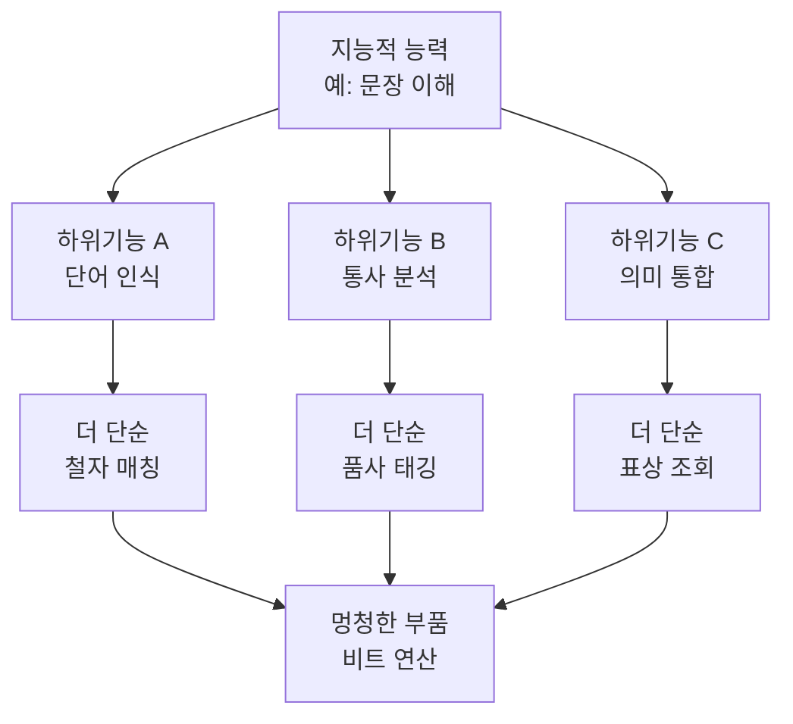

# 🛠️ 기능주의의 성공 — 인지를 설명하는 작업가설

> **Psyche L0** · Chapter 4: 기능주의 · 문서 3/5
> 형이상학적 논쟁과 무관하게, 인지과학과 AI는 마음을 기능적으로 기술함으로써 실제로 작동한다.

설의 중국어 방이 기능주의의 *형이상학적* 야심에 의문을 던졌더라도, 기능주의는 흔들림 없는 한 영역을 가진다. 바로 *인지를 설명하는 과학*으로서의 위력이다. 이 문서는 기능주의가 왜 인지과학과 AI의 사실상 표준 방법론이 되었는지, 그 성공이 어디까지 미치는지를 추적한다. 공정하게 말해, 기능주의는 20세기 마음 과학을 가능케 한 패러다임이다.

---

## 🎯 핵심 질문

철학적 기능주의는 "마음 *은* 역할이다"라고 주장한다(형이상학적 명제). 과학적 기능주의는 더 겸손하게 "마음을 역할로 *기술하면* 설명적으로 강력하다"고 말한다(방법론적 명제). 이 문서의 핵심 질문은 후자에 초점을 둔다.

> **마음을 기능적·계산적으로 기술하는 전략은 *왜* 그토록 강력하며, 그것은 마음의 어느 부분까지를 설명하는가?**

답의 골격은 이렇다. 기능적 기술은 마음을 *분해 가능한 정보처리 체계*로 보게 해주고, 이로써 마음을 신경의 세부를 기다리지 않고 *지금* 연구할 수 있게 한다. 그러나 이 성공에는 경계가 있다. 기능주의는 *인과적·정보처리적* 마음(지각·기억·추론·언어)을 눈부시게 설명하지만, *현상적* 마음(느낌의 질)에 다가가면 그 설명력이 급격히 줄어든다. 성공의 지도를 그리는 것이 이 문서의 목표다.

## 🌍 어디서 마주치나

기능주의적 설명은 마음 과학의 거의 모든 페이지에 스며 있다.

- **인지심리학**: 기억을 "감각기억–단기기억–장기기억"의 다단계 흐름으로, 주의를 "필터·자원 할당"으로 모형화한다. 모두 *기능적 상자–화살표 모형*이다.
- **계산신경과학**: 시각 피질을 "가장자리 검출 → 형태 통합 → 객체 인식"의 처리 파이프라인으로 본다. 마(Marr)의 세 수준 — 계산 수준(무엇을·왜), 알고리즘 수준(어떻게), 구현 수준(무엇으로) — 이 기능주의의 교과서적 정식이다.
- **인공지능**: 모든 AI 시스템은 정의상 기능적 명세다. 신경망은 "입력 → 변환 → 출력"의 함수이며, 그 정체성은 가중치 패턴(소프트웨어)에 있지 실행하는 GPU(하드웨어)에 있지 않다.
- **임상·진단**: 인지 장애를 "어떤 기능 모듈의 손상"으로 진단한다(예: 작업기억 결손, 실행기능 저하). 치료와 재활도 기능 회복을 겨눈다.

이처럼 기능주의는 "이론"이라기보다 마음을 다루는 *과학적 공용어*다.

## 🔍 직관의 함정

**함정 1: "과학적 성공이 형이상학적 진리를 증명한다."** 기능적 기술이 잘 작동한다는 것은 그것이 *유용*함을 보일 뿐, 마음이 *오직* 역할에 불과함을 증명하지는 않는다. 도구의 성공과 존재론적 완결성은 다른 문제다. 4·5문서가 정확히 이 틈을 파고든다.

**함정 2: "기능주의는 신경과학을 대체한다."** 정반대다. 마의 세 수준은 기능 수준과 구현 수준이 *상보적*임을 말한다. 알고리즘이 *어떻게 구현되는지*를 알면 어떤 알고리즘이 그럴듯한지에 제약이 생긴다. 좋은 기능주의는 신경과학을 무시하지 않고 그것과 맞물린다.

**함정 3: "기능적으로 기술 가능하면 곧 의식이 있다."** 호흡 조절, 혈당 항상성도 정교한 기능 체계지만 우리는 거기에 의식을 귀속하지 않는다. 기능적 복잡성은 의식의 충분조건이 아니다. 이 직관이 5문서의 경계선 논의로 이어진다.

## ⚙️ 논증 구조

기능주의가 과학적으로 강력한 이유를 논증으로 정리하면 이렇다.

1. **(전제: 분해 가능성)** 복잡한 능력은 더 단순한 하위 기능들의 조직된 협동으로 분석될 수 있다(기능적 분해, functional decomposition).
2. **(전제: 추상화)** 각 하위 기능은 그 구현과 독립적으로 *입출력 명세*로 기술될 수 있다.
3. **(전제: 동질성 다리)** 따라서 마음과 인공물은 같은 추상적 어휘(정보처리)로 기술될 수 있어, 한쪽의 통찰이 다른 쪽으로 이전된다.
4. **(소결론)** 그러므로 마음은 신경 세부를 다 알기 전에도 *기능적 모형*으로 연구·예측·구현될 수 있다.
5. **(결론)** 기능적 전략은 인지를 *설명하고 시험 가능한 모형으로 만드는* 데 강력하다. $\square$

이 논증의 엔진은 **호먼큘러스 기능주의(homuncular functionalism)**, 곧 데닛(Dennett)이 정식화한 "어리석은 호먼큘러스로의 분해"다. 지능적 전체를 점점 더 단순한 하위 행위자로 쪼개고, 마지막엔 "그저 0과 1을 더하는" 멍청한 부품에 도달한다. 이로써 *지능을 비지능적 부품으로 설명*하는 길이 열린다 — 마음을 신비가 아니라 메커니즘으로 보는 핵심 전략이다.

## 🧪 증거와 사고실험

**마의 시각 이론(성공 사례).** 데이비드 마는 시각을 세 수준으로 분석해, "가장자리 검출"이라는 계산 문제를 *왜* 풀어야 하는지(생존을 위한 형태 추출), *어떤 알고리즘*으로 푸는지(라플라시안 필터의 영점 교차), *어떤 신경 회로*가 구현하는지를 따로 다뤘다. 이 다층 기능 분석은 시각 과학의 토대가 되었고, 기능적 추상화가 *실제로 발견을 낳음*을 입증한다.

**물리 기호 체계 가설(뉴웰·사이먼).** "물리 기호 체계는 일반 지능적 행동에 충분하고도 필요한 수단이다." 이 가설 아래 고전 AI는 정리 증명·체스·계획 수립을 구현했다. 그 자체로 강한 기능주의의 경험적 베팅이며, 부분적 성공과 한계(상식·접지 문제) 모두를 낳았다.

**연결주의의 성공.** 신경망은 학습을 가중치 조정이라는 *기능적* 과정으로 구현한다. 같은 아키텍처가 이미지 인식, 언어, 게임에서 작동한다 — 다중 실현과 기능적 전략의 동시 입증이다. 오늘날의 대형 모델은 (의식 여부와 무관하게) 인지 기능 모방의 위력을 극적으로 보여준다.

**분열뇌·이중 해리(사고실험 아닌 사례).** 뇌량 절단 환자에서 좌·우반구가 독립적 기능을 보이는 현상, 그리고 특정 손상이 특정 기능만 선택적으로 망가뜨리는 *이중 해리(double dissociation)*는, 마음이 분리 가능한 기능 모듈로 조직되어 있다는 기능주의적 예측을 강력히 지지한다.

**한계의 사고실험(예고).** 그러나 블록(Block)은 "중국 두뇌"를 든다 — 13억 중국 인민이 전화로 신호를 주고받아 한 두뇌의 기능적 조직을 그대로 구현한다면, 그 *나라 전체*가 고통을 느끼는가? 직관적으로 "아니다"라면, 기능적 조직만으로는 *경험*에 충분하지 않다는 것이다. 이 사례가 다음 문서들의 핵심 반례다.

## 🌉 설명적 간극

기능주의의 성공은 정확히 그 *영역*에서 그치며, 거기서 간극이 시작된다. 마의 세 수준은 *시각 정보처리*를 멋지게 설명한다. 그러나 "빨강을 볼 때의 *그 빨강의 느낌*"은 어느 수준에도 등장하지 않는다. 계산 수준은 "파장 정보를 범주로 분류한다"고 말할 뿐, *왜 그것이 이러이러하게 느껴지는지*는 침묵한다.

여기서 경계를 정밀히 그을 수 있다.

- **기능이 설명하는 것**: 변별, 분류, 보고, 통합, 접근, 행동 제어 — 차머스(Chalmers)가 말한 의식의 "쉬운 문제들". 이들은 모두 *기능적으로 정의된 능력*이다.
- **기능이 설명하지 못하는 것**: 그 모든 기능이 *왜 주관적 경험을 동반하는가* — "어려운 문제(hard problem)". 기능적 명세를 다 채워도, "그런데 왜 거기에 무언가를 느끼는 주체가 있는가?"라는 물음이 잔여로 남는다.

따라서 기능주의의 성공은 *조건부*다. 그것은 마음을 *능력의 집합*으로 보는 한 거의 완전하지만, 마음을 *경험의 흐름*으로 보는 순간 빚을 진다. 이 빚의 정확한 규모를 다음 두 문서가 청구한다.

## 🧬 횡단 원리

기능주의의 과학적 성공을 떠받치는 횡단 원리는 **모듈성과 추상화 계층**이다.

> **분해 가능 복잡성 원리**: 충분히 조직된 복잡한 체계는 거의 독립적인 하위 기능들로 분해 가능하며, 각 수준은 그 자체의 설명 어휘를 가진다.

이 원리는 마음 너머에서도 보편적이다.

- **공학**: 복잡한 시스템은 모듈로 설계된다(관심사의 분리). 한 모듈을 바꿔도 인터페이스만 같으면 전체가 작동한다 — 다중 실현의 공학판.
- **생물학**: 세포 → 조직 → 기관 → 개체, 각 수준이 고유한 기능 어휘를 가진다. 사이먼(H. Simon)의 "거의 분해 가능한 위계"가 이를 일반화한다.
- **컴퓨터 과학**: 추상화 계층(하드웨어 → OS → 응용)이 전체 분야의 기반이다.

이 원리가 강력한 이유는 *국소적 이해가 가능*해지기 때문이다. 모든 것을 한꺼번에 알 필요 없이 한 층, 한 모듈씩 정복할 수 있다. 마음 과학의 진보는 대부분 이 전략의 산물이다. 그러나 동일한 원리가 한계도 예고한다 — 만약 *경험*이 깔끔히 모듈화되지 않는, 통합적·환원 저항적 성질이라면, 분해 전략은 바로 거기서 막힐 것이다.

## 🪞 1인칭

과학적 기능주의는 명시적으로 3인칭 기획이다. 그것은 마음을 *바깥에서* 분해하고 모형화한다. 이 외재적 시선이 그 힘의 원천이자 사각지대다.

1인칭에서 보면, 기능적 모형은 나의 인지 *능력*은 잘 그려낸다. 내가 단어를 인식하고 추론하고 기억을 인출한다는 사실은 흐름도로 충실히 재현된다. 실제로 나는 내 기억이 "삐끗"하거나 주의가 "분산"될 때, 그 기능적 고장을 1인칭에서도 알아챈다 — 모형과 경험이 만나는 지점이다.

그러나 모형이 다 그려진 뒤에도, 그것을 *읽는 나*, 그 모든 처리에 *동반하는 의식의 빛*은 흐름도 어디에도 표시되지 않는다. 기능적 설명은 "무엇이 무엇을 한다"를 완결하지만, "그것이 누구에게 어떻게 나타나는가"는 비워 둔다. 공정하게 말하면, 이는 기능주의의 *실패*라기보다 그 *기획의 경계*다. 기능주의는 능력의 과학으로서는 성공했고, 경험의 형이상학으로서는 미완이다. 다음 문서는 이 미완의 영역으로 정면 진입한다.

## 📐 예측·반증

**예측 1.** 인지 능력은 이중 해리될 것이다 — 즉 능력 A는 손상되고 B는 보존되며, 그 역도 가능하다. 이는 마음이 분리 가능한 기능 모듈로 조직됨을 함의한다. → 신경심리학에서 광범위하게 확증됨(예: 얼굴 인식 상실증과 일반 사물 인식의 해리).

**예측 2.** 같은 인지 함수는 서로 다른 기판에서 구현 가능하다. → AI가 인간 인지 과제를 비신경 하드웨어에서 수행함으로써 지지됨.

**예측 3.** 기능적 모형은 행동을 *정량적으로* 예측한다(반응 시간, 오류 패턴). → 인지 모형(ACT-R 등)이 반응 시간 분포를 예측하는 데 성공.

**반증 조건 1.** 만약 어떤 핵심 인지 능력이 *원리적으로* 기능적으로 분해 불가능함이 드러난다면(전체론적·비국소적이어서 어떤 모듈 분석도 실패), 분해 전략은 그 능력에 대해 반증된다.

**반증 조건 2.** 만약 기능적으로 완전한 시스템이 인간과 동일한 인지 행동을 내면서도 *체계적으로 다른* 내부 처리 구조를 가짐이 밝혀진다면, 특정 기능 모형은 거짓이 된다(모형 미결정성). 단, 이는 기능주의 일반이 아니라 *특정 모형*을 반증한다 — 기능주의의 시험 가능성을 보여주는 건강한 특징이다.

## 🤔 다음 질문

기능주의는 인지 — 능력으로서의 마음 — 를 설명하는 데 빛난다. 그러나 우리는 거듭 같은 잔여에 부딪혔다. 마의 모든 수준을 채워도 *빨강의 느낌*은 빠져 있고, 블록의 중국 두뇌는 모든 역할을 채워도 *느끼는 것 같지 않다*.

그렇다면 결정적 질문이 남는다. **기능이 완전히 같아도, 경험의 질은 다르거나 아예 없을 수 있는가?** 만약 그렇다면, 기능적으로 동일한 두 존재가 하나는 빨강을 빨강으로, 다른 하나는 초록으로 경험하거나(역전 감각질), 혹은 아무것도 경험하지 않을 수 있다(부재 감각질·좀비). 이것이 기능주의에 대한 가장 날카로운 반론이다. 다음 문서가 감각질의 문제로 들어간다.

---

🧩 **Principle** — 마음을 분해 가능한 정보처리 체계로 기술하는 기능적 전략은, 인지 능력을 설명·예측·구현하는 데 과학적으로 매우 강력하다.

🌉 **Boundary** — 그 성공은 의식의 "쉬운 문제들"(변별·접근·보고)에 미치며, "어려운 문제"(왜 경험이 동반되는가)에서 멈춘다.

🪞 **Experience** — 기능적 모형은 나의 인지 능력은 충실히 그리지만, 그 모든 처리에 동반하는 의식의 빛 자체는 흐름도에 표시되지 않는다.

## 📝 연습문제

<b>기초</b> — 마(Marr)의 세 수준을 설명하고 기능주의와의 관계를 밝혀라.

**문제.** 마의 세 분석 수준을 각각 설명하고, 그것이 왜 기능주의적 방법론의 모범인지 말하라.

**해설:** 마의 세 수준은 (1) *계산 수준* — 체계가 *무슨* 문제를 *왜* 푸는가(목표와 제약), (2) *알고리즘/표상 수준* — *어떻게* 그 입력을 출력으로 변환하는가(표상과 절차), (3) *구현 수준* — 그것이 *무엇으로* 물리적으로 실현되는가(신경 회로). 이것이 기능주의의 모범인 이유는, 마음을 *구현과 독립된 기능적 명세*(계산·알고리즘 수준)로 먼저 분석할 수 있음을 보이고, 다중 실현 가능성(같은 알고리즘, 다른 구현)을 방법론으로 구현하며, 동시에 구현이 알고리즘에 제약을 준다고 인정해 신경과학과의 상보성을 유지하기 때문이다. 즉 추상화 계층 원리를 시각 과학에 구체적으로 적용한 사례다.

<b>심화</b> — 호먼큘러스 기능주의가 어떻게 "지능을 비지능으로 설명"하는지 논하라.

**문제.** 데닛의 호먼큘러스 기능주의가 지능 설명에서 순환(지능을 지능으로 설명함)을 피하는 방식을 설명하라.

**해설:** 마음을 작은 지능적 행위자(호먼큘러스)로 설명하면, 그 행위자의 지능을 다시 설명해야 하는 무한 후퇴·순환에 빠진다. 호먼큘러스 기능주의의 해법은 *점점 더 멍청한 호먼큘러스로의 하향 분해*다. 지능적 전체 능력(예: 이해)을 약간 덜 똑똑한 하위 기능들로 쪼개고, 그것들을 다시 더 단순한 기능으로 쪼개기를 반복하면, 마지막에는 "비트를 더하고 비교하는" 전혀 지능이 필요 없는 멍청한 부품에 도달한다. 이 부품은 순수 메커니즘으로 구현 가능하므로, 더 이상 설명되지 않은 지능을 가정하지 않는다. 따라서 전체의 지능은 *조직된 멍청함*으로 환원되어 설명되고, 순환은 끊긴다. 이것이 마음을 신비가 아닌 메커니즘으로 보는 기능주의의 핵심 전략이다.

<b>논문 비평</b> — 기능주의의 과학적 성공을 형이상학적 정당화로 쓰는 추론을 평가하라.

**문제.** "기능주의는 인지과학에서 엄청나게 성공했으므로, 마음은 정말로 기능적 조직에 불과하다"는 추론은 정당한가?

**해설:** 이 추론은 *방법론적 성공*에서 *형이상학적 완결성*으로의 비약을 포함하며, 그 비약은 무비판적으로 받아들일 수 없다. 분석: (1) 도구적 성공은 *최선의 설명으로의 추론(IBE)* 형식으로 일부 존재론적 무게를 가질 수 있다 — 기능적 조직이 인지를 잘 예측한다면 인지가 *적어도 부분적으로* 기능적임을 시사한다. 이 한도에서는 정당하다. (2) 그러나 결정적 한계는 *설명 영역의 선택 편향*이다. 기능주의가 성공한 영역은 정의상 *기능적으로 정의 가능한 능력*(변별·기억·추론)이다. 성공이 그 영역에 국한된다는 사실 자체가, 기능적으로 정의되지 *않는* 잔여(현상적 경험)의 존재를 배제하지 못한다 — 오히려 그 경계의 존재를 시사한다. (3) 따라서 추론은 "*인지적 마음*은 기능적이다"까지는 강력히 지지하되, "*마음 전부*가 기능에 불과하다"로는 비약이다. 후자는 어려운 문제·감각질 반론을 독립적으로 처리해야만 한다. 결론: 과학적 성공은 기능주의의 *영역적* 정당화로는 탁월하나, *전면적* 형이상학적 정당화로는 불충분하며, 그 부족분이 4·5문서의 주제다.

[◀ 이전: 튜링 테스트를 넘어서](./02-beyond-turing-test.md) · [📚 README](../README.md) · [다음: 감각질의 문제 ▶](./04-qualia-problem.md)

