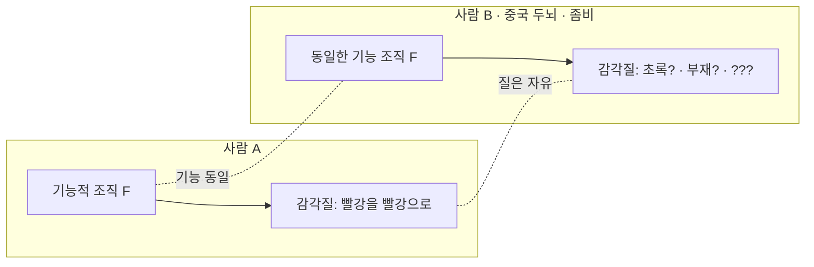

# 🌈 감각질의 문제 — 역할이 같아도 느낌이 다를 수 있나

> **Psyche L0** · Chapter 4: 기능주의 · 문서 4/5
> 기능적 역할이 완전히 같아도 경험의 질은 다르거나 부재할 수 있다 — 그렇다면 느낌은 역할로 환원되지 않는다.

기능주의는 인지를 정복했다. 그러나 마음의 다른 절반 — 경험의 질, 곧 감각질(qualia) — 앞에서 가장 날카로운 반론을 만난다. 역전 감각질, 부재 감각질, 블록의 중국 두뇌, 그리고 좀비. 이 사고실험들은 한목소리로 묻는다. *기능이 같다고 정말 느낌도 같은가?* 만약 아니라면, "마음은 소프트웨어"라는 명제에 빠진 무언가가 있다.

---

## 🎯 핵심 질문

기능주의의 핵심 약속은 "기능적 동일성 → 심적 동일성"이다. 두 체계가 모든 입력·상태 전이·출력에서 동일하면, 그들은 같은 마음을 가진다. 감각질 반론은 이 함의를 정조준한다.

> **두 체계가 기능적으로 완전히 동일하면서도, 경험의 질(what it is like)이 서로 다르거나 한쪽에는 아예 없을 수 있는가?**

만약 "그렇다"는 것이 *정합적*(상상 가능하고 모순 없음)이라면, 경험의 질은 기능적 역할에 의해 *결정되지 않는다*. 즉 같은 역할이 다른 느낌(또는 무느낌)과 양립한다. 그렇다면 감각질은 기능을 *넘어서며*, 기능주의는 마음의 이 차원을 설명하지 못한다.

토마스 네이글(Nagel)의 표현을 빌리면, 의식적 상태에는 그것을 가진 주체에게 "그것임 같은 무엇(what it is like)"이 있다. 박쥐로 산다는 것에는 어떤 느낌이 있다. 핵심 질문은 이 "what it is like"가 입력–출력–상태 전이의 명세로 *환원되는가*다. 기능주의 옹호자는 "그렇다(혹은 그 질문이 잘못됐다)"고, 반론자는 "결코 아니다"라고 답한다.

## 🌍 어디서 마주치나

감각질의 수수께끼는 추상적 사변이 아니라 도처에서 부딪힌다.

- **색맹·색각 다양성**: 같은 사과를 보고 같은 행동(빨강이라 부름, 잘 익었다 판단)을 하는 두 사람이, 속으로는 다른 색을 *경험*할 수 있는가? "당신의 빨강이 내 초록일 수 있다"는 어릴 적 의문이 역전 감각질의 직관이다.
- **AI 의식 논쟁**: 챗봇이 "아프다"고 말할 때, 거기에 *실제로 아픈 느낌*이 동반되는가, 아니면 출력만 있고 안은 텅 비었는가(부재 감각질)? 기능적 행동만으로는 답할 수 없는 이 질문이 AI 윤리의 핵심에 있다.
- **마취와 의식**: 수술 중 환자가 통증 신호를 처리하면서도 *느끼지* 못하게 하는 것이 마취의 목표다. 처리(기능)와 경험(감각질)의 분리가 임상에서 실재함을 시사한다.
- **동물 복지**: 물고기가 통증을 *기능적으로* 처리한다는 데는 합의가 있어도, 그것을 *느끼는가*는 별개 논쟁이다. 도덕적 지위는 종종 후자에 달려 있다.

## 🔍 직관의 함정

**함정 1: "역전 감각질이 상상되니까 실재한다."** 상상 가능성(conceivability)에서 가능성(possibility)으로의 추론은 자명하지 않다. 우리가 모순을 알아채지 못해 상상되는 것처럼 *보일* 뿐, 실제로는 불가능할 수 있다. 반론의 무게는 정확히 이 다리의 견고함에 달렸다 — 6장(설명적 간극)에서 본격 검토된다.

**함정 2: "기능이 같으면 보고도 같으니 역전은 검증 불가능하고 따라서 무의미하다."** 이는 검증주의적 반박인데, 너무 빠르다. 검증 불가능성이 *의미 없음*을 함의한다는 전제 자체가 논쟁적이다. 반론자는 "검증 불가능해도 *사실의 문제*는 있을 수 있다"고 응수한다 — 바로 그 검증 불가능성이 기능주의의 한계를 드러낸다는 것이다.

**함정 3: "감각질은 사적이고 신비하니 과학 밖이다."** 반대로 데닛 같은 기능주의자는 "감각질은 환상이며, 우리가 그것에 부여하는 사적·내재적·직접 파악 가능 같은 성질들은 면밀히 보면 해체된다"고 *적극적으로* 논증한다. 감각질을 신비화하는 것도, 너무 쉽게 실재시하는 것도 함정이다. 양측 모두 논증을 한다.

## ⚙️ 논증 구조

**역전 감각질 논증(로크에서 블록까지).**

1. 빨강을 볼 때 당신과 나는 기능적으로 동일하다 — 같은 자극에 같은 변별·명명·행동을 한다.
2. 그러나 당신이 빨강에서 갖는 경험의 질을, 나는 초록에서 갖는다고 가정하자(스펙트럼 역전). 행동·언어는 완벽히 같으므로 기능적 차이는 *없다*.
3. 이 시나리오는 모순 없이 상상 가능하다.
4. 그러므로 경험의 질은 기능적 역할에 의해 결정되지 않는다. $\square$

**부재 감각질 논증(블록의 중국 두뇌).**

1. 한 사람의 두뇌가 가진 기능적 조직을, 13억 인민이 무전기로 신호를 주고받아 *정확히* 복제한다고 하자. 각 사람이 한 뉴런 역할을 맡는다.
2. 이 "중국 두뇌"는 정의상 그 사람과 기능적으로 동일하다 — 같은 입력에 같은 출력, 같은 내부 상태 전이.
3. 그러나 *나라 전체*가 통증의 욱신거림을, 빨강의 빨강임을 *느낀다*는 것은 직관적으로 터무니없다(부재 감각질).
4. 그러므로 기능적 조직만으로는 경험의 질에 충분하지 않다. $\square$

**좀비 논증(차머스, 예고).**

1. 나와 분자 하나까지(따라서 기능까지) 동일하지만 *경험이 전혀 없는* 존재(철학적 좀비)를 상상할 수 있다.
2. 상상 가능하면 형이상학적으로 가능하다(논쟁적 전제).
3. 그러므로 경험은 기능·물리적 사실을 넘어선다. $\square$

핵심을 압축하면: **기능적 사실의 총합이 경험적 사실을 *고정하지 못한다*.** 세 논변 모두 "역할 명세를 다 채워도 *느낌의 자리*가 자유롭게 남는다"는 한 직관의 변주다.

## 🧪 증거와 사고실험

**블록의 중국 두뇌(Block, 1978).** 위 논증의 핵심 사고실험. 그 힘은 *기능적 조직을 보존하면서 물리적 구현을 직관에 거슬리게 만드는* 데 있다. 우리는 인민의 거대 네트워크에 통일된 의식을 귀속하기를 강하게 주저한다. 블록은 이 주저("부재 감각질 직관")가 기능주의에 대한 반증 정황이라 본다.

**역전 스펙트럼(Locke → Shoemaker).** 행동적으로 검출 불가능한 색 경험의 역전. 쇼메이커는 *체계 내 비대칭*(예: 빨강은 따뜻함과, 파랑은 차가움과 연합)을 이용하면 일부 역전은 기능적으로 검출 가능하나, *완전 대칭적* 역전은 검출 불가능함을 보였다 — 이 경우 질은 기능을 넘어선다.

**메리의 방(Jackson, 예고).** 흑백 방에서 색의 모든 *물리적·기능적* 사실을 배운 신경과학자 메리. 그녀가 처음 빨강을 *볼 때* 새로운 무언가(빨강의 느낌)를 배운다면, 그 지식은 기능적 사실의 총합에 들어 있지 않았던 것이다. 이는 6장 지식 논변에서 본격 다뤄지나, 감각질의 비환원성 직관을 예리하게 보여준다.

**데닛의 반증 시도("Quining Qualia").** 데닛은 역전 감각질·중국 두뇌 직관이 *나쁜 사고실험*이라 논한다. 우리가 감각질에 부여하는 성질들(직접 파악 가능, 내재적, 비교 불가)을 면밀히 분해하면 일관성을 잃으며, 남는 것은 *판단·반응 성향*뿐 — 즉 기능이라는 것이다. 이는 감각질 반론에 대한 가장 강력한 정면 반박이다. 공정하게, 이 논쟁은 결판나지 않았다.

## 🌉 설명적 간극

감각질의 문제는 설명적 간극의 *가장 날카로운 단면*이다. 기능적 설명은 항상 같은 형식을 가진다 — "$X$는 입력 $i$에서 유발되어 상태 $s$를 거쳐 출력 $o$를 낳는다." 이 형식은 *구조와 인과*만을 담는다. 그런데 경험의 질은 구조도 인과도 아닌 *질적 성격*을 가진 것처럼 보인다. 빨강의 빨강임은 "다른 상태들과의 인과 관계"로 *남김없이* 풀리지 않는 듯하다.

레빈(Levine)의 정식화가 핵심이다 — "C-섬유 발화는 고통과 *상관*되지만, *왜* 그것이 *이런* 느낌이어야 하는지는 설명되지 않는다." 같은 간극이 기능주의 판본으로 옮겨온다 — "이 기능적 역할은 통증 행동을 산출하지만, *왜* 그것이 욱신거리는 느낌을 동반해야 하는지는 명세에서 따라 나오지 않는다."

여기서 경계가 선명해진다.

- **기능이 닫는 것**: 변별, 보고, 통합, 접근, 학습 — 모두 인과적 역할로 정의되고 기능적으로 설명된다.
- **기능이 열어둔 채 남기는 것**: 그 역할들이 *왜, 그리고 어떻게* 주관적 질을 동반하는가. 명세는 이 질문에 대해 *임의적*으로 보인다 — 같은 명세가 다른 질, 혹은 무질과 양립하는 듯하다.

이것이 감각질을 둘러싼 설명적 간극이며, 5문서에서 그 경계를 최종 확정한다.

## 🧬 횡단 원리

감각질 반론의 횡단 원리는 **구조적 기술의 폐쇄성(closure of structural description)**이다.

> **구조–질 비결정 원리**: 어떤 체계에 대한 완전한 구조적·관계적 기술은, 그 체계가 어떤 *내재적 질*을 갖는지(혹은 갖는지조차)를 결정하지 못한다.

이 원리는 다른 곳에서도 메아리친다.

- **물리학의 구조주의**: 물리학은 사물의 *관계적·구조적* 속성(질량, 전하, 상호작용)만 기술하고, 그 사물의 *내재적 본성*은 침묵한다(러셀의 통찰). 감각질 문제는 이 "내재적 잔여"가 마음에서 폭발한 형태로 볼 수 있다 — 이것이 5장 범심론·일원론으로 가는 다리다.
- **수학적 모형 일반**: 모형은 구조를 포착하되, 그 구조를 *실현하는 것의 질*은 모형 바깥이다. 같은 미분방정식이 전기 회로와 용수철에 적용된다.

원리의 핵심 주장은 이렇다 — 기능적 명세는 본성상 *관계적*이고, 경험의 질은 *내재적*으로 보인다. 관계로 내재를 길어 올릴 수 있는가? 기능주의자는 "내재성은 환상이거나, 충분히 풍부한 관계망에서 창발한다"고 답하고, 반론자는 "관계망은 아무리 풍부해도 내재적 질을 *함의하지 않는다*"고 맞선다. 이 추상적 비대칭이 모든 감각질 사고실험의 공통 뿌리다.

## 🪞 1인칭

감각질 반론은 본질적으로 1인칭 반론이다. 그 모든 힘은 "*나는* 이 빨강이 *이렇게* 느껴진다는 것을 직접 안다, 그리고 그 느낌은 내가 그것으로 하는 어떤 일(명명·변별·행동)과도 다른 것 같다"는 내성적 증언에서 나온다. 3인칭 기능 명세를 아무리 길게 읽어도, 그 명세는 *이 느낌 자체*를 담지 못하는 듯 보인다 — 이것이 1인칭의 항변이다.

기능주의자의 1인칭 응수는 두 갈래다. (1) **해소(데닛)**: "당신이 '느낌 자체'라 부르는 그것은, 면밀히 보면 당신의 *판단·반응 성향*의 다발일 뿐이다. 그 이상의 '순수한 질'이 있다는 느낌조차 또 하나의 인지적 판단이다." (2) **포섭(표상주의 기능주의)**: "느낌의 질은 경험이 *표상하는 내용*이고, 그 표상은 기능적으로 정의된다 — 빨강의 질은 '빨간 표면을 표상하는 상태에 있음'이다."

반론자는 응수한다 — 두 길 모두 "*그럼에도 왜 거기에 무언가가 느껴지는가*"를 회피한다고. 1인칭의 자명함과 3인칭 기능주의의 환원 사이의 이 교착이, 결국 기능주의 *한계*의 정확한 좌표를 묻는 다음 문서를 부른다.

## 📐 예측·반증

감각질 반론은 사고실험에 기대므로 *경험적* 시험이 까다롭지만, 예측과 반증 조건을 명료히 할 수 있다.

**기능주의 진영의 예측.** 의식 경험의 모든 *보고 가능한* 차이는 *기능적* 차이를 동반한다. 진정으로 검출 불가능한(완전 대칭적) 역전 같은 것은 실제로는 존재하지 않거나 의미 없다. → 신경과학이 모든 질적 차이에 대응하는 처리 차이를 찾아내면 기능주의에 유리.

**반론 진영의 예측.** 기능적·신경적으로 동일한 처리가 서로 다른(또는 부재한) 경험과 양립하는 사례가 원리적으로 배제되지 않는다. → 처리는 같은데 경험이 갈리는 임상 사례(예: 무의식적 처리 vs 의식적 처리의 동일 기능 단계)가 누적되면 반론에 유리.

**반증 조건(기능주의).** 만약 *기능적·신경적으로 완전히 동일*하면서 경험이 다름이 *입증*된다면, 강한 기능주의는 반증된다. 단 "입증"의 어려움 자체 — 1인칭 질은 3인칭에서 직접 측정 불가 — 가 핵심 난점이다.

**반증 조건(반론).** 만약 우리가 감각질에 부여하는 성질들이 *모두* 기능적 판단으로 분석됨이 보여지면(데닛의 기획 성공), 감각질 반론은 토대를 잃는다. 즉 "환원 불가능한 질적 잔여"가 *없음*이 반론을 무너뜨린다.

이 대칭적 시험 가능성의 어려움이, 감각질 문제가 *경험적*이라기보다 *개념적*(상상 가능성 논쟁) 성격이 강함을 보여준다 — 6장의 핵심 논점이다.

## 🤔 다음 질문

감각질 반론이 옳다면, 기능주의에는 빈자리가 있다 — 기능이 같아도 느낌은 자유롭게 변한다. 그러나 그 빈자리는 *얼마나* 큰가? 기능주의는 완전히 실패한 이론인가, 아니면 *특정 영역*에서만 한계를 갖는 강력한 이론인가?

다음 질문은 경계 확정이다. **기능주의가 성공하는 영역(인지)과 실패하는 영역(경험)의 정확한 경계는 어디인가? 현상적 특성은 정말로 기능 기술 바깥에 있는가, 아니면 우리가 아직 충분히 정교한 기능 기술에 이르지 못한 것인가?** 마지막 문서가 이 경계를 그린다.

---

🧩 **Principle** — 기능적 역할이 완전히 같아도 경험의 질은 다르거나 부재할 수 있다는 직관(역전·부재 감각질, 중국 두뇌)이 정합적이라면, 질은 역할로 환원되지 않는다.

🌉 **Boundary** — 기능적 명세는 구조적·관계적이고 닫혀 있다. 그것이 내재적·질적 성격을 결정하는지가 미결의 핵심이며, 여기서 기능주의의 설명력이 멈춘다.

🪞 **Experience** — 빨강의 빨강임은 1인칭에서 직접 주어지며, 그것으로 내가 *하는* 어떤 기능과도 다른 것처럼 보인다. 이 자명함과 기능적 환원 사이의 교착이 반론의 엔진이다.

## 📝 연습문제

<b>기초</b> — 역전 감각질과 부재 감각질을 구별하라.

**문제.** 역전 감각질과 부재 감각질이 각각 무엇이며, 둘 다 기능주의를 어떻게 위협하는지 설명하라.

**해설:** *역전 감각질*은 두 체계가 기능적으로 동일하면서 경험의 질이 서로 *뒤바뀐* 경우다 — 당신의 빨강 경험을 나는 초록으로 갖되, 행동·명명은 완전히 같다. *부재 감각질*은 기능적으로 동일하지만 한쪽에는 경험이 *전혀 없는* 경우다 — 블록의 중국 두뇌가 모든 역할을 채워도 아무것도 느끼지 못함. 둘 다 같은 방식으로 위협한다. 기능주의는 "기능 동일 → 심적 동일"을 주장하는데, 두 사고실험은 기능을 고정한 채 *질*만 변화(역전)시키거나 제거(부재)함으로써, 질이 기능에 의해 결정되지 않음을 보이려 한다. 즉 기능 명세에 *경험의 자유도*가 남아 있다는 것이다. 역전은 질의 *동일성*을, 부재는 질의 *존재 자체*를 기능에서 떼어낸다.

<b>심화</b> — 블록의 중국 두뇌가 다중 실현 가능성을 기능주의에 불리하게 뒤집는 방식을 논하라.

**문제.** 다중 실현 가능성은 기능주의를 *지지*했는데(1문서), 블록은 같은 발상을 어떻게 기능주의에 *불리하게* 사용하는가?

**해설:** 다중 실현은 본래 "구현이 무엇이든 역할만 같으면 같은 마음"이라며 기능주의를 옹호했다 — 뉴런이든 실리콘이든 좋다. 블록은 이 관용을 *극단까지* 밀어 역공한다. 만약 *어떤* 구현이든 역할만 보존하면 마음이 생긴다면, 13억 인민이 무전기로 한 뉴런씩 흉내 내는 *기괴한* 구현도 마음(특히 의식)을 가져야 한다. 그러나 우리는 *나라 전체가 통증을 느낀다*는 데 강하게 저항한다. 이 직관적 저항이 모순을 드러낸다 — 다중 실현을 끝까지 받아들이면 받아들이기 힘든 결론(인민 네트워크의 의식)이 따라오고, 그 결론을 거부하면 "구현이 무관하다"는 기능주의 원칙을 포기해야 한다. 즉 블록은 기능주의의 *관용성*을 환원에 가까운 *불합리*로 몰아간다(귀류법). 단, 기능주의자는 "직관이 단지 규모와 속도에 대한 편견일 뿐, 정말로 기능이 동일하다면 의식도 있다"고 직관을 거부함으로써 응수할 수 있다 — 이 응수의 설득력이 논쟁의 핵심이다.

<b>논문 비평</b> — 데닛 「Quining Qualia」(1988)의 감각질 해소 전략을 평가하라.

**문제.** 데닛은 감각질이 환상이라 논한다. 그의 전략을 재구성하고, 감각질 반론자가 제기할 최선의 응답을 평가하라.

**해설:** 데닛의 전략: 우리는 감각질에 네 성질 — (1) 형언 불가능(ineffable), (2) 내재적(intrinsic), (3) 사적(private), (4) 직접·즉각 파악 가능 — 을 귀속한다. 데닛은 일련의 직관 펌프(맥주 맛의 변화, 커피 감식가, 역전 시나리오의 모호성 등)로, 이 성질들을 동시에 일관되게 유지할 수 없음을 보이려 한다. 예컨대 "내 미각이 변했나, 내 미각에 대한 *반응/판단*이 변했나"를 1인칭에서조차 원리적으로 구별할 수 없다면, "직접 파악되는 내재적 질"이라는 개념은 무너지고 남는 것은 *판단·반응 성향*(곧 기능)뿐이다. 따라서 감각질이라는 *특별한* 존재자는 없다. 평가: 강점은 (a) 감각질의 자명함을 무비판적으로 받아들이지 않고 그 개념을 *분석*에 부친다는 점, (b) "변화 vs 변화에 대한 판단"의 구별 불가능성이 실제로 내재성 직관을 흔든다는 점이다. 반론자의 최선의 응답: 데닛은 감각질의 *부수적* 성질(형언 불가·완전 비교 불가)을 해체하는 데 성공할지 몰라도, *최소 핵심* — 경험에 "그것임 같은 무엇이 있음" — 은 건드리지 못한다. 변화와 판단을 구별 못 한다는 사실조차, *무언가가 거기 나타나고 있음*을 전제한다(판단의 대상). 즉 인식론적 구별 불가능성에서 존재론적 부재로의 비약이 의심된다. 종합: 데닛은 감각질을 *과대 포장한 판본*은 효과적으로 해체하나, 어려운 문제의 *최소 핵심*은 잔존하며, 따라서 그의 해소는 도전적이되 결정적이지 않다 — 이 미결성 자체가 기능주의 한계 논의(5문서)를 정당화한다.

[◀ 이전: 기능주의의 성공](./03-functionalism-success.md) · [📚 README](../README.md) · [다음: 기능주의의 한계 ▶](./05-functionalism-limits.md)

