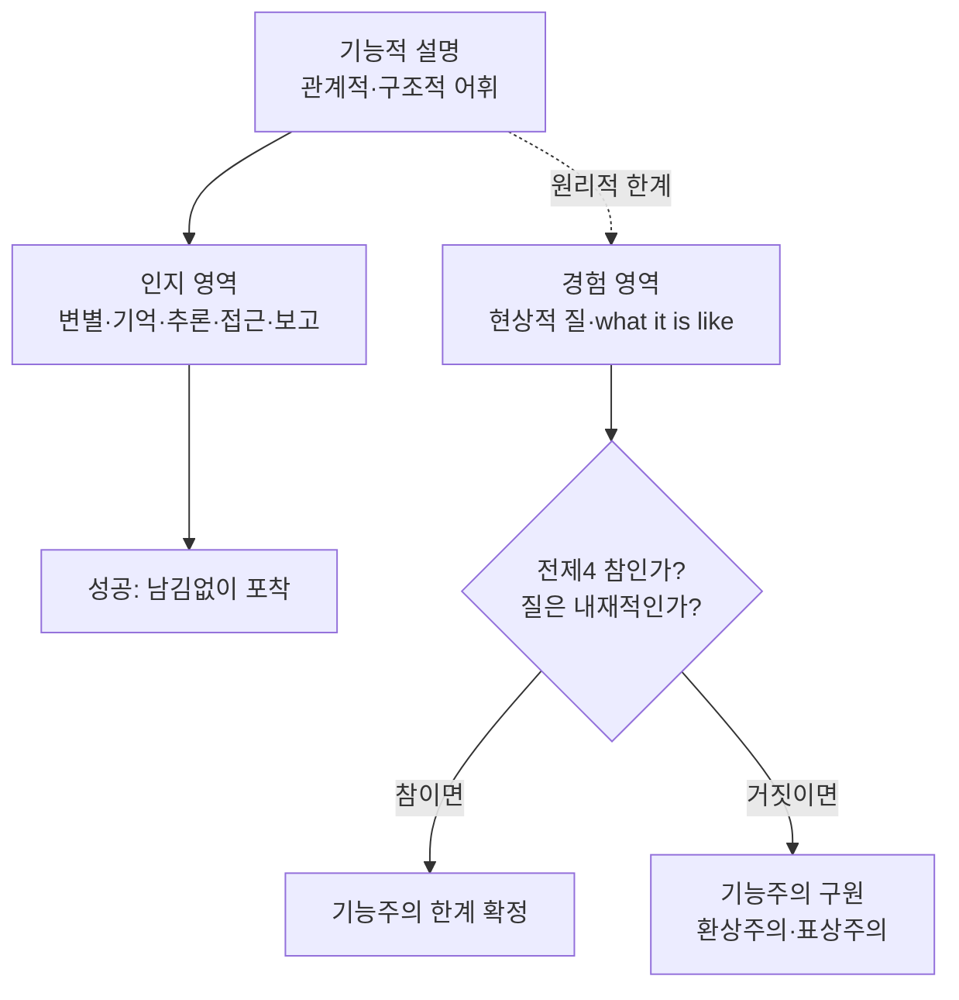

# 🧭 기능주의의 한계 — 인지와 경험의 경계

> **Psyche L0** · Chapter 4: 기능주의 · 문서 5/5
> 기능주의는 인지를 거의 완전히 설명하지만, 현상적 경험은 기능 기술 바깥으로 새어 나간다 — 그 경계를 정밀하게 긋는다.

이 장을 닫으며 우리는 균형 잡힌 평결을 내려야 한다. 기능주의를 폐기하는 것도, 무한정 옹호하는 것도 답이 아니다. 옳은 질문은 *어디까지*다. 기능주의가 빛나는 영역(인지)과 한계에 부딪히는 영역(경험)의 경계를 정확히 그리는 것 — 이것이 "Explain it, don't explain it away"라는 이 저장소의 모토에 충실한 길이다.

---

## 🎯 핵심 질문

앞선 네 문서는 진자처럼 움직였다. 기능주의는 동일론의 편협함을 치료하고(1), 검증의 문제를 열고(2), 인지를 정복하고(3), 감각질 앞에서 흔들렸다(4). 이제 종합의 질문이다.

> **기능주의의 설명력은 정확히 어디서 시작하고 어디서 멈추는가? 현상적 특성이 기능 기술 바깥에 있다는 진단은 기능주의의 *실패*인가, 아니면 그 *기획의 경계*인가?**

이 문서의 답은 *영역 구분*이다. 기능주의는 마음을 *능력*(무엇을 할 수 있는가)으로 보는 한 거의 완전한 이론이다. 그러나 마음을 *경험*(무엇으로 사는가)으로 보는 순간, 그 어휘는 원리적 한계에 부딪힌다. 핵심은 이 경계가 *임의적*이지 않고 *구조적*이라는 것 — 기능 어휘의 본성(관계적·구조적)이 그 한계를 미리 규정한다.

## 🌍 어디서 마주치나

경계의 문제는 실천적 결정이 걸린 곳마다 등장한다.

- **AI 권리·의식 판단**: 시스템이 모든 인지 기능을 수행할 때, 그것에 *경험*과 그에 따른 도덕적 지위를 인정할지는 인지 능력만으로 답할 수 없다. 경계가 어디인지가 정책을 가른다.
- **의식의 신경 상관자(NCC) 연구**: 과학자들은 "어떤 기능적·신경적 차이가 의식과 비의식을 가르는가"를 찾는다. 이는 정확히 인지–경험 경계를 *경험적으로* 위치시키려는 시도다.
- **마취·식물상태 진단**: "처리는 있는데 경험은 있는가"를 판정해야 하는 임상 최전선. 기능적 지표(반응)와 경험의 괴리가 실재한다.
- **이론 선택**: 기능주의의 한계를 인정한 뒤 우리가 가는 곳 — 범심론, 일원론, 신비주의, 환상주의 — 의 선택이 이 경계의 진단에 달렸다(5장 이후의 분기점).

## 🔍 직관의 함정

**함정 1: "감각질 반론이 기능주의를 *논파*했다."** 과장이다. 감각질 반론은 기능주의의 *현상적 야심*을 흔들 뿐, 그 *인지적 성과*를 건드리지 못한다. 기능주의는 마음 과학의 표준 도구로 건재하다. "한계가 있다"와 "틀렸다"는 다르다.

**함정 2: "한계가 있으니 기능주의 대신 이원론으로 가야 한다."** 비약이다. 기능주의의 한계는 *대안이 우월함*을 자동으로 증명하지 않는다. 이원론·범심론도 각자의 난점(인과·결합 문제)을 진다. 경계의 인정은 *문제의 위치 확정*이지 *해법의 선택*이 아니다.

**함정 3: "경계는 단지 우리의 무지일 뿐, 더 정교한 기능 기술이 메울 것이다."** 이것은 열린 가능성이지 확정 사실이 아니다. 기능주의자(특히 표상주의·환상주의)는 이렇게 베팅하고, 반론자는 "어떤 기능 기술도 관계적이어서 원리적으로 내재적 질을 못 잡는다"고 본다. 양쪽 다 *예단*하면 함정이다 — 공정한 진단은 두 가능성을 *열어둔다*.

## ⚙️ 논증 구조

기능주의의 한계를 정식화하는 핵심 논증("설명적 격차의 영역 한정")은 이렇다.

1. **(전제)** 기능적 설명은 본성상 *관계적·구조적*이다 — 모든 항을 입력·출력·다른 상태와의 인과 관계로 정의한다.
2. **(전제)** 인지 능력(변별·기억·추론·언어·접근·보고)은 *그 자체가 관계적·구조적으로 정의되는* 능력이다.
3. **(소결론)** 그러므로 기능적 설명은 인지 능력을 *남김없이* 포착한다. (성공 영역) $\square$
4. **(전제)** 그러나 현상적 질("그것임 같은 무엇")은 *내재적*으로 보인다 — 다른 것과의 관계로 환원되지 않는 그 자체의 성격을 가진다.
5. **(소결론)** 관계적 어휘로는 내재적 질을 *원리적으로* 명세할 수 없다(구조–질 비결정, 4문서).
6. **(결론)** 그러므로 기능주의의 설명력은 *관계적으로 정의되는 마음(인지)*에 정확히 미치고, *내재적으로 보이는 마음(경험의 질)*에서 멈춘다. 경계는 임의가 아니라 어휘의 본성에서 따라 나온다. $\square$

이 논증의 무게중심은 **전제 4**다. 경험의 질이 *정말로* 내재적인가, 아니면 (데닛·표상주의가 주장하듯) 면밀히 보면 관계적·기능적인가? 기능주의의 운명은 이 한 점에 달려 있다. 따라서 정직한 결론은 *조건부*다.

## 🧪 증거와 사고실험

**경계의 양쪽을 보여주는 누적 증거.** 4문서의 사고실험들(중국 두뇌·역전·좀비·메리)은 모두 경계의 *경험 쪽*을 가리킨다. 반면 3문서의 성과들(마의 시각 이론·이중 해리·AI)은 경계의 *인지 쪽*을 가리킨다. 두 묶음이 같은 선의 양면이라는 것이 이 문서의 핵심 관찰이다.

**의식의 "쉬운 문제 vs 어려운 문제"(차머스).** 차머스는 경계를 가장 명료히 그었다 — *쉬운 문제들*(변별·통합·보고·주의 등)은 모두 기능적으로 정의되며 기능적 설명으로 풀린다(언젠가는). *어려운 문제*는 "왜 이 모든 기능 수행에 *경험이 동반되는가*"이며, 기능적 설명이 본성상 닿지 못한다. 이 구분이 기능주의 한계의 표준 지도다.

**환상주의의 반대 베팅(데닛·프랭키시).** "어려운 문제는 *환상*이다 — 우리에게 환원 불가능한 질이 *있는 것처럼 보이는* 그 현상(메타 문제)을 기능적으로 설명하면, 더 설명할 것이 남지 않는다." 이는 경계를 *지우려는* 시도다. 공정하게, 환상주의는 일관되며 점점 더 진지하게 다뤄진다 — 다만 "느낌이 환상이라는 느낌"마저 느낌이라는 반론에 답해야 한다.

**표상주의의 구원 시도(타이·드레츠키).** "현상적 질 = 경험이 표상하는 내용이고, 표상은 기능적으로 정의된다." 빨강의 질은 "빨간 표면을 표상함"이다. 성공하면 질이 기능 안으로 들어온다. 난점: 표상 내용의 *동일성*이 질의 동일성을 정말 고정하는지(전도된 지구 같은 반례), 그리고 표상함이 *왜* 느껴짐을 동반하는지가 여전히 미결.

## 🌉 설명적 간극

이 문서는 설명적 간극의 *지도를 완성*한다. 간극은 마음 전체에 균일하게 퍼져 있지 않다. 그것은 *특정 경계*에 집중되어 있다.

- **간극이 없는 곳(인지)**: "어떻게 두뇌가 얼굴을 인식하는가?"는 기능적 설명이 점점 메워가는, *연속적이고 환원적인* 설명이 가능한 영역이다. 여기엔 원리적 신비가 없다.
- **간극이 있는 곳(경험)**: "왜 그 인식에 *느낌*이 동반되는가?"는 아무리 기능적 설명을 쌓아도 *왜?*가 다시 솟는, 환원이 헛도는 영역이다.

이 비균질성이 결정적이다. 기능주의의 한계는 마음 전체에 대한 무능이 아니라, *마음의 한 차원에 정밀하게 국한된* 한계다. 그래서 정직한 평결은 "기능주의는 마음의 *기능적 차원*에 대해 옳고, *현상적 차원*에 대해 미완"이다.

그리고 이 미완의 간극이 다음 장으로 가는 다리다. 만약 기능적·구조적 기술이 *원리적으로* 내재적 질을 못 잡는다면, 두 길이 갈린다 — (a) 내재적 질은 *없다*(환상주의), (b) 내재적 질은 *물질의 근본 성질*이다(범심론·일원론). 5장은 후자의 길로 들어간다. 기능주의의 한계가 정확히 범심론의 동기를 빚어낸다.

## 🧬 횡단 원리

이 장 전체를 관통하는 횡단 원리를 최종 정식화하자.

> **관계–내재 경계 원리**: 어떤 설명 도식이 *관계적·구조적* 어휘로만 구성되면, 그것은 관계적으로 정의되는 성질은 완전히 포착하되, *내재적*으로 정의되는 성질에 대해서는 원리적 침묵에 빠진다.

이 원리의 위력은 그것이 *왜* 기능주의가 인지에서 성공하고 경험에서 멈추는지를 *예측*한다는 데 있다 — 인지는 관계적으로 정의되고, 경험의 질은 (적어도 표면상) 내재적이기 때문이다. 같은 원리가 도처에서 반복된다.

- **물리학(러셀의 통찰)**: 물리학은 사물의 *관계적 구조*(상호작용·역할)만 기술하고 *내재적 본성*은 비운다. 마음의 감각질 문제는 이 "내재적 잔여"가 의식에서 표면화한 것일 수 있다 — 이것이 *러셀적 일원론*의 발상이며, 기능주의의 한계와 범심론을 잇는 깊은 다리다.
- **수학적 모형**: 구조를 포착하되 실현자의 질은 비운다.

따라서 기능주의의 한계는 *특수한 결함*이 아니라, *모든 구조적 기술이 공유하는 보편적 경계*의 한 사례다. 이 통찰이 마음–몸 문제를 더 큰 형이상학적 지형 안에 위치시킨다 — 마음의 수수께끼는 어쩌면 *내재적 본성 일반*에 대한 우리의 무지의 가장 절박한 단면이다.

## 🪞 1인칭

이 장의 1인칭 여정을 매듭짓자. 나는 내 인지 능력 — 기억하고 추론하고 말하는 — 이 기능적 모형으로 충실히 그려짐을 인정할 수 있다. 그 모형이 내 인지의 고장(건망·혼란)을 예측할 때, 나는 그것이 *나에 관한 참*임을 1인칭에서도 확인한다.

그러나 모형이 다 그려진 뒤에도, *그 모든 것이 나에게 이렇게 나타나고 있다는 사실* — 지금 이 글을 읽는 경험의 빛 자체 — 은 흐름도 어디에도 적히지 않은 채 남는다. 이것이 1인칭이 기능주의에 끝내 양보하지 않는 잔여다.

공정한 1인칭 평결은 이중적이다. 한편으로, 나는 그 잔여를 *부정할 수 없다* — 경험은 가장 직접적으로 주어진 것이다. 다른 한편으로, 나는 그 잔여가 *내가 그것에 대해 내리는 판단과 정말로 다른지*를 1인칭 내성만으로 결정적으로 보일 수도 없다(데닛의 도전). 그래서 정직한 결론은 겸손하다. 경험은 *있다*. 그러나 그것이 기능을 *넘어서는지*는, 1인칭의 자명함만으로는 닫히지 않고 형이상학적 논증을 더 요구한다 — 다음 장들이 그 논증을 이어간다.

## 📐 예측·반증

**경계 가설의 예측.** 의식 과학은 기능적·신경적 처리를 정밀화할수록 *쉬운 문제들*을 차근차근 풀어가되, "왜 경험이 동반되는가"는 그 진전에 비례해 풀리지 *않을* 것이다 — 설명적 격차가 줄어들지 않고 *제자리*에 남는 패턴. → 이 비대칭적 진보 패턴이 관찰되면 경계 가설(어려운 문제의 실재)에 유리.

**환상주의 진영의 예측.** 메타 문제(왜 우리는 어려운 문제가 있다고 *믿는가*)를 기능적으로 설명하는 데 성공하면, 어려운 문제에 대한 우리의 집착이 *서서히 해소*될 것이다. → 그런 해소가 일어나면 환상주의에 유리.

**반증 조건 1.** 만약 현상적 질의 *모든* 측면이 표상 내용·기능적 역할로 빠짐없이 분석됨이 입증되면(표상주의·환상주의의 완전한 성공), 기능주의의 한계 주장은 반증되고 기능주의가 마음 전체를 포섭한다.

**반증 조건 2.** 반대로, 기능적·신경적으로 동일한 처리가 경험의 유무를 가르는 *원리적으로 환원 불가능한* 사례가 확립되면, 기능주의의 한계가 확정되고 환상주의는 반증된다.

이 시험들의 *난이도 자체* — 1인칭 질을 3인칭에서 측정하는 근본 곤란 — 가 마음–몸 문제의 고유한 성격이다. 그것은 보통의 과학 문제처럼 *데이터로* 닫히기 어렵고, 개념적·형이상학적 작업을 요구한다.

## 🤔 다음 질문

기능주의는 우리를 분명한 지점까지 데려다주었다. 마음의 *기능적 골격*은 설명되었다. 그러나 그 골격에 *경험의 살*이 붙는 일 — 왜 정보처리에 느낌이 동반되는가 — 은 기능 어휘 바깥에 남았다. 우리는 두 갈래 앞에 선다.

그 잔여를 *지울* 것인가(환상주의), 아니면 그것을 *진지하게 받아들여 형이상학을 고칠* 것인가? 후자를 택하면 급진적 가능성이 열린다. 어쩌면 경험은 *복잡한 기능에서 창발하는 것*이 아니라, *물질 자체의 근본 성질*일지도 모른다. 의식은 두뇌가 *만드는* 것이 아니라 우주에 *이미 있는* 것일 수 있다. 다음 장은 이 도발적 제안 — 범심론 — 으로 들어가, 기능주의가 남긴 내재적 잔여를 정면으로 다룬다.

---

🧩 **Principle** — 관계적·구조적 어휘로 된 기능적 설명은 관계적으로 정의되는 마음(인지)을 남김없이 포착하되, 내재적으로 보이는 마음(경험의 질)에 대해서는 원리적 한계에 부딪힌다.

🌉 **Boundary** — 설명적 간극은 마음에 균일하지 않고 *인지–경험 경계*에 집중된다. 기능주의는 인지에 옳고 경험에 미완이다 — 단, 전제4(질의 내재성)가 참일 때만.

🪞 **Experience** — 인지 모형이 다 그려진 뒤에도 "그것이 나에게 나타나고 있다는 사실"은 남는다. 그러나 그 잔여가 기능을 넘어서는지는 1인칭 자명함만으로 닫히지 않고 형이상학을 요구한다.

## 📝 연습문제

<b>기초</b> — 차머스의 "쉬운 문제 / 어려운 문제" 구분으로 기능주의의 경계를 설명하라.

**문제.** 의식의 쉬운 문제와 어려운 문제를 구별하고, 이 구분이 기능주의의 성공 영역과 한계 영역을 어떻게 나누는지 말하라.

**해설:** *쉬운 문제들*은 변별, 정보 통합, 인지 상태의 보고 가능성, 주의 통제, 행동 제어 등 — 모두 *어떤 기능이 수행되는가*로 정식화되는 문제다. 원리적으로 기능적 메커니즘을 명세하면 풀리며, 시간 문제일 뿐이다. *어려운 문제*는 "왜 이 모든 기능 수행에 *주관적 경험*이 동반되는가"이며, 기능을 다 명세해도 *왜?*가 남는다. 이 구분이 곧 기능주의의 경계다 — 기능주의는 쉬운 문제(인지 능력)를 거의 완전히 설명하지만, 어려운 문제(경험의 동반)에 대해서는 그 어휘가 본성상 닿지 못한다. 따라서 기능주의의 성공 영역 = 쉬운 문제 = 인지, 한계 영역 = 어려운 문제 = 현상적 경험으로 깔끔히 정렬된다.

<b>심화</b> — 기능주의의 한계가 "구조적 기술의 본성"에서 따라 나옴을 논증하라.

**문제.** 기능주의의 경험 설명 한계가 단순한 *현재의 무지*가 아니라 *원리적 한계*라는 주장을, 기능 어휘의 본성을 통해 옹호하라. 그리고 이에 대한 기능주의자의 최선의 반박을 제시하라.

**해설:** 옹호: 기능적 설명은 정의상 모든 항을 *관계적*으로 — 입력·출력·다른 상태와의 인과 관계로 — 명세한다(관계적 폐쇄성). 그런데 현상적 질은 *내재적*으로 보인다. 즉 다른 것과의 관계가 아니라 그 자체의 성격으로 존재하는 듯하다(빨강의 빨강임은 그것이 무엇을 유발하느냐와 별개로 *그렇게 있다*). 관계만 기술하는 도식은 정의상 내재적 성질을 *변항으로* 남길 수밖에 없다 — 같은 관계 구조가 여러 내재적 질(또는 무질)과 양립한다(구조–질 비결정). 따라서 한계는 데이터 부족이 아니라 *어휘 종류*의 문제이며 원리적이다. 기능주의자의 최선의 반박: 전제 — "질은 내재적이다" — 를 거부한다. (1) *표상주의*: 질은 사실 경험이 표상하는 *관계적* 내용이며, "내재적으로 보임"은 우리가 표상을 투명하게 들여다봐 그 내용을 세계의 속성으로 경험하기 때문이다. (2) *환상주의*: "내재적·비관계적 질"이라는 개념 자체가 정합적이지 않은 인지적 착각이며, 실재하는 것은 그렇게 *판단하는 성향*(관계적)뿐이다. 두 반박 모두 경계를 *어휘의 한계*가 아니라 *질에 대한 오해*로 재해석한다. 평가: 따라서 한계의 *원리성*은 "질이 정말 내재적인가"라는 미결 전제에 *조건부*다 — 논증은 타당하나 건전성이 그 한 전제에 걸려 있다.

<b>논문 비평</b> — 환상주의(데닛·프랭키시)가 기능주의의 한계를 해소하는 데 성공하는지 평가하라.

**문제.** 환상주의는 "어려운 문제는 환상"이라 주장함으로써 기능주의를 완성하려 한다. 그 전략을 재구성하고, "메타 문제" 응답과 그에 대한 최선의 반론을 평가하라.

**해설:** 재구성: 환상주의는 현상적 의식(환원 불가능한 내재적 질)이 *실재하지 않으며*, 실재하는 것은 "그런 질이 있는 것처럼 *우리에게 표상되는* 인지 상태"라고 본다. 따라서 우리가 풀어야 할 진짜 문제는 어려운 문제가 아니라 *메타 문제* — "왜 우리는 환원 불가능한 질이 있다고 *그토록 강하게 믿고 보고하는가*"다. 이 메타 문제는 *기능적* 문제(어떤 인지 메커니즘이 그런 강한 직관을 산출하는가)이므로 기능주의 도구로 풀 수 있고, 풀고 나면 "추가로 설명할 현상적 잔여"가 *없다*. 이로써 경계가 지워지고 기능주의가 마음 전체를 포섭한다. 강점: (a) 이론적 경제성 — 새로운 비물리적·내재적 존재자를 가정하지 않는다. (b) 메타 문제는 실제로 *잘 정의된 연구 프로그램*이다. (c) 신경과학·진화론과 매끄럽게 통합된다. 최선의 반론: (1) *자기 반박 우려* — "경험이 있는 것처럼 *보인다*"는 그 *보임* 자체가 이미 하나의 경험(현상)이다. 환상에는 환상의 *현상*이 있어야 하므로, 의식을 환상이라 부르는 것은 설명항에 피설명항을 슬쩍 들여놓는 듯하다(스트로슨의 "역사상 가장 어리석은 주장" 비판). (2) *데이터의 부정* — 다른 모든 과학은 현상(나타남)을 설명하려 하지 부정하지 않는데, 환상주의만 유독 가장 직접적인 데이터(경험)를 부정한다. 환상주의자의 재반박: "보임"을 또 다른 *기능적 표상 상태*로 재기술하면 무한 후퇴 없이 닫힌다 — 현상적 잔여처럼 보이는 것마저 표상의 한 층이다. 종합 평가: 환상주의는 *일관*되며 무시할 수 없는 진지한 입장이고, 기능주의를 구원할 *유일하게 깔끔한* 물리주의 경로일 수 있다. 그러나 그 성패는 "메타 문제를 다 풀면 잔여가 정말 *사라지는가*, 아니면 잔여가 단지 *재기술*되어 남는가"라는 미결 쟁점에 걸려 있다. 따라서 환상주의는 기능주의의 한계를 *해소할 후보*이지 *해소한 사실*은 아니며 — 바로 이 미결성이 5장에서 정반대 길(범심론: 잔여를 부정하지 말고 물질의 근본 성질로 받아들이라)을 진지한 경쟁자로 만든다.

[◀ 이전: 감각질의 문제](./04-qualia-problem.md) · [📚 README](../README.md) · [다음: 범심론의 주장 ▶](../ch5-panpsychism-monism/01-panpsychism.md)

