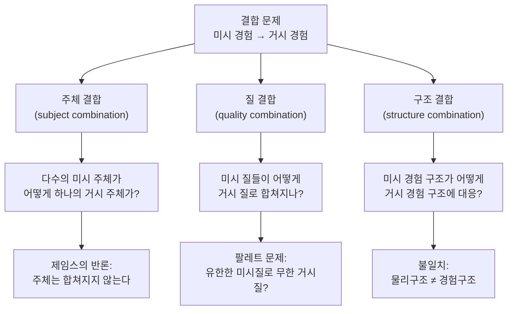

# 🧩 결합 문제

> **Psyche L0** · Chapter 5: 범심론과 중립적 일원론 · 문서 2/4
>
> 수십억 개의 미시 경험이 어떻게 단 하나의 통합된 나의 의식이 되는가. 범심론이 간극을 우회하며 발행한 청구서가 여기 도착한다.

## 🎯 핵심 질문

앞 문서에서 범심론은 설명적 간극을 우회했다. 경험을 근본 층위에 두어, "구조에서 경험으로"라는 건널 수 없는 도약을 "미시 경험에서 거시 경험으로"라는 조직화 문제로 바꾸었다. 그러나 이 변형은 공짜가 아니다. 새 형태의 문제가 청구서로 날아온다.

> **개별 미시 주체들의 작은 경험이, 어떻게 통합된 하나의 거시 주체의 경험으로 합쳐지는가.**

이것이 **결합 문제(combination problem)**다. 윌리엄 제임스(William James)가 『심리학의 원리』(1890)에서 이미 날카롭게 제기했고, 윌리엄 시거(William Seager)가 1995년 이 이름을 붙였다. 제임스의 표현은 지금도 정곡을 찌른다.

> "100개의 감각을 한 방에 모아 놓아도, 그것들이 결합되어 하나의 101번째 감각이 되지는 않는다. 그것들은 여전히 100개의 개별 감각으로 남는다."

범심론에 따르면 나의 뇌 속 각 미시 입자는 자신만의 최소 경험을 갖는다. 그런데 *나*의 의식은 그 미시 경험들의 단순한 병렬이 아니다. 그것은 하나의 시점, 하나의 통합된 장(unified field)이다. 이 단일성은 어디서 오는가? 작은 주체들은 어떻게 사라지고 하나의 큰 주체로 흡수되는가? 이 질문이 범심론의 **가장 큰 비용**이다.

## 🌍 어디서 마주치나

결합 문제는 범심론 내부의 기술적 난점처럼 보이지만, 실은 의식 연구 전반의 핵심 문제 — **통합(integration)** — 의 한 얼굴이다.

- **의식과학과의 접점**: 통합 정보 이론(IIT, Tononi)은 의식을 *통합된 정보의 양($\Phi$)*으로 정의한다. 이는 "여럿이 어떻게 하나가 되는가"라는 결합 문제와 직접 공명한다(→ L6 통합). IIT는 사실상 결합 문제에 대한 한 가지 형식적 응답으로 읽힐 수 있다.
- **분리뇌(split-brain) 사례**: 뇌량이 절단된 환자에서 의식이 둘로 갈라지는 듯한 현상은, 통합이 *물리적 조건에 민감한 깨지기 쉬운 성취*임을 보여 준다. 이는 결합이 자동적이지 않음을 시사한다.
- **철학 문헌**: 차머스의 "The Combination Problem for Panpsychism"(2017)이 이 문제를 세 갈래로 정밀하게 해부한 표준 텍스트다. 고프, 모치, 콜먼(Sam Coleman)이 각기 다른 해법을 제시하며 토론이 활발하다.

요컨대 결합 문제는 범심론만의 문제가 아니다. 그것은 "다수성에서 단일성으로"라는, 의식의 본질에 관한 가장 오래된 수수께끼의 현대적 정식화다.

## 🔍 직관의 함정

결합 문제를 둘러싼 직관의 함정은, **우리가 "결합"을 물리적 합산처럼 상상한다**는 데 있다.

- **함정 1 — 양동이 그림.** 물 분자들이 모여 한 양동이의 물이 되듯, 미시 경험들이 모여 큰 경험이 된다고 상상한다. 그러나 물의 경우 합쳐지는 것은 *외부에서 본 양*이지 *내부에서 본 시점*이 아니다. 경험의 결합은 양의 합산이 아니라 *주체의 통합*이며, 양동이 유비는 바로 이 차이를 가린다.
- **함정 2 — 단일성은 자명하다는 그림.** 나의 의식이 하나라는 것은 너무 자명해서, 그것이 *설명을 요구하는 성취*임을 잊게 한다. "당연히 하나지"라는 직관이 문제를 안 보이게 만든다. 그러나 범심론에서 통합은 결코 공짜가 아니다.
- **함정 3 — 미시 주체가 사라진다는 그림.** "작은 경험들이 큰 경험으로 녹아든다"고 말하지만, 작은 주체들이 *왜 자신의 시점을 포기*하는지는 전혀 설명되지 않는다. 제임스의 지적처럼, 그것들은 그냥 100개로 남을 수도 있다.

가장 깊은 함정은, 물리적 결합(많은 부분 → 하나의 구조)과 경험적 결합(많은 시점 → 하나의 시점)이 *근본적으로 다른 종류의 결합*이라는 점을 간과하는 것이다. 전자는 우리가 일상적으로 이해하지만, 후자는 그 자체로 새로운 수수께끼다.

## ⚙️ 논증 구조

차머스를 따라, 결합 문제를 **세 개의 하위 문제**로 분해하자. 각각은 미시 경험의 한 측면이 거시 경험의 대응 측면으로 어떻게 옮겨 가는가를 묻는다.

**(1) 주체 결합 문제(the subject-summing problem).** 가장 심각한 갈래다.

1. 각 미시 입자는 하나의 *경험 주체*다 (범심론의 전제).
2. 주체란 본질적으로 *하나의 통합된 관점*이며, 다른 주체에게 닫혀 있다(privacy).
3. 그렇다면 다수의 닫힌 미시 주체로부터, 어떻게 그것들을 *포함하면서도 단일한* 새 주체가 생기는가?
4. 제임스: 100개의 주체는 그저 100개로 남는다. 하나의 거시 주체가 *따라 나올* 논리적 경로가 없다.

$$\text{미시 주체 } \{s_1, s_2, \dots, s_n\} \;\not\Rightarrow\; \text{단일 거시 주체 } S \qquad \square$$

이것이 **"주체 합산 논증"**이다. 주체는 합산되지 않는다는 것.

**(2) 질 결합 문제(the palette problem).** 미시 입자가 가진 경험적 질은 극도로 단순하고 종류가 적을 것이다. 그런데 인간 경험은 수백만 가지 색조, 음색, 맛을 포함한다. *제한된 팔레트(미시 질)*에서 어떻게 *풍부한 거시 질*이 나오는가? 빨강의 경험은 미시 질들의 어떤 조합으로도 환원되지 않는 듯 보인다.

**(3) 구조 결합 문제(the structural mismatch).** 미시 경험들의 구조(예: 입자들의 공간적 배치에 대응하는 경험 구조)와, 거시 경험의 구조(예: 통합된 시야의 위상학)가 *왜 일치하는가*, 혹은 *왜 불일치하는가*. 나의 시야는 매끄럽고 연속적인데, 그 기반인 뉴런 발화는 이산적이고 불연속적이다. 이 구조적 간극은 어떻게 메워지는가?

세 문제 중 가장 치명적인 것은 **(1) 주체 결합**이다. (2)와 (3)은 "어렵지만 가능할 수도 있는" 문제로 보이는 반면, (1)은 *원리적 불가능성*의 냄새를 풍기기 때문이다. 주체의 통일성과 사밀성은 정의상 "합쳐질 수 없음"을 함축하는 듯하다.

## 🧪 증거와 사고실험

- **제임스의 100개 감각.** 위에서 본 핵심 사고실험. 여러 개의 별도 의식을 한 공간에 모은다고 해서 그것들을 *느끼는* 하나의 상위 의식이 생기지 않는다. 결합은 공간적 근접이나 인과적 연결로 환원되지 않는다.
- **마음의 결합 vs 마음의 분해.** 분리뇌 환자는 *하나의 의식이 둘로 갈라질 수 있음*을 시사한다. 이는 결합 문제를 거꾸로 비춘다. 통합이 그토록 깨지기 쉽다면, 그것은 미시 주체들의 자동적 합산이 아니라 *특정 물리적 조건에 의존하는 성취*다. 그렇다면 그 조건이 무엇인지를 범심론이 설명해야 한다.
- **"무엇이 결합을 막는가" 사고실험.** 만약 미시 주체들이 결합한다면, 왜 *내 뇌 전체*가 아니라 그보다 작은/큰 단위에서 결합이 멈추는가? 두 사람이 손을 잡으면 하나의 주체가 되는가? 결합의 *경계 조건*을 지정하지 못하면, 범심론은 "어디서든 결합이 일어나거나, 어디서도 일어나지 않는" 딜레마에 빠진다.
- **현상적 결합(Goff의 phenomenal bonding).** 고프는 미시 주체들 사이에 우리가 아직 모르는 *현상적 결합 관계*가 있어, 그것이 작용할 때 주체들이 융합된다고 제안한다. 이는 문제를 "해결"한다기보다 *결합을 가능케 하는 새 원초 관계를 가정*하는 것이다 — 설명적 비용이 따른다.

## 🌉 설명적 간극

여기서 결정적 물음이 떠오른다. **범심론은 정말로 설명적 간극을 우회했는가, 아니면 그저 위치를 옮겼을 뿐인가?**

원래 간극: $$P_{\text{구조}} \;\xrightarrow{?}\; Q_{\text{경험}} \quad (\text{종류가 다른 항 사이의 도약})$$

범심론 이후: $$P^*_{\text{미시경험}} \;\xrightarrow{?}\; Q_{\text{거시경험}} \quad (\text{같은 종류 항 사이의 결합})$$

낙관적 독해: 이제 양쪽이 *같은 종류*(둘 다 경험)이므로, 도약이 아니라 조직화의 문제가 되었다. 종류 간 환원 불가능성이라는 *원리적* 장벽은 사라졌다.

비관적 독해: 주체 결합 문제는 *그 자체로* 새로운 종류 간 간극일 수 있다. "다수의 사밀한 시점"과 "단일한 통합 시점"은 같은 종류처럼 보여도, 사실 *질적으로 다른 범주*다. 그렇다면 범심론은 간극을 없앤 것이 아니라, "구조 vs 경험"의 간극을 "다수 vs 단일"의 간극으로 *교환*한 것에 불과하다.

차머스의 정직한 평가는 이렇다. *결합 문제가 어려운 문제(hard problem)만큼이나 어렵다면, 범심론의 이론적 이득은 사라진다.* 범심론이 매력적인 것은 결합 문제가 어려운 문제보다 *더 다루기 쉬울 때*뿐이다. 이것이 미해결의 핵심 쟁점이며, 다음 문서들에서 무게를 달아 볼 사안이다.

## 🧬 횡단 원리

- **L6 통합(Integration).** 결합 문제는 "다수성 → 단일성"이라는 통합 원리의 가장 순수한 형태다. IIT의 $\Phi$, 전역 작업공간 이론의 방송(broadcast), 시간적 결속(temporal binding) 등 의식과학의 모든 통합 이론이 이 문제의 변주에 응답한다.
- **L3 출현(Emergence).** 앞 문서에서 범심론은 "근본적 출현"을 거부하고 "구성적 출현"만 허용했다. 그러나 주체 결합이 구성적으로 설명되지 않는다면, 범심론은 자신이 금지한 *근본적 출현*을 미시→거시 층위에서 몰래 다시 끌어들이는 셈이 된다. 이 일관성 압박이 핵심이다.
- **L1 주체성(Subjecthood).** "주체란 무엇이며 합쳐질 수 있는가"라는 물음은 인격 동일성, 시점의 사밀성 등 더 깊은 형이상학적 주제와 연결된다.

가장 깊은 횡단 원리는 **"통합은 설명을 요구하는 성취이지 공짜 전제가 아니다"**이다. 의식의 단일성을 당연시하는 모든 이론 — 범심론이든 물리주의든 — 은 이 성취를 어떻게 산출하는지 답해야 한다.

## 🪞 1인칭

결합 문제는 1인칭에서 가장 절절하다. 지금 이 순간 나의 경험은 *명백히 하나*다. 시야의 한 부분과 다른 부분, 청각과 촉각, 생각과 감정이 모두 *하나의 같은 나*에게 동시에 나타난다. 이 통합된 단일성은 의심할 여지가 없는 1인칭 여건이다.

그런데 범심론은 이 단일한 나가 *수십억 개의 별도 미시 시점들*로 이루어졌다고 말한다. 1인칭에서 나는 그 미시 시점들을 *전혀 느끼지 못한다*. 나는 "여러 작은 나들의 합"으로 느껴지지 않고, 그냥 하나의 나로 느껴진다. 미시 주체들은 어디로 갔는가? 그것들의 사밀한 시점은 나의 시점 속에서 *지워졌는가, 보존되었는가, 융합되었는가?*

이 1인칭 불투명성이 주체 결합 문제의 심장이다. 내가 통합된 하나로 느낀다는 바로 그 사실이, 그 통합이 *어떻게* 이루어졌는지를 1인칭으로는 결코 볼 수 없게 만든다. 단일성의 자명함이 그 기원의 신비를 가린다.

## 📐 예측·반증

- **결합 조건의 명세.** 범심론이 과학적 진지함을 얻으려면 "어떤 물리적 조건에서 미시 주체들이 거시 주체로 결합하는가"를 명세해야 한다. IIT의 $\Phi$ 같은 양은 이 명세의 후보다. 만약 결합이 특정 $\Phi$ 임계값과 상관한다면, 분리뇌·마취·뇌 손상 사례에서 *검증 가능한 예측*이 도출된다.
- **반증의 형태 (핵심).** 결합 문제의 *원리적 해결 불가능성*이 증명되면 범심론은 무너진다. 즉 "어떤 미시 경험 사실들의 집합으로도 거시 주체의 단일 시점이 연역되거나 구성될 수 없음"이 논리적으로 확립된다면, 범심론은 어려운 문제를 우회한 것이 아니라 새 간극으로 교환한 것임이 확정된다. 차머스 자신이 이 가능성을 진지하게 열어 둔다.
- **거꾸로의 시험.** 분리뇌·통합실조 사례는 통합이 깨질 수 있음을 보인다. 만약 통합/분리가 미시 경험 사실과 *무관하게* 거시 물리 조건에만 의존한다면, 이는 결합이 미시 층위에서 결정되지 않음을 시사하여 범심론에 압력을 가한다.

요컨대 결합 문제는 범심론을 *경험과학과 형이상학이 만나는 지점*으로 끌어올린다. 그 운명은 이 문제가 "어려운 문제보다 쉬운가"라는 비교 회계에 달려 있다.

## 🤔 다음 질문

결합 문제는 범심론의 가장 무거운 비용임이 드러났다. 그렇다면 다른 길은 없는가? 경험을 근본에 두지 *않으면서도* 물리주의의 간극에 빠지지 않는 제3의 길은?

다음 문서는 **중립적 일원론(neutral monism)**을 검토한다. 정신도 물질도 근본이 아니며, 둘 모두 *중립적인 제3의 기초*에서 파생한다는 입장이다. 러셀과 제임스의 계보를 따라, 이원론과 물리주의 사이의 좁은 길을 걸어 보자. 그것이 결합 문제를 피할 수 있는지가 관건이다.

---

🧩 **Principle** — 의식의 단일성은 공짜 전제가 아니라 설명을 요구하는 성취다. 범심론은 미시 경험을 근본에 두는 대가로, 그것들이 어떻게 하나의 시점으로 통합되는지를 반드시 설명해야 한다.

🌉 **Boundary** — 범심론이 간극을 진정으로 우회했는지는 결합 문제가 어려운 문제보다 *더 쉬운가*에 달려 있다. 주체 결합 문제가 새로운 종류 간 간극이라면, 범심론은 간극을 없앤 것이 아니라 위치를 교환한 것이다.

🪞 **Experience** — 나의 의식은 명백히 하나로 주어진다. 바로 이 단일성의 자명함이, 그것이 수십억 미시 시점으로부터 어떻게 구성되는지를 1인칭으로는 결코 볼 수 없게 만든다.

## 📝 연습문제

<b>기초</b> — 제임스의 "100개 감각" 사고실험이 결합 문제의 무엇을 보여 주는가?

**문제:** 윌리엄 제임스의 100개 감각 논증을 자신의 말로 설명하고, 그것이 결합 문제의 어느 갈래(주체/질/구조)를 겨냥하는지 밝혀라.

**해설:** 제임스의 논증: 100개의 개별 감각(각각 자신의 의식적 상태)을 한 공간에 모아 놓아도, 그것들이 자동으로 합쳐져 그것들을 통째로 느끼는 하나의 상위 의식(101번째 감각)이 생기지는 않는다. 그것들은 여전히 100개의 별개 감각으로 남는다. 이는 *주체 결합 문제*를 정면으로 겨냥한다. 핵심 통찰은 경험적 결합이 공간적 근접이나 단순 집합으로 환원되지 않는다는 것이다. 물리적 부분들을 모으면 하나의 물리적 전체가 되지만, 의식적 주체들을 모은다고 하나의 의식적 주체가 *따라 나오지는* 않는다. 이는 결합이 자동적·논리적 귀결이 아니라, 만약 일어난다면 추가 설명을 요구하는 사건임을 보여 준다.

<b>심화</b> — 결합 문제를 주체·질·구조 세 갈래로 분해하고, 왜 주체 결합이 가장 치명적인지 논하라.

**문제:** 차머스의 삼분법을 설명하고, 세 갈래 중 주체 결합 문제가 다른 둘보다 더 위협적인 이유를 제시하라.

**해설:** 세 갈래: (1) 주체 결합 — 다수의 미시 주체가 어떻게 하나의 거시 주체가 되는가. (2) 질 결합(팔레트 문제) — 단순하고 적은 미시 질에서 어떻게 풍부한 거시 질이 나오는가. (3) 구조 결합 — 미시 경험 구조와 거시 경험 구조가 어떻게 대응/불일치하는가. 주체 결합이 가장 치명적인 이유: (가) 질과 구조 문제는 "어렵지만 점진적으로 풀릴 수 있는" 공학적 문제처럼 보이는 반면, 주체 결합은 *원리적 불가능성*의 성격을 띤다. (나) 주체란 정의상 하나의 통합되고 사밀한 관점이며, "사밀한 다수 → 단일"이라는 이행은 주체 개념 자체와 충돌하는 듯하다(제임스 논증). (다) 만약 주체가 결합 불가능하다면, 질과 구조의 결합이 아무리 잘 설명되어도 그것을 *통합하여 느낄 단일 주체*가 없으므로 전체 기획이 무의미해진다. 즉 주체 결합은 다른 둘의 *전제*다. 우수한 답은 이 위계적 의존 관계를 짚는다.

<b>논문 비평</b> — 고프의 "현상적 결합(phenomenal bonding)" 해법은 결합 문제를 해결하는가, 미루는가?

**문제:** 필립 고프는 미시 주체들 사이에 특수한 "현상적 결합 관계"를 가정하여 결합 문제에 답한다(『Galileo's Error』, 그리고 "phenomenal bonding" 논문들). 이 해법이 진정한 설명인지, 아니면 문제의 재기술인지 비판적으로 평가하라.

**해설:** 고프의 제안: 미시 주체들이 단지 공간적으로 가깝다고 결합하는 것이 아니라, 그들 사이에 우리가 아직 그 본성을 모르는 특수한 *현상적 결합 관계*가 성립할 때 융합하여 거시 주체를 구성한다. 이 관계가 작동하면 주체 합산이 가능해진다. 평가 — 강점: (가) 결합이 자동적이지 않고 특정 관계에 의존한다고 봄으로써, "왜 어떤 집합체는 의식적이고 어떤 것은 아닌가"라는 경계 문제에 자리를 마련한다. (나) IIT 같은 통합 이론과 결합 관계를 동일시할 여지를 연다. 약점: (다) 핵심 비판은 이것이 *문제를 해결하기보다 이름 붙여 미룬다*는 것이다. "주체들이 어떻게 결합하는가?"에 "현상적 결합 관계가 그것들을 결합시킨다"고 답하는 것은, 설명항(explanans)에 피설명항(explanandum)을 그대로 집어넣는 순환에 가깝다 — 그 관계의 본성과 작동 기제가 명세되지 않는 한. (라) 더욱이 이 관계는 새로운 *원초적(primitive) 요소*로서, 범심론이 자랑하던 절약성을 깎아먹는다. (마) 제임스 논증에 대한 직접 답이 되려면, 왜 그 관계가 *사밀성의 장벽*을 무너뜨릴 수 있는지를 보여야 하는데, 고프는 그것을 "이론적 가능성"으로 열어 둘 뿐 증명하지 못한다. 균형 잡힌 비평: 고프의 해법은 결합 문제를 *원리적으로 불가능하지 않은 것*으로 만드는 데는 기여하지만, 결합의 실제 기제를 설명하기보다는 그것을 담을 형이상학적 자리(placeholder)를 만든 것에 가깝다. 따라서 "해결"보다는 "정교한 미룸"으로 평가하는 것이 공정하다.

[◀ 이전: 범심론의 주장](./01-panpsychism.md) · [📚 README](../README.md) · [다음: 중립적 일원론 ▶](./03-neutral-monism.md)

