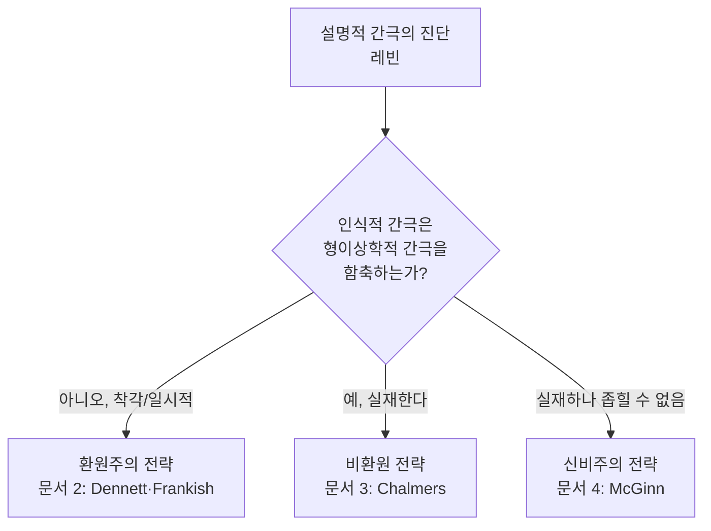

# 🔬 간극의 정밀 진단

> **Psyche L0** · Chapter 6: 설명적 간극과 그 전략 · 문서 1/5
> "C섬유가 발화한다"는 왜 "고통스럽다"를 설명하는 데 실패하는가 — 그 실패의 정확한 좌표를 찾는다.

설명적 간극(explanatory gap)은 의식 논쟁의 어떤 결론이 아니라, 논쟁이 시작되는 **출발점**이다. 조지프 레빈(Joseph Levine)이 1983년 논문 "Materialism and Qualia: The Explanatory Gap"에서 이 표현을 주조했을 때, 그의 목적은 물리주의를 반박하는 것이 아니었다. 오히려 그는 물리주의가 참일 **수도** 있음을 인정하면서, 그럼에도 불구하고 우리가 결코 만족스럽게 이해하지 못하는 무언가가 남는다고 진단했다. 이 미묘한 위치 — 형이상학적 결론을 유보한 채 인식적 결핍만을 정밀하게 짚어내는 것 — 이야말로 6장 전체를 여는 좌표계다. 간극을 어떻게 진단하느냐에 따라, 우리가 채택할 전략(환원·비환원·신비주의)이 갈라지기 때문이다.

## 🎯 핵심 질문

핵심 질문은 단순하지만 함정으로 가득하다. **"고통은 C섬유의 발화다"라는 동일성 진술이 참이라고 가정하더라도, 왜 이 진술은 다른 과학적 동일성처럼 우리를 만족시키지 못하는가?**

비교 대상을 명확히 하자. "물은 $H_2O$다"라는 동일성은, 일단 우리가 분자 구조와 화학 결합을 이해하면 더 이상 신비롭지 않다. 물의 모든 거시적 성질 — 끓는점, 어는점, 용매성, 표면장력 — 은 $H_2O$ 분자들의 행동으로부터 **연역적으로 따라 나온다**. "왜 물은 $H_2O$인데도 여전히 젖어 있을까?"라는 질문은 우문이다. 젖음 그 자체가 분자 수준 기술로 남김없이 해소되기 때문이다.

그런데 "고통은 C섬유 발화다"는 다르다. C섬유의 발화 패턴, 신경전달물질의 농도, 시냅스의 전기화학적 사건을 아무리 상세히 기술해도, "그런데 **왜** 그것이 이렇게 아픈 느낌이어야 하는가?"라는 질문은 끈질기게 살아남는다. 레빈의 진단은 이것이다: 물리적 기술과 현상적 사실 사이에는 $H_2O$ 사례에는 없는 **개념적 틈**이 있다. 이 틈을 정확히 어디에 위치시킬 것인가가 이 문서의 과제다.

## 🌍 어디서 마주치나

이 간극은 추상적 철학자의 발명품이 아니다. 일상과 임상과 과학의 여러 지점에서 그 윤곽이 드러난다.

**임상 마취학.** 마취과 의사는 환자의 의식 수준을 EEG의 BIS(Bispectral Index) 같은 지표로 모니터링한다. 그러나 지표가 알려주는 것은 "이 뇌 상태에서는 통상 경험이 없다"는 **상관적** 사실일 뿐, "지금 이 환자에게 느낌이 있는가 없는가"라는 현상적 사실을 직접 읽어내지는 못한다. 수술 중 각성(intraoperative awareness)의 드문 사례들은 이 간극이 환자의 생사가 걸린 문제로 비화함을 보여준다.

**신경과학 논문의 결론부.** 의식의 신경 상관물(NCC, Neural Correlates of Consciousness) 연구는 "상관물"이라는 단어에 정직하게 머문다. 어떤 뇌 영역의 활동이 특정 경험과 함께 나타난다는 발견은 풍부하지만, "함께 나타남"에서 "왜 그것이 그 경험**인가**"로 넘어가는 다리는 어느 논문도 놓지 못한다.

**일상의 색 경험.** 우리는 잘 익은 토마토를 보며 빨강을 경험한다. 그 빨강의 질감 — 무어라 형언하기 어려운 '빨강스러움' — 이 망막 원추세포의 흥분 비율($L:M:S$)과 시각피질 V4의 활동으로 어떻게 '구성되는지' 묻는 순간, 우리는 곧장 간극의 가장자리에 서 있다.

**철학 강의실의 진입로.** 의식 철학을 처음 접하는 학생은 거의 예외 없이 같은 지점에서 멈칫한다. 신경 기제에 관한 설명을 모두 따라온 뒤에도 "그래서 그게 왜 느낌이 되는가"라는 물음이 남는다는 경험. 레빈의 공헌은 이 막연한 멈칫거림에 정확한 이름과 좌표를 부여한 데 있다. 간극은 천재적 사변의 산물이 아니라, 충분히 정직하게 생각하는 사람이라면 누구나 부딪히는 공통의 벽이며, 레빈은 그 벽이 정확히 어디에 서 있는지를 측량했다.

## 🔍 직관의 함정

간극을 진단할 때 빠지기 쉬운 함정이 여럿 있고, 레빈 자신이 가장 경계한 것은 **인식적 간극을 형이상학적 결론으로 곧장 환산하는 도약**이다.

함정 1: **"이해할 수 없다 = 동일하지 않다."** "물리적 기술이 경험을 설명하지 못한다"에서 "따라서 경험은 물리적이지 않다"로 건너뛰는 것. 레빈은 이를 거부한다. 우리가 어떤 동일성을 이해하지 못한다는 사실은 그 동일성이 거짓임을 보증하지 않는다. 인식론적 결핍이 곧 존재론적 사실은 아니다.

함정 2: **"느낌은 명백하니 설명이 필요 없다."** 반대 방향의 함정. 현상적 경험이 직접 주어진다는 사실이 그것에 대한 설명 요구를 면제하지는 않는다. 직접성은 데이터이지 해명이 아니다.

함정 3: **상상가능성을 형이상학적 가능성과 즉시 동일시하기.** 좀비를 상상할 수 있다는 것이 곧 좀비가 형이상학적으로 가능함을 의미하는지는 별도의 논변을 요구한다(이 쟁점은 문서 3에서 본격화된다). 레빈의 진단은 이 강한 주장에 의존하지 **않는다**는 점이 그의 신중함의 핵심이다.

함정 4: **간극을 일시적 무지와 혼동하기.** 어떤 이는 "지금 설명 못 하는 것은 단지 신경과학이 어리기 때문이며, 시간이 해결한다"고 말한다. 그러나 레빈의 진단은 단순한 데이터 부족이 아니라 **연역적 경로의 개념적 부재**를 가리킨다. 더 많은 측정이 아니라, 측정 결과를 경험과 잇는 추론의 형식 자체가 보이지 않는다는 것이다. 이 구분을 흐리면 간극의 독특함이 사라진다 — 이것이 문서 2의 환원주의가 정면으로 다투어야 할 지점이기도 하다.

## ⚙️ 논증 구조

레빈의 진단을 형식적으로 재구성하면 다음과 같다.

전제 1. 성공적인 과학적 환원은 **연역적 설명 가능성**을 동반한다. 즉 미시 수준 기술 $P$와 교량 원리들이 주어지면, 거시 성질 $M$에 관한 사실들이 그로부터 도출 가능하다($P \models M$).

전제 2. 물–$H_2O$, 열–분자운동, 번개–전기방전 같은 표준 사례에서는 이 연역적 도출이 (원리적으로) 가능하다.

전제 3. 그러나 임의의 물리적 기술 $P$로부터 "그 상태가 **이러한** 현상적 특질을 갖는다"는 사실 $Q$는 연역적으로 도출되지 않는다. $P$를 완전히 받아들여도 $Q$는 항상 추가적 질문으로 남는다.

소결론. 따라서 물리–현상 관계에는 표준 환원에 없는 **설명적 간극**이 존재한다. $\square$(인식적 결론)

여기서 결정적인 절제가 작동한다. 레빈은 위 소결론에서 **형이상학적 결론을 도출하지 않는다.** "그러므로 물리주의는 거짓이다"는 추가 전제 없이는 따라 나오지 않는다. 간극은 우리의 **이해**에 관한 사실이지, 곧바로 세계의 **존재론**에 관한 사실이 아니다. 이 분리야말로 레빈 진단의 가장 정교한 부분이다.

## 🧪 증거와 사고실험

**$H_2O$ 대조 실험.** 사고 속에서 두 가설적 과학자를 세운다. 한 사람은 물의 분자 이론을 완성하고, 다른 한 사람은 통증의 신경 이론을 완성한다. 첫 번째 과학자에게 "왜 $H_2O$가 끓는가?"라고 물으면 그는 분자 간 인력과 운동에너지로 빈틈없이 답한다. 두 번째 과학자에게 "왜 이 신경 상태가 아픈 느낌인가?"라고 물으면, 그는 어느 지점에서 "그것은 그냥 그런 것이다"라고 말할 수밖에 없는 벽에 부딪힌다. 이 **비대칭**이 간극의 경험적 흔적이다.

**역전된 스펙트럼(inverted spectrum).** 기능적·물리적으로 나와 동일하면서도 빨강과 초록의 경험이 서로 뒤바뀐 사람을 정합적으로 상상할 수 있다는 직관. 이것이 정합적이라면, 물리·기능 사실은 현상적 특질을 고정하지 못한다 — 즉 간극이 있다. (이 사고실험의 무게는 4장에서 더 다루었고, 여기서는 간극의 **인식적** 측면을 부각하는 데만 쓰인다.)

**메리의 방.** 흑백 방에서 색에 관한 모든 물리적 사실을 배운 메리가 처음 빨강을 볼 때 무언가 새로운 것을 배운다는 직관. 만약 그렇다면, 물리적 사실의 총체가 현상적 사실을 함축하지 못한다는 — 적어도 우리가 그 함축을 **파악하지** 못한다는 — 증거가 된다. 다만 레빈의 진단 수준에서 중요한 것은 메리가 새로운 **사실**을 배우느냐(형이상학적 주장)가 아니라, 우리가 그 전이를 **선험적으로 예견하지** 못한다는 인식적 사실이다. 메리 논변의 강한 형이상학적 해석을 받아들이지 않더라도, 약한 인식적 해석만으로 간극의 존재는 충분히 진단된다.

**번개·열 대조의 보강.** 번개가 전기 방전이고 열이 분자 운동이라는 동일성도 처음에는 낯설었으나, 일단 거시 현상(섬광, 천둥, 뜨거움)이 미시 기술로부터 도출되는 경로가 드러나자 신비가 걷혔다. 현상의식이 이 패턴을 따르지 않는다는 점 — 미시 기술이 아무리 정교해져도 '느껴짐'으로의 도출 경로가 열리지 않는다는 점 — 이 간극의 끈질김을 보여주는 누적 증거다.

## 🌉 설명적 간극

이 문서는 간극 그 자체를 주제로 삼으므로, 여기서는 간극을 **두 종류로 해부**한다. 이 구분이 6장 나머지 전체의 분기점이다.

**인식적 간극(epistemic gap).** 물리적 사실과 현상적 사실 사이에 **설명·연역·이해**의 결핍이 있다는 주장. 이것은 우리의 개념과 인지적 접근에 관한 명제다. 레빈의 1차 진단은 정확히 여기에 머문다.

**형이상학적 간극(metaphysical gap).** 물리적 사실과 현상적 사실이 실제로 **별개의 존재론적 사실**이라는 주장. 즉 현상성은 물리성에 의해 형이상학적으로 결정되지 않는다.

두 간극의 관계가 전략을 가른다:

핵심 통찰: 모든 전략은 레빈의 **인식적** 간극을 출발점으로 공유한다. 그들이 갈라지는 곳은 "이 인식적 간극이 세계에 관해 무엇을 말해주는가"라는 단 하나의 물음에 대한 답이다.

## 🧬 횡단 원리

여러 영역을 가로지르는 추상적 진단 원리를 추출한다.

**원리 (설명적 연역 가능성, Explanatory Deducibility).** 어떤 환원 $R: P \to M$이 설명적으로 만족스러우려면, 충분히 이상화된 인식자가 $P$와 교량 법칙으로부터 $M$의 성립을 선험적(a priori) 추론으로 도출할 수 있어야 한다. 형식적으로:
$$\text{Satisfying}(R) \iff \big( P \wedge \text{BridgeLaws} \big) \vdash_{a\text{-}priori} M$$

이 원리를 물리–현상 관계에 적용하면, 우변이 성립하지 않는 것처럼 보이는 것이 곧 간극이다. 이 원리는 물리학·화학·생물학의 모든 성공적 환원을 가로질러 작동하지만, 현상의식 앞에서만 유독 깨지는 듯 보인다는 점이 진단의 핵심 데이터다.

## 🪞 1인칭

3인칭 기술과 1인칭 관점의 비대칭을 직접 마주해 보자. 지금 당신이 이 문장을 읽으며 가지는 시각 경험 — 흰 바탕 위 검은 글자의 대비, 그 선명함 — 을 생각하라. 이 경험은 당신에게 **무엇인가를 띤(what-it-is-like)** 상태로 직접 주어진다.

이제 상상하라. 누군가 당신의 뇌를 완벽히 스캔해 모든 뉴런의 상태를 기록했다. 그 기록을 아무리 정독해도, 그 안에서 당신은 **지금 이 선명함**을 발견할 수 있는가? 데이터는 "이 뉴런들이 이렇게 발화 중"이라고 말할 뿐, "그리고 그것은 이렇게 느껴진다"는 한 줄을 어디에 적어야 할지 알려주지 않는다. 1인칭이 직접 아는 그것을, 3인칭 기술은 가리킬 수는 있어도 **담아낼** 수는 없다 — 이것이 간극의 체험적 핵심이다.

## 📐 예측·반증

간극 진단은 추상적이지만 검증 가능한 함의를 낳는다.

**예측 1 (환원주의가 옳다면).** 신경과학이 성숙함에 따라, "왜 이 상태가 이렇게 느껴지는가"라는 질문이 점차 **잘못 던져진 질문**으로 해소되어야 한다. 마치 "생명력(élan vital)은 무엇인가"가 분자생물학의 발전과 함께 증발했듯이.

**예측 2 (비환원주의가 옳다면).** 아무리 신경과학이 발전해도, 현상적 특질을 물리 법칙만으로 도출하는 과제는 영구히 미완으로 남고, 새로운 **교량 원리**(심리물리 법칙)를 추가해야만 진전이 생긴다.

**반증 조건.** 만약 어떤 이론이 임의의 현상적 특질 $Q$에 대해 그것이 왜 **다른** 특질이 아닌 바로 $Q$여야 하는지를 선험적으로 도출해 보인다면, 레빈의 진단(전제 3)은 반증된다. 현재까지 이런 도출을 성공시킨 이론은 없다는 것이 정직한 현황이다.

## 🤔 다음 질문

진단을 마쳤으니 처방으로 넘어간다. 인식적 간극은 분명 존재하는 것처럼 보인다. 그렇다면 이것이 무엇을 의미하는가? 세 갈래의 길이 있다. 첫째, 간극은 **착각**이며 더 나은 개념을 갖추면 사라진다(문서 2). 둘째, 간극은 **실재**하며 자연을 보는 우리의 그림 자체를 확장해야 한다(문서 3). 셋째, 간극은 실재하지만 인간 인지의 구조적 한계로 인해 **원리상 좁힐 수 없다**(문서 4). 다음 문서는 첫 번째 길, 즉 간극을 설명해 없애려는 환원주의 전략을 추적한다.

---

🧩 **Principle** — 설명적 간극은 일차적으로 **인식적** 사실(설명·연역의 결핍)이며, 형이상학적 결론은 추가 전제 없이는 도출되지 않는다.
🌉 **Boundary** — 인식적 간극과 형이상학적 간극의 분리선이 곧 환원·비환원·신비주의가 갈라지는 분기점이다.
🪞 **Experience** — 1인칭이 직접 아는 '이렇게 느껴짐'을, 3인칭 신경 기술은 가리킬 수는 있어도 담아내지는 못한다.

## 📝 연습문제

<b>기초</b> — $H_2O$ 사례와 통증 사례의 핵심 차이

**문제:** "물은 $H_2O$다"가 만족스러운 환원인 반면 "고통은 C섬유 발화다"가 만족스럽지 못한 이유를, 레빈의 '연역적 설명 가능성' 개념을 사용해 한 문단으로 설명하라.

**해설:** 핵심은 거시 성질의 **선험적 도출 가능성**이다. $H_2O$ 사례에서는 물의 거시적 성질(끓음, 젖음 등)이 분자 수준 기술과 물리 법칙으로부터 원리적으로 연역된다 — "왜 여전히 젖어 있는가"라는 잔여 질문이 남지 않는다. 반면 C섬유 사례에서는 신경 기술을 완전히 받아들여도 "왜 그것이 **이렇게** 느껴지는가"가 추가 질문으로 살아남는다. 즉 $(P \wedge \text{BridgeLaws}) \vdash Q$가 성립하지 않는 것처럼 보인다. 이 연역적 결핍이 곧 설명적 간극이다.

<b>심화</b> — 인식적/형이상학적 간극의 분리가 왜 중요한가

**문제:** 레빈이 인식적 간극에서 형이상학적 결론으로 도약하기를 거부한 것이, 6장의 세 전략(환원·비환원·신비주의)을 분류하는 데 어떻게 기여하는지 논하라.

**해설:** 만약 인식적 간극이 곧 형이상학적 간극을 함축한다면, 환원주의는 출발점에서부터 배제되어 논쟁이 성립하지 않는다. 레빈이 두 간극을 분리해 둠으로써, 동일한 출발점(인식적 간극의 존재)을 공유하면서도 "이것이 세계에 관해 무엇을 말하는가"에서 갈라지는 세 입장이 모두 정합적 선택지로 남는다. 환원주의는 인식적 간극을 인정하되 형이상학적 함의를 부정하고(착각·일시적 무지), 비환원주의는 인식적 간극을 형이상학적 간극의 증거로 읽으며, 신비주의는 형이상학적 간극의 실재를 인정하되 그것을 좁힐 인지 능력의 부재를 주장한다. 분리가 없으면 이 삼분법 자체가 무너진다.

<b>논문 비평</b> — 간극은 진단인가 결론인가

**문제:** 어떤 비평가는 "레빈의 설명적 간극은 단지 현재 과학의 미성숙을 반영하는 일시적 무지에 불과하며, 독립된 철학적 문제가 아니다"라고 주장한다. 이 비평을 레빈의 입장에서 평가하고, 비평이 놓치는 지점과 정당한 지점을 각각 지적하라.

**해설:** 비평의 **정당한** 지점: 레빈 자신도 간극이 형이상학적 결론을 보증하지 않는다고 인정하므로, "일시적 무지일 가능성"을 원리적으로 배제하지 않는다 — 이 점에서 비평은 레빈의 신중함과 오히려 일치한다. 비평이 **놓치는** 지점: 레빈의 진단은 단순한 '아직 모름'이 아니라 **구조적 비대칭**을 지적한다. 다른 모든 성공적 환원에서는 연역적 도출의 경로가 원리상 보이는데, 현상의식에서만 그 경로 자체가 개념적으로 차단된 것처럼 보인다. 이 비대칭은 "더 많은 데이터"로 메워질 종류의 무지와 질적으로 다르다. 따라서 비평이 간극을 일상적 미성숙으로 환원하려면, 왜 유독 이 영역에서만 연역의 경로가 보이지 않는지를 별도로 설명해야 하는 부담을 진다. 이 부담을 지는 것이 바로 문서 2의 환원주의 전략이다.

[◀ 이전: 범심론의 매력과 한계](../ch5-panpsychism-monism/04-panpsychism-appeal-limits.md) · [📚 README](../README.md) · [다음: 환원주의적 전략 ▶](./02-reductive-strategy.md)

