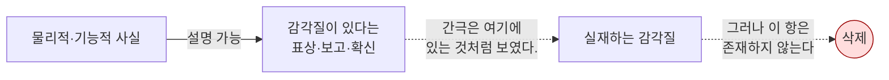

# 🪓 환원주의적 전략

> **Psyche L0** · Chapter 6: 설명적 간극과 그 전략 · 문서 2/5
> 간극은 메워야 할 구덩이가 아니라 **착시**다 — 데닛과 프랭키시는 감각질 개념 자체를 해체함으로써 간극을 설명해 없앤다.

레빈의 진단(문서 1)은 인식적 간극이 **있다**는 데서 멈췄다. 환원주의 전략은 그 다음 한 걸음을 가장 과감하게 내딛는다: 이 간극은 세계의 틈이 아니라 **우리 개념틀의 결함이 만들어낸 환영**이라는 것. 대니얼 데닛(Daniel Dennett)과 키스 프랭키시(Keith Frankish)로 대표되는 이 노선은 "간극을 어떻게 메울까"라는 질문 자체를 거부한다. 메울 간극이 없기 때문이다. 대신 그들은 묻는다: **왜 우리는 메울 수 없는 간극이 있다고 그토록 강하게 느끼는가?** 이 물음의 전환 — 형이상학적 문제에서 인지심리학적 문제로의 이동 — 이 환원주의 전략의 정체성이다. 본 문서는 이 전략을 가장 강한 형태로 재구성하고, 그것이 무엇을 지키기 위해 무엇을 포기하는지 정직하게 셈한다.

## 🎯 핵심 질문

환원주의 전략의 핵심 질문은 두 겹이다. 표면 질문: **현상적 경험(감각질)은 표상적·기능적 사실로 남김없이 환원되는가?** 심층 질문: **만약 그렇다면, 왜 우리에게는 환원 불가능한 무언가가 있다는 강력한 직관이 생기는가?**

두 번째 질문이 결정적이다. 환원주의자는 직관이 틀렸다고 주장하는 데 그치지 않는다. 그들은 **틀린 직관이 왜 그토록 설득력 있게 느껴지는지를 설명할 의무**를 스스로 떠안는다. 이것이 단순한 부정과 환원주의를 가르는 지점이다. 단순한 부정은 "감각질? 그런 건 없어"로 끝나지만, 환원주의는 "감각질이 있다는 강력한 인상이 어떻게 비감각질적 메커니즘에서 발생하는지"를 보여주려 한다. 프랭키시가 이를 **"착각 문제(illusion problem)"**라 부르는 이유다 — 진짜 어려운 문제(hard problem)를 대체하는, 풀 수 있는 문제로서.

## 🌍 어디서 마주치나

**시각 착시의 일상.** 우리는 정지된 그림에서 움직임을 보고(착시), 존재하지 않는 윤곽선을 본다(카니자 삼각형). 시각계는 세계를 직접 중계하는 창이 아니라, 적극적으로 **모델을 구성**한다. 환원주의자는 의식 그 자체가 이런 종류의 사용자 환영(user illusion)이라고 본다.

**컴퓨터의 바탕화면 비유.** 데닛이 즐겨 쓰는 비유. 화면 위 폴더 아이콘은 실리콘 어딘가에 '진짜 폴더'로 존재하지 않는다. 그것은 사용자가 복잡한 하부 과정을 다루게 해주는 **유용한 인터페이스**다. 의식의 풍부한 질감도 뇌가 자기 자신을 위해 만든 단순화된 인터페이스라는 것.

**임상 현상.** 무시증(neglect), 맹시(blindsight), 변화맹(change blindness) 같은 현상은, 우리의 의식 경험이 우리가 믿는 만큼 풍부하거나 연속적이지 않음을 보여준다. 환원주의는 이를 "감각질의 직접성"이라는 인상이 사실은 뇌의 사후 편집이 빚은 구성물이라는 증거로 읽는다.

**마술과 주의의 조작.** 무대 마술사는 관객의 주의를 조작해 '명백히 본' 것을 놓치게 만든다. 우리가 "내 시야는 선명하고 완전하다"고 확신하는 바로 그 순간에도, 시야 주변부의 해상도는 형편없고 안구는 끊임없이 도약운동(saccade)을 한다. 환원주의는 이 괴리 — 경험의 실제 빈약함과 '풍부하다는 인상' 사이의 괴리 — 를, 의식이 직접 중계가 아니라 적극적 구성임을 보여주는 일상적 증거로 본다.

## 🔍 직관의 함정

환원주의가 겨냥하는 함정은, 역설적으로, **간극을 실재로 받아들이는 직관 그 자체**다.

함정 1: **"느낌은 직접 주어지므로 의심할 수 없다."** 환원주의는 이 데카르트적 확실성을 공격한다. 우리가 "직접 주어진다"고 느끼는 것조차 뇌의 보고 메커니즘이 생성한 **이차적 판단**일 수 있다. '직접성의 인상'과 '실제 직접성'은 다르다.

함정 2: **"질문이 의미 있게 보이므로 답이 있어야 한다."** "왜 빨강은 이렇게 느껴지는가"가 잘 형성된 질문처럼 보인다는 사실이, 그것이 실제로 잘 형성된 질문임을 보증하지 않는다. 데닛은 이것이 "생명력은 어디에 있는가" 같은 **사이비 질문**일 수 있다고 본다.

그러나 환원주의 자신도 함정에 빠질 위험이 있다 — **"설명하기 어려운 것을 존재하지 않는다고 선언하기."** 이것이 비판자들이 말하는 "설명해 없애기(explaining away)"의 위험이며, 이 전략의 가장 큰 비용이다. 문서 모토 "Explain it, don't explain it away"는 바로 이 노선을 향한 경고로 읽힐 수 있다.

## ⚙️ 논증 구조

환원주의(특히 환상주의) 논증을 형식화한다.

전제 1. 현상적 속성(phenomenal property)이 **실재**한다면, 그것은 물리·기능 사실로 환원되지 않는 내재적·사적·직접적으로 알려지는 속성이어야 한다(감각질의 표준 정의).

전제 2. 그러나 그런 비물리적·내재적 속성을 물리 세계에 위치시키는 것은 인과적·존재론적으로 감당할 수 없는 비용을 낳는다(인과 폐쇄성 위반, 자연주의와의 충돌).

전제 3. 한편, **현상적 속성이 있다는 강력한 인상(introspective report)**은 순수하게 기능적·표상적 메커니즘으로 설명될 수 있다. 즉 뇌가 자신의 상태를 "환원 불가능한 질"을 가진 것으로 **표상**하도록 진화/구성되었다고 보면 인상이 설명된다.

소결론. 따라서 가장 절약적인(parsimonious) 해석은, 현상적 속성은 실재하지 않으며 다만 우리가 그것을 갖는다는 **강력한 표상적 착각**만이 실재한다는 것이다. 어려운 문제는 착각 문제로 대체된다. $\square$

데닛의 약한 버전(이종현상학, heterophenomenology)은 전제 3에 무게를 두되 존재론적 부정까지 가지 않을 수 있고, 프랭키시의 강한 버전(환상주의, illusionism)은 소결론의 부정을 명시적으로 채택한다. 두 버전 모두 핵심은 **설명 대상의 재정의**다: 설명해야 할 것은 '감각질'이 아니라 '감각질이 있다는 보고와 확신'이다.

## 🧪 증거와 사고실험

**색 채움(color filling-in)과 변화맹.** 망막의 맹점에는 광수용기가 없지만 우리는 그곳에 구멍을 느끼지 않는다. 뇌가 주변 정보로 '채운다'. 데닛은 묻는다 — 뇌가 정말로 픽셀을 채워 넣는가, 아니면 단지 "거기에 무언가 있다"고 **판단**할 뿐인가? 후자라면, 풍부한 현상적 채움이라는 인상은 실제 채움 없이도 발생한다. 즉 인상과 실재가 분리된다.

**다중원고 모델(Multiple Drafts Model).** 데닛은 의식 경험이 단일한 "데카르트 극장"의 무대 위에서 한 번에 상영된다는 그림을 거부한다. 뇌에는 여러 병렬 처리의 초안들이 있을 뿐, "이제 이것이 의식된다"고 도장 찍는 중앙 무대는 없다. 색 위상(color phi) 실험 등은 의식의 시간 순서가 사후적으로 편집됨을 시사하며, 이는 '직접 주어지는 통일된 현상장'이라는 인상을 약화한다.

**환상주의의 자기 적용.** 프랭키시는 자신의 주장을 사고실험으로 강화한다: 만약 어떤 시스템이 "나는 환원 불가능한 질을 경험한다"고 진심으로 보고하도록 만들어졌다면, 그 시스템의 보고는 — 실제로 그런 질이 있든 없든 — 동일할 것이다. 그렇다면 보고의 존재는 질의 존재를 증거하지 못한다. 보고만으로 충분하다면, 절약 원리는 질을 잘라낸다.

**생기론과의 역사적 유비.** 환원주의가 즐겨 드는 보강 사례는 생기론(vitalism)의 운명이다. 한때 생명은 물리·화학으로 환원 불가능한 '생명력'을 요구한다고 여겨졌고, "물질이 어떻게 살아 있을 수 있는가"는 당대의 '어려운 문제'였다. 그러나 분자생물학이 대사·복제·유전을 메커니즘으로 풀어내자, 생명력은 메워야 할 간극이 아니라 **잘못 설정된 개념**으로 증발했다. 데닛은 의식의 어려운 문제가 정확히 이 경로를 밟으리라 예측한다 — 신비는 풀리는 것이 아니라 **해소**된다. 비판자들은 이 유비의 비대칭(생명은 3인칭 현상, 의식은 1인칭 현상)을 지적하지만, 환원주의에게 이 사례는 "해소"가 정당한 과학적 전략임을 보여주는 전례다.

## 🌉 설명적 간극

환원주의의 간극 처리 방식이 이 전략의 정수다. 그들은 간극을 **메우지** 않는다. 간극의 **위치를 옮긴다.**

레빈의 원래 간극은 [물리적 사실] ↔ [현상적 사실] 사이에 있었다. 환원주의는 이렇게 재배치한다:

핵심: 간극은 [물리]와 [현상] 사이가 아니라, [물리]와 [현상이 있다는 **인상**] 사이에 있는 것으로 재서술된다. 그런데 이 후자의 간극은 — 환원주의에 따르면 — 인지과학으로 메울 수 있는 보통의 설명 과제다. 왜 뇌가 자신을 그렇게 표상하는지는 진화적·기능적으로 설명 가능하기 때문이다. 어려운 문제를 **메타 문제(meta-problem of consciousness)**로 변환하는 것 — 이것이 환원주의의 간극 처리법이다. 데닛이 "어려운 문제는 환상의 보고를 설명하는 문제로 녹아든다"고 말하는 지점이다.

## 🧬 횡단 원리

**원리 (절약과 보고 등가성, Parsimony & Report-Equivalence).** 어떤 시스템의 1인칭 보고 $B$가 가설 $H_1$(실재하는 감각질)에서도 $H_2$(감각질 없는 표상 메커니즘)에서도 동일하게 산출된다면($H_1 \to B$ 이고 $H_2 \to B$), 추가 존재론적 부담을 지지 않는 $H_2$가 선호된다.
$$\text{만약 } P(B \mid H_2) \approx P(B \mid H_1) \text{ 이고 } H_2 \text{가 더 절약적이면, } H_2 \text{ 채택}$$

이 원리는 생기론 폐기, 천체의 주전원 폐기 등 과학사의 환원적 승리들을 가로지른다. 환원주의는 의식을 이 동일한 패턴의 다음 사례로 위치시킨다. 비판자의 반론도 바로 이 원리에 집중된다: 보고 등가성이 성립하려면 **설명될 것이 보고뿐**이어야 하는데, 1인칭에게는 보고 이전에 경험 자체가 데이터로 주어진다는 것(문서 3의 응수).

## 🪞 1인칭

환원주의가 1인칭과 맺는 관계는 긴장으로 가득하다. 데닛은 1인칭 데이터를 무시하지 않는다 — 그는 그것을 **이종현상학적 텍스트**로 진지하게 수집한다. 즉 "피험자가 자신의 경험에 관해 무엇을 믿고 보고하는가"를 객관적 데이터로 다룬다. 그러나 결정적 한 걸음에서 그는 멈춘다: 그 보고가 **참인지**는 별도 문제다.

여기서 1인칭의 항변이 가장 날카롭게 터진다. "내가 지금 빨강을 경험한다는 것은, 내가 그렇게 **보고한다**는 것보다 더 확실하다. 보고는 틀릴 수 있어도, 무언가가 나에게 나타나고 있다는 사실 자체는 의심 불가능하다." 환원주의의 응답은 단호하다: 그 '의심 불가능성의 느낌'조차 뇌가 생성한 표상의 한 속성일 수 있다. 즉 "이것은 직접적이고 확실하다"는 메타-판단이 메커니즘의 산물이라는 것. 1인칭은 이 응답을 **선결문제 요구**라 비난하고, 환원주의는 이를 **확실성의 자연화**라 옹호한다. 이 교착이 전략의 가장 깊은 균열이다.

## 📐 예측·반증

**예측 1.** 내성적 보고의 메커니즘이 신경과학적으로 추적 가능해질수록, "왜 환원 불가능한 질이 있다고 느끼는가"에 대한 기능적 설명이 누적되어야 한다. 메타 문제는 점진적으로 풀려야 한다.

**예측 2.** 감각질이 진정 비기능적이라면, 기능을 모두 보존한 채 감각질만 조작하는 개입은 불가능해야 한다 — 즉 모든 경험 변화에는 추적 가능한 기능적 상관자가 동반된다(역전 스펙트럼의 경험적 불성립 예측).

**반증 조건 1.** 만약 기능적·표상적으로 **완전히 동등**한 두 상태가 신뢰할 만한 방식으로 다른 경험을 동반함이 입증된다면, 보고 등가성 원리가 깨지고 환상주의는 타격을 입는다.

**반증 조건 2.** 환원주의의 메타 문제 프로그램이 원리적으로 진전 불가능함이 드러난다면 — 즉 "왜 그런 인상이 생기는가"조차 기능적으로 설명할 수 없다면 — 전략의 핵심 약속이 공허해진다. 다만 비판자들은 이 반증이 환원주의가 아니라 비환원주의로의 통로일 수 있다고 본다.

## 🤔 다음 질문

환원주의는 자연주의와 과학적 절약을 지키는 대신, 가장 직접적인 1인칭 데이터를 '착각'으로 격하하는 비용을 치른다. 비판자에게 이것은 문제를 푸는 것이 아니라 **부정하는** 것이다. 그렇다면 정반대의 길은 어떤가? 인식적 간극을 액면 그대로 형이상학적 간극의 증거로 받아들이고, 자연 그림 자체를 확장하려는 시도 — 차머스의 비환원적 전략으로 넘어간다. 그것이 무엇을 지키고 무엇을 포기하는지가 다음 문서의 주제다.

---

🧩 **Principle** — 1인칭 보고가 '실재하는 감각질'과 '질 없는 표상 메커니즘' 양쪽에서 동일하게 산출된다면, 절약 원리는 후자를 선택한다.
🌉 **Boundary** — 환원주의는 간극을 메우지 않고 [물리]↔[현상이 있다는 인상] 사이로 **이동**시켜, 어려운 문제를 풀 수 있는 메타 문제로 변환한다.
🪞 **Experience** — '경험의 직접성·확실성'조차 뇌가 생성한 표상의 속성일 수 있다는 주장에서, 환원주의와 1인칭의 가장 깊은 교착이 발생한다.

## 📝 연습문제

<b>기초</b> — 착각 문제 vs 어려운 문제

**문제:** 프랭키시의 "착각 문제(illusion problem)"가 차머스의 "어려운 문제(hard problem)"를 어떻게 **대체**하는지 설명하라. 두 문제의 설명 대상(explanandum)이 어떻게 다른가?

**해설:** 어려운 문제의 설명 대상은 **현상적 경험 그 자체** — "왜 물리적 과정이 주관적 느낌을 동반하는가"다. 환상주의는 이 대상이 실재하지 않는다고 보므로, 이 문제를 풀 수 없는 것이 아니라 **풀 필요가 없는** 사이비 문제로 본다. 대신 설명 대상을 바꾼다: "왜 우리는 환원 불가능한 현상적 질을 가진다는 강력한 인상과 확신을 갖는가." 이것이 착각 문제다. 그 설명 대상은 경험이 아니라 **경험이 있다는 보고·믿음·인상**이며, 이는 기능적·표상적 메커니즘으로 추적 가능한 보통의 인지과학 문제라는 것이 환상주의의 핵심 주장이다.

<b>심화</b> — 보고 등가성 원리의 부담

**문제:** 환원주의의 '보고 등가성 + 절약' 논증은 $P(B \mid H_2) \approx P(B \mid H_1)$를 전제한다. 비환원주의자는 이 전제의 어디를 공격할 수 있는가? 그 공격이 성공하려면 무엇을 보여야 하는가?

**해설:** 비환원주의자의 공격점은 **설명 대상이 보고 $B$에 국한된다는 가정** 자체다. 환원주의는 "설명할 것은 보고뿐"이라고 전제하지만, 비환원주의는 1인칭에게는 보고 이전에 **경험 자체**가 데이터로 주어진다고 본다. 이 경우 $H_1$은 보고뿐 아니라 경험의 존재까지 설명하는 반면 $H_2$는 보고만 설명하므로, 두 가설은 동일한 설명 대상을 다루지 않게 되어 절약 비교가 성립하지 않는다. 이 공격이 성공하려면 비환원주의자는 "경험이 보고와 독립된 데이터다"를 — 단지 가정이 아니라 — 옹호해야 하며, 이것이 곧 문서 3에서 차머스가 떠안는 입증 부담이다. 즉 교착은 "무엇이 설명 대상인가"라는 메타 수준의 불일치로 귀착된다.

<b>논문 비평</b> — '설명해 없애기'는 정당한 환원인가

**문제:** 한 비평가는 "환상주의는 의식을 환원한 것이 아니라 부정한 것이며, 이는 데이터를 설명하는 대신 데이터를 폐기하는 부당한 수법"이라고 주장한다(모토 "Explain it, don't explain it away"의 정신). 이 비평을 환상주의 옹호자의 입장에서 반박하고, 그 반박이 여전히 남기는 잔여 부담을 지적하라.

**해설:** 환상주의자의 **반박**: 모든 성공적 환원은 어떤 의미에서 "설명해 없애기"였다. 생기론의 '생명력', 연소설의 '플로지스톤'은 부정되었지만, 그것이 설명하려던 현상(생명·연소)은 더 깊은 메커니즘으로 재서술되었다 — 부정된 것은 잘못 가정된 존재자이지 현상이 아니다. 마찬가지로 환상주의는 '경험'을 폐기하는 것이 아니라 '비물리적 감각질'이라는 잘못 가정된 존재자만 폐기하고, 그것이 산출하던 현상(보고·확신)은 메커니즘으로 재서술한다는 것. 따라서 정당한 환원이라는 주장이다. **잔여 부담**: 그러나 생기론 사례와의 결정적 비대칭이 남는다 — 생명의 경우 '설명될 현상'이 3인칭으로 접근 가능했던 반면, 의식의 경우 '설명될 현상'(나타남 자체)이 정확히 1인칭 데이터이며, 환상주의는 바로 이 데이터의 실재성을 부정해야 한다. 즉 환상주의는 "현상은 보존하고 가정만 폐기한다"는 자기 변론을 의식에 적용하려면, '나타남'이 보고와 구별되는 별도의 현상이 **아님**을 입증해야 하는데, 이것이야말로 논쟁의 핵심 쟁점이므로 선결문제 요구의 혐의를 완전히 벗기 어렵다. 비평은 이 비대칭을 정확히 겨냥할 때 가장 강하다.

[◀ 이전: 간극의 정밀 진단](./01-diagnosing-the-gap.md) · [📚 README](../README.md) · [다음: 비환원적 전략 ▶](./03-nonreductive-strategy.md)

