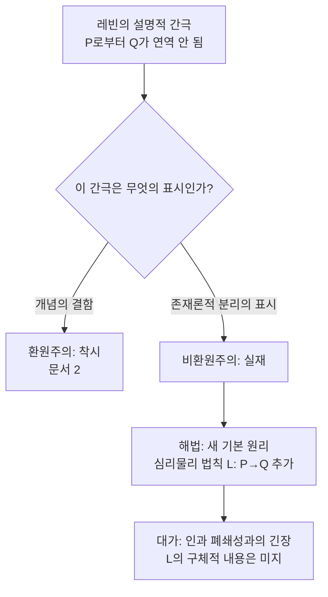

# 🌌 비환원적 전략

> **Psyche L0** · Chapter 6: 설명적 간극과 그 전략 · 문서 3/5
> 간극은 착시가 아니라 자연의 진짜 이음매다 — 차머스는 물리 법칙에 경험을 잇는 **새 기본 원리**를 요청한다.

문서 2의 환원주의가 "간극은 우리 개념의 결함"이라 진단했다면, 비환원적 전략은 정반대로 출발한다: **간극은 우리의 결함이 아니라 자연의 사실이다.** 데이비드 차머스(David Chalmers)가 1995–1996년에 제기한 "어려운 문제(hard problem)"는 이 전략의 깃발이다. 그의 주장은 도발적이면서도 정교하다 — 물리주의를 버리되 자연주의는 지키겠다는 것. 즉 경험을 비물리적인 무엇으로 인정하되, 그것을 신비나 영혼이 아니라 **자연의 추가적 기본 요소**로 위치시킨다. 이를 그는 "자연주의적 이원론(naturalistic dualism)" 또는 속성 이원론으로 부른다. 본 문서는 이 전략이 어떻게 간극을 형이상학적으로 진지하게 받아들이는지, 그리고 그 대가로 어떤 부담 — 인과 폐쇄성과의 긴장, 심리물리 법칙의 미지 — 을 떠안는지를 추적한다.

## 🎯 핵심 질문

핵심 질문: **물리적 사실의 총체가 주어져도 현상적 사실이 그로부터 따라 나오지 않는다면, 현상성을 자연에 통합하기 위해 무엇을 추가해야 하는가?**

차머스의 진단은 레빈의 인식적 간극을 형이상학적 결론으로 끌어올린다. 그의 논리: 만약 물리적 사실 $P$로부터 현상적 사실 $Q$가 선험적으로 **연역되지 않을** 뿐 아니라, $P$가 모두 성립하면서 $Q$가 다른('좀비' 시나리오) 상황을 **상상할 수 있다면**, 이는 $Q$가 $P$에 의해 형이상학적으로 결정되지 않음을 시사한다. 그렇다면 자연의 완전한 기술에는 $P$ 외에 현상적 사실 또는 그것을 산출하는 **심리물리 법칙**이 추가되어야 한다. 쉬운 문제들(easy problems) — 주의, 변별, 보고, 통합 — 은 기능의 문제이므로 결국 물리적으로 풀린다. 그러나 "왜 기능 수행에 **경험이 동반**되는가"라는 어려운 문제는 기능 설명으로 환원되지 않는다는 것이 출발점이다.

## 🌍 어디서 마주치나

**물리학의 기본 법칙 구조.** 물리학은 질량·전하·시공간 같은 기본량을 더 근본적인 것으로 환원하지 않고 **기본 요소**로 받아들인다. 맥스웰이 전자기를 별도 법칙으로 도입했듯이. 차머스는 경험도 이런 지위의 후보일 수 있다고 본다 — 환원이 아니라 **목록 추가**.

**정보 이론과의 접점.** 차머스는 정보가 물리적 측면과 현상적 측면이라는 두 양상을 가질 수 있다는 사변(이중상 정보, double-aspect of information)을 제시했다. 이는 통합정보이론(IIT) 같은 경험과학 프로그램과 느슨하게 공명한다 — 의식을 특정 정보 구조와 법칙적으로 연결하려는 시도들.

**인공지능과 의식의 분리 가능성 물음.** "이 시스템은 기능을 다 수행하는데 경험은 있는가?"라는 물음이 진지하게 제기되는 곳마다, 기능과 경험을 원리적으로 분리하는 비환원적 직관이 작동하고 있다. 대규모 언어모델이 인간처럼 유창하게 "나는 느낀다"고 보고할 때, 우리가 여전히 "그래도 정말 느끼는가"를 묻게 된다는 사실 자체가, 기능적 수행과 현상적 경험을 별개로 보는 직관의 끈질김을 드러낸다. 비환원주의는 이 직관을 변칙이 아니라 데이터로 받아들인다.

## 🔍 직관의 함정

비환원적 전략은 강력한 직관에 기대지만, 바로 그 직관들이 함정이 될 수 있음을 차머스 자신이 의식한다.

함정 1(반대편의 함정): **"느낌이 명백하니 그것은 비물리적이다."** 이것은 너무 빠른 도약이다. 차머스의 논증은 단순한 명백성이 아니라 **상상가능성–가능성 연결**이라는 정교한 다리를 거쳐야 한다.

함정 2(자기 진영의 함정): **상상가능성을 형이상학적 가능성과 무비판적으로 동일시하기.** 좀비를 일관되게 상상할 수 있다는 것에서 좀비가 형이상학적으로 가능하다는 결론으로 가려면, "이상적 1차 상상가능성은 가능성을 함축한다"는 강한 전제가 필요하다. 이 전제는 논쟁적이며(후술), 차머스는 이를 2차원 의미론으로 방어하지만 모두가 수긍하지는 않는다.

함정 3: **이원론 = 비과학.** 비환원주의를 곧 영혼·초자연으로 오해하는 함정. 차머스의 자연주의적 이원론은 심리물리 관계를 **법칙적·규칙적**으로 보므로, 원리상 경험과학과 양립한다. 다만 그 법칙이 환원적이지 않을 뿐이다.

## ⚙️ 논증 구조

차머스의 반물리주의 논증(상상가능성 논변)을 형식화한다.

전제 1 (상상가능성). 물리적 복제(좀비)가 현상적 의식을 결여한 상황 $Z$를 우리는 일관되게 상상할 수 있다 — 즉 $Z$는 선험적으로 모순이 아니다. $\text{Conceivable}(Z)$.

전제 2 (상상가능성→가능성). 이상적으로 정합적인 1차 상상가능성은 형이상학적 가능성을 함축한다. $\text{Conceivable}(Z) \Rightarrow \text{Possible}(Z)$.

전제 3. $Z$가 형이상학적으로 가능하다면, 현상적 사실 $Q$는 물리적 사실 $P$에 의해 형이상학적으로 결정되지 않는다($P$가 $Q$를 수반(supervene)하지 않는다).

소결론 A. 따라서 물리주의(모든 사실이 물리적 사실에 수반한다는 명제)는 거짓이다. $\square$

보완 논증(자연주의 보존). 그럼에도 현상적 사실은 물리적 사실과 **법칙적으로** 상관한다(같은 뇌 상태엔 같은 경험). 따라서 둘을 잇는 기본적 심리물리 법칙 $L: P \to Q$가 존재한다. 이 $L$은 환원 법칙이 아니라 **기본 법칙(fundamental law)**이며, 자연의 목록에 추가되어야 한다. 결론: 속성 이원론 + 자연주의. $\square$

논증의 무게중심은 전제 2다. 차머스는 2차원 의미론을 통해 "1차 내포에서의 상상가능성"이 가능성을 함축한다고 방어하며, "물=$H_2O$" 같은 후험적 필연성 반례가 현상 개념에는 적용되지 않는다고 논한다 — 현상 개념은 1차 내포와 2차 내포가 일치하는 특수한 개념이라는 것이다.

## 🧪 증거와 사고실험

**철학적 좀비(zombie).** 나와 분자 하나까지 동일하지만 내적 경험이 전혀 없는 존재. 이것이 정합적으로 상상 가능하다면, 물리 사실은 경험 사실을 고정하지 못한다. 좀비 논변은 비환원 전략의 중심 무기다.

**메리의 방(지식 논변, Frank Jackson).** 색에 관한 모든 물리적 사실을 흑백 방에서 습득한 메리가 처음 빨강을 볼 때 **새로운 사실**을 배운다. 만약 그렇다면 물리적 사실의 총체가 현상적 사실을 포함하지 못한다. 차머스는 이를 자기 입장의 강력한 보강 증거로 삼는다.

**역전된 스펙트럼.** 물리·기능적으로 동일하되 경험이 체계적으로 뒤바뀐 가능성. 성립한다면 경험은 기능 위에 자유도(degree of freedom)를 갖는다 — 즉 별도 사실이다.

**상상가능성 비판자의 응수.** 환원주의자(데닛 등)는 "좀비를 정말로 일관되게 상상한 것이 아니라, 상상했다고 **착각**한 것"이라고 반박한다. 우리가 좀비의 모든 기능적 세부를 빠짐없이 상상한다면 경험의 부재를 일관되게 유지할 수 없으리라는 것. 이 응수가 전제 1·2를 동시에 겨냥하며, 논쟁은 여기서 교착한다.

**네이글의 박쥐와의 연결.** 토머스 네이글(Thomas Nagel)의 "박쥐가 된다는 것은 무엇인가"는 비환원 전략의 정서적 뿌리를 제공한다. 박쥐의 반향정위(echolocation) 경험이 '어떠한 것인지'는 박쥐의 신경 생리를 아무리 객관적으로 기술해도 포착되지 않는다. 이는 객관적·3인칭 사실의 총체가 주관적·1인칭 사실을 남김없이 담지 못함을 시사한다. 차머스는 이 통찰을 형이상학적 논증(좀비·수반 실패)으로 정밀화했다고 볼 수 있다 — 네이글이 가리킨 '관점의 환원 불가능성'을 자연주의적 이원론의 형식으로 옮긴 것이다.

## 🌉 설명적 간극

비환원 전략의 간극 처리는 환원주의와 정확히 거울상이다. 환원주의가 간극을 **착시로 해소**했다면, 비환원주의는 간극을 **자연의 구조로 승격**한다.

결정적 통찰: 비환원주의는 간극을 **메우지 않고 가교한다**. 환원은 $P$에서 $Q$로의 연역적 다리를 놓으려 하지만 실패한다. 비환원주의는 연역 대신 **법칙적 연결**을 받아들인다 — 마치 우리가 중력을 더 근본적인 것으로 환원하지 않고 법칙으로 받아들이듯. 간극은 사라지지 않는다. 다만 그것이 "설명 실패"가 아니라 "기본 법칙의 자리"로 재해석된다. 어려운 문제는 풀리는 것이 아니라, 자연의 기본 항목으로 **수용**된다.

## 🧬 횡단 원리

**원리 (수반 실패와 기본 법칙, Supervenience Failure → Fundamental Law).** 영역 $Q$가 기저 영역 $P$에 (논리적·형이상학적으로) 수반하지 않으면서도 $P$와 규칙적으로 공변(covary)한다면, 자연의 완전한 기술은 $P$ 외에 $P$와 $Q$를 잇는 기본 법칙 $L$을 포함해야 한다.
$$\neg\big(Q \text{ supervenes-on } P\big) \ \wedge\ \text{Regular}(P, Q) \ \Rightarrow\ \exists L:\ P \xrightarrow{L} Q \ \ (L \text{ fundamental})$$

이 원리는 물리학의 역사를 가로지른다 — 전자기, 강력·약력은 더 근본적인 것으로의 환원이 아니라 새 기본 법칙의 추가로 이론에 들어왔다. 비환원주의는 경험을 이 패턴의 다음 사례로 제안한다. 원리의 부담: $L$의 **구체적 내용**(어떤 물리 구조가 어떤 경험을 산출하는가)이 아직 비어 있다는 점, 그리고 $L$이 인과적이라면 물리적 인과 폐쇄성과 충돌하고 부수현상적(epiphenomenal)이라면 경험이 보고를 야기하지 못하는 역설에 빠진다는 점.

## 🪞 1인칭

비환원 전략은 1인칭 데이터를 **액면 그대로** 받아들이는 데서 환원주의와 갈라진다. "나에게 빨강이 이렇게 나타난다"는 것은 보고로 환원될 데이터가 아니라, 설명되어야 할 **일차적 사실**이다. 차머스의 출발점 자체가 1인칭의 진지한 수용이다 — 그는 의식의 존재를 "우리가 가진 가장 확실한 사실"이라 부른다.

그러나 비환원주의의 1인칭 옹호에는 자기 부담이 따른다. **부수현상론의 그림자**다. 만약 경험 $Q$가 물리적 $P$에 의해 인과적으로 폐쇄된 세계에 추가된 별도 사실이라면, $Q$ 자체는 물리적 결과(예: "나는 경험한다"는 발화)를 야기할 인과적 여지가 없어 보인다. 그렇다면 나의 의식은 나의 의식 보고의 원인이 아니게 된다. 이는 직관적으로 받아들이기 어렵다 — 내가 통증을 보고하는 것은 통증을 느끼기 때문이 아닌가. 차머스는 이 난점을 인정하고, 범심론적 일원론이나 러셀적 일원론(현상적 성질이 물리적 구조의 내재적 본성을 채운다는 견해)으로 인과적 역할을 회복하려 시도한다(5장과 연결). 1인칭을 지키려는 비환원주의가 결국 1인칭의 인과적 효력 문제에 부딪히는 것 — 이것이 이 전략의 내적 긴장이다.

## 📐 예측·반증

**예측 1.** 신경과학이 아무리 발전해도, 현상적 특질을 물리·기능 사실만으로 **선험적 도출**하는 데는 영구히 실패한다. 진전은 오직 심리물리 **상관 법칙**의 누적으로만 일어난다.

**예측 2.** 의식과학은 결국 "어떤 물리 구조가 어떤 경험과 법칙적으로 연결되는가"를 기술하는 교량 원리들의 체계로 수렴하며, 이 원리들은 더 기본적인 물리학으로 환원되지 않는다(IIT류 프로그램의 비환원적 핵).

**반증 조건 1.** 만약 어떤 이론이 임의의 경험 $Q$를 물리 사실 $P$로부터 선험적·연역적으로 도출해 보인다면(즉 좀비가 상상조차 불가능함을 입증한다면), 전제 1이 무너지고 비환원주의는 핵심 동기를 잃는다.

**반증 조건 2.** 상상가능성→가능성 연결(전제 2)이 후험적 필연성 사례들에 의해 일반적으로 무너진다면 — 즉 현상 개념도 "물=$H_2O$"처럼 1차/2차 내포가 갈라지는 개념임이 입증된다면 — 논증의 다리가 끊어진다. 이것이 비판자들의 주된 표적이다.

## 🤔 다음 질문

비환원 전략은 1인칭 데이터와 간극의 실재성을 지키는 대신, 자연주의적 이원론의 존재론적 부담과 인과 폐쇄성과의 긴장, 그리고 비어 있는 심리물리 법칙이라는 미완의 약속을 떠안는다. 환원주의는 "설명해 없앤다"는 비난을, 비환원주의는 "법칙이라는 이름의 약속어음만 발행한다"는 비난을 받는다. 그렇다면 세 번째 가능성은? 간극이 실재함은 인정하되, 그것을 좁힐 인지 능력이 인간에게 **원리적으로 결여**되어 있다는 비관적 진단 — 콜린 매긴의 신비주의로 넘어간다.

---

🧩 **Principle** — 어떤 영역이 기저 영역에 수반하지 않으면서 규칙적으로 공변하면, 자연의 완전한 기술은 둘을 잇는 새 기본 법칙을 포함해야 한다.
🌉 **Boundary** — 비환원주의는 간극을 메우지 않고 **법칙적으로 가교**한다 — 어려운 문제는 풀리는 것이 아니라 자연의 기본 항목으로 수용된다.
🪞 **Experience** — 1인칭을 액면대로 지키려는 대가로, 경험의 인과적 효력(부수현상론)이라는 내적 긴장을 떠안는다.

## 📝 연습문제

<b>기초</b> — 쉬운 문제와 어려운 문제

**문제:** 차머스가 "쉬운 문제(easy problems)"와 "어려운 문제(hard problem)"를 구분하는 기준은 무엇인가? 변별·보고·주의 통합은 왜 '쉬운' 쪽에 속하는가?

**해설:** 구분 기준은 **기능으로의 환원 가능성**이다. 쉬운 문제들 — 자극 변별, 정보 통합, 행동 통제, 내적 상태의 언어 보고, 주의 집중 — 은 모두 "어떤 기능적 메커니즘이 이 능력을 수행하는가"로 정식화되며, 원리적으로 인지·신경 메커니즘의 기술로 풀린다. 따라서 '쉽다'(원리상 표준 과학의 사정권). 반면 어려운 문제는 "왜 이 모든 기능 수행에 **경험(주관적 느낌)이 동반**되는가"이며, 기능을 다 설명해도 "그런데 왜 그것이 느껴지기까지 하는가"가 잔여 질문으로 남는다. 즉 어려운 문제는 기능 질문이 아니라 기능과 경험의 **연결** 질문이므로, 기능적 설명의 사정권 밖에 있다는 것이 차머스의 주장이다.

<b>심화</b> — 상상가능성에서 가능성으로

**문제:** 좀비 논변의 전제 2($\text{Conceivable}(Z) \Rightarrow \text{Possible}(Z)$)는 "물은 $H_2O$다"가 후험적 필연성(상상은 되나 형이상학적으로 불가능)이라는 사실에 의해 위협받는다. 차머스는 2차원 의미론으로 어떻게 응수하며, 그 응수가 의존하는 핵심 주장은 무엇인가?

**해설:** 후험적 필연성의 표준 사례에서는 한 개념이 두 내포(intension)를 갖는다. '물'의 1차 내포(우리 세계에서 물 역할을 하는 것)와 2차 내포(실제 그것, 즉 $H_2O$)가 갈라지기 때문에, "물이 $H_2O$가 아닌 세계"는 상상은 되지만(1차) 형이상학적으로는 불가능하다(2차). 차머스의 응수: 상상가능성→가능성 연결은 **1차 내포 수준**에서 성립하며, 좀비 논변에 필요한 것도 1차 가능성이다. 그리고 결정적 주장은 **현상 개념의 특수성**이다 — '의식'/'고통' 같은 현상 개념은 1차 내포와 2차 내포가 **일치**한다(현상적 성질은 그것이 나타나는 그대로가 곧 그 본질이다). 따라서 물 사례 같은 1차/2차 분기가 일어나지 않으므로, 좀비의 1차 상상가능성이 그대로 형이상학적 가능성으로 이어진다는 것. 이 응수가 성립하느냐는 곧 "현상 개념이 정말 1차=2차인가"에 달려 있으며, 환원주의자는 바로 이 동일성을 부인한다.

<b>논문 비평</b> — 자연주의적 이원론은 약속어음인가

**문제:** 한 비평가는 "차머스의 심리물리 법칙 $L$은 내용이 텅 비어 있어, '설명'이 아니라 '미해결의 재명명'에 불과하다. 어떤 $P$가 어떤 $Q$를 낳는지 말하지 못하는 법칙은 약속어음일 뿐"이라고 주장한다. 비환원주의 입장에서 반박하되, 반박이 해소하지 못하는 부분을 명시하라.

**해설:** 비환원주의의 **반박**: 기본 법칙이 처음 도입될 때 내용이 비어 있는 것은 자연스럽다. 뉴턴이 중력을 도입했을 때 "왜 질량이 끌어당기는가"는 답하지 못했지만, 그것을 기본 법칙으로 정립한 것은 정당한 과학적 진보였다 — 환원 없이 규칙성을 포착하는 것 자체가 설명적 가치를 갖는다. $L$도 마찬가지로, 어떤 물리 구조가 어떤 경험과 공변하는지를 경험적으로 채워 나가는 연구 프로그램(예: NCC, IIT)을 정의한다. 즉 $L$은 답이 아니라 **올바른 질문의 자리**를 지정한다. **해소하지 못하는 부분**: 그러나 중력 사례와의 비대칭이 남는다 — 중력 법칙은 3인칭으로 측정·검증되는 양들 사이의 관계여서 경험적으로 채워질 경로가 분명한 반면, $L$의 우변($Q$, 현상적 특질)은 1인칭으로만 접근되므로 "어떤 $P$가 어떤 $Q$를 낳는지"를 **독립적으로 검증**할 방법이 불투명하다. 게다가 $L$이 인과적인지 부수현상적인지에 따라 인과 폐쇄성 위반 또는 경험의 무력화라는 딜레마가 발생하는데, 이는 중력에는 없는 부담이다. 따라서 "약속어음" 비판은 $L$의 미완성 자체보다는 **그것을 채우고 검증할 경로의 원리적 불투명성**을 겨냥할 때 가장 강하며, 이 지점에서 비환원주의는 문서 4의 신비주의적 비관과 위험할 만큼 가까워진다.

[◀ 이전: 환원주의적 전략](./02-reductive-strategy.md) · [📚 README](../README.md) · [다음: 신비주의 ▶](./04-mysterianism.md)

