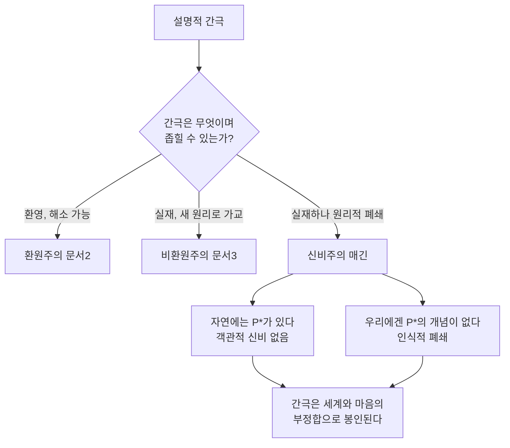

# 🌫️ 신비주의

> **Psyche L0** · Chapter 6: 설명적 간극과 그 전략 · 문서 4/5
> 간극은 실재한다 — 그러나 우리는 그것을 좁힐 수 없다. 매긴은 인간 인지의 **구조적 폐쇄**를 진단한다.

환원주의(문서 2)는 간극이 환영이라 했고, 비환원주의(문서 3)는 간극이 실재하므로 새 원리로 가교하자고 했다. 세 번째 전략 — 콜린 매긴(Colin McGinn)의 "신비주의(mysterianism)" 또는 초월적 자연주의(transcendental naturalism) — 는 두 진영의 가정 하나를 동시에 거부한다: **간극은 해결 가능하다**는 가정. 매긴의 진단은 차머스와 형이상학적으로 가깝다 — 의식은 자연적이고 물리적 기반을 갖는다(따라서 그는 자연주의자다). 그러나 인식론적으로 그는 비관한다 — 의식과 뇌를 잇는 자연적 속성 $P^*$는 실제로 **존재하지만**, 인간의 인지 구조는 원리적으로 그것에 접근할 수 없다는 것이다. 이것이 "인지적 폐쇄(cognitive closure)"다. 본 문서는 이 전략이 어떤 점에서 정직한 겸손인지, 어떤 점에서 탐구를 조기에 닫아버리는 위험한 비관인지를 공정하게 따진다.

## 🎯 핵심 질문

핵심 질문: **설명적 간극이 실재한다면, 그것은 자연의 신비인가 아니면 우리 마음의 한계인가?**

매긴의 독창성은 이 양자택일을 거부하는 데 있다. 그에게 간극은 **자연 속의 신비가 아니다** — 객관적으로 보면 의식과 뇌의 연결은 완벽히 자연적이고 법칙적이며, 거기에 마술은 없다. 동시에 그것은 단순한 우리 마음의 일시적 한계도 아니다 — 더 노력하거나 더 똑똑해진다고 메워질 종류가 아니다. 그의 진단: 의식–뇌 연결을 설명할 자연적 속성 $P^*$는 실재하지만, 인간 인지 능력의 **구조적 형식**이 그 속성을 표상할 수 있는 개념을 형성하지 못한다. 마치 쥐가 미적분을 원리적으로 이해할 수 없듯, 인간은 이 특정 자연 사실에 대해 "인지적으로 폐쇄"되어 있다. 신비는 세계에 있는 것이 아니라 세계와 우리 마음의 **부정합**에 있다.

## 🌍 어디서 마주치나

**다른 종의 인지 한계.** 개는 소수(prime number)를 이해할 수 없고, 침팬지는 자연선택 이론을 구성할 수 없다. 각 인지 체계에는 표상 가능한 개념의 범위에 자연적 한계가 있다. 매긴은 묻는다 — 왜 인간만 모든 것을 이해할 수 있다고 가정하는가?

**진화의 우연성.** 인간의 인지 능력은 특정 적응 문제(포식자 회피, 도구 사용, 사회적 협력)를 풀도록 진화했다. 이 능력이 우주의 모든 구조를 파악하도록 보장되었다고 볼 이유는 없다. 의식의 본성 이해는 진화가 우리에게 부여하지 않은 능력일 수 있다.

**과학사의 '영구 미해결' 후보.** 어떤 문제들은 단지 어렵기만 한 것이 아니라, 그것에 접근할 개념틀 자체가 우리에게 없을 가능성이 있다. 매긴은 의식의 어려운 문제를 이 범주의 가장 유력한 후보로 지목한다.

## 🔍 직관의 함정

신비주의는 두 방향의 함정을 동시에 경계하지만, 스스로도 함정에 빠질 위험을 안는다.

함정 1(매긴이 겨냥): **"우리가 이해하지 못한다 = 자연에 신비가 있다."** 매긴은 이 도약을 거부한다. 이해 불가능성은 우리 인지의 사실이지 자연의 사실이 아니다. 자연은 닫혀 있고 완비되어 있다.

함정 2(매긴이 겨냥): **"우리가 충분히 똑똑하면 결국 다 풀 수 있다."** 인지적 낙관주의의 함정. 매긴은 "인간 지성에 원리적 한계가 없다"는 가정이 입증된 적 없는 종-중심적 오만이라고 본다.

함정 3(매긴 자신이 빠질 수 있는 함정): **"지금 못 푼다 = 원리적으로 못 푼다."** 비판자들이 가장 강하게 지적하는 지점. 현재의 실패를 영구적 폐쇄로 진단하는 것은, 과거에 "절대 알 수 없다"고 선언되었다가 풀린 수많은 문제들(별의 화학 조성 등)을 떠올리면 성급할 수 있다. 매긴의 진단이 **검증 불가능한 비관**으로 흐를 위험이 여기 있다.

## ⚙️ 논증 구조

매긴의 인지적 폐쇄 논증을 형식화한다.

전제 1 (자연주의). 의식 $C$는 뇌의 물리적 속성에 의해 자연적으로 산출된다. 따라서 $C$와 뇌 $B$를 자연적으로 잇는 어떤 속성 $P^*$가 **실재한다**. $\exists P^*: B \xrightarrow{P^*} C$.

전제 2 (개념 형성의 한계). 모든 인지 체계는 표상 가능한 개념의 범위에 구조적 한계를 가진다. 어떤 체계에 대해, 그 체계가 원리적으로 형성할 수 없는 개념이 존재한다.

전제 3 (접근 경로의 차단). 인간이 $P^*$의 개념을 형성하려면 두 경로 중 하나를 거쳐야 한다 — (i) 지각/내성을 통한 접근, (ii) 외부 세계 관찰로부터의 이론적 추론. 그런데 내성은 의식의 **현상적** 측면만 주고 그 물리적 기반을 주지 않으며, 외부 지각은 뇌의 **공간적·물리적** 측면만 주고 그 현상적 측면을 주지 않는다. $P^*$는 양쪽을 통합하는 속성인데, 우리의 두 접근 경로 어느 쪽도 그 통합을 표상할 개념을 산출하지 못한다.

소결론. 따라서 인간은 $P^*$에 대해 인지적으로 폐쇄되어 있다. 간극은 실재하는 자연적 연결에 대응하지만, 우리는 그것을 좁힐 개념을 **원리적으로** 가질 수 없다. $\square$

논증의 무게중심은 전제 3이다. 매긴은 우리의 두 인식 경로(내성과 지각)가 각각 의식의 한 면만 포착하도록 '특화'되어 있어서, 둘을 잇는 매개 속성 $P^*$를 어느 쪽도 단독으로도 결합으로도 표상하지 못한다고 본다. 이 "접근 비대칭"이 폐쇄의 메커니즘이다.

## 🧪 증거와 사고실험

**쥐와 미적분(인지 한계의 모형).** 쥐의 신경계는 미적분 개념을 형성할 표상 자원이 없다. 이것은 쥐의 게으름이나 미적분의 신비함 때문이 아니라, 쥐 인지의 **구조** 때문이다. 매긴은 인간과 $P^*$의 관계가 이와 동형이라고 본다. 이 사고실험의 힘은 "인지 한계가 종마다 다르다"는 명백한 사실을 인간에게 확장하는 데 있다.

**네이글의 박쥐와의 연결.** 토머스 네이글(Thomas Nagel)의 "박쥐가 된다는 것은 무엇인가"는 다른 종의 주관성에 대한 우리의 인식적 접근 불가능성을 보였다. 매긴은 이를 한 걸음 더 밀어, 우리 자신의 의식의 **기반**조차 우리에게 접근 불가능할 수 있다고 주장한다. 네이글의 박쥐가 '타자의 주관성'의 한계라면, 매긴의 폐쇄는 '자기 주관성의 설명'의 한계다.

**두 경로 사고실험.** 당신이 어떤 신경과학자라고 상상하라. 외부에서 뇌를 아무리 관찰해도 보이는 것은 공간 속 물리 구조뿐 — 어디에도 '빨강의 느낌'은 보이지 않는다. 내성으로 아무리 깊이 들어가도 만나는 것은 느낌 자체뿐 — 어디에도 '뉴런'은 보이지 않는다. 두 시선은 결코 같은 화면에서 만나지 않는다. 이 영구적 어긋남이 폐쇄의 체험적 증거다.

## 🌉 설명적 간극

신비주의의 간극 처리는 세 전략 중 가장 독특하다. 환원주의는 간극을 **해소**하고, 비환원주의는 **가교**하며, 신비주의는 간극을 **인정하되 우리 쪽에서 닫힌 것으로 봉인**한다.

결정적 통찰: 매긴에게 간극은 **인식적이면서 영구적**이다. 그것은 차머스처럼 형이상학적 분리의 증거가 아니다(자연은 통합되어 있다). 그렇다고 데닛처럼 착시도 아니다(연결은 실재하나 우리가 못 본다). 간극은 자연의 솔기가 아니라, **우리 인지의 사각지대**다. 그리고 이 사각지대는 망원경이나 가속기로 메워질 종류가 아니라, 우리 개념 형성 능력의 형식 자체에 새겨진 것이다. 따라서 어려운 문제는 풀리지도, 수용되지도 않고, 그저 **인간 지성의 영구적 외부**로 남는다.

## 🧬 횡단 원리

**원리 (인지적 폐쇄, Cognitive Closure).** 인지 체계 $S$와 속성 $\Phi$에 대해, $S$가 $\Phi$를 표상할 개념을 그 인지 형식상 형성할 수 없다면, $S$는 $\Phi$에 대해 인지적으로 폐쇄되어 있다. 형식적으로:
$$\text{Closed}(S, \Phi) \iff \neg\exists c \in \text{Concepts}(S):\ c \text{ represents } \Phi$$
그리고 $\Phi$의 실재성은 $S$의 폐쇄와 독립적이다 — $\text{Closed}(S, \Phi) \not\Rightarrow \neg\exists \Phi$.

이 원리는 종 비교 인지과학을 가로지른다(쥐/소수, 침팬지/진화론). 핵심은 **실재성과 접근 가능성의 분리**다. 어떤 것이 인지적으로 폐쇄되어 있다는 사실은 그것이 존재하지 않음을 함축하지 않는다 — 이것이 신비주의를 단순한 회의주의나 제거주의와 구별한다. 원리의 부담: $\text{Closed}(S, \Phi)$를 **내부에서** 입증하기 어렵다는 점. 우리가 $\Phi$의 개념을 못 가진다면, 애초에 무엇에 대해 폐쇄되었는지조차 명료히 특정할 수 없다 — 이 자기지시적 곤경이 다음 절들의 반증 논의로 이어진다.

## 🪞 1인칭

신비주의에서 1인칭의 지위는 묘하게 이중적이다. 한편으로 매긴은 1인칭 경험을 **온전히 실재하는 자연 현상**으로 받아들인다 — 데닛과 달리 그는 의식을 부정하거나 착시로 격하하지 않는다. 통증은 진짜로 아프고, 빨강은 진짜로 그렇게 나타난다.

다른 한편, 1인칭 관점이야말로 폐쇄의 **한쪽 벽**이다. 내성은 우리에게 의식의 현상적 질을 직접 주지만, 바로 그 직접성 때문에 그 질이 어떻게 물리적 뇌에서 발생하는지는 결코 보여주지 않는다. 내성의 빛은 느낌을 비추지만, 느낌의 **하부 기제**에는 닿지 않는다 — 마치 화면의 그림은 보여도 그것을 그리는 회로는 보이지 않듯이. 그래서 1인칭은 매긴에게 데이터의 원천이면서 동시에 한계의 표지다. 우리가 우리 경험을 가장 친밀하게 안다는 바로 그 사실이, 역설적으로 그 경험의 자연적 기반에 대한 우리의 영구적 무지를 보증한다. 가장 가까운 것이 가장 설명 불가능하다는 이 역설이, 신비주의가 1인칭에 부여하는 독특한 무게다.

## 📐 예측·반증

**예측 1.** 의식의 신경 상관물(NCC) 연구는 무한히 상세해질 수 있지만, "왜 이 상관이 성립하는가"에 대한 **설명적** 진전은 영구히 정체된다. 상관의 목록은 길어지되, 그것을 이해 가능하게 만드는 매개 개념은 끝내 나타나지 않는다.

**예측 2.** 의식에 관한 철학적 입장들은 — 환원이든 비환원이든 — 영구히 합의에 이르지 못하고 순환할 것이다. 매긴은 이 영구적 교착 자체를 폐쇄의 징후로 해석한다(이론 다툼의 비수렴이 우리가 올바른 개념을 결여함을 시사).

**반증 조건 1.** 만약 누군가 의식과 뇌를 잇는 매개 속성 $P^*$를 실제로 **개념화**하고 그로써 간극을 좁힌 설명을 제시한다면, 인지적 폐쇄 진단은 즉시 반증된다. 즉 신비주의는 단 하나의 성공적 설명으로 무너지는 강한 주장이다.

**반증 조건 2(자기지시적 곤경).** 그러나 비판자들은 신비주의가 **검증 불가능한 비관**이라 지적한다. "우리는 $P^*$를 원리적으로 개념화할 수 없다"는 주장 자체가, 우리가 $P^*$가 무엇인지 모르는 상태에서 어떻게 정당화되는가? 폐쇄를 단언하려면 폐쇄된 대상의 윤곽을 알아야 하는데, 그것을 안다면 완전한 폐쇄가 아니다. 이 긴장 때문에 신비주의는 자신의 핵심 주장을 입증할 명확한 절차를 제시하기 어렵고, 따라서 **탐구를 조기에 종결시키는** 자기충족적 비관으로 비판받는다.

## 🤔 다음 질문

신비주의는 인지적 겸손과 자연주의를 동시에 지키는 대신, 검증 불가능성과 탐구 종결의 위험을 떠안는다. 그것은 정직한 한계 인정인가, 아니면 패배주의의 형이상학적 미화인가? 이제 세 전략이 모두 무대에 올랐다. 환원주의는 절약을, 비환원주의는 1인칭 데이터를, 신비주의는 인지적 겸손을 각각 지키며, 그 대가로 각각 직관·존재론적 부담·검증 가능성을 포기한다. 다음 문서는 이 셋을 한 자리에 놓고, 각자가 무엇을 지키고 무엇을 버리는지를 비용-편익 매트릭스로 정직하게 비교한다.

---

🧩 **Principle** — 어떤 속성에 대한 인지적 폐쇄는 그 속성의 비실재를 함축하지 않는다 — 실재성과 접근 가능성은 분리된다.
🌉 **Boundary** — 간극은 자연의 솔기도 착시도 아닌, 인간 인지 형식에 새겨진 **영구적 사각지대**로 봉인된다.
🪞 **Experience** — 가장 친밀하게 아는 1인칭 경험이, 바로 그 직접성 때문에 자신의 자연적 기반에 대한 영구적 무지를 보증한다.

## 📝 연습문제

<b>기초</b> — 인지적 폐쇄와 비실재의 차이

**문제:** 매긴은 "우리가 $P^*$를 이해할 수 없다"고 말하면서도 "$P^*$는 실재한다"고 주장한다. 이 두 주장이 어떻게 양립하는지, 그리고 이것이 신비주의를 제거주의와 어떻게 구별하는지 설명하라.

**해설:** 두 주장은 **실재성과 인지적 접근 가능성을 분리**함으로써 양립한다. $\text{Closed}(S, \Phi)$는 $S$의 인지 형식에 관한 사실이고, $\Phi$의 실재는 세계에 관한 사실이며, 전자가 후자를 함축하지 않는다($\text{Closed}(S, \Phi) \not\Rightarrow \neg\exists\Phi$). 매긴은 자연주의자이므로 의식–뇌 연결 $P^*$가 객관적으로 실재한다고 본다 — 자연 안에 마술적 간극은 없다. 다만 인간 인지가 그 $P^*$를 표상할 개념을 형성할 수 없을 뿐이다. 이것이 제거주의(데닛/처치랜드류)와의 결정적 차이다. 제거주의는 설명되지 않는 것(예: 비물리적 감각질)이 **존재하지 않는다**고 결론짓지만, 신비주의는 그것이 **존재하되 우리가 못 본다**고 결론짓는다. 즉 같은 인식적 실패에서 한쪽은 존재론적 부정으로, 다른 쪽은 인식론적 겸손으로 나아간다.

<b>심화</b> — 접근 비대칭이 폐쇄를 낳는 메커니즘

**문제:** 매긴의 전제 3(접근 경로의 차단)은 폐쇄 논증의 핵심이다. 내성과 외부 지각이라는 두 경로가 왜 각각 단독으로도, 결합으로도 $P^*$를 표상하지 못하는지 그 메커니즘을 설명하고, 이 논증의 약점을 하나 지적하라.

**해설:** **메커니즘:** 매긴에 따르면 우리의 두 인식 경로는 각각 의식의 한 면에만 특화되어 있다. 내성은 현상적 질(빨강의 느낌)을 직접 주지만, 그것을 공간적·물리적 항으로 표상하지 못한다 — 내성 안에는 '뉴런'이 나타나지 않는다. 외부 지각은 뇌를 공간 속 물리 구조로 주지만, 그것을 현상적 항으로 표상하지 못한다 — 뇌 스캔 안에는 '느낌'이 보이지 않는다. $P^*$는 정의상 이 두 측면을 **매개·통합**하는 속성인데, 각 경로는 자기 쪽 면만 산출하므로 단순히 둘을 합쳐도 매개 속성이 나오지 않는다(두 그림을 나란히 붙인다고 그 사이의 변환 규칙이 생기지 않듯). **약점:** 그러나 이 논증은 "현재 우리가 가진 두 경로"의 한계를 "원리적·영구적 한계"로 확대한다는 비판에 노출된다. 과학사에서 직접 지각도 단순 추론도 아닌 **이론적 개념의 창안**(장, 시공간 곡률, 양자 상태 등)이 기존 경로로 접근 불가능해 보이던 것을 표상 가능하게 만든 사례가 많다. 매긴은 $P^*$가 이런 개념적 혁신으로도 도달 불가능함을 보여야 하는데, 전제 3은 그 불가능성을 충분히 입증하기보다 현재의 두 경로만 열거하는 데 그친다는 약점이 있다.

<b>논문 비평</b> — 신비주의는 정직한 겸손인가 위장된 패배주의인가

**문제:** 한 비평가는 "신비주의는 반증 불가능한 비관을 학설로 격상한 것이며, 실질적으로 의식 연구의 종결을 정당화함으로써 과학적으로 해롭다"고 주장한다. 매긴 옹호자의 반론을 제시하되, 그 반론이 끝내 해소하지 못하는 핵심 부담을 명시하라.

**해설:** **매긴 옹호자의 반론:** 첫째, 신비주의는 반증 불가능하지 않다 — 누군가 $P^*$를 개념화해 간극을 좁힌 설명을 제시하는 순간 즉시 반증된다(반증 조건 1). 즉 그것은 강한, 위험을 무릅쓴 경험적 예측을 포함한다. 둘째, 신비주의는 의식 연구의 종결을 함의하지 않는다 — 의식의 신경 상관물 연구, 임상 응용, 기능적 모형화는 모두 계속 가치 있으며, 매긴이 닫는 것은 오직 "현상성을 물리 기반으로부터 **이해 가능하게 도출**하는" 특정 과제뿐이다. 셋째, 한계의 솔직한 인정은 거짓 약속(채워지지 않는 심리물리 법칙)보다 지적으로 더 정직할 수 있다. **해소하지 못하는 핵심 부담:** 그럼에도 자기지시적 곤경이 남는다(반증 조건 2). 폐쇄를 단언하려면 폐쇄된 대상 $P^*$의 윤곽을 어느 정도 알아야 하는데, 그것을 안다면 완전한 폐쇄가 아니고, 모른다면 "바로 그것에 대해 폐쇄되어 있다"는 진단을 정당화할 근거가 없다. 더 나아가, 어떤 미해결 문제가 "단지 아직 안 풀린 것"인지 "원리적으로 폐쇄된 것"인지를 **내부에서 구별할 신뢰할 만한 기준**을 매긴은 제시하지 못한다. 별의 화학 조성처럼 "영구히 알 수 없다"던 것이 풀린 전례가 있는 한, 폐쇄 진단은 현재의 실패를 영구화하는 귀납적 도약이라는 혐의를 완전히 벗기 어렵다. 따라서 비평이 "탐구 종결"을 직접 겨냥할 때는 옹호자가 막아내지만, "폐쇄 진단의 정당화 기준 부재"를 겨냥할 때는 가장 강하다.

[◀ 이전: 비환원적 전략](./03-nonreductive-strategy.md) · [📚 README](../README.md) · [다음: 전략들의 평가 ▶](./05-evaluating-strategies.md)

