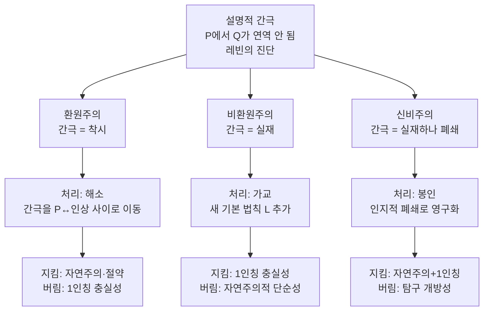

# ⚖️ 전략들의 평가

> **Psyche L0** · Chapter 6: 설명적 간극과 그 전략 · 문서 5/5
> 환원·비환원·신비주의는 각자 무엇을 지키고 무엇을 포기하는가 — 정직한 현황과 비용-편익의 결산.

세 전략이 모두 무대에 올랐다. 환원주의(문서 2)는 간극을 착시로 해소하고, 비환원주의(문서 3)는 간극을 새 법칙으로 가교하며, 신비주의(문서 4)는 간극을 인지적 폐쇄로 봉인했다. 이 마지막 문서의 임무는 승자를 선언하는 것이 **아니다.** 그것은 정직하지 못한 일이 될 것이다 — 의식 문제는 미해결이며, 그 미해결 자체가 본 챕터가 보고해야 할 핵심 사실이다. 대신 우리는 각 전략을 동일한 저울 위에 놓고, 그것이 **무엇을 지키는 대가로 무엇을 내주는지**를 명료히 한다. 좋은 철학적 선택은 비용 없는 정답을 찾는 것이 아니라, 어떤 비용을 감수할지를 눈을 뜬 채 결정하는 것이다. 모토 "Explain it, don't explain it away"는 이 결산의 윤리적 나침반이다 — 설명의 야심과 부정의 유혹 사이에서.

## 🎯 핵심 질문

핵심 질문: **세 전략 각각이 보존하는 것과 희생하는 것은 무엇이며, 그 교환은 정당화되는가?**

이 질문은 "어느 것이 참인가"보다 메타적이다. 우리는 각 전략을 세 축으로 평가한다 — (1) **자연주의/절약**: 세계의 통일된 물리적 그림을 얼마나 보존하는가, (2) **1인칭 충실성**: 경험의 직접적 소여를 얼마나 액면대로 존중하는가, (3) **탐구 가능성**: 미래의 진전 경로를 얼마나 열어 두는가. 세 전략 중 어느 것도 세 축을 동시에 만족시키지 못한다는 것 — 이것이 의식 문제의 구조적 곤경이며, 본 평가의 출발 가설이다. 각 전략은 세 축 중 하나 이상을 위해 다른 것을 희생하는 **선택**이다.

## 🌍 어디서 마주치나

**이론 선택의 일반 구조.** 과학과 철학 어디서나, 경쟁 이론들은 흔히 동일한 데이터를 다르게 저울질한다. 어떤 이론은 단순성을, 어떤 이론은 데이터 충실성을, 어떤 이론은 보수성을 우선한다. 의식 논쟁은 이 일반 구조의 가장 첨예한 사례다.

**연구비와 연구 프로그램의 실제.** 환원주의자는 신경과학·인지과학 프로그램에, 비환원주의자는 IIT 같은 비환원적 의식과학에, 신비주의자는 (소극적으로) 응용 연구에만 자원을 배분하는 경향이 있다. 메타이론적 선택이 실제 과학 실천을 형성한다.

**AI 의식 판정.** "이 시스템은 의식이 있는가"라는 임박한 실천적 물음 앞에서, 세 전략은 전혀 다른 답을 준다 — 환원주의는 기능 검사로 충분하다 하고, 비환원주의는 기능만으로는 결정 불가라 하며, 신비주의는 우리가 원리적으로 알 수 없다고 한다. 평가는 추상이 아니라 곧 닥칠 결정의 문제다.

**동물 복지와 임상 윤리.** 어류·곤충·뇌 오가노이드(organoid)에 경험이 있는가, 식물인간 상태의 환자에게 느낌이 남아 있는가 — 이런 물음은 법과 의료 현장에서 실제 결정을 강제한다. 환원주의는 행동·기능 지표로 판정하려 하고, 비환원주의는 그 지표가 경험을 보증하지 못한다고 경고하며, 신비주의는 확실한 판정의 원리적 불가능성을 인정하라 한다. 메타이론적 선택이 누구를 도덕적 고려 대상으로 포함할지를 좌우한다.

## 🔍 직관의 함정

평가 단계에서 빠지기 쉬운 함정들.

함정 1: **"내 직관에 맞는 것이 옳다."** 세 전략은 모두 어떤 강력한 직관을 위반한다. 직관 보존을 유일한 기준으로 삼으면 평가는 편견의 추인으로 전락한다. 직관은 데이터지 심판이 아니다.

함정 2: **"미해결이니 모두 똑같이 그르다(또는 옳다)."** 미해결이라는 사실이 모든 전략의 동등한 무가치(혹은 동등한 가치)를 함의하지는 않는다. 전략들은 비용 구조가 **다르며**, 그 차이는 분석 가능하다.

함정 3: **"중립이 곧 공정이다."** 모든 입장에 똑같은 점수를 주는 것은 공정이 아니라 평가의 포기다. 공정함이란 각 전략에게 그 최강의 형태로 발언권을 주되, 각자의 비용을 회피 없이 기록하는 것이다.

## ⚙️ 논증 구조

평가의 메타논증을 형식화한다.

전제 1. 의식 이론은 최소한 세 평가 기준을 만족시키려 한다 — 자연주의적 통합($N$), 1인칭 충실성($F$), 탐구 개방성($O$).

전제 2. 환원주의는 $N$을 극대화하되 $F$를 희생한다(경험을 착각으로 격하). 비환원주의는 $F$를 극대화하되 $N$을 약화한다(이원론적 부담, 인과 폐쇄성 긴장). 신비주의는 $N$과 $F$를 모두 인정하되 $O$를 희생한다(원리적 폐쇄).

전제 3. 현재 어떤 전략도 $N \wedge F \wedge O$를 동시에 만족시키지 못한다.

소결론. 따라서 의식 문제의 현 상태는 "해결 대기 중인 단일 정답"이 아니라, **양립 불가능한 세 가치 사이의 미해결된 교환**으로 정확히 기술된다. 전략 선택은 어느 가치를 우선하느냐는 **합리적이되 강제되지 않는** 결정이다. $\square$

이 메타논증의 함의는 겸손하지만 단단하다 — 우리는 정답을 모르지만, **무엇이 걸려 있는지는** 정확히 안다. 미해결의 구조를 아는 것 자체가 진전이다.

## 🧪 증거와 사고실험

**리트머스 사고실험 — 완성된 신경과학.** 의식의 신경과학이 완성된 미래를 상상하라. 모든 NCC가 밝혀지고, 모든 경험에 대응하는 뇌 상태가 사전처럼 정리되었다. 이때 세 전략은 다르게 반응한다. 환원주의: "보라, 어려운 문제는 처음부터 없었다 — 사전이 곧 설명이다." 비환원주의: "사전은 상관 목록일 뿐, '왜'는 여전히 비어 있다 — 심리물리 법칙이 거기 있다." 신비주의: "사전은 길어졌으나 이해는 한 치도 깊어지지 않았다 — 보라, 폐쇄가 입증된다." 동일한 미래가 세 전략에 의해 정반대로 해석된다는 사실이, 이 논쟁이 **데이터 부족이 아니라 데이터 해석의 메타이론적 차이**임을 드러낸다.

**좀비·메리·역전 스펙트럼의 분배.** 동일한 사고실험들이 전략마다 다른 무게를 갖는다 — 비환원주의는 이들을 결정적 증거로, 환원주의는 직관의 착시로, 신비주의는 우리 개념 한계의 징후로 읽는다. 사고실험은 중립적 심판이 아니라, 각 전략이 자기 식으로 전유하는 자원이다.

**비대칭 부담 검사.** 각 전략에 "당신이 옳다면 무엇이 설명되지 않은 채 남는가"를 동일하게 물어보자. 환원주의: "왜 하필 착각이 이토록 강력하고 보편적인가"의 완전한 기능적 설명이 아직 미완이다. 비환원주의: "심리물리 법칙의 구체적 내용"이 비어 있고 인과 효력 문제가 미해결이다. 신비주의: "왜 이것이 일시적 무지가 아니라 영구적 폐쇄인지"의 입증 기준이 부재하다. 어느 전략도 잔여 부담 없이 끝나지 않는다는 사실 — 그 부담의 종류가 다를 뿐 — 이 균형 잡힌 평가의 출발점이다.

## 🌉 설명적 간극

세 전략의 간극 처리를 한눈에 대조한다. 이것이 본 챕터 전체의 종합이다.

핵심 종합: 셋은 레빈의 동일한 간극을 출발점으로 공유하되, "이 간극이 세계와 우리에 관해 무엇을 말하는가"에서 갈라진다. 환원주의는 간극을 우리 개념의 문제로, 비환원주의는 세계 구조의 문제로, 신비주의는 세계와 우리 마음의 부정합 문제로 위치시킨다. 간극은 사라지지 않았다 — 그것은 세 갈래로 재서술되어, 각각 다른 비용표를 달고 우리 앞에 놓여 있다.

## 🧬 횡단 원리

**원리 (가치 교환의 불가피성, Inevitability of Value Trade-off).** 어떤 현상 영역이 (i) 강한 자연주의적 통합 압력과 (ii) 환원 불가능해 보이는 1차 데이터를 **동시에** 가질 때, 가능한 이론적 입장들은 자연주의·데이터충실성·탐구개방성 중 적어도 하나를 부분 희생하는 형태로만 정합적으로 구성된다.
$$\text{Coherent}(T) \Rightarrow \neg\big(N_{\max}(T) \wedge F_{\max}(T) \wedge O_{\max}(T)\big)$$

이 원리는 의식 논쟁을 넘어, 자유의지·수학적 대상·도덕 실재론 등 "환원 압력 vs 환원 저항 데이터"의 긴장이 있는 모든 영역을 가로지른다. 그 함의는 비관이 아니라 명료성이다 — 정답 없음을 한탄하는 대신, 각 입장이 치르는 정확한 대가를 회계하면 토론이 정직해진다. 다음 절의 매트릭스가 이 회계의 구체적 장부다.

## 🪞 1인칭

평가자 자신의 1인칭에 정직해 보자. 이 모든 논증을 읽는 동안에도, 당신에게는 무언가가 **나타나고 있다** — 글자의 검음, 이해의 명료감, 동의나 거부감의 색조. 이 직접적 소여가 세 전략을 저울질하는 사람의 발밑에 깔린 부정할 수 없는 바닥이다.

바로 이 바닥 때문에 평가는 결코 완전히 중립적일 수 없다. 환원주의를 받아들이려면 당신은 지금 이 나타남이 '착각'이라는 주장을 — 그 나타남을 가진 채로 — 삼켜야 한다. 비환원주의를 받아들이려면 당신은 이 나타남이 세계의 인과 그물에서 어쩌면 무력할 수 있다는 부수현상론의 그림자를 견뎌야 한다. 신비주의를 받아들이려면 당신은 가장 친밀한 이 나타남의 기반을 영영 이해 못 한다는 영구적 무지를 수용해야 한다. 세 전략은 결국 당신의 1인칭에게 각기 다른 종류의 불편을 요구한다. 어떤 불편이 가장 견딜 만한지를 묻는 것 — 그것이 정직한 평가가 1인칭에게 돌려주는 질문이다.

## 📐 예측·반증

본 평가 자체의 검증 가능한 함의.

**비용-편익 매트릭스.** 세 전략을 세 평가 축과 주요 비용에 대해 정리한다.

| 평가 축 / 전략 | 환원주의 (Dennett·Frankish) | 비환원주의 (Chalmers) | 신비주의 (McGinn) |
|---|---|---|---|
| 간극 진단 | 착시 (인식적, 해소 가능) | 실재 (형이상학적) | 실재하나 인지적 폐쇄 |
| 자연주의·절약 ($N$) | ◎ 최대 보존 | △ 이원론 부담 | ○ 자연주의 유지 |
| 1인칭 충실성 ($F$) | ✕ 경험을 착각으로 격하 | ◎ 액면 그대로 존중 | ◎ 실재로 인정 |
| 탐구 개방성 ($O$) | ◎ 메타 문제 연구 추진 | ○ 심리물리 법칙 탐색 | ✕ 원리적 종결 |
| 핵심 편익 | 통일된 물리 세계상 보존 | 직접 데이터 존중 | 인지적 겸손·정직 |
| 핵심 비용 | "설명해 없애기" 위험 | 인과 폐쇄성 긴장, 빈 법칙 | 검증 불가, 탐구 조기 종결 |
| 결정적 반증 | 기능 동등 ≠ 경험 동등 입증 시 | 좀비의 상상 불가 입증 시 | $P^*$의 성공적 개념화 시 |

(◎ 강하게 보존 · ○ 보존 · △ 약화 · ✕ 희생)

**예측.** 매트릭스의 가설(어떤 전략도 세 축을 동시 만족 못 함)이 옳다면, 향후 의식 논쟁은 새 데이터로 합의에 이르기보다 **가치 우선순위의 차이**를 중심으로 재편될 것이다.

**반증 조건.** 만약 어떤 미래 이론이 자연주의·1인칭 충실성·탐구 개방성을 **동시에** 큰 희생 없이 만족시킨다면, 본 평가의 핵심 가설(가치 교환의 불가피성)은 반증된다. 이는 의식 문제의 진정한 해결을 뜻할 것이다 — 그리고 그것이야말로 모두가 바라는 반증이다.

## 🤔 다음 질문

평가는 끝났지만 문제는 열려 있다. 우리는 정답을 정하지 않았고, 정직하게 정할 수 없었다. 그러나 우리는 무엇이 걸려 있는지, 각 길이 어떤 대가를 요구하는지를 명료히 했다. 그렇다면 다음 단계는 무엇인가? 추상적 메타이론에서 한 걸음 내려와, 각 이론이 **구체적으로 무엇을 예측하는지** — 특히 AI 의식, 동물 의식, 임상 판정 같은 실천적 시험대에서 — 를 나란히 비교하는 일이다. 7장이 이 작업을 이어받는다. 간극을 어떻게 보느냐가 우리가 무엇을 측정하고 무엇을 윤리적으로 책임질지를 결정하기 때문이다.

---

🧩 **Principle** — 강한 자연주의 압력과 환원 저항 데이터를 동시에 지닌 영역에서, 정합적 이론은 자연주의·데이터충실성·탐구개방성 중 적어도 하나를 부분 희생할 수밖에 없다.
🌉 **Boundary** — 세 전략은 레빈의 동일한 간극을 공유하되, 그것을 각각 개념의 문제·세계의 문제·세계와 마음의 부정합 문제로 재서술한다.
🪞 **Experience** — 세 전략은 평가자의 1인칭에게 각기 다른 불편(착각 수용·무력함 수용·영구적 무지 수용)을 요구하며, 어느 불편이 견딜 만한지가 정직한 선택의 핵심이다.

## 📝 연습문제

<b>기초</b> — 세 축과 세 전략

**문제:** 비용-편익 매트릭스에서 환원주의·비환원주의·신비주의가 각각 희생하는 평가 축($N$/$F$/$O$)을 하나씩 짝지어 설명하라.

**해설:** 환원주의는 **1인칭 충실성($F$)**을 희생한다 — 자연주의적 통합과 절약을 극대화하는 대신, 경험의 직접적 소여를 '착각·강력한 표상'으로 격하해야 한다. 비환원주의는 **자연주의적 단순성($N$)**을 희생한다 — 1인칭 데이터를 액면 그대로 지키는 대신, 속성 이원론의 존재론적 부담과 인과 폐쇄성과의 긴장, 비어 있는 심리물리 법칙을 떠안는다. 신비주의는 **탐구 개방성($O$)**을 희생한다 — 자연주의와 1인칭 실재를 모두 인정하는 대신, 간극을 좁히는 일이 원리적으로 불가능하다고 선언하여 그 특정 설명 과제를 영구히 닫는다. 어느 전략도 세 축을 동시에 지키지 못한다는 점이 의식 문제의 구조적 곤경이다.

<b>심화</b> — 가치 교환의 불가피성 원리의 적용

**문제:** "가치 교환의 불가피성" 원리($\text{Coherent}(T) \Rightarrow \neg(N_{\max} \wedge F_{\max} \wedge O_{\max})$)가 단지 의식 문제의 우연적 특징이 아니라 더 일반적 구조임을 보이려 한다. 자유의지 또는 도덕 실재론 중 하나를 골라, 동일한 삼중 긴장이 어떻게 나타나는지 논하라.

**해설:** **자유의지 사례로 설명한다.** 여기서 세 축은 (N) 물리적 인과 결정론과의 통합, (F) "내가 달리 할 수 있었다"는 행위자적 자유의 직접 경험에 대한 충실성, (O) 책임·처벌·숙고 실천을 지탱할 개념적 개방성에 대응한다. 강한 결정론적 양립불가론은 $N$을 극대화하되 자유 경험($F$)을 환영으로 격하한다(환원주의와 동형). 자유지상론(libertarianism)은 행위자적 자유($F$)를 액면대로 지키되, 결정론적 인과 그물에 비결정적 행위자 인과를 추가하여 $N$을 약화한다(비환원주의와 동형). 그리고 "자유의지의 형이상학은 인간 인지가 풀 수 없다"는 비관적 입장은 $N$과 $F$를 모두 보존하되 해결 개방성($O$)을 닫는다(신비주의와 동형). 동일한 삼중 구조가 재현된다는 것은, 가치 교환의 불가피성이 '환원 압력 vs 환원 저항 1차 데이터'라는 일반 형식에서 비롯됨을 시사한다. 즉 의식 문제는 이 형식의 가장 첨예한 사례일 뿐, 유일한 사례가 아니다.

<b>논문 비평</b> — '정직한 미해결'은 회피인가 미덕인가

**문제:** 한 비평가는 "본 챕터가 승자를 가리지 않고 '미해결'로 결론짓는 것은 학문적 회피이며, 결국 어떤 입장이 더 옳은지를 판정하지 못하는 무능의 미화"라고 주장한다. 이 비평을 평가하고, '정직한 미해결'이 정당한 결론일 수 있는 조건과 회피로 전락하는 조건을 각각 명시하라.

**해설:** **비평의 정당한 핵심:** 모든 결론을 '미해결'로 환원하는 것은 실제로 평가의 포기일 수 있다 — 어떤 입장이 명백히 더 적은 비용으로 더 많은 것을 설명한다면, 그것을 가리지 않는 '중립'은 비겁이다. 따라서 '미해결' 결론은 무임승차해서는 안 된다. **정당한 조건:** 미해결 결론이 정당하려면 세 요건을 충족해야 한다 — (1) 각 입장이 그 **최강의 형태**로 재구성되었을 것(허수아비 논증 금지), (2) 각 입장의 비용이 회피 없이 **구체적으로** 기록되었을 것(매트릭스의 역할), (3) 미해결이 단순한 무지가 아니라 **구조적 이유**(가치 교환의 불가피성)로 설명되었을 것. 본 챕터는 이 세 요건을 충족하려 했으므로 — 즉 "왜 정답이 강제되지 않는지"를 메타논증으로 보였으므로 — 그 미해결은 분석된 미해결이지 게으른 미해결이 아니다. **회피로 전락하는 조건:** 반대로, 입장들을 약하게 희화화하거나, 비용을 모호하게 뭉개거나, "다들 일리가 있다"는 말로 차이를 지워버리면 미해결 결론은 즉시 회피가 된다. 결정적 시금석은 이것이다 — 독자가 챕터를 읽은 뒤 **자기 가치 우선순위에 따라 합리적으로 한 입장을 선택할 수 있게 되었는가.** 그렇다면 '정직한 미해결'은 미덕이다. 선택의 근거조차 제공하지 못했다면 비평이 옳다. 본 평가의 목표는 정확히 전자, 즉 정답의 부재 속에서도 **합리적 선택의 지형도**를 그리는 것이다.

[◀ 이전: 신비주의](./04-mysterianism.md) · [📚 README](../README.md) · [다음: 각 이론의 예측 비교 ▶](../ch7-synthesis/01-predictions-compared.md)

