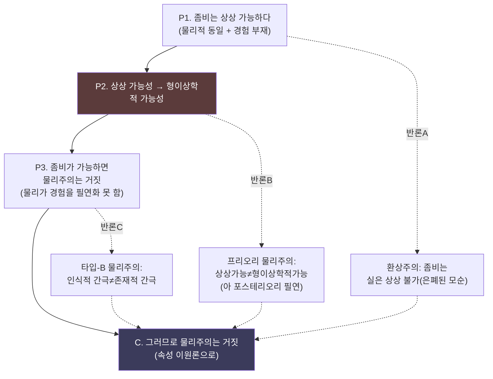

# 🗺️ 마음-몸 지도 시각화 — 격자에서 지형으로

> **Psyche L0** · Chapter 7: 지형도의 활용과 종합 · 문서 2/6
> 입장·논변·반론은 목록이 아니라 *관계망*이다 — 흐름도와 레이더 차트, 실행 가능한 코드로 그 지형을 눈에 보이게 그린다.

앞 문서가 입장들을 *표*로 펼쳤다면, 이 문서는 그것을 *지도*로 그린다. 표는 행과 열의 격자이지만, 철학적 지형은 본질적으로 *관계망*이다 — 논변이 분기하고, 반론이 답변을 부르고, 입장들이 여러 차원에서 가까워지거나 멀어진다. 이 문서는 좀비 논변의 흐름도, 입장 비교 매트릭스, 그리고 실제로 실행 가능한 Python 코드(matplotlib 레이더 차트, networkx 논변 그래프)를 제공하여, 우리가 그려 온 지형 전체를 한눈에 조망 가능한 *그림*으로 만든다. 시각화는 장식이 아니라 *사고 도구*다 — 보이지 않던 구조를 보이게 한다.

---

## 🎯 핵심 질문

지형도는 머릿속에 흩어진 채로는 쓸 수 없다. 핵심 질문은 방법론적이다.

> **마음–몸 문제의 입장·논변·반론 사이의 관계를 어떻게 *시각적으로* 표상해야, 그 구조가 왜곡 없이 드러나는가? 그리고 어떤 표상 형식이 어떤 종류의 관계에 적합한가?**

답은 *형식–관계 대응*이다. 서로 다른 시각화 형식은 서로 다른 관계를 포착한다. (a) *흐름도*(flowchart)는 논변의 *논리적 의존*(전제→결론, 분기점)을 그린다. (b) *레이더 차트*는 각 입장을 여러 *평가 차원*(설명력·경제성·직관 부합 등)의 프로파일로 비교한다. (c) *네트워크 그래프*는 입장·논변·반론의 *상호 참조망*을 그린다. 어느 하나가 전체를 담지 못하므로, 세 형식을 겹쳐야 지형이 입체로 선다. 시각화의 윤리는 *단순화하되 왜곡하지 않기* — "Explain it, don't explain it away"의 도해판이다.

## 🌍 어디서 마주치나

시각화는 추상적 도구가 아니라 실제 사고와 교육의 현장에서 작동한다.

- **연구·교육**: 마음 철학 강의에서 좀비 논변·메리의 방·역전 감각질의 논리 구조를 흐름도로 보이면, 학생은 *어느 전제가 다투어지는지*를 즉시 파악한다.
- **입장 자기 진단**: 자신의 직관이 여러 차원(경험 실재성·물리 완결성·직관 부합)에서 어디에 서는지를 레이더로 그려 보면, 자신이 암묵적으로 어떤 입장에 가까운지 드러난다.
- **AI 정렬·의식 논의**: AI 의식 논쟁에서 각 입장이 어떤 증거에 어떻게 반응하는지를 그래프로 그리면, 논쟁 참여자들이 *실제로 어디서 갈리는지*를 빠르게 합의할 수 있다.
- **저장소 간 연결**: 이 시각화 기법은 자매 저장소 `theories-of-consciousness`(GWT·IIT·HOT 비교)와 `emergence`(창발 위계)에서도 재사용된다 — 같은 코드가 다른 지형을 그린다.

## 🔍 직관의 함정

**함정 1: "그림은 객관적이다."** 모든 시각화는 *선택*이다 — 어떤 차원을 축으로 삼고, 어떤 입장을 노드로 두고, 어떤 관계를 엣지로 그릴지가 이미 해석이다. 레이더 차트의 축 선택 하나로 입장의 우열 인상이 바뀐다. 그림을 *주장*으로 읽되 *사실*로 오인하지 말 것.

**함정 2: "정량화된 점수는 정밀하다."** 레이더 차트에 입장의 "설명력 = 7점"을 찍으면 정밀해 *보인다*. 그러나 그 점수는 질적 판단의 *시각적 요약*일 뿐 측정값이 아니다. 숫자의 정밀성이 판단의 확실성으로 착각되는 것이 함정이다 — 점수는 *논변의 대용물이 아니라 색인*이다.

**함정 3: "흐름도가 논변을 *대체*한다."** 흐름도는 논변의 *골격*을 보이지만, 각 화살표의 *정당성*(왜 이 전제에서 저 결론이 따라오는가)은 산문 논증으로만 옹호된다. 그림을 논증의 대체물로 쓰면, 다투어지는 화살표가 *자명한 것처럼* 호도된다. 그림은 논증을 *조직*하되 *생략*해서는 안 된다.

## ⚙️ 논증 구조

먼저 **좀비 논변의 흐름도**를 Mermaid로 그린다. 이것이 마음–몸 지형의 중심 분기점이기 때문이다.



이 흐름도의 핵심 독법: 세 반론(R1·R2·R3)이 각각 다른 전제를 겨냥한다. **P2(상상가능성→가능성)**가 가장 뜨거운 매듭이다(붉게 표시). 좀비 논변의 운명은 이 한 화살표의 정당성에 달려 있다. 흐름도는 *어디를 공격해야 하는지*를 즉시 보여준다 — 이것이 산문보다 흐름도가 나은 한 가지다.

논변 구조의 일반 형식도 정식화하자. 모든 마음–몸 논변은 다음 골격을 공유한다.
1. **(현상 전제)** 경험에는 환원 저항적으로 *보이는* 무엇이 있다.
2. **(연결 전제)** 그 보임은 *실재*를 반영한다(또는 반영하지 않는다).
3. **(형이상학 결론)** 그러므로 마음은 물리로 환원된다/안 된다. $\square$

모든 입장은 전제 2에 대한 태도로 분류된다 — 이것이 다음 매트릭스의 조직 원리다.

## 🧪 증거와 사고실험

이제 **실행 가능한 Python 코드**다. 먼저 입장들을 여러 차원에서 비교하는 **matplotlib 레이더 차트**.

```python
import numpy as np
import matplotlib.pyplot as plt

# 평가 차원 (각 축) — 0~10, 질적 판단의 시각적 요약(측정값 아님)
dims = ['경험 실재성\n인정', '물리적\n완결성', '직관\n부합', '이론적\n경제성', 'AI의식\n수용', '간극\n해소력']
positions = {
    '기능주의':      [5, 7, 5, 8, 9, 4],
    '환원적 물리주의': [3, 10, 4, 9, 6, 5],
    '속성 이원론':    [10, 4, 8, 4, 5, 3],
    '범심론/일원론':  [10, 6, 3, 5, 4, 6],
}

N = len(dims)
angles = np.linspace(0, 2*np.pi, N, endpoint=False).tolist()
angles += angles[:1]  # 폐곡선

fig, ax = plt.subplots(figsize=(8, 8), subplot_kw=dict(polar=True))
for name, vals in positions.items():
    v = vals + vals[:1]
    ax.plot(angles, v, linewidth=2, label=name)
    ax.fill(angles, v, alpha=0.08)

ax.set_xticks(angles[:-1])
ax.set_xticklabels(dims, fontsize=9)
ax.set_ylim(0, 10)
ax.set_title('마음–몸 입장 비교 레이더', pad=20, fontsize=13)
ax.legend(loc='upper right', bbox_to_anchor=(1.25, 1.1))
plt.tight_layout()
plt.savefig('mind_body_radar.png', dpi=120)
print('저장: mind_body_radar.png')
```

이 차트의 독법: *어떤 입장도 모든 축에서 최고일 수 없다* — 레이더의 면적이 비슷하되 *모양*이 다르다는 것이 핵심 통찰이다. 물리주의는 완결성·경제성 축으로 길고 경험 실재성 축으로 짧으며, 속성 이원론은 정확히 그 반대다. *상보적 비대칭*이 그림으로 드러난다.

다음은 **networkx 논변 그래프** — 입장·논변·반론의 상호 참조망.

```python
import networkx as nx
import matplotlib.pyplot as plt

G = nx.DiGraph()
# 노드 유형: 입장(P), 논변(A), 반론(R)
positions_n = ['기능주의', '환원적 물리주의', '속성 이원론', '범심론']
arguments  = ['좀비 논변', '메리의 방', '역전 감각질', '다수 실현']
rebuttals  = ['환상주의 응답', '능력 가설', '표상주의', '결합 문제']

for n in positions_n: G.add_node(n, kind='position')
for a in arguments:   G.add_node(a, kind='argument')
for r in rebuttals:   G.add_node(r, kind='rebuttal')

# 논변 → 그것이 지지하는 입장 (supports)
G.add_edges_from([('좀비 논변','속성 이원론'), ('메리의 방','속성 이원론'),
                  ('역전 감각질','속성 이원론'), ('다수 실현','기능주의')])
# 반론 → 그것이 겨냥하는 논변 (attacks)
G.add_edges_from([('환상주의 응답','좀비 논변'), ('능력 가설','메리의 방'),
                  ('표상주의','역전 감각질'), ('결합 문제','범심론')])
# 입장 간 동기 부여
G.add_edges_from([('속성 이원론','범심론')])  # 잔여를 물질 근본성질로

color_map = {'position':'#4c72b0', 'argument':'#55a868', 'rebuttal':'#c44e52'}
colors = [color_map[G.nodes[n]['kind']] for n in G.nodes]

plt.figure(figsize=(11, 8))
pos = nx.spring_layout(G, seed=7, k=1.2)
nx.draw_networkx_nodes(G, pos, node_color=colors, node_size=1600, alpha=0.9)
nx.draw_networkx_edges(G, pos, arrows=True, arrowsize=18,
                       edge_color='#888', connectionstyle='arc3,rad=0.08')
nx.draw_networkx_labels(G, pos, font_size=9)
plt.title('논변–입장–반론 관계망 (파랑=입장, 초록=논변, 빨강=반론)')
plt.axis('off'); plt.tight_layout()
plt.savefig('argument_graph.png', dpi=120)
print('저장: argument_graph.png')
```

이 그래프는 표가 못 보여주는 것 — *논변이 입장을 지지하고 반론이 논변을 공격하는 방향성* — 을 드러낸다. 속성 이원론이 세 논변(좀비·메리·역전)의 *수렴점*이라는 것, 그리고 그것이 다시 범심론으로 *동기를 흘려보낸다*는 것이 노드 위상으로 보인다. 마(Marr)의 교훈을 빌리면, 같은 현상을 *세 수준*(논변=계산 수준, 입장=알고리즘 수준 비유, 반론=구현 비판)으로 본 것이다.

## 🌉 설명적 간극

시각화는 설명적 간극을 *그릴 수* 있는가? 부분적으로만. 흐름도는 간극을 *노드*로 표시할 수 있다("왜 이 물리에 이 경험이?"라는 박스). 레이더는 간극을 *축*으로 둘 수 있다("간극 해소력"). 그러나 어느 형식도 간극의 *느낌* — "아무리 메워도 다시 솟는 왜?"의 경험적 질 — 을 그림으로 전달하지 못한다.

이것이 시각화의 *한계이자 정직성*이다. 그림은 간극의 *위치*(어느 논변·어느 칸에 사는가)와 *구조*(어느 전제에서 갈리는가)를 표상할 수 있지만, 간극 그 자체는 *3인칭 표상으로 환원되지 않는* 무엇이기에, 그림 안에서 *빈 노드*로만 가리켜진다. 좀비 논변 흐름도에서 P2 화살표가 붉게 칠해진 것은, 바로 그 지점에 "인식적 간극이 존재적 간극인가"라는 메워지지 않는 물음이 살기 때문이다. 시각화는 간극을 *지우지 않고 위치시킨다* — 이것이 모토의 도해적 준수다. 그림은 간극을 설명해 *없애는* 대신, 어디를 보아야 하는지 손가락으로 가리킨다.

## 🧬 횡단 원리

이 문서의 횡단 원리는 표상의 본성에 관한 것이며, 자매 저장소 `computation-representation`의 핵심과 공명한다.

> **형식–내용 적합성 원리**: 어떤 구조를 표상하려면, 그 구조의 관계 유형에 맞는 표상 형식을 골라야 한다. 잘못된 형식은 구조를 왜곡하고, 옳은 형식은 보이지 않던 관계를 드러낸다.

논리적 의존에는 흐름도, 다차원 비교에는 레이더, 상호 참조망에는 그래프 — 형식이 곧 분석 렌즈다. 이 원리는 마(Marr)의 3수준 분석과 직결된다. 마는 시각 시스템을 이해하려면 *계산·알고리즘·구현* 세 수준에서 각각 다른 기술이 필요하다고 했다. 마찬가지로 마음–몸 지형은 한 형식으로 다 그려지지 않으며, *세 형식의 중첩*이 입체를 만든다.

여기서 따라오는 규율: 어떤 시각화를 보든 *"이 형식이 무엇을 보이고 무엇을 숨기는가"*를 먼저 물어야 한다. 레이더는 비교를 보이되 인과를 숨기고, 그래프는 관계를 보이되 정도를 숨긴다. 형식의 선택은 항상 *조명과 그림자의 동시 선택*이다 — 시각화 리터러시의 핵심이 바로 이 자각이다.

## 🪞 1인칭

시각화는 철저히 3인칭 작업처럼 보인다 — 노드와 축과 화살표는 모두 외부에서 조망된 객체다. 그러나 레이더 차트의 "직관 부합" 축을 보라. 그 점수는 *어디서* 오는가? 그것은 도해를 그리는 사람의 *1인칭 직관* — "좀비가 상상 가능하게 *느껴지는가*", "메리가 무언가 새로 배운 듯 *여겨지는가*" — 의 외화다. 가장 3인칭적인 그림조차 그 바탕에 1인칭 판단을 깔고 있다.

이 점이 시각화의 숨은 1인칭 차원이다. 내가 입장 매트릭스에 점수를 찍을 때, 나는 사실 *나의 직관을 측량하고 있다*. 따라서 다른 사람의 레이더와 나의 레이더가 다르다면, 그것은 측정 오차가 아니라 *직관의 차이*일 수 있다. 공정한 자세는 시각화를 *합의된 사실의 그림*이 아니라 *직관의 좌표를 공유 가능하게 만든 장치*로 보는 것이다. 그림은 1인칭들을 한 평면에서 *마주 세워* 대화하게 만든다 — 이것이 도해의 가장 깊은 효용일지 모른다.

## 📐 예측·반증

시각화 자체는 예측을 만들지 않지만, *좋은 시각화의 조건*은 반증 가능한 형태로 적을 수 있다.

**예측 1.** 옳게 그려진 레이더 차트는 *어떤 입장도 전 축 우월일 수 없음*을 보일 것이다 — 만약 한 입장이 모든 축에서 압도한다면, 그것은 축 선택이 편향됐다는 신호다(반증: 균형 잡힌 축 집합에서 단일 우승자가 나오면 축 설계 오류).

**예측 2.** 논변 그래프에서 *수렴점 노드*(여러 화살표가 모이는 입장)는 가장 활발히 다투어지는 입장일 것이다. 속성 이원론이 세 논변의 수렴점이라는 그래프 위상은, 그것이 문헌에서 가장 집중적으로 공격·옹호된다는 *문헌계량 사실*로 검증·반증 가능하다.

**반증 조건.** 만약 어떤 단일 시각화 형식이 입장·논변·반론·간극·1인칭 차원을 *모두* 왜곡 없이 담는다면, "형식–내용 적합성 원리"(한 형식은 한 종류 관계에 적합)는 반증된다. 현재로선 그런 만능 형식은 없으며, 이것이 세 형식 중첩 전략의 정당화다.

이 예측들은 시각화를 *주장*으로 다루는 규율을 보여준다 — 그림조차 반증 가능한 책임을 진다.

## 🤔 다음 질문

우리는 이제 지형 전체를 표(01)와 지도(02)로 펼쳐 보았다. 그러나 이 지형도는 *허공*에 떠 있지 않다. 그것은 더 큰 구조물 — IQ AI Lab의 Psyche Lab 전체 — 의 *기초 층(Layer 0)*이다. 우리가 그린 입장·논변·간극의 지도는 위층들(인지·계산·의식·자아·창발)에서 *어떻게 쓰이는가*?

다음 문서는 이 지형도를 연구소의 층위 구조 안에 위치시킨다. L0의 마음–몸 지도가 L1부터 L6까지 각 층에서 *어느 부분을 다루는지*를 매핑하여, 왜 "마음–몸 문제"가 모든 상위 탐구의 *발사대*인지를 보인다.

---

🧩 **Principle** — 형식–내용 적합성: 구조의 관계 유형에 맞는 표상 형식을 골라야 한다. 흐름도는 논리 의존, 레이더는 다차원 비교, 그래프는 참조망을 그린다. 한 형식은 한 종류 관계를 조명하며 동시에 다른 것을 가린다.

🌉 **Boundary** — 시각화는 간극의 *위치와 구조*는 그릴 수 있으나 간극 *자체*는 빈 노드로만 가리킨다. 그림은 간극을 지우지 않고 위치시킨다 — 모토의 도해판.

🪞 **Experience** — 가장 3인칭적인 도해조차 "직관 부합" 같은 축의 점수를 1인칭 직관에서 길어 온다. 시각화는 직관의 좌표를 공유 가능하게 만들어 1인칭들을 마주 세운다.

## 📝 연습문제

<details>
<summary><b>기초</b> — 좀비 논변 흐름도에서 세 반론이 각각 어느 전제를 겨냥하는지 말하라.</summary>

**문제.** 본문의 Mermaid 흐름도에서 R1(환상주의), R2(아 포스테리오리 필연), R3(타입-B 물리주의)는 각각 좀비 논변의 어느 전제(P1·P2·P3)를 공격하는가? 그리고 왜 P2가 "가장 뜨거운 매듭"인가?

**해설:** R1(환상주의 응답)은 **P1**을 겨냥한다 — "좀비는 상상 가능하다"를 부정하며, 면밀히 보면 좀비 개념에 은폐된 모순이 있어 *실은 상상 불가능*하다고 주장한다. R2(아 포스테리오리 물리주의, 크립키식 필연성 응용)는 **P2**를 겨냥한다 — "상상 가능성이 형이상학적 가능성을 함의한다"를 부정하며, 물과 H₂O처럼 *아 포스테리오리 필연성*이 있어 상상 가능해 보여도 형이상학적으로 불가능할 수 있다고 한다. R3(타입-B 물리주의)는 **P3**(또는 P2-P3 연결)을 겨냥한다 — *인식적* 간극(우리가 설명을 못 봄)이 *존재적* 간극(실제로 환원 안 됨)을 함의하지 않는다고 본다. P2가 가장 뜨거운 이유: 좀비 논변 전체의 무게가 "상상 가능성 → 형이상학적 가능성"이라는 한 추론에 실려 있기 때문이다. P1(상상 가능성)은 비교적 널리 인정되고, P3(가능하면 물리주의 거짓)은 거의 정의상 참이므로, 실질적 전투는 모두 P2에서 벌어진다. 흐름도가 이 화살표를 붉게 칠한 것은 그 전략적 중심성을 시각화한 것이다.

</details>

<details>
<summary><b>심화</b> — 레이더 차트의 점수 부여가 가진 인식적 지위를 비판적으로 분석하라.</summary>

**문제.** 본문 코드의 레이더 차트는 각 입장에 "경험 실재성 = 10, 물리 완결성 = 4" 같은 점수를 부여한다. 이 점수들의 인식적 지위는 무엇인가? 측정인가, 판단인가, 수사인가? 시각화가 호도할 위험과 그 위험을 줄이는 방법을 논하라.

**해설:** 지위: 이 점수들은 *측정값이 아니라 질적 판단의 시각적 요약*이다. "속성 이원론의 경험 실재성 = 10"은 측정 도구로 잰 값이 아니라, "속성 이원론은 경험의 환원 불가능성을 가장 진지하게 받아들인다"는 *질적 평가*를 0~10 척도에 사상한 것이다. 위험: (a) *정밀성의 착각* — 숫자가 붙는 순간 판단이 객관적 측정처럼 보인다. (b) *축 선택 편향* — 어떤 차원을 축으로 삼느냐가 결론을 미리 정한다. "경제성" 축을 넣으면 물리주의가, "경험 실재성" 축을 강조하면 이원론이 유리해 보인다. (c) *면적 환상* — 레이더의 다각형 면적이 "전체 점수"처럼 읽혀, 사실 비교 불가능한 차원들을 부당하게 합산하게 만든다. 위험 완화: ① 점수를 *논변의 색인*으로 명시하고, 각 점수 옆에 그 근거 논변을 링크한다. ② 축 집합을 *공정하게* 설계하여 어느 입장도 구조적으로 유리하지 않게 한다(찬반 양쪽 차원을 균형 있게). ③ 면적 합산을 금하고 *모양(프로파일) 비교*로만 읽도록 안내한다 — "누가 더 큰가"가 아니라 "누가 어느 축으로 긴가". ④ 여러 평가자의 레이더를 겹쳐 *직관의 분산*을 함께 보인다. 종합: 레이더는 직관의 좌표를 공유하는 유용한 장치이되, "측정"으로 오인되면 가장 위험한 수사가 된다. 정직한 사용은 점수를 *대화의 출발점*으로, 결코 *논증의 종결*로 쓰지 않는 것이다.

</details>

<details>
<summary><b>논문 비평</b> — "시각화는 철학적 논증을 왜곡한다"는 비판을 평가하라.</summary>

**문제.** 어떤 비판자는 철학적 입장을 그래프·차트로 시각화하는 것이 미묘한 논증을 평면화·정량화하여 본질을 왜곡한다고 주장한다(시각화 회의론). 이 비판을 재구성하고, 마(Marr)의 다수준 분석을 원용하여 옹호 가능한 시각화의 조건을 제시하라.

**해설:** 비판 재구성: (1) 철학적 논증의 가치는 그 *미묘한 구별과 조건절*에 있다. (2) 시각화는 이를 노드·축·점수로 *이산화·정량화*한다. (3) 이산화는 미묘함을 제거하므로 (4) 시각화는 철학을 왜곡한다. 강점: 이 비판은 진짜 위험을 짚는다 — 흐름도가 다투어지는 화살표를 자명한 듯 그리거나, 레이더 점수가 질적 판단을 가짜 측정으로 둔갑시키는 일은 실재한다(심화 문제 참조). 시각화의 *수사적 권력*(그림은 산문보다 강하게 설득한다)이 검증되지 않은 단순화를 밀어붙일 수 있다. 결정적 약점과 옹호 가능한 조건: (a) 비판은 *나쁜 시각화*와 *시각화 자체*를 혼동한다. 산문 논증도 똑같이 왜곡될 수 있다(허수아비 논법). 형식이 아니라 사용이 문제다. (b) 마(Marr)의 통찰을 원용하면 — 마는 단일 기술로 시각 시스템을 이해할 수 없고 *계산·알고리즘·구현* 세 수준이 각기 다른 표상을 요구한다고 했다. 마찬가지로 마음–몸 지형은 한 형식으로 환원되지 않으며, *세 형식의 중첩*(흐름도+레이더+그래프)이 각 형식의 사각지대를 서로 보완한다. 단일 형식의 왜곡은 다형식 중첩으로 교정된다. (c) 옹호 가능한 시각화의 조건: ① 각 도해가 *무엇을 숨기는지* 명시(형식–내용 적합성의 자각), ② 점수·노드를 산문 논증에 *앵커*하여 그림이 논증을 대체하지 않게 함, ③ 다투어지는 지점을 *시각적으로 표시*(붉은 화살표처럼)하여 자명화 함정을 피함, ④ 정량화는 *비교의 색인*으로만 쓰고 *측정*으로 주장하지 않음. 종합 평가: 시각화 회의론은 *규율의 요구*로는 타당하나 *형식의 기각*으로는 과장이다. 옳은 결론은 "시각화하지 말라"가 아니라 "왜곡 없이 시각화하라" — 즉 도해를 반증 가능한 *주장*으로 다루고, 그것이 조명하는 것과 가리는 것을 함께 명시하는 것이다. 이것이 "Explain it, don't explain it away"의 도해적 실천이다.

</details>

<div align="center">

[◀ 이전: 각 이론의 예측 비교](./01-predictions-compared.md) · [📚 README](../README.md) · [다음: 이 연구소와의 연결 ▶](./03-lab-connections.md)

</div>
