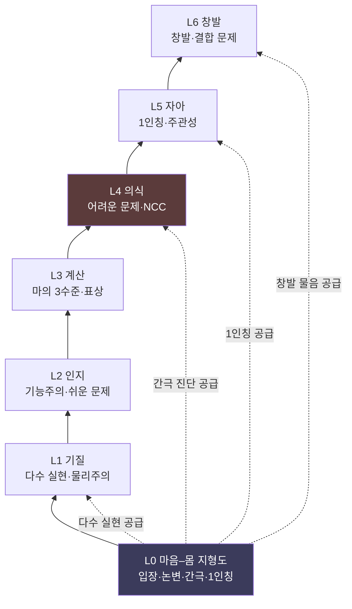

# 🏛️ 이 연구소와의 연결 — L0에서 L6까지

> **Psyche L0** · Chapter 7: 지형도의 활용과 종합 · 문서 3/6
> 마음–몸 지도는 허공에 떠 있지 않다 — 그것은 Psyche Lab 전체의 기초 층(L0)이며, 위층들이 각자 이 지도의 어느 조각을 들어 올려 작업한다.

지금까지 우리는 마음–몸 지형을 그 자체로 탐구했다. 이제 한 걸음 물러서서, 이 지형도가 *더 큰 건축물* 안에서 어디에 놓이는지를 본다. IQ AI Lab의 Psyche Lab은 마음을 일곱 층(L0~L6)으로 쌓아 탐구하는 구조물이며, 우리가 그려 온 마음–몸 지도는 그 *기초 층(Layer 0)*이다. 이 문서는 각 상위 층 — 기질·인지·계산·의식·자아·창발 — 이 L0 지형도의 *어느 부분*을 들어 올려 자기 작업의 토대로 삼는지를 매핑한다. 이로써 "왜 마음–몸 문제가 모든 상위 탐구의 출발점인가"가 구조적으로 드러난다.

---

## 🎯 핵심 질문

지형도의 가치는 그것이 *무엇을 떠받치는가*로 측정된다. 핵심 질문은 건축적이다.

> **마음–몸 지형도(L0)는 연구소의 상위 층들(L1~L6)과 어떤 관계인가? 각 층은 L0의 어느 입장·논변·간극을 *전제*로 삼고, L0는 각 층에 무엇을 *공급*하는가?**

답의 구조는 *기초–상부* 관계다. L0는 다른 층들이 답을 *가정해야* 진행할 수 있는 근본 물음들 — "정신적인 것은 물리적인 것과 어떤 관계인가", "설명적 간극은 실재하는가" — 을 정리해 둔다. 상위 층들은 이 물음에 대한 *특정 입장을 채택하거나 괄호 치고* 자기 작업을 한다. 예컨대 의식 이론들(L4)은 모두 "현상적 의식이 설명 대상이다"라는 L0의 진단을 전제하며, 자아 모델(L5)은 "주관성이 실재한다"는 1인칭 분석을 빌려 온다. L0는 *공유된 어휘와 미결 목록*을 제공함으로써, 상위 층들이 같은 지반 위에서 작업하게 만든다.

## 🌍 어디서 마주치나

층위 연결은 실제 연구·설계 결정에서 끊임없이 작동한다.

- **이론 설계 시 가정 점검**: 어떤 의식 이론(L4, `theories-of-consciousness`)을 세울 때, 그것이 L0의 어느 입장(물리주의·범심론·이원론)을 암묵적으로 깔고 있는지 점검해야 한다. IIT는 범심론에 가깝고 GWT는 기능주의에 가깝다 — L0 지도가 이 정렬을 드러낸다.
- **창발 논쟁(L6, `emergence`)**: "의식은 복잡성에서 창발하는가"라는 물음은 L0의 "기능 동일 → 경험 동일" 베팅(기능주의)과 직결된다. 창발론은 L0의 설명적 간극 진단을 *약한 창발로 메울 수 있는가*를 시험한다.
- **AI 자아·자기모델(L5, `self-model`)**: AI가 자기 모델을 갖는다는 것이 *경험을 동반하는가*는 L0의 AI 의식 베팅에 의존한다. 자기 모델의 계산적 기술(L2~L3)만으로는 이 물음이 닫히지 않는다.
- **방법론 선택**: 어떤 층에서든 "3인칭만으로 충분한가, 1인칭이 필요한가"를 결정할 때 L0의 신경현상학적 통찰(다음 문서 05)을 끌어 쓴다.

## 🔍 직관의 함정

**함정 1: "상위 층은 하위 층으로 환원된다(엄격한 위계)."** Psyche Lab의 층위는 *환원 사다리*가 아니라 *설명 수준*이다(자매 저장소 `levels-of-explanation`). L4(의식)가 L0(마음–몸) 위에 *놓인다*는 것은 L4가 L0로 *환원된다*는 뜻이 아니라, L4가 L0의 물음에 *입장을 취해야* 작동한다는 뜻이다. 층은 쌓이되 녹아내리지 않는다.

**함정 2: "L0를 풀어야 상위 층을 시작할 수 있다."** 거짓이다. L0의 핵심 물음(어려운 문제)은 *미결*이지만, 상위 층은 그것을 *괄호 치고* 진행할 수 있다. 의식 과학은 어려운 문제를 풀지 않고도 NCC를 연구한다. L0가 제공하는 것은 *해답*이 아니라 *무엇이 미결인지에 대한 명료함*이다 — 그 명료함만으로 상위 작업은 충분히 시작된다.

**함정 3: "층위는 임의적 분류다."** 층위는 *설명적 입자도*의 자연스러운 마디를 따른다 — 기질(무엇으로 되어 있나)·인지(무엇을 하나)·계산(어떻게 처리하나)·의식(어떻게 느끼나)·자아(누가 느끼나)·창발(어떻게 솟나). 이 마디들은 마(Marr)의 수준 구분처럼 *분석의 자연 관절*이지 편의적 칸막이가 아니다.

## ⚙️ 논증 구조

"L0가 모든 층의 발사대"라는 주장을 정식화하자.

1. **(전제)** 마음에 관한 모든 상위 탐구(인지·계산·의식·자아·창발)는 "정신적인 것이 물리적인 것과 어떤 관계인가"에 대한 *어떤* 입장을 — 명시적으로든 암묵적으로든 — 전제한다.
2. **(전제)** 이 전제를 *무자각적으로* 깔면, 상위 이론은 자신의 형이상학적 부채를 모른 채 결론을 내린다(숨은 가정의 오류).
3. **(소결론)** 그러므로 상위 탐구의 건전성은 자신이 채택한 마음–몸 입장을 *명시화*하는 데 달려 있다. $\square$
4. **(전제)** L0 지형도는 가능한 입장들과 그 부담·예측을 체계적으로 정리한다.
5. **(결론)** 그러므로 L0는 상위 층들에 *형이상학적 자기 인식의 도구*를 공급하며, 이 의미에서 모든 층의 발사대다 — 답을 주어서가 아니라, *무엇을 가정하고 있는지를 보게* 하므로. $\square$

이 논증의 핵심은 **전제 1**이다. 정말로 모든 상위 탐구가 마음–몸 입장을 전제하는가? 강한 형태("반드시 형이상학적 입장을 채택")는 다투어질 수 있다 — 일부는 *방법론적 중립*(어느 입장에도 헌신하지 않음)을 주장한다. 그러나 약한 형태("적어도 무엇을 괄호 쳤는지 알아야 한다")는 거의 부정 불가능하다. L0의 가치는 이 약한 형태로 충분히 확보된다.

## 🧪 증거와 사고실험

핵심 산출물 — **L0→L6 층위 매핑 표**다. 각 층이 L0 지형도의 어느 부분을 들어 올리는지 명세한다.

| 층 | 이름 | 핵심 물음 | L0 지형의 어느 부분을 쓰나 | 자매 저장소 |
|---|---|---|---|---|
| **L0** | 마음–몸 (기초) | 정신∼물리 관계는? | (지형도 전체) | *(본 저장소)* |
| **L1** | 기질 (substrate) | 마음은 무엇으로 되나? | 물리주의·다수 실현·기질 독립성 | `levels-of-explanation` |
| **L2** | 인지 (cognition) | 마음은 무엇을 하나? | 기능주의·쉬운 문제·인지 능력 | `computation-representation` |
| **L3** | 계산 (computation) | 어떻게 처리하나? | 마의 3수준·계산주의·표상 | `computation-representation` |
| **L4** | 의식 (consciousness) | 어떻게 느끼나? | 어려운 문제·설명적 간극·NCC | `hard-problem`, `theories-of-consciousness` |
| **L5** | 자아 (self) | 누가 느끼나? | 1인칭·주관성·통일성 | `self-model`, `first-person-methods` |
| **L6** | 창발 (emergence) | 어떻게 솟나? | 창발·결합 문제·층위 간 결정 | `emergence` |

표의 독법: *아래층일수록 L0의 "쉬운 문제" 쪽을, 위층일수록 "어려운 문제" 쪽을 들어 올린다*. L1~L3(기질·인지·계산)은 주로 기능주의·물리주의의 성공 영역에 기댄다. L4~L6(의식·자아·창발)은 설명적 간극·1인칭·결합 문제 같은 L0의 *미결* 영역과 직접 씨름한다. 이 비대칭이 연구소 설계의 핵심 — *간극을 가로지르며 층이 쌓인다*.

**연구소 설계 원리의 시각화.** Mermaid로 층위 의존을 그린다.

흐름도가 보이듯 L0는 *수직 사슬의 바닥*이자 *여러 상위 층으로 가지를 뻗는 분배점*이다. L4(의식, 붉게)가 어려운 문제를 직접 상속하는 결정적 마디다. 마(Marr)의 통찰 — 한 시스템을 계산·알고리즘·구현 세 수준에서 봐야 한다는 것 — 이 여기서 *일곱 층*으로 확장된다.

## 🌉 설명적 간극

층위 구조는 설명적 간극을 *어디로* 위치시키는가? 간극은 단일 층 안에 있지 않고 *L3과 L4 사이* — 계산·인지 층과 의식 층 사이 — 의 *경계*에 산다. L1~L3은 간극의 *아래쪽*(쉬운 문제, 기능·구조로 설명되는 영역)이고, L4~L6은 *위쪽*(어려운 문제, 경험·주관성 영역)이다. 연구소의 층위 사다리는 *간극을 가로지르는 사다리*다.

이것이 연구소 설계의 가장 정직한 인정이다. 우리는 L3에서 L4로 *부드럽게 올라갈 수 없다*. 계산·표상의 완전한 기술(L3)에서 의식의 경험(L4)으로 가는 길에는 *설명적 절벽*이 있다. 연구소는 이 절벽을 *메운 척하지 않는다* — 대신 절벽의 양쪽을 각각 정밀히 측량하고(L3 아래, L4 위), 절벽 자체를 L0의 어려운 문제로 *명명*해 둔다. 위층들은 절벽을 *건너뛰지* 않고 *마주 본다*. 이것이 "Explain it, don't explain it away"가 연구소 *아키텍처*에 새겨진 방식이다 — 간극은 설계도에서 빈칸이 아니라 *표시된 협곡*이다.

## 🧬 횡단 원리

이 문서의 횡단 원리는 설명 수준의 자율성에 관한 것이며, `levels-of-explanation` 저장소의 핵심 명제다.

> **수준 자율성 원리**: 각 설명 수준은 자기 고유의 개념·법칙·물음을 가지며, 인접 수준으로 무손실 환원되지 않는다. 그러나 각 수준은 인접 수준에 *제약*과 *물음*을 공급한다 — 자율적이되 고립되지 않는다.

이 원리가 연구소 전체의 설계 철학이다. L2(인지)는 L1(기질)로 환원되지 않지만(다수 실현), L1의 제약을 받는다. L4(의식)는 L3(계산)으로 환원되지 않지만(어려운 문제), L3이 던지는 물음("이 계산에 왜 경험이?")을 상속한다. 따라서 연구소는 *환원주의*도 *분리주의*도 아닌 제3의 길 — *연결된 자율성* — 위에 서 있다.

여기서 따라오는 규율: 어떤 층에서 작업하든, *위아래 인접 층에 진 빚과 던지는 물음*을 명시해야 한다. L4 의식 이론가는 자신이 L0에서 어떤 입장을 빌렸고 L6 창발에 무엇을 떠넘기는지 알아야 한다. 이 *층간 회계*가 연구소를 한 덩어리로 묶는다 — 각 저장소는 독립적이되, 그 인용·전제 관계가 전체를 직조한다.

## 🪞 1인칭

층위 구조에서 1인칭은 특별한 위치를 차지한다. 그것은 *한 층의 주제*(L5 자아)이면서 동시에 *모든 층을 관통하는 방법*이다. L0가 L5에 "주관성은 실재한다"는 분석을 공급하지만, 거꾸로 1인칭 데이터는 *모든 층의 검증*에 스며든다 — L2 인지 모델조차 "이것이 내가 실제로 추론하는 방식인가"라는 1인칭 점검을 받는다.

이 양면성 — 1인칭이 *대상*이자 *방법*이라는 것 — 이 연구소 설계의 미묘함이다. 만약 1인칭을 단지 L5의 주제로만 가두면, 다른 층들은 순수 3인칭이 되어 *현상을 놓친다*. 그래서 연구소는 1인칭을 L5에 *위치*시키되 `first-person-methods`를 통해 *모든 층에 침투*시킨다. 나 자신의 경험은 자아 층의 연구 대상이지만, 동시에 모든 층의 이론이 *나에게 참인지*를 가늠하는 시금석이다. 공정한 인정: 이 양면성을 잘 다루지 못하면 연구소는 1인칭을 *주제로는 다루되 방법으로는 무시하는* 흔한 함정에 빠진다 — 다음 문서(05)가 이 위험을 정면으로 다룬다.

## 📐 예측·반증

층위 매핑은 그 자체로 예측을 함의한다.

**예측 1.** 상위 층 이론(L4 의식 이론)이 *명시적으로 채택한 L0 입장*은 그 이론의 강점과 약점을 *예측*한다. IIT가 범심론적 L0 입장을 채택하므로, IIT는 경험 실재성에서 강하고 결합 문제에서 약할 것이다(범심론의 부담을 상속). → 이 정렬이 깨지면(범심론 입장인데 결합 문제를 안 짐) 매핑이 반증된다.

**예측 2.** L0의 어려운 문제가 미결인 한, L4~L6의 *근본* 물음(왜 경험이?, 누가 느끼나?, 어떻게 솟나?)도 미결로 남되, *주변* 물음(NCC·자기 모델 메커니즘·약한 창발)은 진보할 것이다. → 어려운 문제를 풀지 않고도 NCC가 진보하는 패턴이 이 예측을 확증한다(실제로 관찰됨).

**반증 조건.** 만약 어떤 상위 층이 L0의 *어떤* 마음–몸 입장도 전제하지 않고 — 완전히 형이상학 중립으로 — 자신의 근본 물음을 *완결*한다면, "L0가 모든 층의 발사대"라는 주장은 반증된다. 약한 형태("적어도 무엇을 괄호 쳤는지 알아야 한다")는 이보다 훨씬 견고하다.

이 예측들은 층위 구조가 *장식적 분류*가 아니라 *경험적·문헌계량적으로 시험 가능한 가설*임을 보인다.

## 🤔 다음 질문

층위 매핑은 L0가 무엇을 *공급*하는지를 보였다 — 공유된 어휘, 입장 목록, 그리고 *미결 목록*. 마지막 항목이 가장 정직하다. L0가 상위 층에 넘겨주는 것 중 일부는 *해답*이 아니라 *풀리지 않은 물음*이다. 그렇다면 우리는 그 미결들을 *정직하게 열거*해야 한다 — 무엇이 *원리적으로* 미해결이고 무엇이 단지 *현재* 미해결인가?

다음 문서는 지형도가 남긴 미해결의 목록을 정직하게 펼친다 — 어려운 문제, 결합 문제, 간극의 운명을, 영구적 한계와 일시적 무지로 구별하여.

---

🧩 **Principle** — 수준 자율성: 각 층은 고유의 물음·개념을 가지며 인접 층으로 무손실 환원되지 않으나, 인접 층에 제약과 물음을 공급한다. 연구소는 환원주의도 분리주의도 아닌 *연결된 자율성* 위에 선다.

🌉 **Boundary** — 설명적 간극은 단일 층 안이 아니라 L3(계산)과 L4(의식) 사이의 경계에 산다. 연구소의 층위 사다리는 *간극을 가로지르는 사다리*이며, 절벽을 메운 척하지 않고 *표시된 협곡*으로 명명한다.

🪞 **Experience** — 1인칭은 한 층(L5 자아)의 *주제*이자 모든 층을 관통하는 *방법*이다. 나의 경험은 자아 층의 대상이면서, 모든 층의 이론이 나에게 참인지를 가늠하는 시금석이다.

## 📝 연습문제

<b>기초</b> — L0→L6 매핑에서 "쉬운 문제 층"과 "어려운 문제 층"을 구분하라.

**문제.** 본문의 층위 매핑 표에서 어느 층들이 L0의 "쉬운 문제" 영역에 주로 기대고, 어느 층들이 "어려운 문제" 영역과 직접 씨름하는가? 이 비대칭이 연구소 설계에 대해 무엇을 말하는가?

**해설:** *쉬운 문제 층*: L1(기질)·L2(인지)·L3(계산)은 주로 L0의 기능주의·물리주의 성공 영역에 기댄다. 이들의 핵심 물음 — 마음은 무엇으로 되나(다수 실현), 무엇을 하나(인지 능력), 어떻게 처리하나(계산·표상) — 은 모두 *기능적·구조적으로* 정식화되어 원리적으로 환원적 설명이 가능한, 차머스가 말한 "쉬운 문제들"이다. *어려운 문제 층*: L4(의식)·L5(자아)·L6(창발)은 L0의 미결 영역과 직접 씨름한다. 왜 경험이 동반되는가(L4 어려운 문제), 누가 그것을 느끼는가(L5 주관성), 경험이 복잡성에서 솟는가(L6 창발·결합 문제) — 모두 설명적 간극의 위쪽이다. 설계 함의: 이 비대칭은 연구소가 *간극을 가로질러 쌓인다*는 것을 보여준다. L3에서 L4로 가는 경계에 설명적 절벽이 있고, 연구소는 그 절벽을 메운 척하지 않고 L0의 어려운 문제로 *명명*한다. 즉 아래 세 층은 "설명할 수 있는 것"을 정밀화하고, 위 세 층은 "왜 그것에 경험이 따라오는가"를 정직하게 마주 본다. 연구소의 수직 구조 자체가 마음–몸 문제의 지도를 입체로 복각한 것이다.

<b>심화</b> — "상위 층은 L0를 전제하되 환원되지 않는다"는 주장을 IIT를 예로 옹호하라.

**문제.** "수준 자율성 원리"에 따르면 L4(의식)는 L0(마음–몸)를 전제하되 그것으로 환원되지 않는다. 통합정보이론(IIT)을 예로 들어 이 이중 관계 — 전제하되 환원 안 됨 — 가 무엇을 뜻하는지 구체적으로 설명하라.

**해설:** *전제함*: IIT는 L0의 특정 입장 — 범심론에 가까운 입장 — 을 채택한다. IIT는 의식을 통합정보(Φ)와 *동일시*하며, Φ를 가진 어떤 시스템도(생물이든 아니든) 그만큼 의식을 가진다고 본다. 이는 L0 지형의 "현상적 속성이 근본적이며 물리 구조에 따라 분포한다"는 범심론적 진단을 *전제*한다. 만약 L0에서 엄격한 물리주의(경험은 특정 생물학적 구현에만)를 채택했다면 IIT의 기본 틀이 성립하지 않는다. 즉 IIT는 자신의 형이상학적 부채를 L0에서 빌린다. *환원되지 않음*: 그러나 IIT는 L0의 범심론으로 *환원되지 않는다*. IIT는 L0가 제공하지 않는 고유의 자원 — Φ의 수학적 정의, 다섯 공리(내재적 존재·구성·정보·통합·배제)와 그로부터의 공준, 의식의 *양과 질*에 대한 구체적 예측 — 을 추가한다. L0는 "현상적 속성이 근본적일 수 있다"까지만 말하고, *어떤 물리 구조가 얼마만큼의 어떤 경험을 갖는가*는 침묵한다. IIT는 바로 그 침묵을 자기 이론으로 채운다. 따라서 IIT를 "그냥 범심론"이라 부르면 그 고유 내용을 지운다 — 환원 불가. 이중 관계의 의미: IIT는 L0에서 *입장의 좌표*를 빌리되, 그 좌표 위에 *독립적 구조물*을 세운다. 이것이 "전제하되 환원 안 됨"의 구체적 모습이다. 그리고 이 관계가 IIT의 강점(경험 실재성 진지하게 수용)과 약점(범심론의 결합 문제·과잉 귀속 부담)을 *동시에* 예측한다 — 빌린 입장의 부채까지 함께 상속하기 때문이다. 이것이 층위 매핑이 단순 분류가 아니라 진단 도구인 이유다.

<b>논문 비평</b> — "연구소의 층위 구조는 위장된 환원주의다"라는 비판을 평가하라.

**문제.** 어떤 비판자는 마음을 L0~L6의 *층*으로 쌓는 것이, 겉으로는 자율성을 말하지만 실제로는 아래에서 위로 올라가는 *환원 사다리*를 암시하며, 따라서 어려운 문제를 은밀히 평가절하한다고 주장한다. 이 비판을 재구성하고 평가하라.

**해설:** 비판 재구성: (1) 무언가를 "층"으로 배열하고 화살표를 아래에서 위로 그리면(본문 Mermaid의 `BT` 흐름), 이는 *상향 결정* — 아래층이 위층을 산출함 — 을 암시한다. (2) 상향 결정 암시는 의식(L4)을 계산·기질(L1~L3)의 *결과물*로 보게 만든다. (3) 그러면 어려운 문제는 "복잡성이 충분히 쌓이면 경험이 나온다"는 *약한 창발*로 슬쩍 해소되고, L0가 강조한 환원 불가능성이 배신당한다. 따라서 (4) 층위 구조는 위장된 환원주의다. 강점: 이 비판은 진짜 위험을 짚는다 — 시각적 위계는 강력한 수사이며(02 문서의 시각화 함정 참조), "층"이라는 은유 자체가 상향 구성의 직관을 실어 나른다. 실제로 많은 신경과학 서사가 "뉴런 → 회로 → 인지 → 의식"의 매끄러운 상향 사다리를 암시하며 어려운 문제를 건너뛴다. 결정적 약점과 응답: (a) 비판은 *수준 자율성 원리*를 무시한다. 본 연구소의 층은 *환원 사다리*가 아니라 *설명 수준*으로 명시되며(이 문서 ⚙️ 절), L4가 L3 *위에 놓임*은 L3으로 *환원됨*이 아니라 L3의 물음을 *상속함*을 뜻한다. 화살표는 "구성"이 아니라 "의존·전제" 관계다. (b) 비판은 연구소가 간극을 *표시된 협곡*으로 명명한다는 설계 사실을 간과한다(🌉 절). L3↔L4 경계에 설명적 절벽이 명시되어 있으므로, 구조 자체가 상향 매끄러움을 *거부*한다 — 사다리에 *끊긴 칸*이 그려져 있다. (c) 그럼에도 비판의 *경계 효용*은 인정해야 한다. "층" 은유의 상향 편향은 실재하므로, 연구소는 의식적으로 (i) 화살표를 "의존"으로 명시하고, (ii) 간극을 시각적으로 표시하며, (iii) 1인칭을 단일 층이 아니라 전 층 관통 방법으로 두어(🪞 절) 환원 암시를 능동적으로 상쇄해야 한다. 종합 평가: 비판은 *구조 자체*에 대한 반박으로는 실패한다(자율성·간극 명시가 환원주의를 배제). 그러나 *수사적 위험에 대한 경고*로는 타당하다. 옳은 교훈은 "층위 구조를 버려라"가 아니라 "층위의 은유적 상향 편향을 명시적 장치로 끊임없이 교정하라" — 즉 사다리를 그리되 그 끊긴 칸(간극)을 결코 지우지 않는 것이다. 이것이 연구소가 "Explain it, don't explain it away"를 *아키텍처 차원*에서 준수하는 방식이다.

[◀ 이전: 마음-몸 지도 시각화](./02-map-visualization.md) · [📚 README](../README.md) · [다음: 미해결의 목록 ▶](./04-open-questions.md)

