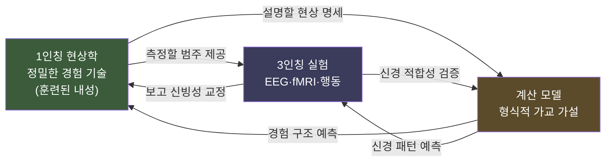

# 🧭 어떻게 탐구할 것인가 — 삼각측량의 방법론

> **Psyche L0** · Chapter 7: 지형도의 활용과 종합 · 문서 5/6
> 어느 한 시점으로는 거리를 잴 수 없다 — 3인칭(실험)·1인칭(현상학)·계산 모델, 셋을 *잇는* 삼각측량만이 마음에 닿는다.

미해결의 목록(앞 문서)은 절망의 근거가 아니라 *방법의 요청*이었다. 가장 깊은 문제들이 어느 단일 방법으로도 닫히지 않는다면, 길은 방법들을 *잇는* 데 있다. 이 문서는 마음을 탐구하는 성숙한 방법론 — *삼각측량* — 을 제시한다. 측량사가 한 점의 위치를 알려면 여러 지점에서 각도를 재 교차시키듯, 마음을 알려면 3인칭 실험(신경과학·행동)·1인칭 현상학(경험의 정밀 기술)·계산 모델(형식적 가설)을 *어느 하나로 환원하지 않고 교차*시켜야 한다. 바렐라의 신경현상학이 그 원형이다. "Explain it, don't explain it away"는 여기서 *어느 한 시점도 특권화하지 않기*의 규율이 된다 — 3인칭으로 1인칭을 지우지도, 1인칭으로 3인칭을 무시하지도 않는다.

---

## 🎯 핵심 질문

미해결 앞에서 방법론의 질문은 절박하다.

> **어느 단일 접근법(순수 3인칭이든 순수 1인칭이든 순수 계산이든)으로도 마음의 핵심이 닿지 않는다면, 이 접근법들을 *어떻게* 결합해야 — 어느 하나로 환원하지 않으면서 — 서로를 제약하고 밝히게 할 수 있는가?**

답의 구조는 *상호 제약*이다. 삼각측량은 세 방법을 단순히 *나란히* 두는 것(병렬)이 아니라, 서로를 *제약하고 교정하게* 만드는 것이다. 1인칭 현상학은 3인칭 실험이 *무엇을 측정해야 하는지*(어떤 경험 범주가 실재하는지)를 알려주고, 3인칭 데이터는 1인칭 보고의 *신빙성을 점검*하며, 계산 모델은 둘을 잇는 *형식적 가교 가설*을 제공한다. 핵심은 *순환적 상호 정보*다 — 바렐라가 "상호 구속(mutual constraints)"이라 부른 것. 세 꼭짓점이 서로를 당기며 추정을 좁힌다.

## 🌍 어디서 마주치나

삼각측량은 실제 의식 과학의 최전선에서 작동한다.

- **신경현상학 실험**: 바렐라·루츠의 연구에서, 피험자가 자신의 경험 상태(주의·준비도)를 *정밀히 보고*(1인칭 훈련)하고, 그 보고로 뇌파 데이터를 *분류*(3인칭)하면, 보고를 무시했을 때 보이지 않던 신경 패턴이 드러난다. 1인칭이 3인칭 분석의 *변수*가 된다.
- **명상·마취 연구**: 숙련된 명상가의 정밀한 1인칭 보고가 의식 상태 변화의 신경 상관을 *세분*하게 해준다. 1인칭 전문성이 3인칭 해상도를 높인다.
- **계산 모델 검증**: 전역작업공간(GWT)·예측처리 모델은 *계산적 가설*이며, 그것이 옳은지는 3인칭 신경 데이터와 1인칭 경험 보고 *양쪽*에 맞춰 검증된다.
- **자매 저장소 연결**: `first-person-methods`(L5)가 이 문서의 직접 확장이며, 1인칭 방법의 훈련·신뢰성·형식화를 상세히 다룬다.

## 🔍 직관의 함정

**함정 1: "1인칭 보고는 주관적이라 비과학적이다."** 과도한 3인칭주의다. 모든 의식 과학은 *어떤 식으로든* 1인칭 보고에 의존한다 — "이 자극이 보였습니까"라는 질문 없이는 NCC조차 정의할 수 없다(무엇과 상관시킬 의식이 없으면). 1인칭을 *원리적으로* 배제하면 의식 과학 자체가 불가능하다. 문제는 1인칭의 *배제*가 아니라 그 *정밀화·신뢰성 확보*다.

**함정 2: "1인칭 내성은 직접적이고 오류 불가능하다."** 반대 방향의 순진함이다. 내성은 *훈련 가능하고 오류 가능한* 기술이다(니스벳·윌슨의 고전 연구: 우리는 종종 자기 정신 과정을 잘못 보고한다). 삼각측량이 필요한 *이유*가 바로 이것 — 1인칭도 3인칭에 의해 *교정*되어야 한다. 1인칭을 특권화하면 삼각측량이 무너진다.

**함정 3: "계산 모델은 단지 도구일 뿐 실재를 말하지 않는다."** 과소평가다. 좋은 계산 모델은 *가교 가설* — "이 계산 구조가 이 경험과 이 신경을 잇는다" — 을 형식적으로 명세하여, 1인칭과 3인칭이 *어디서 만나야 하는지*를 예측한다. 모델은 삼각형의 한 꼭짓점이지 외부 도구가 아니다.

## ⚙️ 논증 구조

"삼각측량이 단일 방법보다 우월하다"는 방법론적 논증을 정식화하자.

1. **(전제)** 마음의 핵심 현상(의식)은 *3인칭 측정 가능 측면*(신경·행동)과 *1인칭 접근 가능 측면*(경험의 질) 모두를 가진다.
2. **(전제)** 순수 3인칭 방법은 (1)의 둘째 측면을 *직접* 포착하지 못한다(설명적 간극의 측정 판본).
3. **(전제)** 순수 1인칭 방법은 *공유·검증·일반화*가 곤란하다(사밀성·오류 가능성).
4. **(소결론)** 그러므로 어느 단일 방법도 마음의 *양 측면*을 동시에 책임지지 못한다. $\square$
5. **(전제)** 세 방법을 *상호 제약*시키면, 각 방법의 약점이 다른 방법의 강점으로 보완된다(1인칭이 3인칭에 측정 대상을 주고, 3인칭이 1인칭을 교정하고, 계산이 둘을 잇는다).
6. **(결론)** 그러므로 삼각측량 — 환원 없는 상호 제약 — 이 마음 탐구의 우월한 방법론이다. $\square$

이 논증의 핵심은 **전제 5**다. 세 방법이 정말로 *상호 제약*하는가, 아니면 그저 *병렬*에 그치는가? 회의론자는 "1인칭과 3인칭은 범주가 달라 서로를 제약할 *공통 통화*가 없다"고 한다(간극의 방법론 판본). 신경현상학의 실제 성과(1인칭 보고가 3인칭 분류의 변수가 됨)가 이 회의에 대한 경험적 응답이며, 이 응답의 *완전성*이 미결 쟁점이다.

## 🧪 증거와 사고실험

핵심 산출물 — **세 방법의 역할 분담표**다.

| 방법 | 포착하는 것 | 강점 | 약점 | 다른 꼭짓점에 주는 제약 |
|---|---|---|---|---|
| **3인칭 (실험)** | 신경 활동·행동·보고 | 공유·검증·일반화 가능 | 경험의 질에 직접 못 닿음 | 1인칭 보고의 신빙성 점검; 계산 모델의 신경 적합성 검증 |
| **1인칭 (현상학)** | 경험의 구조·질 | 현상에 직접 접근 | 사밀·오류 가능·일반화 곤란 | 3인칭이 측정할 *경험 범주*를 정의; 계산 모델이 설명할 *현상*을 명세 |
| **계산 모델** | 형식적 가교 가설 | 명시적·예측적·시뮬레이션 가능 | 실재성 미정(도구 vs 설명) | 1인칭·3인칭이 *만나는 지점*을 예측; 검증 가능한 다리 제공 |

표의 핵심 독법: *각 방법의 약점 칸이 다른 방법의 "주는 제약" 칸으로 메워진다*. 3인칭의 약점(질에 못 닿음)은 1인칭이 채우고, 1인칭의 약점(검증 곤란)은 3인칭이 채우며, 둘 사이의 빈틈은 계산 모델이 형식적 다리로 잇는다. 이 *상호 보완의 닫힘*이 삼각측량의 기하학이다.

**신경현상학의 작동 방식(바렐라).** 삼각측량을 Mermaid로 그린다.

흐름도가 보이듯 세 꼭짓점 사이에 *양방향* 화살표가 흐른다 — 이것이 "상호 제약"의 시각화다. 어느 화살표도 끊기면 삼각형이 무너진다. 특히 P1→P3("측정할 범주 제공")이 신경현상학의 혁신이다 — 1인칭을 데이터에서 *제거*하지 않고 *변수로 승격*시킨다.

**사고실험: 세 방법의 단독 실패.** 순수 3인칭만으로 의식을 연구하면, 좀비와 의식적 존재를 구별할 측정이 없다(질에 못 닿음). 순수 1인칭만으로 연구하면, 보고를 교차 검증할 길이 없어 사변에 빠진다. 순수 계산만으로 연구하면, 모델이 실제 경험·신경에 닿는지 알 수 없다. *셋을 교차*해야 비로소 추정이 좁혀진다 — 측량의 기하학 그대로다.

## 🌉 설명적 간극

삼각측량은 설명적 간극을 *메우는가*? 정직한 답: *아니오, 그러나 가로지른다*. 삼각측량은 간극을 *닫지* 못한다 — 1인칭과 3인칭을 잇는 계산 다리조차 "왜 이 계산에 *이* 경험이"라는 어려운 문제를 해소하지 못한다(메타 미해결, 앞 문서). 그러나 삼각측량은 간극의 *양안을 정밀하게 측량*하고, 그 사이에 *체계적 대응*(어떤 경험이 어떤 신경·계산과 함께 가는지)을 구축한다.

이것이 삼각측량의 정직한 위상이다. 그것은 간극을 *설명해 없애지*(3인칭 환원) 않고, *영원한 신비로 봉인하지도*(1인칭 특권화) 않는다. 대신 간극을 *가로지르는 다리* — 메우지는 못하되 양안을 잇는 — 를 놓는다. 만약 어려운 문제가 (1) 현재적 미해결이라면, 이 다리들이 누적되어 언젠가 간극이 *해소*될 수 있다(미래 A). 만약 (2) 원리적이라면, 다리는 간극을 *닫지 못한 채* 양안의 대응 지도를 완성하는 데 그친다(미래 B). 어느 경우든 삼각측량은 *현재 우리가 할 수 있는 최선* — 메타 미해결 앞에서 단일 방법에 도박하지 않는 성숙 — 이다. 모토의 방법론적 화신: 간극을 존중하되, 그 앞에서 *작업을 멈추지 않는다*.

## 🧬 횡단 원리

이 문서의 횡단 원리는 인식론 일반에 닿는다.

> **상호 제약 원리**: 단일 시점으로 닿지 않는 대상은 여러 독립적 시점을 *교차*시켜 추정한다. 핵심은 시점들의 *환원*(하나를 다른 것으로 녹임)이 아니라 *상호 구속*(서로의 추정을 좁힘)이다.

이 원리는 측량·천문학(시차로 별 거리 측정)·통계학(다방법 측정의 수렴 타당도)에서 보편적이다. 마음 탐구는 이 보편 원리를 *가장 어려운 대상*(1인칭과 3인칭이 범주적으로 다른 대상)에 적용한 사례다. 바렐라의 신경현상학은 후설의 현상학과 인지과학을 *상호 구속*시키려는 시도였고, 그 핵심은 "현상학을 신경과학으로 환원하지 말고, 둘이 서로를 제약하게 하라"는 것이었다.

여기서 따라오는 규율: 마음을 탐구할 때 *어느 한 시점을 특권화하려는 충동*을 경계해야 한다. 3인칭 환원주의("1인칭은 환상")도, 1인칭 직접주의("내성은 오류 불가")도, 계산주의("마음은 곧 계산")도 모두 *삼각형을 한 점으로 붕괴*시킨다. 성숙한 방법론은 세 꼭짓점을 *팽팽히* 유지하며, 어느 화살표도 끊지 않는다. 이 긴장의 유지가 곧 정직이다.

## 🪞 1인칭

이 문서에서 1인칭은 단지 주제가 아니라 *방법의 정당한 한 꼭짓점*으로 복권된다. 오랫동안 행동주의·강한 3인칭주의는 1인칭을 과학에서 *추방*했다 — "내성은 신빙성 없다." 삼각측량은 이 추방을 거부하되, 1인칭을 *무비판적으로 복권*하지도 않는다. 1인칭은 *훈련 가능하고 교정 가능한 기술*로서, 3인칭의 점검을 받으며 데이터에 *기여*한다.

내가 나의 경험을 정밀히 기술하는 능력은 — 명상가가 주의의 미세 구조를 보고하듯 — *연마될 수 있다*. 그리고 그 정밀한 보고는 나만의 사밀한 일기가 아니라, 3인칭 실험이 *무엇을 찾아야 하는지* 알려주는 *공적 기여*가 된다. 이것이 1인칭의 가장 성숙한 자기 이해다 — 자명한 권위도, 비과학적 잡음도 아닌, *훈련되고 교정되는 탐구의 한 시점*. 공정한 평결: 삼각측량은 1인칭에게 과학 시민권을 *조건부로* 돌려준다 — 정밀화와 상호 검증을 조건으로. 이것이 다음 레이어(`first-person-methods`)가 상세히 펼칠 약속이며, 마음 과학이 자신의 가장 직접적인 데이터(경험)와 화해하는 길이다.

## 📐 예측·반증

삼각측량 방법론은 반증 가능한 예측을 낳는다.

**예측 1.** 1인칭 보고를 *변수로 통합*한 3인칭 실험은, 1인칭을 *무시한* 동일 실험보다 *더 많은 신경 구조*를 드러낼 것이다(신경현상학의 핵심 예측). → 1인칭 통합이 아무런 추가 정보도 주지 못하면 삼각측량의 효용이 반증된다(실제로는 루츠·바렐라 연구가 이 예측을 지지).

**예측 2.** 1인칭 보고 훈련(명상·기술 훈련)을 받은 피험자는 의식 상태의 신경 상관을 *더 세밀히* 변별하게 할 것이다. → 훈련된 보고자와 비훈련 보고자의 신경 분류 해상도가 *같으면* 예측이 약화된다.

**예측 3.** 좋은 계산 모델(가교 가설)은 1인칭 현상과 3인칭 신경 *양쪽*에 동시에 적합할 것이다. 한쪽에만 맞고 다른 쪽에 어긋나는 모델은 *덜 좋은* 다리다. → 모든 모델이 한쪽에만 적합하면 "가교" 주장이 반증된다.

**근본 반증 조건.** 만약 1인칭과 3인칭이 *어떤* 상호 제약도 산출하지 못함이 — 즉 둘이 정보적으로 완전히 단절됨이 — 입증되면, 삼각측량 전체가 불가능하고 우리는 *순수 병렬*(메우지 못하는 두 독립 기술)로 후퇴한다. 신경현상학의 성패가 이 가능성을 시험한다.

이 예측들은 방법론조차 *경험적 책임*을 진다는 것 — 삼각측량이 단지 좋은 슬로건이 아니라 시험 가능한 연구 전략임 — 을 보인다.

## 🤔 다음 질문

우리는 마음을 탐구하는 성숙한 방법 — 어느 시점도 특권화하지 않는 삼각측량 — 에 도달했다. 표(01), 지도(02), 연구소 위치(03), 미해결(04), 방법(05)을 모두 거쳤다. 이제 남은 것은 *종합*이다. 이 모든 것을 하나로 묶는 *규율의 뿌리*는 무엇인가? 표와 지도와 방법을 관통하며 흐른 단 하나의 정신은?

다음 문서는 이 장 전체와 Layer 0 전체를 종합한다. "Explain it, don't explain it away"라는 모토를 그 가장 깊은 의미에서 풀어내고, 마음–몸 지형도가 왜 Psyche Lab 전체의 *종착이자 발사대*인지를 매듭짓는다.

---

🧩 **Principle** — 상호 제약: 단일 시점으로 닿지 않는 대상은 여러 독립 시점을 교차시켜 추정한다. 핵심은 시점의 *환원*이 아니라 *상호 구속* — 서로의 추정을 좁힘이다.

🌉 **Boundary** — 삼각측량은 간극을 *메우지 못하되 가로지른다*. 양안을 정밀 측량하고 체계적 대응을 구축하되, "왜 이 계산에 이 경험이"는 해소하지 못한다 — 간극을 존중하며 작업을 멈추지 않는다.

🪞 **Experience** — 1인칭은 자명한 권위도 비과학적 잡음도 아닌, 훈련되고 교정되는 탐구의 한 시점이다. 삼각측량은 1인칭에게 과학 시민권을 조건부로(정밀화·상호 검증을 조건으로) 돌려준다.

## 📝 연습문제

<b>기초</b> — 삼각측량의 세 꼭짓점과 각각의 역할을 설명하라.

**문제.** 마음 탐구의 삼각측량을 이루는 세 방법은 무엇이며, 각각 무엇을 포착하고 어떤 약점을 가지는가? 그리고 왜 셋을 *결합*해야 하는가?

**해설:** 세 꼭짓점: (1) *3인칭 실험* — EEG·fMRI·행동 측정으로 신경 활동과 행동을 포착한다. 강점은 공유·검증·일반화 가능성이고, 약점은 경험의 질(주관적 느낌)에 직접 닿지 못함이다(설명적 간극의 측정 판본). (2) *1인칭 현상학* — 훈련된 내성으로 경험의 구조와 질을 정밀히 기술한다. 강점은 현상에 직접 접근함이고, 약점은 사밀성·오류 가능성·일반화 곤란이다. (3) *계산 모델* — 형식적 가교 가설을 세운다. 강점은 명시성·예측력·시뮬레이션 가능성이고, 약점은 실재성 미정(단지 도구인지 설명인지)이다. 결합의 이유: 각 방법의 *약점*이 다른 방법의 *강점*으로 보완되기 때문이다. 3인칭이 질에 못 닿는 약점은 1인칭이 채우고, 1인칭의 검증 곤란은 3인칭이 채우며, 둘 사이의 빈틈은 계산 모델이 형식적 다리로 잇는다. 순수 3인칭만으로는 좀비와 의식적 존재를 구별하지 못하고, 순수 1인칭만으로는 보고를 교차 검증하지 못하며, 순수 계산만으로는 모델이 실재에 닿는지 모른다. 셋을 *교차*해야 — 측량사가 여러 지점에서 각도를 재 한 점을 특정하듯 — 추정이 좁혀진다. 핵심은 어느 하나로 다른 둘을 *환원*하는 것이 아니라, 셋이 서로를 *제약*하게 두는 것이다.

<b>심화</b> — 바렐라의 신경현상학이 "1인칭을 변수로 승격"한다는 것의 의미를 설명하라.

**문제.** 바렐라의 신경현상학에서 가장 혁신적인 수는 1인칭 보고를 데이터에서 *제거*하는 대신 3인칭 분석의 *변수로 승격*시킨 것이다. 이것이 구체적으로 무엇을 뜻하며, 전통적 3인칭주의와 어떻게 다른지 루츠·바렐라의 실험 구조를 통해 설명하라. 그리고 이 접근이 직면하는 난점을 논하라.

**해설:** 전통적 3인칭주의는 1인칭 보고를 *불신*하여 가능한 한 배제하거나, 기껏해야 "보였다/안 보였다" 같은 *최소 보고*만 허용한다. 1인칭은 신빙성 없는 잡음으로 취급된다. 바렐라의 수: 피험자를 *훈련*시켜 자신의 경험 상태(예: 자극 직전의 주의 준비도·집중 정도)를 *세밀한 범주*로 보고하게 한다. 그런 다음 이 1인칭 보고를 *독립 변수로 삼아* 뇌파(EEG) 데이터를 *분류*한다. 루츠·바렐라의 실험에서, 피험자가 보고한 "준비됨/안 됨" 같은 경험 범주에 따라 EEG를 나누면, 보고를 무시하고 *뭉뚱그렸을 때는 보이지 않던* 신경 동역학 패턴(자극 전 위상 동기화의 차이)이 드러난다. 즉 1인칭 보고가 3인칭 데이터의 *구조를 드러내는 열쇠*가 된다 — 경험 범주가 신경 패턴을 *예측*한다. 전통주의와의 차이: 1인칭이 *제거 대상*에서 *분석 자원*으로 지위가 바뀐다. 1인칭과 3인칭이 *상호 제약*한다 — 1인칭은 3인칭에 분류 변수를 주고, 3인칭은 1인칭 보고의 체계적 신경 상관을 보여 그 신빙성을 *사후 정당화*한다(임의 보고였다면 신경 패턴과 상관하지 않았을 것이다). 직면하는 난점: (a) *훈련의 신뢰성* — 1인칭 보고 훈련이 경험을 더 정밀히 *드러내는지*, 아니면 보고를 특정 틀에 *맞추도록 오염*시키는지 구별하기 어렵다(관찰자 효과). (b) *순환 우려* — 1인칭으로 3인칭을 분류하고 3인칭으로 1인칭을 정당화하는 것이 *선순환*(상호 구속)인지 *악순환*(서로의 가정을 떠받침)인지 논쟁된다. (c) *어려운 문제는 여전히 미해결* — 이 방법은 경험과 신경의 *대응*을 정밀화할 뿐, "왜 이 신경에 이 경험이"는 해소하지 못한다. 종합: 1인칭의 변수 승격은 의식 과학에서 1인칭을 추방하지 않고 *과학적으로 길들이는* 핵심 혁신이며, 삼각측량의 실증적 핵이다 — 다만 그 순환이 선순환임을 보이는 부담이 남는다.

<b>논문 비평</b> — "1인칭과 3인칭은 상호 제약할 수 없다"는 회의론을 평가하라.

**문제.** 어떤 회의론자는 1인칭(경험)과 3인칭(신경)이 *범주적으로 다른 종류*라서 서로를 제약할 *공통 통화*가 없으며, 따라서 삼각측량은 두 독립 기술의 *병렬*에 불과하고 진정한 *상호 구속*은 불가능하다고 주장한다(설명적 간극의 방법론 판본). 이 회의론을 재구성하고, 신경현상학의 성과에 비추어 평가하라.

**해설:** 회의론 재구성: (1) 1인칭 데이터(경험의 질)와 3인칭 데이터(신경 활동)는 설명적 간극으로 분리된 *이종(異種)*이다. (2) 두 이종이 서로를 *제약*하려면, 한쪽의 변화가 다른 쪽의 추정을 *좁히는* 정보 연결이 있어야 한다. (3) 그러나 간극이 실재한다면 그런 정보 연결은 *원리적으로* 없다 — 경험으로부터 신경을, 신경으로부터 경험을 *연역*할 수 없다. (4) 그러므로 삼각측량은 상호 구속이 아니라 *병렬 기술*에 그치며, 두 그림은 *나란히 놓일 뿐 서로를 교정하지 못한다*. 강점: 이 회의론은 진짜 깊은 점을 짚는다 — 만약 간극이 *존재적*(미래 B)이라면, 경험과 신경 사이에 *법칙적 연역* 관계가 없을 수 있고, 그렇다면 "상호 제약"은 착각일 수 있다. 또한 1인칭 보고 자체가 *3인칭 행동*(말·버튼 누름)을 통해서만 측정되므로, "1인칭이 3인칭을 제약한다"는 사실 "3인칭 보고가 3인칭 신경을 제약한다"의 위장일 수 있다는 날카로운 의심을 제기한다. 결정적 약점과 응답: (a) *상호 제약은 연역적 연결을 요구하지 않는다*. 회의론은 전제 (3)에서 "제약 = 연역"을 가정하나, 측량·통계의 상호 구속은 *상관적·확률적* 제약으로 충분하다. 별의 거리를 시차로 잴 때 두 시점이 서로를 *연역*하지 않아도 추정은 좁혀진다. 신경현상학에서 1인칭 보고가 EEG를 *분류*하여 패턴을 드러낼 때, 이는 연역이 아니라 *체계적 상관*을 통한 제약이며, 그것으로 추정 공간이 실제로 좁혀진다(루츠·바렐라의 경험적 성과). (b) *간극의 존재가 정보적 단절을 함의하지 않는다*. 경험과 신경 사이에 *설명적* 간극(왜?의 미해소)이 있어도 *상관적* 다리(무엇이 무엇과 함께 가나)는 풍부히 존재한다 — NCC 연구 전체가 그 증거다. 회의론은 설명 간극을 정보 단절로 *과장*한다. (c) *전제 (2)의 "1인칭=위장된 3인칭" 의심에 대한 응답*: 1인칭 보고가 *훈련에 따라 신경 분류 해상도를 높인다*는 사실(심화 문제의 예측 2)은 단순한 행동–신경 상관으로 환원되지 않는다 — 변별을 만드는 것은 *경험 범주의 정밀화*이지 운동 출력의 변화가 아니기 때문이다. 종합 평가: 회의론은 *간극이 존재적일 경우의 한계*를 정당하게 경고하나, "상호 제약 불가"를 *입증*하지는 못한다 — 그것은 "제약=연역"이라는 과한 요구와 "설명 간극=정보 단절"이라는 과장에 의존하기 때문이다. 신경현상학의 실증적 성과는 *상관적 상호 구속*이 실재함을 보인다. 따라서 삼각측량은 회의론이 주장하는 *순수 병렬*보다는 강하되, 회의론이 우려하는 대로 *간극을 닫지는 못하는* — 즉 "메우지 못하되 가로지르는" 위상에 정확히 안착한다. 회의론은 삼각측량을 무너뜨리지 못하나, 그 야심의 *한계*(대응 지도는 그리되 어려운 문제는 못 푼다)를 정직하게 그어 준다는 점에서 생산적이다.

[◀ 이전: 미해결의 목록](./04-open-questions.md) · [📚 README](../README.md) · [다음: 종합 ▶](./06-synthesis.md)

